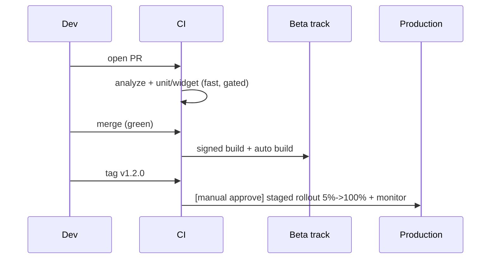

# CI/CD Integration (Capstone: Commit → Store Pipeline)

> Assemble the full pipeline from **commit to store**: on **PR**, run fast **analyze + unit/widget tests** (cached, parallel, incremental via `melos --since`) and **gate the merge**; on **merge to main**, build **signed** artifacts per flavor and **auto-deploy to beta** (Play internal / TestFlight) with an **auto-bumped build number**; on **tag**, do a **gated one-click promotion** to production with **staged rollout + monitoring**. All secrets (keystore/certs/store credentials) live in the **encrypted CI store**; the whole thing is **config-as-code**, reproducible, and documented. This is the delivery backbone that makes testing enforceable and releases routine.

## Introduction

This module capstone composes fundamentals, the CI pipeline, signing/flavors, and CD/release automation into one coherent commit→store pipeline — the reference a team runs. It shows the stages, triggers, gates, secrets, and the branching/versioning strategy end to end.

## Why this concept exists

The pieces (CI, signing, CD) only deliver value **assembled into one gated, automated, reproducible pipeline** with the right triggers and secret handling. This capstone provides that assembled exemplar — turning "we have some CI" into "commit → tested → signed → beta → gated staged production," the standard for professional Flutter delivery.

## Real-world analogy

It's the **complete factory-to-retail line**: inspection at every added part (PR CI), assembly + sealing + shipping to the **test shelf** on completion (merge → signed → beta), and a **manager-approved, phased retail launch** with monitoring (tag → gated staged production). One integrated, automated line — not disconnected manual steps — with the **vault** (encrypted secrets) securing the seals.

## Internal Working

```mermaid
flowchart TD
    PR[PR] --> CI[CI: analyze + format + unit/widget (cached, parallel, melos --since)]
    CI -->|green| MergeGate[merge gate (protected + CODEOWNERS)]
    MergeGate --> Merge[merge to main]
    Merge --> BuildSign[build SIGNED per flavor + auto build-number bump]
    BuildSign --> Beta[auto-deploy BETA: Play internal / TestFlight + release notes]
    Tag[tag v1.2.0] --> Promote{manual one-click promote}
    Promote --> Staged[production staged rollout 5%->100% + monitoring]
    Secrets[(encrypted CI secrets: keystore/certs/store creds)] --- BuildSign & Beta & Staged
    Note[config-as-code; reproducible; each stage gates the next]
```

- **PR trigger — fast CI + gate** ([ci_pipeline_and_automation.md](ci_pipeline_and_automation.md)): pinned SDK → cached `pub get` → **`dart format` + `flutter analyze`** → **`flutter test --coverage`** (unit/widget), parallel + **`melos --since`** incremental (monorepo). **Merge gated** on green (protected branch + CODEOWNERS — [Module 47](../47%20Scalable%20Applications/README.md)). E2E on nightly/merge (not every PR).
- **Merge trigger — build + beta**: build **signed** artifacts per **flavor** ([build_signing_and_flavors.md](build_signing_and_flavors.md)) with an **auto-bumped unique build number**; **auto-deploy to beta** (Play internal / TestFlight) with **generated release notes** ([cd_release_automation.md](cd_release_automation.md)). This is Continuous Delivery to staging.
- **Tag trigger — gated production**: a **version tag** (`v1.2.0`) → a **manual one-click promotion** (environment protection/approval) → **staged rollout (5%→100%)** with **crash-free-rate monitoring** + **halt** ([Module 52](../52%20Monitoring/README.md)). Mobile = Continuous **Delivery** (gated prod).
- **Secrets everywhere-secure** ([Module 37](../37%20Security/README.md)): keystore/certs/store-API credentials in the **CI encrypted store**, decoded to temp files at build, never committed/logged.
- **Config-as-code + reproducible**: the whole pipeline is versioned YAML/config with **pinned toolchains** and clean runners; iOS builds on **Mac runners**; Fastlane (or Codemagic/Bitrise built-ins) automate build/sign/upload.
- **Branching/versioning strategy** (glue it together): trunk-based or GitFlow-lite — **PRs → main (gated)**, **main → beta (auto)**, **tags → production (gated, staged)**; semver bumps per release, build number auto per upload.
- **The payoff**: testing is **enforced** (gate), builds are **signed + reproducible**, releases are **automated + staged + monitored** — commit to store is a controlled, fast, safe path enabling confident, frequent shipping.
- **Right-sizing**: a solo/small app needs the CI half + simple beta deploy; large/multi-team adds incremental monorepo CI, flavors, staged rollout, and strict gating — scale the pipeline to the app ([Module 47](../47%20Scalable%20Applications/README.md)).

## Memory Representation

Not runtime — a **pipeline definition** (jobs/triggers/gates/secrets) + release metadata (version/build number/notes/rollout state) + run history. The invariant: main always green + buildable; each stage gates the next; secrets never leave the encrypted store.

## Compiler / Build Behavior

Pinned SDK + clean runners → reproducible builds; per-flavor signed artifacts; version/build number embedded; caching speeds compilation. Undeclared secrets or duplicate build numbers fail the build/upload.

## Runtime Behavior

PR → fast verify + gate; merge → signed build + auto beta; tag → gated staged production with monitoring-driven promote/halt. Failures fail fast; users receive production progressively (staged).

## Flutter Engine Behavior

Integration-test jobs run the engine on emulators; production artifacts run per flavor on-device. Otherwise pipeline stages build/test, not run, the engine.

## Dart VM Behavior

Fast unit base + incremental (`melos --since`) keep CI quick; tests run in the VM; builds AOT-compile per flavor.

## Examples

```yaml
# Full pipeline (GitHub Actions sketch), triggers → stages
name: CI-CD
on:
  pull_request: {}                 # fast CI + gate
  push: { branches: [main] }       # -> beta
  push: { tags: ['v*'] }           # -> gated production

jobs:
  verify:                          # PR + push: fast, cached, gated
    runs-on: ubuntu-latest
    steps:
      - uses: actions/checkout@v4
      - uses: subosito/flutter-action@v2
        with: { flutter-version: '3.24.0', cache: true }
      - run: flutter pub get
      - run: dart format --set-exit-if-changed . && flutter analyze
      - run: flutter test --coverage           # (or: melos run test --since=origin/main)

  beta:                            # on merge to main: signed build -> beta
    if: github.ref == 'refs/heads/main'
    needs: verify
    runs-on: macos-latest          # iOS needs macOS
    steps:
      - run: echo "$KEYSTORE_B64" | base64 -d > android/app/upload.jks   # from encrypted secret
      - run: flutter build appbundle --release --flavor prod \
             --build-number=${{ github.run_number }}                     # unique build number
      - run: bundle exec fastlane beta                                    # -> Play internal / TestFlight

  production:                      # on tag: MANUAL gate -> staged rollout
    if: startsWith(github.ref, 'refs/tags/v')
    needs: verify
    environment: production        # requires manual approval
    runs-on: macos-latest
    steps:
      - run: bundle exec fastlane production   # supply(track: production, rollout: '0.05') + monitor
```

```text
Trigger -> stage map:
  PR            -> analyze + format + unit/widget (cached, gated)   [fast feedback]
  merge->main   -> signed build (flavor) + auto build# + BETA deploy [Continuous Delivery]
  tag v*        -> manual promote -> PROD staged rollout + monitoring [gated]
  nightly       -> integration/E2E on emulators
```

## Diagrams



## Common Mistakes

| Mistake | Why | Fix |
|---------|-----|-----|
| No merge gate | Bad code on main | Protected branch requires green CI |
| Auto-deploy straight to prod (mobile) | Ignores review/timing/rollback | Continuous Delivery: gated prod promotion |
| Slow PR pipeline (E2E/full builds) | Devs bypass CI | Fast PR (analyze+unit/widget); heavy on merge/tag/nightly |
| Secrets in repo/config/logs | Security breach | Encrypted CI secrets → temp → cleanup |
| Duplicate build number | Store rejects | Auto-bump unique build number |
| 100% release immediately | Bad build → everyone | Staged rollout + monitoring + halt |
| Non-reproducible builds | "works on my machine" | Pin SDK, clean runners |
| One-size pipeline for a tiny app | Over-engineering | Right-size (CI + simple beta first) |

## Best Practices

- **Config-as-code** pipeline with **pinned SDK/clean runners**: **PR → fast gated CI** (analyze/format/unit/widget, cached/parallel/`melos --since`), **merge → signed per-flavor build + auto beta** (unique build number + notes), **tag → gated one-click prod promotion + staged rollout + monitoring**.
- Keep **all secrets** (keystore/certs/store creds) in the **encrypted CI store** (temp files, cleaned up); build iOS on **Mac runners**; automate build/sign/upload with **Fastlane/Codemagic**.
- **Gate merges** (protected + CODEOWNERS + coverage) and **gate production** (manual approval); design for **forward-fix + feature flags** (hard mobile rollback).
- Define a clear **branching/versioning strategy** (PR→main→beta→tag→staged prod); **right-size** the pipeline to the app's stage.

## Performance

Caching + parallelism + `melos --since` keep PR feedback fast; heavy stages deferred to merge/tag/nightly keep the inner loop tight; staged rollout limits release blast radius. A fast, reliable pipeline is trusted; a slow/flaky one is bypassed ([Module 47](../47%20Scalable%20Applications/README.md)).

## Advantages / Disadvantages

- **+** Enforced testing, reproducible signed builds, automated + staged + monitored releases, fast trusted feedback, routine safe shipping — enables scale.
- **−** Upfront + ongoing setup (pipelines/secrets/signing/store), CI cost + Mac runners for iOS, discipline (gates, small merges), mobile prod-gate/rollback nuances.

## Interview Questions

1. **🟢 Describe a full commit→store pipeline.** — PR: fast gated CI (analyze/unit/widget); merge→main: signed per-flavor build + auto beta (unique build number + notes); tag: manual-gated production promotion + staged rollout + monitoring.
2. **🟢 What runs on PR vs merge vs tag?** — PR: analyze + unit/widget (fast, gated); merge: signed build + beta deploy; tag: gated staged production; nightly: E2E.
3. **🟡 How are secrets handled across the pipeline?** — In the CI encrypted store (keystore/certs/store creds), decoded to temp files at build, never committed/logged; iOS on Mac runners.
4. **🟡 Why is production gated and staged for mobile?** — Store review/timing + hard rollback → a manual one-click promotion + staged rollout with monitoring (Continuous Delivery), containing risk.
5. **🟡 How do you keep the pipeline fast and reproducible?** — Cache + parallelize + `melos --since` incremental, pin the SDK, clean runners; keep heavy stages off the PR path.
6. **🔴 How do you handle a bad production release?** — Halt the staged rollout, use feature flags/kill switches, and ship a forward-fix (hotfix + expedited release) — mobile can't easily roll back.
7. **🔴 How do you right-size the pipeline?** — Small app: CI + simple beta deploy; large/multi-team: add incremental monorepo CI, flavors, staged rollout, strict gating — scale to the app's stage.

## Senior Engineer Tips

- Build the pipeline in the order commit→beta→gated-prod, get the PR feedback fast and gated first, then add signed beta, then the gated staged production; each layer compounds and stays trusted.
- Treat secrets and reproducibility as non-negotiable from day one (encrypted store + pinned SDK); leaked keystores and non-deterministic builds are the incidents that hurt most.
- Make production a one-click gated staged rollout with monitoring and a forward-fix plan; auto-to-prod on mobile trades a rare convenience for a real risk you can't easily undo.

## Architect Perspective

The commit→store pipeline is the delivery backbone that operationalizes everything upstream: testing becomes enforced (gate), builds become signed + reproducible (config-as-code + secure secrets), and releases become automated, staged, and monitored (Continuous Delivery with a gated prod). Assembled and right-sized, it turns shipping from a fragile ritual into a fast, safe, routine flow — the enabler of scalable, multi-team Flutter delivery and the handoff to deployment + monitoring ([Module 49](../49%20Testing/README.md), [Module 51](../51%20Deployment/README.md), [Module 52](../52%20Monitoring/README.md), [Module 47](../47%20Scalable%20Applications/README.md)).

## Summary

- Full pipeline: PR → fast gated CI (analyze/unit/widget, cached/parallel/incremental); merge → signed per-flavor build + auto beta (unique build number + notes); tag → gated one-click prod promotion + staged rollout + monitoring.
- Secrets in the encrypted CI store (temp/cleanup); config-as-code + pinned SDK (reproducible); Fastlane/Codemagic automate build/sign/upload; iOS on Mac runners.
- Mobile = Continuous Delivery (gated prod, staged, forward-fix); right-size to the app's stage; the backbone that makes testing enforced + releases routine.

## Revision Notes

- Triggers→stages: PR (analyze/format/unit/widget, cached/parallel/`melos --since`, merge-gated) → merge/main (signed per-flavor build + auto build# + beta deploy + notes) → tag (manual gate → prod staged rollout 5%→100% + monitoring) → nightly (E2E).
- Secrets in encrypted CI store (keystore/certs/store creds → temp → cleanup); config-as-code + pinned SDK/clean runners (reproducible); Mac runner for iOS; Fastlane/Codemagic automate build/sign/upload.
- Mobile = Continuous Delivery (gated prod), staged rollout + halt + forward-fix/flags; branching: PR→main→beta→tag→staged prod; semver + auto build#; right-size to stage.

## Practice Questions

1. Map triggers (PR/merge/tag/nightly) to pipeline stages.
2. How are secrets, signing, and reproducibility handled across the pipeline?
3. Why is mobile production gated + staged, and how do you handle a bad release?

## Coding Questions

1. Write a full CI/CD config with PR (gated CI), merge (signed beta), and tag (gated staged prod) jobs.
2. Add secure keystore decoding + auto build-number bump.
3. Configure a manual-approval production job with a staged rollout.

## Mini Project

**Commit→store pipeline (capstone — Flutter/CI-CD):** Author a full GitHub Actions (or Codemagic) CI/CD pipeline: PR job (pinned SDK, cached, `format`+`analyze`+`flutter test --coverage`, merge-gated; `melos --since` if monorepo), merge job (signed per-flavor build with auto build-number bump → auto-deploy beta via Fastlane + release notes), and tag job (manual-approval production → staged rollout 5%→100% with monitoring) — all secrets in the encrypted store, iOS on a Mac runner. Document the branching/versioning strategy + forward-fix rollback plan. Acceptance: config-as-code, pinned SDK; PR fast + merge-gated; merge→signed beta (unique build#, notes); tag→gated staged prod + monitoring; secrets encrypted (temp/cleanup, never committed); Fastlane/Codemagic automation; branching/versioning + forward-fix documented; right-sized.
