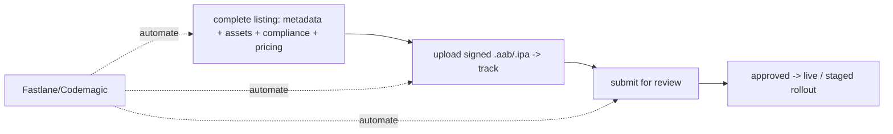

# Store Setup & Submission

> Publishing requires a fully configured **store listing** plus the **build upload**. In **Play Console** and **App Store Connect** you create the app, fill **metadata** (name, description, keywords, category), provide **visual assets** (icon, screenshots per device size, feature graphic/preview), complete **compliance forms** (privacy policy, **data-safety/App Privacy** disclosures, **content rating**, target audience), set up **pricing/availability**, and upload the **signed artifact** to a **track**. Getting the **assets sized correctly**, the **privacy disclosures accurate**, and the **build on the right track** is what turns a submission into a live (or reviewable) app — and what avoids instant rejections.

## Introduction

This file is the practical checklist for both consoles: account/app creation, metadata, assets (with sizing), the compliance/privacy forms, pricing/availability, and uploading a build to a track. It's the store-side execution of the fundamentals ([01_deployment_fundamentals.md](01_deployment_fundamentals.md)).

## Why this concept exists

A build alone isn't publishable — stores require a complete, compliant **listing** (how users discover/evaluate the app) and mandatory **disclosures** (privacy/rating). Missing or wrong assets/metadata/privacy answers cause rejections or block submission. Knowing exactly what each console needs (and correct asset specs) makes the first submission smooth instead of a multi-day back-and-forth.

## Real-world analogy

It's **setting up a retail product listing**: you register as a seller (developer account), create the **product page** (metadata + photos), fill mandatory **regulatory labels** (privacy/ingredients/age rating), set **price + regions**, and deliver the **inventory** (the build) to the right **shelf** (track). A page with the wrong-size photos, missing labels, or product on the wrong shelf won't go live.

## Internal Working

```mermaid
flowchart TD
    Account[developer account: Play Developer / Apple Developer] --> CreateApp[create app in console]
    CreateApp --> Meta[metadata: name, description, keywords, category]
    CreateApp --> Assets[assets: icon, screenshots per size, feature graphic/preview]
    CreateApp --> Compliance[privacy policy, data-safety/App Privacy, content rating, target audience]
    CreateApp --> Pricing[pricing + availability (regions)]
    CreateApp --> Upload[upload signed .aab/.ipa to a track]
    Upload --> Submit[submit for review]
```

- **Prereqs**: **Google Play Developer** account (one-time fee) + **Apple Developer Program** (annual). Create the app in **Play Console** / **App Store Connect** (set bundle/application id — must match your signed build + flavor).
- **Metadata** (discovery + evaluation):
  - **App name/title**, **short + full description** (Play) / **subtitle + description** (App Store), **keywords** (App Store field; Play uses description for ASO), **category**, **contact info**, **support/marketing URL**, **promotional text**.
  - Optimize for **ASO** (app store optimization): clear title, keyword-relevant description, compelling first screenshots.
- **Visual assets (size them exactly — wrong sizes are rejected)**:
  - **App icon** (adaptive on Android; specific px on iOS).
  - **Screenshots** per required **device size** (phone + tablet/iPad; iOS requires specific display sizes) — the primary conversion driver; show real value in the first 1–2.
  - **Play**: **feature graphic** (1024×500) + optional promo video (YouTube).
  - **App Store**: optional **app preview** video; **localized** assets per language.
  - Provide **localized** metadata/assets for target markets.
- **Compliance/privacy forms (mandatory — block submission if missing/wrong)** ([03_review_process_and_compliance.md](03_review_process_and_compliance.md)/[Module 37](../37%20Security/README.md)):
  - **Privacy policy URL** (required if you collect any data).
  - **Data safety (Play)** / **App Privacy "nutrition labels" (App Store)**: **accurately** declare what data you collect, why, whether it's shared/linked to identity, and tracking (**ATT** on iOS). **Must match actual app behavior** — mismatches cause rejection/removal.
  - **Content rating** (Play questionnaire → IARC rating) / **age rating** (App Store); **target audience/kids** declarations (extra rules if targeting children — COPPA/Families).
  - **Permissions justification** (sensitive permissions may need declaration forms, esp. Android — background location, etc.).
- **Pricing & availability**: free/paid, in-app purchases config, **country/region availability**, and (paid apps) tax/banking setup.
- **Build upload → track**:
  - **Play**: upload the **`.aab`** to a **track** (internal/closed/open/production); fill **release notes**; set **staged rollout %** for production.
  - **App Store**: upload the **`.ipa`** (Xcode/Transporter/Fastlane `pilot`/`deliver`) → appears in **TestFlight** / select for an **App Store version**; attach screenshots + "what's new".
  - Ensure the **build's version/build number** and **bundle id** match the console + are unique/increasing ([01_deployment_fundamentals.md](01_deployment_fundamentals.md)).
- **Submit for review**: once listing + build + compliance are complete, **submit**; track review status. Automate metadata/asset/build upload with **Fastlane** (`supply`/`deliver`) / Codemagic ([Module 50](../50%20CI%20CD/README.md)).
- **First-submission gotchas**: missing screenshots for a required device size, inaccurate data-safety answers, no privacy policy URL, mismatched bundle id, undeclared sensitive permissions — all block/reject.

## Memory Representation

Not runtime — a **console configuration**: app record + metadata + localized assets + compliance answers + pricing + uploaded build on a track. Fastlane can store metadata/assets as **files in the repo** (`fastlane/metadata`, `screenshots/`) for version-controlled, automated submission.

## Compiler / Build Behavior

The uploaded artifact must be a **signed release** build with matching **bundle id + version/build number**; console validates format/signing/version on upload (rejects duplicates/unsigned/wrong-id).

## Runtime Behavior

Not applicable (store-side). Once approved + rolled out, users see the listing + download the build.

## Flutter Engine Behavior

Not applicable.

## Dart VM Behavior

Not applicable.

## Examples

```text
Submission checklist (both stores):
  [ ] Developer account (Play Developer / Apple Developer) + app created (bundle id matches build)
  [ ] Metadata: name, description(s), keywords (iOS), category, support URL, promo text
  [ ] Assets: icon; screenshots for EVERY required device size; Play feature graphic (1024x500); (optional preview video)
  [ ] Compliance: privacy policy URL; Data Safety (Play) / App Privacy (App Store) ACCURATE; content/age rating; target audience
  [ ] Permissions: justify/declare sensitive ones (e.g., background location)
  [ ] Pricing & availability (regions, IAP config, tax/banking if paid)
  [ ] Upload signed .aab/.ipa to a track; release notes; (prod) staged rollout %
  [ ] Localize metadata/assets for target markets
  [ ] Submit for review
```

```ruby
# Fastlane — version-controlled metadata/assets + automated upload
# deliver   # (App Store) uploads screenshots + metadata from fastlane/metadata, submits
# supply(track: 'internal', aab: 'build/app.aab', metadata_path: 'fastlane/metadata/android')
```

## Diagrams



## Common Mistakes

| Mistake | Why it blocks/rejects | Fix |
|---------|----------------------|-----|
| Missing screenshots for a required device size | Submission blocked | Provide all required sizes (phone + tablet/iPad) |
| Inaccurate data-safety/App Privacy answers | Rejection/removal | Declare data usage to match actual behavior |
| No privacy policy URL (but collecting data) | Blocked/rejected | Provide a valid privacy policy URL |
| Bundle id mismatch (build vs console) | Upload rejected | Match application/bundle id + flavor |
| Duplicate/lower build number | Upload rejected | Unique increasing build number |
| Undeclared sensitive permissions | Rejection (esp. Android) | Complete permission declaration forms |
| Unsigned/debug build uploaded | Rejected | Upload signed release artifact |
| No localized assets for target markets | Poor discovery | Localize metadata/screenshots |

## Best Practices

- Complete the **full listing** (accurate metadata + correctly-sized, compelling **screenshots per device**, feature graphic/preview) and **localize** for target markets; optimize for **ASO** (first screenshots + keyword-relevant description).
- Fill **compliance forms accurately** (privacy policy URL, **Data Safety/App Privacy matching real behavior**, content/age rating, target audience, sensitive-permission declarations) — mismatches cause rejection/removal.
- Upload a **signed release `.aab`/`.ipa`** with **matching bundle id + unique increasing build number** to the correct **track**, with release notes (+ staged rollout % for prod).
- **Automate** metadata/asset/build upload with **Fastlane (`supply`/`deliver`)**/Codemagic; keep metadata/assets **version-controlled**.

## Performance

Not runtime perf — but **listing quality drives install conversion** (screenshots/description = ASO). App size (from the build) affects install rates ([04_app_size_and_build_optimization.md](04_app_size_and_build_optimization.md)). Automating submission speeds release cadence.

## Advantages / Disadvantages

- **+** Discoverable, compliant, professional listing; automatable + version-controlled (Fastlane); localized reach; correct track distribution.
- **−** Many exact requirements (asset sizes, forms) to satisfy; per-store differences; accurate-privacy discipline; first-time setup is fiddly.

## Interview Questions

1. **🟢 What's needed to publish beyond the build?** — A complete store listing: metadata, correctly-sized assets (icon/screenshots/feature graphic), compliance forms (privacy/data-safety/rating), pricing/availability — then upload the signed build to a track and submit.
2. **🟢 What visual assets do the stores require?** — App icon and screenshots for each required device size (phone + tablet/iPad); Play also needs a 1024×500 feature graphic; optional preview videos; localized per market.
3. **🟡 What are Data Safety / App Privacy forms, and why critical?** — Mandatory disclosures of what data you collect/share/track; they must match actual app behavior or the app is rejected/removed.
4. **🟡 What common setup mismatches block an upload?** — Bundle-id mismatch, duplicate/lower build number, unsigned/debug build, missing required screenshots, no privacy policy URL.
5. **🟡 How do you handle sensitive permissions in submission?** — Complete permission declaration/justification forms (esp. Android background location) and disclose in privacy forms.
6. **🔴 How do you automate/version-control submission?** — Fastlane `supply` (Play) / `deliver` (App Store) upload metadata/assets/build from repo files; integrate into CI/CD.
7. **🔴 Why does listing quality matter (ASO)?** — Title, description, and especially the first screenshots drive discovery + install conversion; localize for target markets.

## Senior Engineer Tips

- Prepare and version-control your metadata/screenshots (Fastlane `metadata`/`screenshots` dirs) so submissions are automated and repeatable — hand-entering the console every release is slow and error-prone.
- Fill privacy/data-safety forms to match what the app actually does, and keep them updated when you add data collection; inaccurate disclosures are a rejection/removal risk, not a formality.
- Have all required screenshot sizes + a valid privacy policy URL + matching bundle id/build number ready before your first submission; those are the usual multi-day blockers.

## Architect Perspective

Store setup/submission is the productization layer: a compliant, discoverable listing + a correctly-uploaded signed build is what makes an app publishable. Treating metadata/assets/compliance as **version-controlled, automated** artifacts (Fastlane in CI/CD) — with accurate privacy disclosures and correct sizing/versioning — turns submission from a fragile manual ritual into a repeatable pipeline step, feeding the review process and staged rollout ([03_review_process_and_compliance.md](03_review_process_and_compliance.md), [Module 50](../50%20CI%20CD/README.md)).

## Summary

- Configure a full listing (metadata + correctly-sized/localized assets + accurate compliance forms + pricing) and upload a signed `.aab`/`.ipa` (matching bundle id + unique build number) to a track, then submit.
- Compliance (privacy policy, Data Safety/App Privacy, content rating, permission declarations) is mandatory + must match real behavior.
- Optimize the listing for ASO; automate + version-control submission with Fastlane/Codemagic.

## Revision Notes

- Prereqs: Play Developer + Apple Developer accounts; create app (bundle id matches build/flavor). Metadata: name/description/keywords(iOS)/category/URLs/promo (ASO).
- Assets (exact sizes, localized): icon; screenshots per required device size (phone + tablet/iPad); Play feature graphic 1024×500; optional preview video.
- Compliance (mandatory, match behavior): privacy policy URL; Data Safety (Play)/App Privacy (App Store); content/age rating; target audience/kids; sensitive-permission declarations. Pricing/availability + IAP + tax/banking.
- Upload signed `.aab`/`.ipa` (matching bundle id + unique increasing build number) → track + release notes (+ staged rollout %); submit. Automate via Fastlane `supply`/`deliver`, version-controlled metadata/assets.

## Practice Questions

1. What must a complete store listing include beyond the build?
2. Why must Data Safety/App Privacy forms match actual behavior?
3. What common mismatches block a build upload?

## Coding Questions

1. Draft a submission checklist for both stores (metadata/assets/compliance/upload).
2. Structure version-controlled Fastlane metadata/screenshots for automated upload.
3. Identify + fix three setup errors that would block a first submission.

## Mini Project

**Store submission setup (Flutter/deployment):** Prepare a full submission for both stores: a metadata set (name/description/keywords/category), an asset spec (icon + required screenshot sizes + Play feature graphic, localized), accurate compliance answers (privacy policy URL, Data Safety/App Privacy, content rating, permission declarations), pricing/availability, and the signed-artifact upload plan (matching bundle id + unique build number → track + release notes + staged rollout) — automated/version-controlled via Fastlane. Acceptance: complete listing (metadata + correctly-sized/localized assets); accurate compliance forms (matching real behavior); signed artifact with matching id + unique build number → correct track; ASO-optimized; automatable/version-controlled submission; no common blockers.
