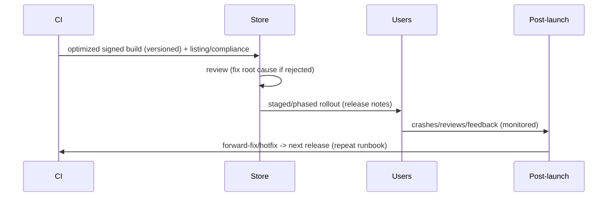

# Deployment Integration (Capstone: Full Release + Post-Launch)

> Assemble the last mile into a **release runbook**: **pre-release** (bump version + build number, build an **optimized signed** App Bundle/IPA, run the CI gate), **store** (complete/compliant listing + accurate privacy/rating), **submit** (with reviewer demo access), **release** (staged/phased rollout with **monitoring**), and **post-launch** (watch crash-free rate + reviews, respond to feedback, run a **forward-fix/hotfix** process). It ties CI/CD ([Module 50](../50%20CI%20CD/README.md)), store setup, compliance, and size optimization into one repeatable process — and continues *after* launch, because shipping is the start of the operate/iterate loop, not the end.

## Introduction

This module capstone composes the fundamentals, store setup/submission, review/compliance, and size optimization into one end-to-end release runbook, then covers the post-launch practices (monitoring, reviews, hotfixes, iteration) that make a launch sustainable. It's the "actually ship it and keep it healthy" deliverable.

## Why this concept exists

The pieces only deliver a **successful launch** when executed as one coordinated, repeatable process — and a launch isn't done at "approved": crashes surface at scale, users leave reviews, and regressions need fast fixes. A runbook + post-launch practices turn releasing from a stressful one-off into a reliable, iterative operation.

## Real-world analogy

It's a **product launch playbook + store operations**: pre-launch QA + packaging (optimized signed build), a compliant shelf listing, passing inspection (review), a **phased regional rollout** you watch closely, and then **ongoing store operations** — reading customer reviews, tracking defect reports, and shipping quick fixes. The launch event is the beginning of running the product, not the finish line.

## Internal Working

```mermaid
flowchart TD
    Pre[pre-release: bump version+build#, optimized signed build, CI gate green] --> Store[store: compliant listing + metadata/assets + privacy/rating]
    Store --> Submit[submit for review (+ reviewer demo access)]
    Submit --> Approve{approved?}
    Approve -->|no| Fix[fix root cause -> resubmit]
    Approve -->|yes| Rollout[staged/phased rollout + monitoring]
    Rollout --> Post[post-launch: crash-free rate, reviews, feedback, forward-fix/hotfix]
    Post --> Iterate[next release (repeat runbook)]
```

- **Pre-release** ([01_deployment_fundamentals.md](01_deployment_fundamentals.md)/[04_app_size_and_build_optimization.md](04_app_size_and_build_optimization.md)/[Module 50](../50%20CI%20CD/README.md)): bump **semver + unique build number**; build an **optimized, signed** App Bundle/IPA (`--release --obfuscate --split-debug-info`, App Bundle, optimized assets — **archive the symbol mapping**); ensure the **CI gate is green** (analyze/tests). Automate via CI/CD.
- **Store** ([02_store_setup_and_submission.md](02_store_setup_and_submission.md)): complete **listing** (metadata, correctly-sized/localized screenshots, feature graphic), **accurate compliance** (privacy policy, Data Safety/App Privacy matching behavior, content/age rating, permission declarations), pricing/availability.
- **Submit** ([03_review_process_and_compliance.md](03_review_process_and_compliance.md)): submit a **complete, crash-free** build with **reviewer demo credentials + notes**; budget review time (Apple); on rejection, **fix root cause + respond/resubmit**.
- **Release**: **staged/phased rollout** (5%→100% Play / Phased Release iOS) with **release notes**, watching **monitoring** ([Module 52](../52%20Monitoring/README.md)); **halt** if metrics degrade. Production is **gated** (mobile = Continuous Delivery — [Module 50](../50%20CI%20CD/README.md)).
- **Post-launch (the loop that matters)**:
  - **Monitor** crash-free rate, errors, ANRs, performance (startup/frames), and adoption ([Module 52](../52%20Monitoring/README.md)) — de-symbolicate obfuscated crashes with the archived mapping.
  - **Reviews/ratings**: read + **respond** to store reviews (support + ASO signal); triage feedback into the backlog.
  - **Forward-fix/hotfix process**: mobile can't easily roll back → **staged rollout halt + feature flags/kill switches + expedited hotfix release**. Have this ready *before* launch.
  - **Iterate**: feed monitoring + feedback into the next release; run the **same runbook** each time (repeatable cadence).
- **A living runbook (deliverable)**: a checklist covering pre-release → store → submit → release → post-launch, so every release is consistent, automatable, and low-stress.
- **Right-sizing**: a solo app needs a lean runbook (build → store → submit → release → basic monitoring); a large app adds staged rollout, flags, dashboards, on-call, and formal hotfix SLAs. Scale to the product.

## Memory Representation

Not runtime — a **runbook + release state**: version/build-number, artifact, listing/compliance status, review status, rollout %, and post-launch metrics/feedback. The invariant: every release follows the same checklist; launch transitions into an operate/iterate loop.

## Compiler / Build Behavior

Pre-release produces an optimized, signed, versioned artifact (App Bundle/IPA) with an archived debug-info mapping; CI gates it. Deterministic via pinned toolchains.

## Runtime Behavior

Users receive the release progressively (staged/phased); monitoring reports crashes/errors/performance at scale; hotfixes ship as expedited releases; feature flags toggle behavior server-side without a store round-trip.

## Flutter Engine Behavior

The optimized artifact runs per device (App Bundle/thinning); crash reporting captures engine/Dart errors for post-launch triage.

## Dart VM Behavior

AOT release build in production; crash de-symbolication uses the archived mapping ([04_app_size_and_build_optimization.md](04_app_size_and_build_optimization.md)/[Module 52](../52%20Monitoring/README.md)).

## Examples

```text
Release runbook (checklist):
  PRE-RELEASE
    [ ] bump semver + unique build number (automated)
    [ ] optimized signed build (App Bundle/IPA, --release --obfuscate --split-debug-info) + archive mapping
    [ ] CI gate green (analyze + tests); E2E on critical journey
  STORE
    [ ] listing complete (metadata + screenshots/feature graphic, localized)
    [ ] compliance accurate (privacy policy, Data Safety/App Privacy, content rating, permissions)
  SUBMIT
    [ ] reviewer demo credentials + notes; budget review time
    [ ] on rejection: fix ROOT cause -> resubmit / respond in Resolution Center
  RELEASE
    [ ] release notes; staged/phased rollout %; monitoring watch; halt-if-degraded
  POST-LAUNCH
    [ ] monitor crash-free rate/errors/perf (de-symbolicate via mapping)
    [ ] read + respond to reviews; triage feedback -> backlog
    [ ] forward-fix/hotfix process ready (flags/kill switch + expedited release)
    [ ] iterate -> next release (repeat runbook)
```

```mermaid
flowchart LR
    Launch[launch (staged + monitored)] --> Monitor2[monitor crashes/reviews/perf]
    Monitor2 --> Fix2[forward-fix/hotfix (flags + expedited release)]
    Fix2 --> Next[iterate -> next release]
    Next --> Launch
```

## Diagrams



## Common Mistakes

| Mistake | Why it's a problem | Fix |
|---------|-------------------|-----|
| Treating launch as "done" | Crashes/feedback need response | Post-launch loop (monitor/respond/hotfix/iterate) |
| No monitoring after release | Blind to prod crashes | Crash-free/error/perf monitoring (Module 52) |
| Straight-to-100% release | Bad build hits everyone | Staged/phased rollout + halt |
| No hotfix/forward-fix process | Slow response to regressions | Flags/kill switch + expedited release ready pre-launch |
| Ad hoc, inconsistent releases | Errors, stress | A repeatable release runbook |
| Ignoring store reviews | Lost support + ASO signal | Read + respond; triage into backlog |
| Not archiving the symbol mapping | Unreadable prod crashes | Archive `--split-debug-info` per release |
| Over-engineering a solo app's process | Overhead | Right-size the runbook |

## Best Practices

- Run a **repeatable release runbook**: pre-release (versioned, **optimized signed** build, CI-gated, **mapping archived**) → compliant **store listing** → **submit** (reviewer demo access) → **staged/phased rollout + monitoring** (gated prod) → **post-launch loop**.
- **Monitor** crash-free rate/errors/perf ([Module 52](../52%20Monitoring/README.md)) and **de-symbolicate** with the archived mapping; **read + respond** to reviews; triage feedback.
- Have a **forward-fix/hotfix process ready before launch** (feature flags/kill switches + expedited release) since mobile rollback is hard; **halt** staged rollout on degradation.
- **Iterate** (feedback + metrics → next release) and **right-size** the runbook to the product; **automate** the pipeline steps via CI/CD ([Module 50](../50%20CI%20CD/README.md)).

## Performance

Post-launch monitoring surfaces real-world **performance** (startup/frames/crashes) at scale — closing the loop with performance budgets ([Module 21](../21%20Performance/README.md)/[Module 47](../47%20Scalable%20Applications/README.md)). Optimized builds + staged rollout protect install conversion + limit blast radius. A repeatable runbook improves **release velocity**.

## Advantages / Disadvantages

- **+** Consistent low-stress releases, safe staged rollout, fast crash/feedback response, iterative improvement, automatable + right-sized.
- **−** Requires monitoring + hotfix infrastructure + process discipline; mobile rollback is hard (forward-fix); review latency; ongoing post-launch effort.

## Interview Questions

1. **🟢 What are the phases of a release runbook?** — Pre-release (version + optimized signed build + CI gate + archive mapping), store (compliant listing), submit (reviewer demo access), release (staged rollout + monitoring), post-launch (monitor/respond/hotfix/iterate).
2. **🟢 Why isn't launch the end?** — Crashes surface at scale, users leave reviews, and regressions need fast fixes — launch begins the operate/iterate loop.
3. **🟡 How do you handle a bad production release?** — Halt the staged rollout, toggle feature flags/kill switches, and ship an expedited forward-fix/hotfix (mobile can't easily roll back).
4. **🟡 What post-launch signals do you monitor, and how?** — Crash-free rate, errors/ANRs, performance (startup/frames), adoption — via crash reporting/monitoring, de-symbolicating obfuscated crashes with the archived mapping.
5. **🟡 Why respond to store reviews?** — Support/retention + ASO signal; triage feedback into the backlog for the next iteration.
6. **🔴 Why archive the debug-info mapping at release time?** — To de-symbolicate obfuscated production crash reports; without it, prod stack traces are unreadable.
7. **🔴 How do you right-size the release process?** — Solo/small: lean runbook + basic monitoring; large: staged rollout, flags, dashboards, on-call, hotfix SLAs — scale to the product.

## Senior Engineer Tips

- Write the runbook once and follow it every release; consistency is what makes launches boring (good) instead of stressful firefights.
- Set up monitoring + a hotfix/feature-flag process before your first launch, and archive the symbol mapping per build; those are exactly what you'll wish you had the moment a production crash spikes.
- Always release staged + monitored and treat "approved" as the start of operations — reading reviews, watching crash-free rate, and shipping fast forward-fixes is where a launch actually succeeds or fails.

## Architect Perspective

Deployment integration is the operate-and-iterate culmination: a repeatable runbook that turns CI/CD's signed optimized artifact into a compliant, reviewed, staged, monitored release — and then keeps the app healthy via monitoring, review response, and a forward-fix process. It closes the loop from build → ship → observe → fix → iterate, tying testing, CI/CD, size optimization, and monitoring into one sustainable delivery practice. Launch is a phase in an ongoing operation, and the runbook + post-launch loop are what make that operation reliable ([Module 50](../50%20CI%20CD/README.md), [Module 52](../52%20Monitoring/README.md), [Module 47](../47%20Scalable%20Applications/README.md)).

## Summary

- Follow a repeatable release runbook: pre-release (version + optimized signed build + CI gate + archive mapping) → compliant store listing → submit (reviewer demo access) → staged/phased rollout + monitoring (gated prod) → post-launch.
- Post-launch = monitor crash-free/errors/perf (de-symbolicate via mapping), respond to reviews, run a forward-fix/hotfix process (flags + expedited release), iterate.
- Launch begins the operate/iterate loop; automate via CI/CD; right-size the runbook to the product.

## Revision Notes

- Runbook: pre-release (bump semver + unique build#, optimized signed App Bundle/IPA `--release --obfuscate --split-debug-info` + archive mapping, CI gate) → store (compliant listing + accurate privacy/rating) → submit (reviewer demo creds/notes, budget review, fix root cause) → release (release notes, staged/phased rollout + monitoring, halt) → post-launch.
- Post-launch loop: monitor crash-free/errors/perf (de-symbolicate via mapping — Module 52), read + respond to reviews, forward-fix/hotfix ready (flags/kill switch + expedited release), iterate → next release.
- Gated prod (Continuous Delivery); mobile rollback hard → forward-fix; automate via CI/CD; right-size to product; launch = start of operate/iterate.

## Practice Questions

1. What are the runbook phases from pre-release to post-launch?
2. How do you handle a bad release given hard mobile rollback?
3. What do you do after launch, and why isn't it the end?

## Coding Questions

1. Write an end-to-end release checklist (pre-release → post-launch).
2. Define the post-launch monitoring + hotfix/forward-fix process.
3. Wire de-symbolication (archived mapping) into the crash-reporting flow.

## Mini Project

**Release runbook + post-launch (capstone — Flutter/deployment):** Produce a full release runbook for an app: pre-release (auto version/build# bump, optimized signed App Bundle/IPA with obfuscation + archived mapping, CI gate), compliant store listing + submission (reviewer demo access), staged/phased rollout with monitoring, and a post-launch plan (crash-free/error/perf monitoring with de-symbolication, review response/triage, forward-fix/hotfix via flags + expedited release, iteration) — right-sized to the product and automated via CI/CD. Acceptance: repeatable runbook covering pre-release→store→submit→release→post-launch; optimized signed versioned build + archived mapping; compliance + reviewer access; staged rollout + monitoring + halt; post-launch monitoring/reviews/forward-fix/iterate; gated prod; right-sized + automatable.
