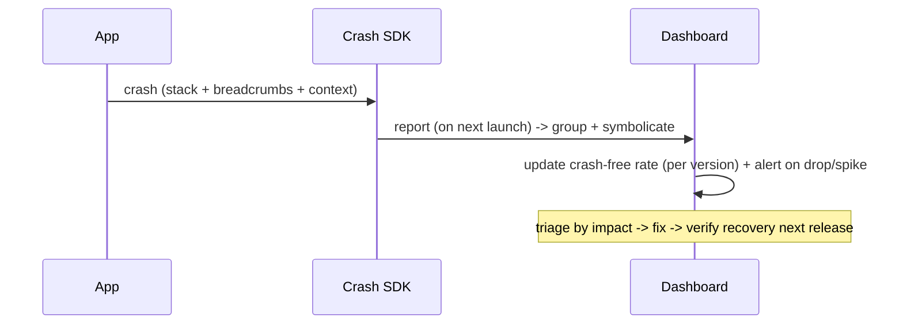

# Crash Reporting

> Crash reporting captures **uncaught crashes + fatal/non-fatal errors** from real devices — via **Crashlytics** or **Sentry** — and surfaces them as **grouped, symbolicated, contextualized** issues so you can find + fix what's actually breaking. The headline metric is **crash-free rate** (% of users/sessions without a crash — your stability SLI). To be useful, reports need **symbolication** (map obfuscated release stack traces back to source via the archived `--split-debug-info` mapping), **breadcrumbs** (the trail of events before the crash), **custom keys/context** (version/device/user-opaque-id/correlation id), and a **release-health** view (crashes per version) — all PII-safe.

## Introduction

This file covers crash reporting concretely: wiring a crash SDK to global error handlers, symbolication, breadcrumbs + context, fatal vs non-fatal, crash-free rate + release health, and triage. It consumes the global error handling ([Module 38](../38%20Error%20Handling/README.md)) and the symbol mapping from deployment ([Module 51](../51%20Deployment/README.md)).

## Why this concept exists

Crashes on uncontrolled devices are invisible without reporting — and users rarely report them, they just churn. A crash reporter automatically captures every crash with the context needed to diagnose it, groups duplicates, tracks stability over time/versions, and alerts on spikes — the single most important production signal for app health.

## Real-world analogy

A crash reporter is a **flight-data recorder + incident dashboard**: every crash "black box" is automatically retrieved with the **flight path leading up to it** (breadcrumbs), **decoded from raw codes to readable events** (symbolication), and **tagged with aircraft/route** (version/device/context). Identical incidents are **grouped**, and a **fleet-health board** shows crash-free rate per model (version) — so investigators fix the biggest, newest problems first instead of guessing from passenger complaints.

## Internal Working

```mermaid
flowchart TD
    Handlers[global error handlers: FlutterError.onError + PlatformDispatcher.onError + zone] --> SDK[crash SDK: Crashlytics / Sentry]
    Native[native crashes] --> SDK
    SDK --> Group[group duplicates into issues]
    Group --> Symbol[symbolicate (archived --split-debug-info mapping)]
    Symbol --> Context[+ breadcrumbs + custom keys + correlation id + version/device]
    Context --> Dash[dashboard: crash-free rate + release health + alerts]
    Note[PII-safe; fatal + non-fatal; per-version stability]
```

- **Capture uncaught errors**: route the **global handlers** to the crash SDK — **`FlutterError.onError`** (framework), **`PlatformDispatcher.instance.onError`** / `runZonedGuarded` (async/uncaught), and **native crashes** (SDK hooks) — so **every crash** is recorded ([Module 38](../38%20Error%20Handling/README.md)). Report **fatal** (crashes) and **non-fatal** (handled exceptions you still want visibility on) with stack + context.
- **Symbolication (essential for release)**: release builds are **obfuscated** ([Module 51](../51%20Deployment/README.md)), so raw stacks are unreadable. Upload the **debug-info/symbol mapping** (`--split-debug-info`, dSYMs on iOS, mapping/ProGuard files on Android) to the crash service so it **maps stacks back to source**. Automate the upload in CI/CD; **without it, crashes are undiagnosable**.
- **Grouping/issues**: the service **groups identical crashes** into a single issue (by stack signature) with **occurrence count + affected users + versions + trend** — so you triage by **impact**, not noise.
- **Breadcrumbs + context** (diagnose the *why*):
  - **Breadcrumbs**: the **sequence of events** (navigations, taps, network results, logs) leading to the crash — fed from your logging facade ([Module 39](../39%20Logging/README.md)).
  - **Custom keys/context**: app **version/build**, **device/OS**, **session**, an **opaque user id** (not PII), the current **screen**, and a **correlation/trace id** to link to logs/traces.
  - Together they reconstruct the incident.
- **Crash-free rate (the key metric)**: **% of users (and % of sessions) that didn't crash** — your **stability SLI**. Track it per **release** (**release health**): a new version dropping crash-free rate is the signal to **halt a staged rollout** ([04_performance_monitoring_and_alerting.md](04_performance_monitoring_and_alerting.md)/[Module 51](../51%20Deployment/README.md)).
- **Alerting**: alert on **crash-free-rate drops**, **new/regressed issues**, and **velocity spikes** (crashes/hour) — especially during rollout — so you react before wide exposure.
- **Triage workflow**: prioritize by **impact** (users × frequency × recency/newness), open the top issue → read **symbolicated stack + breadcrumbs + context** → reproduce/fix → verify crash-free rate recovers in the next release. Mark fixed issues to detect regressions.
- **ANRs / non-fatals**: Android **ANRs** (app-not-responding) and **OOMs** are tracked too; log important **handled** errors as non-fatals for visibility without crashing.
- **PII-safe** ([Module 37](../37%20Security/README.md)/[Module 39](../39%20Logging/README.md)): **never** put PII/secrets in keys/breadcrumbs; use **opaque ids**; respect consent. Crash data is shipped to a vendor.
- **Tools**: **Firebase Crashlytics** (free, Flutter-integrated, crash-free rate + velocity alerts) vs **Sentry** (crashes + performance + errors, cross-platform, rich release health). Wire once, behind your error/logging layer.

## Memory Representation

On-device: a small buffer of the current session's breadcrumbs + context, flushed with a crash report (async/on next launch). Backend: grouped issues (stack signature → occurrences/users/versions/trend), crash-free-rate time-series, and symbol mappings per version.

## Compiler Behavior

Release obfuscation makes stacks opaque → the crash SDK relies on the uploaded **symbol mapping** (per build) to symbolicate; global handlers are top-level entry points capturing errors.

## Runtime Behavior

On a crash, the SDK captures stack + breadcrumbs + context and reports it (often on **next launch**); non-fatals report immediately (async). The backend groups, symbolicates, updates crash-free rate, and fires alerts.

## Flutter Engine Behavior

Framework errors flow via `FlutterError.onError`; native/engine crashes are caught by the SDK's platform hooks; ANRs/OOMs captured on Android.

## Dart VM Behavior

Uncaught Dart errors (incl. isolates) route through the global handlers to the SDK; correlation ids from logging link Dart errors to their breadcrumbs/traces.

## Examples

```dart
// Wire global handlers -> crash SDK (Crashlytics example) + non-fatals + context
void main() {
  WidgetsFlutterBinding.ensureInitialized();
  FlutterError.onError = FirebaseCrashlytics.instance.recordFlutterFatalError;   // framework
  PlatformDispatcher.instance.onError = (e, s) {                                  // async/uncaught
    FirebaseCrashlytics.instance.recordError(e, s, fatal: true);
    return true;
  };
  // Context/custom keys (opaque id — NO PII) + correlation id
  FirebaseCrashlytics.instance.setCustomKey('screen', 'home');
  FirebaseCrashlytics.instance.setUserIdentifier(opaqueUserId);
  runApp(const App());
}

// Non-fatal (handled error you still want visibility on) + breadcrumb
try {
  await repo.load();
} catch (e, s) {
  FirebaseCrashlytics.instance.recordError(e, s, fatal: false);   // non-fatal
  logger.warn('load_failed', {'correlationId': corrId});          // breadcrumb (Module 39)
}
```

```text
Symbolication (CI/CD) — upload symbols so release crashes are readable:
  flutter build ... --obfuscate --split-debug-info=build/symbols   # produce mapping
  # upload build/symbols + iOS dSYMs + Android mapping to Crashlytics/Sentry (automated in CI)
  # WITHOUT this: release stacks are obfuscated garbage.

Triage by impact:
  sort issues by (affected users x frequency x recency) -> fix biggest/newest first
  watch crash-free rate PER VERSION -> halt staged rollout if a new version drops it
```

## Diagrams



## Common Mistakes

| Mistake | Why it's wrong | Fix |
|---------|---------------|-----|
| No symbol upload for release | Stacks unreadable | Upload `--split-debug-info`/dSYM/mapping (CI) |
| Only capturing framework errors | Misses async/native crashes | Wire `PlatformDispatcher.onError`/zone + native |
| PII in keys/breadcrumbs | Privacy breach (vendor-shipped) | Opaque ids; redact; consent |
| Ignoring crash-free rate per version | Miss regressions during rollout | Track release health; halt on drop |
| Not using breadcrumbs/context | Can't diagnose the "why" | Feed breadcrumbs + custom keys + correlation id |
| Triaging by recency alone | Fix low-impact issues | Prioritize by users × frequency × newness |
| Not logging non-fatals | Blind to handled failures | Record important non-fatals |
| No alerting on spikes | React too late | Alert on crash-free drop / velocity spike |

## Best Practices

- Route **all** global handlers (`FlutterError.onError` + `PlatformDispatcher.onError`/zone + native) to the crash SDK; report **fatal + important non-fatal** errors with stack + context.
- **Upload symbols** (`--split-debug-info`/dSYM/mapping) in CI so **release crashes symbolicate**; without it they're undiagnosable.
- Attach **breadcrumbs + custom keys + correlation id + version/device/session** (PII-safe, opaque ids) to diagnose the *why*; feed breadcrumbs from your logging facade.
- Track **crash-free rate per version** (release health), **alert** on drops/spikes (halt staged rollout), and **triage by impact** (users × frequency × recency).

## Performance

Crash reporting is low-overhead: reports are batched/async (often sent on next launch), breadcrumbs are a small ring buffer, and non-fatals are cheap. It must not degrade the app — the SDKs are designed for this. The value is catching stability regressions early (esp. during rollout).

## Advantages / Disadvantages

- **+** Automatic capture of all crashes with context, grouping, symbolicated stacks, crash-free-rate/release-health tracking, spike alerts, impact-based triage.
- **−** Symbol-upload setup, PII discipline, vendor dependency, alert tuning, non-fatal noise if over-reported.

## Interview Questions

1. **🟢 What is crash-free rate, and why does it matter?** — The % of users/sessions without a crash — the key stability SLI; tracked per version to detect regressions and gate staged rollouts.
2. **🟢 Why is symbolication required, and how is it done?** — Release builds are obfuscated (unreadable stacks); you upload the `--split-debug-info`/dSYM/mapping so the service maps stacks back to source.
3. **🟡 How do you capture all crashes in Flutter?** — Route `FlutterError.onError` (framework) + `PlatformDispatcher.onError`/zone (async/uncaught) + native SDK hooks to the crash reporter; also record important non-fatals.
4. **🟡 What context makes a crash diagnosable?** — Breadcrumbs (event trail), custom keys (screen/version/device), an opaque user id, and a correlation id linking to logs/traces — all PII-safe.
5. **🟡 How do you triage crashes?** — By impact (affected users × frequency × recency/newness) — fix the biggest, newest issues first using the symbolicated stack + breadcrumbs.
6. **🔴 How does crash reporting integrate with staged rollout?** — Watch crash-free rate per version during rollout; a drop (or a new-issue spike) triggers halting/rolling back the rollout ([Module 51](../51%20Deployment/README.md)).
7. **🔴 Fatal vs non-fatal reporting — why both?** — Fatal = crashes (stability); non-fatal = handled errors you still want visibility on (early warning) without crashing the app.

## Senior Engineer Tips

- Automate symbol uploads in CI on every release; the day a crash spikes, unsymbolicated stacks turn a 10-minute fix into an all-day guess.
- Wire crash reporting behind your error/logging layer so breadcrumbs + correlation ids come for free, and never let PII into keys/breadcrumbs — crash data leaves the device.
- Gate staged rollouts on crash-free rate per version and triage by impact; a new version dropping crash-free rate is your primary halt signal.

## Architect Perspective

Crash reporting is the stability sensor of the observability stack: it turns invisible field crashes into grouped, symbolicated, contextualized issues and a crash-free-rate SLI that gates rollouts and drives triage. Built on the global error handlers + logging breadcrumbs + the deployment symbol mapping, and kept PII-safe/low-overhead, it's the single highest-value production signal — feeding the alerting/feedback loop and the safe-release process ([Module 38](../38%20Error%20Handling/README.md), [Module 39](../39%20Logging/README.md), [Module 51](../51%20Deployment/README.md), [05_monitoring_integration.md](05_monitoring_integration.md)).

## Summary

- Route all global handlers (+ native) to a crash SDK (Crashlytics/Sentry); report fatal + non-fatal with stack + context; upload symbols so release crashes symbolicate.
- Diagnose via breadcrumbs + custom keys + correlation id + version/device (PII-safe); crashes are grouped into issues.
- Crash-free rate per version = stability SLI; alert on drops/spikes (halt rollout); triage by impact (users × frequency × recency).

## Revision Notes

- Capture: `FlutterError.onError` (framework) + `PlatformDispatcher.onError`/zone (async) + native + non-fatals → crash SDK (Crashlytics/Sentry). Fatal + non-fatal.
- Symbolicate: upload `--split-debug-info`/dSYM/Android mapping (CI) — else release stacks unreadable. Group duplicates into issues (count/users/versions/trend).
- Context: breadcrumbs (from logging) + custom keys (screen/version/device) + opaque user id + correlation id; PII-safe. Crash-free rate per version (release health) = stability SLI → alert on drop/spike → halt staged rollout; triage by impact (users×frequency×recency).

## Practice Questions

1. Why must you upload symbols, and what breaks without it?
2. What context turns a crash into a diagnosable issue?
3. How does crash-free rate gate a staged rollout?

## Coding Questions

1. Wire `FlutterError.onError` + `PlatformDispatcher.onError` to a crash SDK with context.
2. Record a non-fatal error + a breadcrumb with a correlation id.
3. Add CI symbol upload for release crash symbolication.

## Mini Project

**Crash reporting setup (Flutter/monitoring):** Wire a crash SDK (Crashlytics/Sentry) to all global handlers (framework + async + native) reporting fatal + important non-fatal errors with breadcrumbs (from your logging facade) + custom keys + correlation id + version/device (PII-safe, opaque ids), automate symbol upload in CI for release symbolication, and set up crash-free-rate-per-version tracking + an alert (drop/spike) that gates staged rollout. Acceptance: all crash sources captured + symbolicated (CI symbol upload); breadcrumbs + context (no PII); grouped issues; crash-free-rate release health + alert → rollout halt; triage-by-impact plan.
