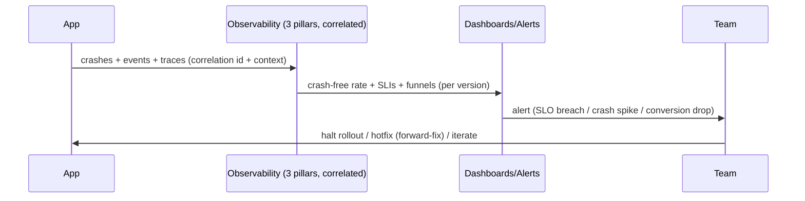

# Monitoring Integration (Capstone: Full Observability + Feedback Loop)

> Assemble one **observability stack** that closes the loop: **crash reporting** (Crashlytics/Sentry — crash-free rate, symbolication, breadcrumbs), **analytics** (event taxonomy + funnels, privacy-safe), and **performance monitoring** (startup/frame/network SLIs, SLOs), all **correlated** (shared ids + version/device/session context), fed by your **logging facade**, surfaced on **dashboards**, and guarded by **actionable alerts** — wired into the **delivery feedback loop**: staged-rollout gate (crash-free + SLO) → triage → fix/hotfix → iterate. This completes the build→ship→**observe→improve** cycle and makes every earlier module's work verifiable in production.

## Introduction

This module capstone composes crash reporting, analytics, and performance monitoring into a single correlated, privacy-safe, low-overhead observability stack that drives action — the "how it all fits + closes the loop" deliverable. It ties monitoring to deployment (staged rollout) and to the whole handbook (verifying architecture/perf/quality in the field).

## Why this concept exists

The pillars are only valuable **assembled + correlated + acted upon**: crashes, analytics, and performance answer different questions but must stitch together (one correlation id linking a crash to its funnel step + trace), surface on shared dashboards, alert meaningfully, and **feed decisions** (halt rollout, hotfix, iterate). This capstone shows that integrated stack and the feedback loop that makes monitoring worthwhile.

## Real-world analogy

It's **mission control for a live product**: separate consoles (stability, usage, performance) feed **one correlated picture** with shared telemetry ids; a **health board** shows release status; **alarms** fire on real anomalies; and controllers **act** — hold the launch (halt rollout), send a fix (hotfix), or plan the next mission (iterate). Disconnected consoles nobody watches or acts on aren't mission control — the **integrated, acted-upon loop** is.

## Internal Working

```mermaid
flowchart TD
    App[live app] --> Log[logging facade (structured, redacted, correlation id)]
    Log --> Crash[crash reporting: crash-free rate + symbolication + breadcrumbs]
    Log --> Analytics[analytics: taxonomy + funnels (privacy-safe)]
    Log --> Perf[performance: startup/frame/network SLIs + SLOs]
    Crash & Analytics & Perf --> Correlate[correlate via ids + context (version/device/session)]
    Correlate --> Dash[dashboards (release health) + alerts (actionable)]
    Dash --> Loop[feedback loop: staged-rollout gate -> triage -> fix/hotfix -> iterate]
    Loop --> App
    Note[PII-safe, low-overhead; each behind an interface (swappable/testable)]
```

- **Three pillars, correlated** ([01_monitoring_fundamentals.md](01_monitoring_fundamentals.md)):
  - **Stability** — crash reporting (crash-free rate, symbolicated stacks, breadcrumbs — [02_crash_reporting.md](02_crash_reporting.md)).
  - **Usage** — analytics (event taxonomy, funnels, retention, privacy-safe — [03_analytics_and_metrics.md](03_analytics_and_metrics.md)).
  - **Performance** — field SLIs/SLOs (startup/frames/network/custom traces — [04_performance_monitoring_and_alerting.md](04_performance_monitoring_and_alerting.md)).
  - **Correlated** by a shared **correlation/trace id** + **context** (version/device/session/opaque user) so a crash links to its funnel step + trace + breadcrumbs.
- **Fed by the logging facade** ([Module 39](../39%20Logging/README.md)): one place emits structured, redacted, correlated telemetry to all three (breadcrumbs → crash reporter; events → analytics; spans → performance) — keeping instrumentation **DRY, PII-safe, consent-gated**.
- **Behind interfaces (swappable/testable)**: `CrashReporter`, `Analytics`, `PerformanceMonitor` abstractions so vendors are swappable, tests use fakes, and consent/redaction is centralized — the same discipline as logging.
- **Dashboards + alerts**:
  - A **release-health dashboard** (crash-free rate + key SLIs per version) is the launch cockpit.
  - **Actionable, tuned alerts** on **crash-free-rate drops, SLO breaches/regressions, funnel-conversion drops, error spikes** — routed + mapped to a decision.
- **The feedback loop (the whole point)** ([Module 51](../51%20Deployment/README.md)):
  - **Staged-rollout gate**: monitored signals (crash-free + SLOs) decide **promote vs halt** at 5%/20%/… — a regression stops it before 100%.
  - **Triage → fix/hotfix**: alert → open the correlated issue (crash stack + breadcrumbs + trace + funnel context) → fix → **forward-fix/hotfix** (mobile rollback is hard — flags/kill switch + expedited release).
  - **Iterate**: funnels/retention + perf/stability trends → next release; **re-verify** metrics recover.
- **Verifies the whole handbook in the field**: monitoring confirms your **architecture/perf/quality** actually hold on real devices — crash-free rate validates error handling/testing, SLIs validate performance budgets, funnels validate product decisions. It's the **outer verification loop** of everything built.
- **Constraints** ([Module 37](../37%20Security/README.md)): **PII-safe** (redact, opaque ids, consent — ATT/GDPR, matching store data-safety), **low-overhead** (async/batched/sampled) across all pillars.
- **Right-sizing**: a small app needs crash reporting + a couple of SLIs + basic analytics; a large app adds full dashboards, tuned alerting, SLO governance, on-call, and experiment analytics — scale to the product ([Module 47](../47%20Scalable%20Applications/README.md)).

## Memory Representation

Not app state — a **correlated telemetry system**: crash issues, analytics event streams/funnels, performance SLI time-series, all keyed by correlation ids + context, surfaced on dashboards with alert rules. On-device: the logging facade batches/redacts/consent-gates telemetry to the three sinks (async).

## Compiler Behavior

Instrumentation compiles against the pillar interfaces (mockable); release obfuscation → symbolication via archived mapping ([Module 51](../51%20Deployment/README.md)). Global handlers are entry points feeding crash reporting.

## Runtime Behavior

The app emits correlated telemetry (async/batched/sampled); backends aggregate into crash-free rate, funnels, and SLIs; alerts fire on anomalies; rollout decisions + triage + iteration act on them. Correlation stitches a single incident across pillars.

## Flutter Engine Behavior

Performance hooks engine frame/startup timings; crash SDKs capture framework/native errors; analytics may observe navigation — all funneled through the facade.

## Dart VM Behavior

Uncaught Dart/isolate errors → crash reporter (via global handlers); custom traces measure Dart operations; batching keeps all pillars off the critical path.

## Examples

```dart
// One facade feeds all three pillars, correlated + redacted + consent-gated
class Observability {
  final CrashReporter crashes; final Analytics analytics; final PerformanceMonitor perf;
  Observability(this.crashes, this.analytics, this.perf);

  void bootstrap(String corrId, String version) {
    crashes.setContext({'version': version, 'correlationId': corrId}); // ties pillars together
    FlutterError.onError = crashes.recordFlutterError;                 // stability
    PlatformDispatcher.instance.onError = (e, s) { crashes.record(e, s, fatal: true); return true; };
  }

  Future<void> checkout(Cart cart) async {
    final trace = perf.startTrace('checkout');                         // performance
    analytics.logEvent('checkout_start', {'cart_size': cart.items.length}); // usage (funnel)
    try {
      await doCheckout(cart);
      analytics.logEvent('purchase', {'value': cart.totalCents});
    } catch (e, s) {
      crashes.record(e, s, fatal: false);                              // non-fatal (stability)
      analytics.logEvent('checkout_failed');
      rethrow;
    } finally {
      await trace.stop();                                              // duration SLI
    }
  }
}
// All three share the correlation id + version context -> one incident view.
```

```text
Feedback loop (staged rollout -> action):
  release at 5% -> watch crash-free rate + SLIs + funnel conversion
    if crash-free drops / SLO breach / conversion tanks -> HALT + triage (correlated: crash+breadcrumbs+trace+funnel)
    -> forward-fix/hotfix (flags/kill switch + expedited release) -> verify recovery
    else -> promote 20% -> ... -> 100% -> iterate next release on funnel/perf/stability data
```

## Diagrams



## Common Mistakes

| Mistake | Why it's wrong | Fix |
|---------|---------------|-----|
| Pillars uncorrelated | Can't stitch a full incident | Shared correlation id + context |
| Collecting but not acting | Monitoring without the loop is waste | Gate rollout / triage / fix / iterate |
| Direct SDK calls everywhere | Not swappable/testable/consistent | Interfaces + logging facade |
| PII across telemetry | Privacy/compliance breach | Redact, opaque ids, consent (all pillars) |
| No release-health dashboard/alerts | Regressions unnoticed | Per-version dashboard + actionable alerts |
| Not gating staged rollout | Bad release hits everyone | Halt on crash-free/SLO regression |
| High-overhead telemetry | Harms the app | Async/batched/sampled across pillars |
| Over-monitoring a tiny app | Overhead > value | Right-size (crashes + few SLIs + basic analytics) |

## Best Practices

- Integrate **all three pillars** (stability/usage/performance) behind **interfaces**, fed by the **logging facade**, **correlated** via shared ids + context (version/device/session/opaque user).
- Surface a **release-health dashboard** (crash-free rate + key SLIs + funnels per version) and set **actionable, tuned alerts** (crash-free drop / SLO breach / conversion drop / error spike).
- **Close the feedback loop**: gate **staged rollout** on signals → triage the correlated incident → **forward-fix/hotfix** (flags/kill switch) → **iterate**; re-verify recovery.
- Keep telemetry **PII-safe + consent-gated + low-overhead** across pillars; **right-size** to the product; use monitoring to **verify** your architecture/perf/quality in the field.

## Performance

The stack is designed low-overhead (async/batched/sampled across pillars); its payoff is protecting field **stability + performance** and enabling safe rollouts. Correlation makes diagnosis fast (fewer wasted hours). Percentile SLIs focus effort on the painful tail. Right-sizing avoids over-instrumentation cost ([Module 21](../21%20Performance/README.md)/[Module 47](../47%20Scalable%20Applications/README.md)).

## Advantages / Disadvantages

- **+** Correlated production visibility (stability/usage/performance), safe monitored rollouts, fast diagnosis, data-driven iteration, verifies the whole app in the field, swappable/testable.
- **−** Setup + backend cost across pillars, correlation/consent/redaction discipline, alert tuning, SLO governance, right-sizing judgment.

## Interview Questions

1. **🟢 What makes an observability stack, not just tools?** — All three pillars (stability/usage/performance) correlated (shared ids + context), surfaced on dashboards, alerted, and wired into a feedback loop that drives action.
2. **🟢 How do the pillars correlate?** — A shared correlation/trace id + context (version/device/session) links a crash to its breadcrumbs, funnel step, and performance trace — one incident view.
3. **🟡 How does monitoring close the feedback loop?** — Signals gate staged rollout (promote/halt) → triage the correlated incident → forward-fix/hotfix → iterate on funnel/perf/stability data → re-verify.
4. **🟡 Why route everything through the logging facade + interfaces?** — DRY, PII-safe/consent-gated instrumentation, swappable vendors, and testable (fakes) — one place owns redaction/consent/correlation.
5. **🟡 What's on a release-health dashboard, and what alerts?** — Crash-free rate + key SLIs (p95 startup, jank%) + funnels per version; alerts on crash-free drop / SLO breach / conversion drop / error spike — actionable + tuned.
6. **🔴 How does monitoring verify the rest of the handbook?** — Crash-free rate validates error handling/testing, SLIs validate performance budgets, funnels validate product decisions — the field verification loop of everything built.
7. **🔴 How do you right-size the stack?** — Small: crash reporting + a few SLIs + basic analytics; large: full dashboards, tuned alerting, SLO governance, on-call, experiment analytics.

## Senior Engineer Tips

- Correlate the pillars with one id + version/device context and feed them from your logging facade; the ability to jump from a crash to its funnel step and trace is what turns hours of guessing into minutes of diagnosis.
- Build the release-health dashboard + a handful of actionable alerts first, and wire them into the staged-rollout gate; monitoring only pays off when it drives the promote/halt/hotfix decision.
- Keep it PII-safe, consent-gated, low-overhead, and behind interfaces across all pillars — and right-size it; over-instrumenting a small app is as much a failure as flying blind on a large one.

## Architect Perspective

Monitoring integration is the outer verification loop of the entire handbook: a correlated, privacy-safe, low-overhead observability stack (stability + usage + performance) that surfaces release health, alerts on real anomalies, and feeds the delivery loop (gate rollout → triage → fix → iterate). It confirms in the field that the architecture, performance budgets, and quality gates actually hold — closing build→ship→observe→improve. Assembled behind interfaces and fed by the logging facade, and right-sized to the product, it's what makes shipping a continuous, data-driven, safe operation rather than a leap of faith ([01_monitoring_fundamentals.md](01_monitoring_fundamentals.md), [Module 51](../51%20Deployment/README.md), [Module 39](../39%20Logging/README.md), [Module 47](../47%20Scalable%20Applications/README.md)).

## Summary

- Integrate all three pillars (crash/analytics/performance) behind interfaces, fed by the logging facade, correlated via shared ids + context; surface a release-health dashboard + actionable alerts.
- Close the feedback loop: gate staged rollout on signals → triage correlated incident → forward-fix/hotfix → iterate; verify architecture/perf/quality in the field.
- Keep PII-safe + consent-gated + low-overhead across pillars; right-size to the product; completes build→ship→observe→improve.

## Revision Notes

- Three pillars integrated + correlated: crash reporting (crash-free rate/symbolication/breadcrumbs), analytics (taxonomy/funnels, privacy-safe), performance (startup/frame/network SLIs + SLOs). Correlate via id + context (version/device/session/opaque user); feed from logging facade; behind interfaces (swappable/testable).
- Dashboards (release health per version) + actionable/tuned alerts (crash-free drop / SLO breach / conversion drop / spike). Feedback loop: staged-rollout gate → triage (correlated incident) → forward-fix/hotfix (flags/kill switch) → iterate → verify recovery.
- PII-safe + consent-gated + low-overhead (async/batched/sampled) all pillars; right-size; verifies whole handbook in field; closes build→ship→observe→improve.

## Practice Questions

1. What turns three monitoring tools into an observability stack?
2. How does correlation speed up diagnosis, and how do you achieve it?
3. How does monitoring close the delivery feedback loop?

## Coding Questions

1. Compose `CrashReporter`/`Analytics`/`PerformanceMonitor` interfaces fed by the logging facade, correlated by id + context.
2. Instrument one flow across all three pillars (crash context + funnel event + custom trace).
3. Define the release-health dashboard signals + alerts + the staged-rollout gate.

## Mini Project

**Observability stack (capstone — Flutter/monitoring):** Integrate crash reporting (crash-free rate + symbolication + breadcrumbs), analytics (event taxonomy + a conversion funnel, privacy-safe), and performance monitoring (startup/frame/network SLIs + SLOs) behind interfaces, fed by your logging facade, correlated via a shared id + version/device/session context; build a release-health dashboard (crash-free + SLIs + funnel per version), set actionable alerts, and document the feedback loop (staged-rollout gate → triage correlated incident → forward-fix/hotfix → iterate). Acceptance: all three pillars integrated + correlated (id + context) + behind interfaces; fed by logging facade; PII-safe + consent-gated + low-overhead; release-health dashboard + tuned actionable alerts; documented feedback loop gating staged rollout; right-sized; verifies architecture/perf/quality in the field.
