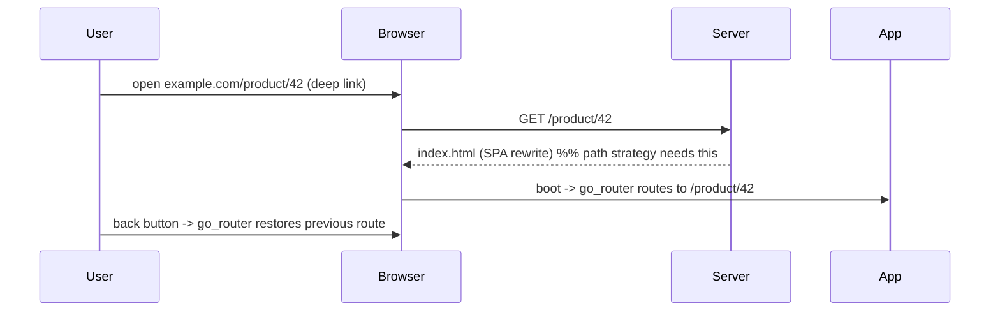

# Web-Specific Concerns

> The web brings expectations mobile doesn't: **URLs must be clean + shareable** (use the **path URL strategy** to drop the `#`), the **browser back/forward buttons + deep links** must work (route ↔ URL sync via **`go_router`**), **SEO is limited** (canvas rendering — mitigate or accept), and users expect **PWA** installability/offline, plus **browser APIs** (via **JS interop**, not platform channels) and awareness of **platform differences** (no `dart:io`, browser sandbox, tab lifecycle). Handle these deliberately or the app feels "not really a website" — broken URLs, dead back button, unindexable, no install.

## Introduction

This file covers the web-integration concerns beyond rendering: URL strategy, routing/deep links/back-button, SEO reality + mitigations, PWA, browser API access (JS interop), and platform differences. It makes a Flutter Web app behave like a proper web app.

## Why this concept exists

Mobile apps have no URLs, no browser chrome, no SEO, no install-from-store-manifest, and full `dart:io`. The web has all of these expectations — users share URLs, hit back, expect installability, and search engines crawl. Ignoring them yields an app that technically runs in a browser but violates web norms. These concerns bridge Flutter to the web platform properly.

## Real-world analogy

Putting a mobile app on the web without these is like **opening a shop inside a mall but with no street address, no signage search engines can read, a door that doesn't respond to "back," and no way to bookmark**. Fixing them = giving the shop a **real address** (clean URL), **listing it in the directory** (SEO, as far as possible), a **working entrance/exit** (back/forward + deep links), and a **"save to home screen" option** (PWA) — so it behaves like a real storefront on the web.

## Internal Working

```mermaid
flowchart TD
    URL[URL strategy: path (drop #)] --> Router[go_router: route <-> URL sync]
    Router --> Deep[deep links + back/forward buttons work]
    SEO[SEO: canvas -> limited] --> Mitigate[prerender/static shell/meta OR accept for app-like]
    PWA[PWA: manifest + service worker] --> Install[installable + offline shell]
    Browser[browser APIs] --> JSInterop[dart:js_interop / package:web (no platform channels)]
    Platform[platform diffs: no dart:io, sandbox, tab lifecycle] --> Guard[guard/branch web code]
```

- **URL strategy (clean URLs)**: by default Flutter Web uses a **hash URL** (`example.com/#/profile`); switch to the **path URL strategy** (`usePathUrlStrategy()`) for clean, shareable URLs (`example.com/profile`) — requires the **server to rewrite all routes to `index.html`** (SPA fallback) so deep links load. Do this for any real web app.
- **Routing + deep links + back/forward**: use **`go_router`** (or Navigator 2.0) so the **app route ↔ browser URL are synced** — the **back/forward buttons work**, URLs are **deep-linkable/bookmarkable/shareable**, and typing a URL loads the right screen ([Module 13](../13%20Routing/README.md)). Without URL-synced routing, the back button breaks and URLs don't reflect state — a cardinal web sin.
- **SEO (be realistic)**: Flutter Web (esp. CanvasKit) renders a **canvas**, so crawlers see minimal indexable HTML → **poor SEO**. Options:
  - **Accept it** for **logged-in/app-like** apps where SEO is irrelevant (the common case — [01_web_fundamentals_and_renderers.md](01_web_fundamentals_and_renderers.md)).
  - **Mitigate** for public pages: **HTML renderer** (marginally better), **meta tags/OpenGraph** in `index.html` (for link previews), a **static/prerendered landing shell** or a **separate SEO-friendly marketing site** (Next/HTML) fronting the app.
  - Don't expect Flutter Web to compete with SSR frameworks on SEO — pick the tool by need.
- **PWA (installable + offline)**: Flutter Web ships a **web app manifest** (`manifest.json`: name/icons/theme/display) + a **service worker** by default → users can **install** it (add to home screen) and get **offline caching** of the app shell. Customize the manifest (icons, theme color, `display: standalone`); ensure the service worker caches appropriately and updates cleanly (versioning to avoid stale caches).
- **Browser APIs via JS interop**: no platform channels on web — use **`dart:js_interop`** + **`package:web`** to call browser APIs (localStorage, clipboard, geolocation, `window`, DOM) or JS libraries. Many `_plus`/community plugins provide web implementations; otherwise interop yourself.
- **Platform differences (guard your code)**:
  - **No `dart:io`** (File/Socket/Platform) on web → use web-safe APIs / conditional imports (`kIsWeb`, `dart.library.io` imports) so shared code compiles for web.
  - **Browser sandbox**: no arbitrary filesystem, restricted storage (IndexedDB/localStorage), CORS on network requests.
  - **Tab/visibility lifecycle**: pages can be backgrounded/closed; handle `AppLifecycleState`/visibility; persist state (URL/storage) since a refresh reloads the app.
  - **Right-click, context menus, browser zoom, multiple tabs** — behaviors mobile doesn't have ([04_responsive_and_web_ux.md](04_responsive_and_web_ux.md)).
- **`index.html`**: your entry HTML — set **meta/title/OpenGraph**, favicon, base href, loading indicator, and manifest link; it's where SEO meta + initial loading UX live.

## Memory Representation

Not app state — web-integration config: URL strategy + router config (route↔URL), `index.html` (meta/manifest/loading), service worker + manifest (PWA), JS-interop bindings. Browser holds the URL/history + storage (localStorage/IndexedDB).

## Compiler Behavior

Conditional imports (`dart.library.html`/`io`) + `kIsWeb` gate platform-specific code so shared code compiles for web. JS interop is type-checked against `package:web`/`dart:js_interop`.

## Runtime Behavior

Path strategy needs server SPA-rewrite (else deep-link 404s); `go_router` syncs URL↔route (back/forward work); the service worker caches the shell (offline + install); JS interop calls browser APIs; a refresh reloads the whole app (persist state).

## Flutter Engine Behavior

The web engine renders as covered ([01_web_fundamentals_and_renderers.md](01_web_fundamentals_and_renderers.md)); accessibility uses the **semantics layer** to expose an a11y tree to the browser/screen readers ([04_responsive_and_web_ux.md](04_responsive_and_web_ux.md)).

## Dart VM Behavior

No VM (JS/WASM); `dart:io` unavailable; isolates→web workers (limited). Storage via browser APIs, not `dart:io` files.

## Examples

```dart
// Clean URLs — path strategy (drop the #); server must rewrite routes to index.html
import 'package:flutter_web_plugins/url_strategy.dart';
void main() {
  usePathUrlStrategy();                 // example.com/profile (not /#/profile)
  runApp(const App());
}

// URL-synced routing + deep links + working back/forward (go_router)
final router = GoRouter(routes: [
  GoRoute(path: '/', builder: (_, __) => const HomeScreen()),
  GoRoute(path: '/product/:id', builder: (_, s) => ProductScreen(id: s.pathParameters['id']!)),
]);
// typing /product/42, sharing it, and browser back/forward all work.

// Browser API via JS interop (no platform channel on web)
import 'package:web/web.dart' as web;
void copyLink(String url) => web.window.navigator.clipboard.writeText(url);

// Guard web-incompatible code
import 'package:flutter/foundation.dart' show kIsWeb;
if (!kIsWeb) { /* dart:io path */ } else { /* web-safe path */ }
```

```json
// web/manifest.json (PWA) — installable + theming
{ "name": "My App", "short_name": "App", "display": "standalone",
  "theme_color": "#0A84FF", "background_color": "#ffffff",
  "icons": [{ "src": "icons/Icon-512.png", "sizes": "512x512", "type": "image/png" }] }
```

## Diagrams



## Common Mistakes

| Mistake | Why it's wrong | Fix |
|---------|---------------|-----|
| Leaving the `#` (hash) URLs | Ugly, un-shareable, un-web-like | `usePathUrlStrategy()` + server SPA rewrite |
| No SPA route rewrite on server | Deep links 404 on refresh | Rewrite all routes → `index.html` |
| Route state not synced to URL | Back button + bookmarking break | `go_router`/Navigator 2.0 (route↔URL) |
| Expecting good SEO from CanvasKit | Canvas → unindexable | Accept (app-like) or use SSR/marketing site |
| Using `dart:io` in shared code | Won't compile for web | Guard with `kIsWeb`/conditional imports |
| Expecting platform channels | Web has none | JS interop (`dart:js_interop`/`package:web`) |
| Ignoring PWA/manifest | No install/offline shell | Customize manifest + service worker |
| Not handling refresh/tab lifecycle | State lost on reload | Persist state (URL/storage), handle visibility |

## Best Practices

- Use the **path URL strategy** (drop `#`) with a **server SPA rewrite**, and **`go_router`** for **route↔URL sync** so **deep links, bookmarking, and back/forward** work.
- Be realistic about **SEO**: accept it for **app-like** apps; for public pages use **meta/OpenGraph**, HTML renderer, or a **separate SSR/marketing site** — don't expect SSR-level SEO from Flutter Web.
- Ship a **customized PWA** (manifest + service worker: installable + offline shell, clean cache updates); access **browser APIs via JS interop** (no platform channels).
- **Guard platform differences** (`kIsWeb`/conditional imports for `dart:io`), respect the **browser sandbox/CORS/storage**, and **handle refresh + tab lifecycle** (persist state).

## Performance

URL/routing/SEO/PWA are correctness/UX concerns; the service worker helps repeat-load performance (cached shell). SEO mitigations (static shell) can speed first meaningful content. Initial-load size is the big perf issue, handled separately ([03_web_performance_and_loading.md](03_web_performance_and_loading.md)).

## Advantages / Disadvantages

- **+** Proper web behavior (clean URLs, deep links, back button, installable PWA, offline shell), browser-API access via interop, cross-target reuse.
- **−** SEO limits (canvas), server SPA-rewrite needed, JS-interop for browser APIs, platform-difference guards, PWA cache/update management, refresh reloads the app.

## Interview Questions

1. **🟢 How do you get clean, shareable URLs in Flutter Web?** — Use the path URL strategy (`usePathUrlStrategy()`, drops the `#`) plus a server rewrite of all routes to `index.html` (SPA fallback).
2. **🟢 How do you make the browser back button and deep links work?** — Use `go_router`/Navigator 2.0 so the app route and browser URL stay in sync — enabling deep links, bookmarking, and back/forward.
3. **🟡 Why is SEO limited, and what are the options?** — Flutter (esp. CanvasKit) paints a canvas, not indexable HTML; accept it for app-like apps, or use meta/OpenGraph, the HTML renderer, or a separate SSR/marketing site for public pages.
4. **🟡 How do you access browser APIs on web?** — JS interop (`dart:js_interop` + `package:web`), or plugins with web implementations — there are no platform channels.
5. **🟡 What does PWA support give, and how?** — Installability + offline app-shell via a web manifest + service worker (shipped by Flutter Web; customize + manage cache/versioning).
6. **🔴 What platform differences must shared code handle for web?** — No `dart:io` (guard with `kIsWeb`/conditional imports), browser sandbox/CORS/restricted storage, and tab/refresh lifecycle (persist state — refresh reloads the app).
7. **🔴 Why does the path strategy require server config?** — Deep-link URLs like `/product/42` must serve `index.html` (SPA rewrite); otherwise a direct load/refresh 404s.

## Senior Engineer Tips

- Turn on the path URL strategy + server SPA rewrite + `go_router` from the start; hash URLs and a broken back button are the instant tells of a "mobile app dumped on the web."
- Decide the SEO story up front by use case — accept it for app-like apps, or front the app with a real SSR/marketing site; don't try to force Flutter Web to be SEO-competitive.
- Guard `dart:io` and design for refresh (persist state in URL/storage) + tab lifecycle; web users reload and share URLs, which mobile-first code never anticipates.

## Architect Perspective

Web-specific concerns are what make a Flutter Web app a *web* app: URL-synced routing (deep links/back button), a realistic SEO stance, PWA installability/offline, browser-API access via interop, and platform-difference handling. They're the integration layer between Flutter's canvas-rendered app and the browser's expectations — and getting them right (path URLs, SPA rewrite, `go_router`, PWA, interop, guards) is the difference between "runs in a browser" and "is a proper web app." Combined with the fit/renderer decisions, they define a production-quality web deployment ([01_web_fundamentals_and_renderers.md](01_web_fundamentals_and_renderers.md), [03_web_performance_and_loading.md](03_web_performance_and_loading.md), [Module 13](../13%20Routing/README.md)).

## Summary

- Clean URLs (path strategy + server SPA rewrite) + `go_router` route↔URL sync → working deep links, bookmarking, back/forward.
- SEO is limited (canvas) — accept for app-like or use meta/HTML renderer/SSR marketing site; ship a customized PWA (manifest + service worker: installable + offline).
- Browser APIs via JS interop (no platform channels); guard platform differences (no `dart:io`, sandbox/CORS, tab/refresh lifecycle — persist state).

## Revision Notes

- URL: default hash (`/#/x`) → `usePathUrlStrategy()` (clean `/x`) + server rewrite-all-to-`index.html` (SPA); `go_router`/Nav2.0 syncs route↔URL → deep links/bookmark/back-forward.
- SEO: canvas (esp. CanvasKit) → poor; accept (app-like) or meta/OpenGraph + HTML renderer + separate SSR/marketing site. PWA: manifest.json + service worker (installable + offline shell; manage cache/versioning).
- Browser APIs: JS interop (`dart:js_interop`/`package:web`) — no platform channels. Platform diffs: no `dart:io` (guard `kIsWeb`/conditional imports), sandbox/CORS/restricted storage (localStorage/IndexedDB), tab/refresh lifecycle (persist state — refresh reloads app). `index.html` = meta/title/OG/favicon/manifest/loading.

## Practice Questions

1. What two things are needed for clean, deep-linkable URLs?
2. What are the realistic SEO options for a Flutter Web app?
3. How do you access browser APIs and handle `dart:io` on web?

## Coding Questions

1. Enable path URL strategy + `go_router` deep links (with server-rewrite note).
2. Customize the PWA manifest + confirm offline-shell caching.
3. Call a browser API via JS interop and guard a `dart:io` path with `kIsWeb`.

## Mini Project

**Web-app behaviors (Flutter Web):** Make an app behave like a proper web app: path URL strategy + `go_router` deep links (with the server SPA-rewrite documented), a customized PWA manifest + verified offline shell, a browser-API call via JS interop, `kIsWeb`/conditional-import guards for a `dart:io` path, and a documented SEO stance (accept for app-like / mitigation plan). Acceptance: clean deep-linkable URLs + working back/forward (route↔URL); SPA rewrite noted; installable PWA + offline shell; browser API via interop (not platform channel); platform differences guarded + refresh/state persistence handled; realistic SEO decision.
