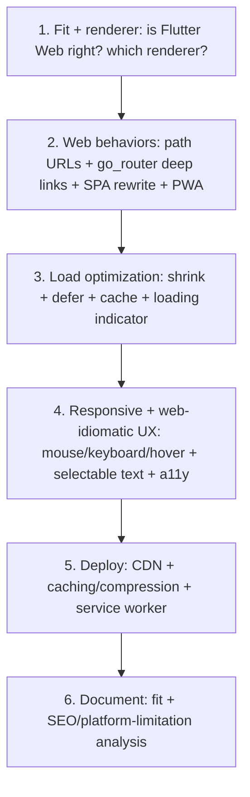

# Flutter Web Integration (Capstone: A Production Web App)

> Assemble a production-quality Flutter Web app: pick the **right use case + renderer** (app-like → CanvasKit/skwasm or HTML by goal), wire **web behaviors** (path URLs + `go_router` deep links + server SPA rewrite, PWA), **optimize the initial load** (shrink + defer + cache + loading indicator), deliver **responsive, web-idiomatic UX** (mouse/keyboard/hover, selectable text, accessibility), and **deploy** to a CDN with caching/compression — plus a documented **fit + SEO/platform-limitation analysis**. This turns "our Flutter app also builds for web" into a real, fast, web-native-feeling deployment — applied where Flutter Web genuinely fits.

## Introduction

This module capstone composes fundamentals/renderers, web-specific concerns, performance/loading, and responsive/web UX into one coherent production web app + a deployment/fit analysis. It's the "put it all together for the web" deliverable.

## Why this concept exists

The web pieces only yield a good product when **assembled coherently**: renderer + web behaviors + load optimization + web UX + deployment, with a clear-eyed **fit decision**. This capstone provides that integrated exemplar and cements when/how Flutter Web works well.

## Real-world analogy

It's **opening a proper storefront on a busy web street** (not just unlocking a back door): the right **premises for your business** (fit + renderer), a **real address + working doors** (URLs/deep links/back button), **fast-loading, cached shelves** (load optimization + CDN), a **layout + controls suited to walk-in desktop customers** (responsive + mouse/keyboard + accessibility), and an **honest sign about what you don't offer** (SEO limits). Assembled, it's a legitimate web presence; half-done, it's a phone app awkwardly wedged into a browser.

## Internal Working



- **1. Fit + renderer** ([01_web_fundamentals_and_renderers.md](01_web_fundamentals_and_renderers.md)): confirm Flutter Web **fits the use case** (logged-in/app-like → yes; SEO/content site → use web-native). Choose the **renderer** (HTML for size/text; CanvasKit/skwasm for fidelity/consistency) per your SDK.
- **2. Web behaviors** ([02_web_specific_concerns.md](02_web_specific_concerns.md)): **path URL strategy** + **`go_router`** (route↔URL sync → deep links/bookmarking/back-forward) + **server SPA rewrite**; **PWA** (customized manifest + service worker: installable + offline shell); **browser APIs via JS interop**; guard **platform differences** (`kIsWeb`, no `dart:io`); handle **refresh/tab lifecycle** (persist state).
- **3. Load optimization** ([03_web_performance_and_loading.md](03_web_performance_and_loading.md)): **shrink** (`--release` tree-shake + `--tree-shake-icons`, compressed/right-sized assets + subset fonts + CDN images), **defer** heavy features (deferred imports → lazy chunks), **cache** (service worker + CDN + gzip/brotli + immutable hashed assets), and a **loading indicator in `index.html`** to mask boot; **measure + budget** first load.
- **4. Responsive + web UX** ([04_responsive_and_web_ux.md](04_responsive_and_web_ux.md)): **responsive layout** (breakpoints + max content width + desktop patterns), **mouse** (hover/cursor/right-click/scrollbars) + **keyboard** (focus/shortcuts), **selectable text** (`SelectionArea`), **zoom-safe** sizing, and **accessibility** (semantics + keyboard nav).
- **5. Deploy**: serve `build/web` static assets from a **CDN** with **caching + compression + immutable hashing** + the **service worker**; configure the **SPA route rewrite**; set **meta/OpenGraph/favicon** in `index.html`.
- **6. Document fit + limitations**: a short analysis — **why Flutter Web fits here**, the **SEO stance** (accept/mitigate), **platform limits** (canvas a11y/text handled, no platform channels), and the **trade-offs accepted** (download size vs reuse/consistency).
- **The payoff**: a fast-loading, deep-linkable, installable, responsive, accessible, web-idiomatic app from your shared Flutter codebase — genuinely production-quality **where Flutter Web fits**.
- **Right-sizing**: an internal tool needs fit+renderer+URLs+basic UX; a public-facing PWA adds full load optimization, PWA polish, accessibility, and (if any SEO need) a marketing shell. Scale effort to the product.

## Memory Representation

Not app state — a **web deployment**: build artifact (engine + app + assets + deferred chunks), `index.html` (meta/manifest/loading), router config (path URLs), service worker + CDN cache, plus a fit/SEO/limitation doc. Browser holds URL/history + storage.

## Compiler Behavior

`--release` (dart2js/dart2wasm) tree-shakes/minifies per renderer; deferred imports → lazy chunks; hashed assets enable immutable caching; conditional imports/`kIsWeb` gate `dart:io`.

## Runtime Behavior

First visit: download+boot (masked by loading UI) → interactive; deep links load via SPA rewrite + `go_router`; repeat visits hit cache; PWA installs/offline-shells; UX adapts to mouse/keyboard; refresh reloads (state persisted).

## Flutter Engine Behavior

The web engine (CanvasKit/skwasm/HTML) renders; the **semantics layer** provides accessibility; pointer/keyboard events drive web UX.

## Dart VM Behavior

No VM (JS/WASM, AOT-like); deferred imports lazy-load code; isolates→limited web workers; storage via browser APIs.

## Examples

```dart
// Bootstrap: clean URLs + router + loading-UI handoff
void main() {
  usePathUrlStrategy();                                  // clean URLs (server SPA rewrite needed)
  runApp(MaterialApp.router(routerConfig: appRouter));   // go_router: deep links + back/forward
}

// Deferred heavy feature (keep initial download small)
import 'package:app/features/analytics/analytics.dart' deferred as analytics;
Future<void> openAnalytics(BuildContext c) async {
  await analytics.loadLibrary();
  if (c.mounted) c.push('/analytics');
}

// Responsive + web-idiomatic shell (desktop rail + max width + selectable + hover)
Widget shell(Widget content) => LayoutBuilder(builder: (ctx, cns) {
  final wide = cns.maxWidth >= 900;
  return Scaffold(body: Row(children: [
    if (wide) const NavigationRail(/* ... */),
    Expanded(child: Center(child: ConstrainedBox(
      constraints: const BoxConstraints(maxWidth: 1100),
      child: SelectionArea(child: content),              // selectable text
    ))),
  ]));
});
```

```text
Deploy checklist:
  build --release (renderer per goal) + deferred chunks + optimized assets
  serve build/web via CDN: gzip/brotli + immutable hashed assets + long TTL + service worker
  server SPA rewrite (all routes -> index.html) for path URLs/deep links
  index.html: meta/OpenGraph/favicon + loading indicator + manifest link (PWA)
  measure first-load (Lighthouse/--analyze-size) vs a web-load budget (CI)

Fit/limitation doc:
  WHY Flutter Web fits (app-like/logged-in/reuse) | SEO stance (accept/mitigate) |
  platform limits handled (a11y/text/JS interop, no platform channels) | trade-offs accepted (download size)
```

## Diagrams

```mermaid
flowchart LR
    Fit2[fit + renderer] --> Behaviors[web behaviors (URLs/deep links/PWA)]
    Behaviors --> Load2[load optimization + CDN caching]
    Load2 --> UX2[responsive + web UX + a11y]
    UX2 --> Prod[production web app]
    Prod --> Doc[fit + SEO/limitation analysis]
```

## Common Mistakes

| Mistake | Why | Fix |
|---------|-----|-----|
| Shipping a mobile build to web unchanged | Bloated, un-web, broken UX | Do fit/renderer/URLs/load/UX work |
| Wrong use case (SEO/content) | Flutter Web can't compete | Use web-native for SEO/content |
| Hash URLs / broken back button | Un-web-like | Path strategy + `go_router` + SPA rewrite |
| Ignoring initial-load size | Slow first paint | Shrink + defer + cache + loading UI |
| Phone-only UX on web | Feels wrong | Responsive + mouse/keyboard + selectable + a11y |
| No CDN caching/compression | Slow loads | CDN + gzip/brotli + immutable hashing + SW |
| Skipping accessibility | Unusable for AT | Semantics + keyboard nav (canvas → deliberate) |
| No fit/limitation analysis | Wrong-tool surprises | Document fit + SEO + trade-offs |

## Best Practices

- **Confirm fit + choose the renderer** first; then wire **web behaviors** (path URLs + `go_router` deep links + SPA rewrite + PWA + JS interop + platform guards).
- **Optimize the initial load** (shrink + defer + cache + loading indicator; measure + budget) and deliver **responsive, web-idiomatic UX** (mouse/keyboard/hover, selectable text, zoom, accessibility).
- **Deploy** to a CDN with caching/compression/immutable hashing + service worker + SPA rewrite + proper `index.html` meta.
- **Document the fit + SEO/platform-limitation analysis + accepted trade-offs**; **right-size** effort to the product (internal tool vs public PWA).

## Performance

The integrated app is fast because load is optimized (shrink/defer/cache/loading-UI) + CDN-served, and runtime uses standard Flutter perf (scoped rebuilds/virtualization) with the chosen renderer. First-paint budget + measurement keep it fast as it grows ([03_web_performance_and_loading.md](03_web_performance_and_loading.md)/[Module 21](../21%20Performance/README.md)).

## Advantages / Disadvantages

- **+** Production-quality web from a shared codebase: fast, deep-linkable, installable, responsive, accessible, web-idiomatic — where Flutter Web fits; high reuse + pixel consistency.
- **−** Real effort across all dimensions (renderer/URLs/load/UX/a11y/deploy), inherent download size + SEO limits, wrong for content sites; must right-size + document trade-offs.

## Interview Questions

1. **🟢 What are the steps to a production Flutter Web app?** — Confirm fit + choose renderer → wire web behaviors (URLs/deep links/PWA) → optimize load (shrink/defer/cache/loading UI) → responsive + web-idiomatic UX + a11y → deploy (CDN/caching/SPA rewrite) → document fit/SEO/limitations.
2. **🟢 How do you make URLs + back button work with fast deep links?** — Path URL strategy + `go_router` (route↔URL) + a server SPA rewrite of all routes to `index.html`.
3. **🟡 How do you tame the initial load?** — Shrink (renderer/`--release`/assets/fonts), defer heavy features (deferred imports), cache (service worker + CDN + compression + immutable hashing), and mask boot with a loading indicator — measured against a budget.
4. **🟡 What makes the UX web-idiomatic?** — Responsive layout (breakpoints + max width + desktop patterns), mouse (hover/cursor/right-click/scrollbars) + keyboard (focus/shortcuts), selectable text (`SelectionArea`), zoom-safe sizing, and accessibility (semantics + keyboard nav).
5. **🟡 How do you deploy Flutter Web?** — Serve `build/web` from a CDN with caching/compression/immutable hashing + the service worker, configure the SPA route rewrite, and set `index.html` meta/manifest/loading.
6. **🔴 What must the fit/limitation analysis cover?** — Why Flutter Web fits (app-like/reuse), the SEO stance (accept/mitigate), platform limits handled (a11y/text/JS interop, no platform channels), and accepted trade-offs (download size).
7. **🔴 How do you right-size the effort?** — Internal tool: fit+renderer+URLs+basic UX; public PWA: full load optimization + PWA polish + accessibility + (if needed) an SEO marketing shell.

## Senior Engineer Tips

- Do the fit decision honestly first; the biggest Flutter Web failures are shipping it for an SEO/content site or dumping an unmodified mobile build into a browser.
- Front-load URLs/deep-links/back-button + initial-load optimization + a loading indicator; those three are what users judge in the first five seconds, and they're what "just builds for web" always misses.
- Treat responsive layout + mouse/keyboard + selectable text + accessibility as required for a real web app, and document the SEO/trade-off analysis so stakeholders aren't surprised later.

## Architect Perspective

Flutter Web integration is the synthesis that turns cross-platform reuse into a genuine web product: the right fit + renderer, proper web behaviors, an optimized cached load, web-idiomatic responsive+accessible UX, and a CDN deployment — with an honest limitation analysis. Done fully and where it fits, Flutter Web delivers a fast, installable, deep-linkable, consistent app from one codebase; done partially or for the wrong use case, it disappoints. The architect's contribution is the fit decision + coherent assembly + documented trade-offs ([01_web_fundamentals_and_renderers.md](01_web_fundamentals_and_renderers.md), [03_web_performance_and_loading.md](03_web_performance_and_loading.md), [Module 54](../54%20Flutter%20Desktop/README.md)).

## Summary

- Production Flutter Web = fit + renderer → web behaviors (path URLs + `go_router` deep links + SPA rewrite + PWA + JS interop) → optimized load (shrink/defer/cache/loading UI) → responsive + web-idiomatic UX + a11y → CDN deploy → documented fit/SEO/limitation analysis.
- Delivers a fast, deep-linkable, installable, responsive, accessible app from a shared codebase — where Flutter Web fits (app-like, not SEO/content).
- Right-size effort to the product and document the accepted trade-offs (download size vs reuse/consistency).

## Revision Notes

- Steps: (1) fit + renderer (app-like → yes; HTML vs CanvasKit/skwasm by goal) (2) web behaviors: path URL strategy + `go_router` deep links + server SPA rewrite + PWA (manifest/SW) + JS interop + `kIsWeb` guards + refresh/state (3) load: `--release` shrink + `--tree-shake-icons` + assets/fonts/CDN images + deferred imports + service worker/CDN/gzip-brotli/immutable hashing + loading indicator + budget (4) UX: responsive (breakpoints + max width + desktop patterns) + mouse/keyboard + `SelectionArea` + zoom + a11y (semantics) (5) deploy CDN + SPA rewrite + index.html meta (6) document fit/SEO/limitation/trade-offs.
- Payoff: fast/deep-linkable/installable/responsive/accessible web app from shared codebase where it fits; right-size; not for SEO/content sites.

## Practice Questions

1. Walk the steps from fit decision to deployed production web app.
2. How do you make URLs/deep links/back button + fast initial load work together?
3. What does the fit/limitation analysis need to state?

## Coding Questions

1. Bootstrap path URLs + `go_router` + a loading indicator + a deferred feature.
2. Build a responsive web-idiomatic shell (desktop rail + max width + selectable text + a11y).
3. Write the deploy + `index.html` config (CDN caching/compression/SPA rewrite/meta/manifest).

## Mini Project

**Production Flutter Web app (capstone — Flutter Web):** Ship a responsive dashboard-style web app: confirm fit + choose a renderer; wire path URLs + `go_router` deep links + server SPA rewrite + a customized PWA; optimize the initial load (shrink + a deferred heavy feature + service-worker/CDN caching/compression + loading indicator, measured vs a budget); deliver web-idiomatic UX (responsive layout + mouse/keyboard/hover + selectable text + zoom + accessibility); deploy to a CDN; and write a fit + SEO/platform-limitation + trade-off analysis. Acceptance: justified fit + renderer; clean deep-linkable URLs + back/forward + PWA; optimized measured initial load (shrink/defer/cache/loading UI); responsive + mouse/keyboard + selectable + accessible UX; CDN deploy + SPA rewrite + meta; documented fit/SEO/limitation/trade-offs; right-sized.
