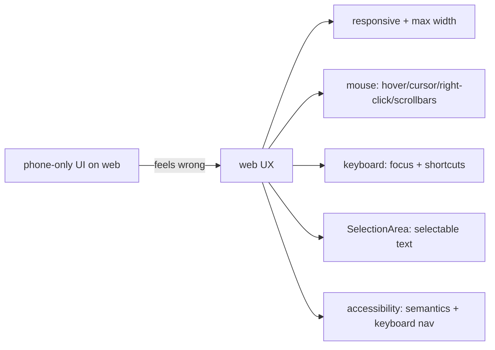

# Responsive & Web UX

> Web users bring desktop expectations mobile doesn't: **large/resizable windows** (responsive layouts + a max content width, not a stretched phone UI), **mouse + keyboard** (hover states, cursors, focus traversal, keyboard shortcuts, right-click/context menus), **text selection + copy** (`SelectionArea`), **browser scrolling/zoom**, and **accessibility** (Flutter's semantics → screen readers, keyboard-navigable). Building a mobile-only UI on the web feels wrong — a phone screen centered in a huge browser window, no hover, unselectable text, mouse-only. Web UX means **responsive layout + pointer/keyboard affordances + selectable text + a11y**, following web conventions.

## Introduction

This file covers making a Flutter Web app feel like a web app: responsive layout for large/resizable windows, mouse+keyboard interactions (hover/cursor/focus/shortcuts/right-click), text selection, scrolling/zoom, and accessibility. It applies responsive/adaptive UI ([Module 24](../24%20Responsive%20UI/README.md)/[Module 25](../25%20Adaptive%20UI/README.md)) to the web's desktop context.

## Why this concept exists

A UI designed only for a fixed narrow phone screen looks broken on a wide desktop browser (stretched or lost in whitespace), and web users expect **hover feedback, keyboard use, selectable text, right-click, and accessibility** — none of which a mobile-only build provides. Web UX bridges the app to desktop-browser norms so it feels native to the platform, not a phone app in a window.

## Real-world analogy

It's like **adapting a phone-booth kiosk for a full desktop workstation**: you can't just enlarge the phone screen — you **reflow content for the wide desk** (responsive + max width), add a **mouse + keyboard** (hover highlights, cursors, tab order, shortcuts, right-click menu), let users **highlight and copy text** (selection), and make it **usable by assistive tech** (accessibility). A kiosk UI plopped on a workstation feels obviously wrong.

## Internal Working

```mermaid
flowchart TD
    Window[large/resizable browser window] --> Responsive[responsive layout + max content width + breakpoints]
    Pointer[mouse] --> Hover[hover states + cursors + right-click/context menus]
    Keyboard[keyboard] --> Focus[focus traversal + shortcuts + Shortcuts/Actions]
    Text[text] --> Select[SelectionArea (select + copy)]
    A11y[accessibility] --> Semantics[Flutter semantics -> screen readers + keyboard nav]
    Scroll[browser scroll/zoom] --> Scrollbars[visible scrollbars + zoom-friendly layout]
```

- **Responsive layout for desktop windows** ([Module 24](../24%20Responsive%20UI/README.md)):
  - Use **`LayoutBuilder`/`MediaQuery`/breakpoints** to adapt phone→tablet→desktop layouts (e.g., a bottom nav on mobile → a **side rail/drawer** + multi-pane on desktop).
  - Cap content with a **max width** (`ConstrainedBox`/centered container) so text/forms don't stretch absurdly across a wide monitor; handle **window resize** live (layouts rebuild on size change).
  - **Adapt, don't just scale** — desktop patterns (master-detail, denser layouts) differ from a phone ([Module 25](../25%20Adaptive%20UI/README.md)).
- **Mouse (pointer) affordances**:
  - **Hover states** via `MouseRegion`/`InkWell` hover / widgets that respond to `onHover` — desktop users expect hover feedback.
  - **Cursors** (`MouseRegion(cursor: SystemMouseCursors.click)`) — pointer over clickables, text cursor over text.
  - **Right-click / context menus** (`GestureDetector.onSecondaryTap` / context-menu builders) where appropriate; browser's default context menu vs custom.
  - Handle **scroll wheel** + trackpad; show **scrollbars** (`Scrollbar`) — desktop expects visible scrollbars, unlike mobile.
- **Keyboard support**:
  - **Focus traversal** (Tab/Shift+Tab) through interactive widgets (`FocusTraversalGroup`, proper focus order) — essential for forms + accessibility.
  - **Keyboard shortcuts** via **`Shortcuts` + `Actions`** (or `CallbackShortcuts`) — Ctrl/Cmd+S, Esc, arrows, etc. — desktop/web users expect them.
  - Ensure buttons/fields are **keyboard-activatable** (Enter/Space).
- **Text selection + copy**: wrap content in **`SelectionArea`** so users can **select + copy text** (a basic web expectation Flutter doesn't give by default on canvas); use `SelectableText` for individual fields. Without it, text feels "dead."
- **Scrolling/zoom**: support **browser zoom** (relative sizing, no fixed pixel assumptions that break on zoom), smooth wheel scrolling, and visible scrollbars; avoid hijacking native scroll.
- **Accessibility (a11y)** ([Module 24](../24%20Responsive%20UI/README.md)): Flutter's **semantics layer** exposes an accessibility tree to the browser → screen readers + keyboard nav. Add **`Semantics`**/labels for icons/images/custom widgets, ensure sufficient **contrast + text scaling**, and **keyboard operability**. Because Flutter paints a canvas, a11y needs deliberate attention (it's not free from the DOM).
- **Web conventions**: respect browser back/forward + URLs ([web_specific_concerns.md](web_specific_concerns.md)), tooltips on hover, standard cursors, selectable text, and don't reinvent native controls users expect.
- **Adaptive input, one codebase**: the same app should feel right on mobile (touch) and web/desktop (mouse+keyboard) — detect/adapt affordances rather than shipping a touch-only UI to the web.

## Memory Representation

Not app state — **UI affordances + layout config**: breakpoints/max-width constraints, hover/focus state, shortcut mappings, selection regions, and the semantics tree. The framework maintains focus + hover + selection state; semantics feed the browser a11y tree.

## Compiler Behavior

Not applicable (normal widgets). `Shortcuts`/`Actions`/`Semantics`/`SelectionArea`/`MouseRegion` are standard widgets that work across platforms; behavior differs by input available.

## Runtime Behavior

Layouts rebuild on window resize; hover/cursor/focus respond to mouse/keyboard; `SelectionArea` enables text selection; shortcuts fire on key events; semantics expose an a11y tree the screen reader reads. Browser zoom/scroll interact with the layout.

## Flutter Engine Behavior

The web engine reports pointer (mouse/hover/wheel/right-click) + keyboard events; the **semantics layer** produces an accessibility tree for the browser (screen readers) — critical since the canvas has no inherent DOM semantics ([web_fundamentals_and_renderers.md](web_fundamentals_and_renderers.md)).

## Dart VM Behavior

Not applicable (JS/WASM); input/focus/semantics handled by the framework/engine.

## Examples

```dart
// Responsive: max content width + breakpoint (side rail on desktop, bottom nav on mobile)
LayoutBuilder(builder: (context, c) {
  final wide = c.maxWidth >= 900;
  return Row(children: [
    if (wide) const NavigationRail(/* ... */),                 // desktop pattern
    Expanded(child: Center(child: ConstrainedBox(
      constraints: const BoxConstraints(maxWidth: 1100),        // cap width on big screens
      child: content,
    ))),
  ]);
  // (bottomNavigationBar when !wide)
});

// Mouse + text + keyboard affordances
MouseRegion(
  cursor: SystemMouseCursors.click,                            // pointer cursor
  child: InkWell(onTap: open, onHover: (h) {/* hover feedback */}, child: card),
);
SelectionArea(child: articleBody);                             // selectable + copyable text
Shortcuts(shortcuts: {
  const SingleActivator(LogicalKeyboardKey.keyS, control: true): const SaveIntent(),  // Ctrl+S
}, child: Actions(actions: {SaveIntent: CallbackAction(onInvoke: (_) => save())}, child: form));

// Accessibility: label a non-text control
Semantics(label: 'Delete item', button: true, child: IconButton(icon: const Icon(Icons.delete), onPressed: del));
```

## Diagrams



## Common Mistakes

| Mistake | Why it's wrong | Fix |
|---------|---------------|-----|
| Phone UI stretched across desktop | Looks broken/awkward | Responsive layout + max content width + desktop patterns |
| No hover states/cursors | Feels un-web/dead | `MouseRegion`/hover + proper cursors |
| Unselectable text | Basic web expectation broken | `SelectionArea`/`SelectableText` |
| No keyboard support | Inaccessible, un-desktop | Focus traversal + `Shortcuts`/`Actions` |
| No visible scrollbars | Desktop expects them | `Scrollbar` |
| Ignoring accessibility (canvas) | Screen readers see nothing | `Semantics` labels + keyboard nav + contrast |
| Fixed pixel sizes breaking on zoom | Layout breaks | Relative sizing, zoom-friendly |
| Touch-only affordances on web | Wrong input model | Adapt for mouse + keyboard |

## Best Practices

- Build **responsive layouts** (breakpoints, **max content width**, desktop patterns like side rail/master-detail) that **adapt** to large/resizable windows — not a stretched phone UI ([Module 24](../24%20Responsive%20UI/README.md)/[Module 25](../25%20Adaptive%20UI/README.md)).
- Add **mouse affordances** (hover states, cursors, right-click/context menus, visible **scrollbars**) and **keyboard support** (focus traversal + `Shortcuts`/`Actions`, Enter/Space activation).
- Make **text selectable** (`SelectionArea`/`SelectableText`), support **browser zoom** (relative sizing), and provide **accessibility** (semantics labels, keyboard nav, contrast) — deliberately, since the canvas gives none for free.
- Follow **web conventions** (URLs/back button, tooltips, standard controls) and **adapt input** so one codebase feels right on touch (mobile) and mouse+keyboard (web/desktop).

## Performance

Not primarily a perf topic; responsive rebuilds on resize should be efficient (scoped) and lists virtualized ([web_performance_and_loading.md](web_performance_and_loading.md)/[Module 21](../21%20Performance/README.md)). The concern is **UX quality + accessibility**, not speed. Semantics add negligible cost.

## Advantages / Disadvantages

- **+** Web-native feel (responsive, hover/keyboard, selectable text, a11y), one codebase adapting to input/screen, accessible + conventional.
- **−** Extra work vs mobile-only (hover/cursor/focus/shortcuts/selection/semantics), a11y needs deliberate effort (canvas), testing across input modes + zoom.

## Interview Questions

1. **🟢 Why doesn't a mobile-only UI work on the web?** — Desktop browsers are large/resizable with mouse+keyboard; a phone UI stretches/looks broken and lacks hover, keyboard, selectable text, and scrollbars users expect.
2. **🟢 How do you make text selectable in Flutter Web?** — Wrap content in `SelectionArea` (or use `SelectableText`) — the canvas doesn't provide selection by default.
3. **🟡 What mouse/keyboard affordances do web users expect?** — Hover states + proper cursors + right-click/context menus + visible scrollbars (mouse); focus traversal + keyboard shortcuts (`Shortcuts`/`Actions`) + Enter/Space activation (keyboard).
4. **🟡 How do you handle large/resizable windows?** — Responsive breakpoints (`LayoutBuilder`/`MediaQuery`), a max content width, and desktop patterns (side rail/master-detail) that rebuild on resize.
5. **🟡 Why does accessibility need deliberate work on Flutter Web?** — Flutter paints a canvas (no inherent DOM semantics), so you must add `Semantics` labels + ensure keyboard nav/contrast for the semantics layer to expose an a11y tree to screen readers.
6. **🔴 How do you support browser zoom?** — Use relative sizing (no fixed-pixel assumptions that break on zoom), test at various zoom levels, and don't hijack native scroll.
7. **🔴 How do you keep one codebase feeling right on touch and mouse+keyboard?** — Adapt affordances (hover/cursor/keyboard on web; touch on mobile) via responsive/adaptive UI rather than shipping a single touch-only design.

## Senior Engineer Tips

- Design for a resizable desktop window from the start (breakpoints + max content width + desktop patterns); a centered phone UI in a huge window is the instant "this is just a mobile app" tell.
- Add hover/cursor/keyboard/selectable-text/scrollbars as first-class — web users notice their absence immediately, and they're cheap to add with `MouseRegion`/`Shortcuts`/`SelectionArea`/`Scrollbar`.
- Treat accessibility as required, not optional: add semantics labels + keyboard navigation, because the canvas model gives you nothing for free and it's painful to retrofit.

## Architect Perspective

Responsive + web UX is what makes a Flutter Web app *belong* on the web: adaptive layouts for desktop windows, mouse+keyboard affordances, selectable text, and deliberate accessibility — bridging Flutter's canvas app to desktop-browser conventions. It's the responsive/adaptive discipline extended to a new input+screen context, and combined with the fit/renderer/perf/web-concern decisions it completes a production-quality web experience rather than a phone app trapped in a browser ([Module 24](../24%20Responsive%20UI/README.md), [Module 25](../25%20Adaptive%20UI/README.md), [web_integration.md](web_integration.md)).

## Summary

- Web UX = responsive layouts for large/resizable windows (breakpoints + max width + desktop patterns), not a stretched phone UI.
- Add mouse affordances (hover/cursor/right-click/scrollbars) + keyboard support (focus + `Shortcuts`/`Actions`), make text selectable (`SelectionArea`), support zoom, and provide accessibility (semantics + keyboard nav) deliberately.
- Follow web conventions and adapt input so one codebase feels right on touch and mouse+keyboard.

## Revision Notes

- Responsive: `LayoutBuilder`/`MediaQuery` breakpoints + max content width + desktop patterns (side rail/master-detail); adapt (not stretch); rebuild on resize (Module 24/25).
- Mouse: hover (`MouseRegion`/`onHover`) + cursors + right-click/context menus + visible `Scrollbar` + wheel. Keyboard: focus traversal (`FocusTraversalGroup`) + `Shortcuts`/`Actions` shortcuts + Enter/Space activation.
- Text: `SelectionArea`/`SelectableText` (canvas has none by default). Zoom: relative sizing (no fixed px). A11y: `Semantics` labels + keyboard nav + contrast (canvas → deliberate). Web conventions (URLs/back/tooltips); adapt input for one codebase (touch + mouse/keyboard).

## Practice Questions

1. Why does a phone-only UI feel wrong on the web, and how do you fix it?
2. What mouse + keyboard affordances must you add for web?
3. Why does Flutter Web accessibility require deliberate effort?

## Coding Questions

1. Build a responsive layout with a desktop side rail + max content width.
2. Add hover/cursor, a keyboard shortcut, and selectable text.
3. Add semantics labels + keyboard traversal for accessibility.

## Mini Project

**Web-idiomatic UX (Flutter Web):** Take a mobile screen and make it web-idiomatic: responsive layout (breakpoints + max content width + a desktop side-rail/master-detail pattern), mouse affordances (hover states + cursors + a right-click menu + visible scrollbars), keyboard support (focus traversal + a shortcut via `Shortcuts`/`Actions`), selectable text (`SelectionArea`), zoom-friendly sizing, and accessibility (semantics labels + keyboard nav). Acceptance: adapts to large/resizable windows (not stretched); hover/cursor/right-click/scrollbars; keyboard focus + shortcut + activation; selectable text; zoom-safe; accessible (semantics + keyboard nav); one codebase adapting touch↔mouse/keyboard.
