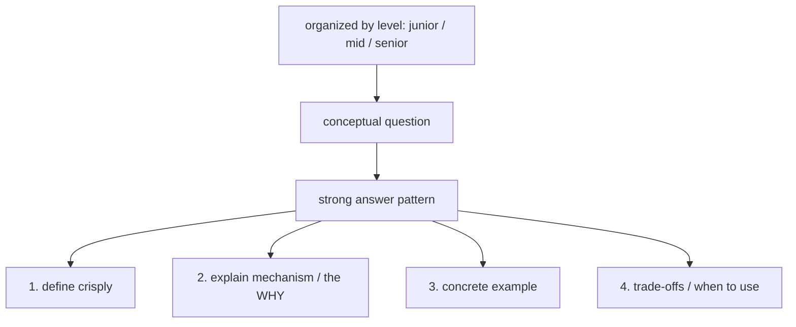
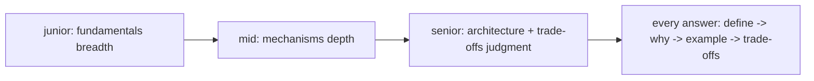

# Flutter/Dart Conceptual Question Bank

> The conceptual round tests **depth, not definitions** — can you explain *how* Flutter/Dart work (the three trees, rebuilds, `const`/keys, async/isolates, state management, architecture, performance) and *why*, with examples and trade-offs? This file is a **level-organized question bank** drawn from across the handbook, with the **key points to hit** for each — so you can rehearse answers that demonstrate understanding rather than recitation. The winning pattern for any conceptual answer: **define → explain the mechanism/why → give an example → note trade-offs/when-to-use**.

## Introduction

This file is a curated conceptual Q&A bank (junior → mid → senior) spanning Dart, widgets/rendering, state, async, architecture, testing, and performance, each with answer bullets — the study/rehearsal resource for the conceptual round. It indexes the depth built throughout the handbook.

## Why this concept exists

Conceptual rounds separate people who *use* Flutter from those who *understand* it. Interviewers probe mechanisms (why does `const` matter? what's an Element? when do isolates help?). A leveled bank with answer keys lets you rehearse **depth + structure + examples**, so you sound like someone who knows the internals, not someone reciting docs.

## Real-world analogy

It's the **oral exam** of the interview: the examiner asks "explain how the engine works," and a strong answer walks the **mechanism + why + a worked example + trade-offs** — like a mechanic who can explain combustion, not just name parts. This bank is your **exam-prep flashcards with model answers**, leveled by seniority.

## Internal Working



- **Answer pattern (use for every conceptual Q)**: **define → explain mechanism/why → example → trade-offs/when**. Depth + structure + a concrete example is what scores.
- **Junior (fundamentals — breadth)**:
  - *Stateless vs Stateful widget?* — Stateless: immutable, rebuilt from inputs; Stateful: holds mutable `State` across rebuilds; use Stateful only when you need local mutable state. ([Module 06](../06%20Flutter%20Fundamentals/README.md))
  - *What does `setState` do?* — Marks the `State` dirty → schedules a rebuild of that subtree; only for local state, keep work minimal. ([Module 11](../11%20State%20Management/README.md))
  - *`final` vs `const`?* — `final`: set once at runtime; `const`: compile-time constant (canonicalized) — `const` widgets skip rebuilds. ([Module 01](../01%20Dart%20Fundamentals/README.md))
  - *`Column`/`Row`/`Expanded`/`Flexible`?* — Layout along an axis; `Expanded`/`Flexible` distribute free space. ([Module 07](../07%20Widgets/README.md))
  - *What is `BuildContext`?* — A handle to the widget's location in the tree; used to look up inherited widgets/`Theme`/`MediaQuery`. ([Module 06](../06%20Flutter%20Fundamentals/README.md))
  - *Null safety?* — Types are non-nullable by default; `?`/`!`/`??`/`late` manage nullability → fewer null errors. ([Module 01](../01%20Dart%20Fundamentals/README.md))
- **Mid (mechanisms + practice — depth)**:
  - *Widget vs Element vs RenderObject (the three trees)?* — Widget = immutable config; Element = mutable instance linking widget↔render object (holds state/lifecycle); RenderObject = layout/paint. Rebuilds diff widgets; Elements are reused → efficiency. ([Module 09](../09%20Rendering%20Pipeline/README.md))
  - *Why `const` constructors + `Keys`?* — `const` enables widget reuse (skip rebuild/canonicalize); `Key`s preserve element/state identity across reorders/list changes. ([Module 07](../07%20Widgets/README.md)/[Module 21](../21%20Performance/README.md))
  - *`Future` vs `Stream`; how does async work?* — `Future` = one async value; `Stream` = many; the **event loop** processes microtasks then events; `async/await` schedules continuations. ([Module 02](../02%20Advanced%20Dart/README.md))
  - *When do you need an isolate?* — For CPU-heavy work (parsing/compute) to avoid jank — isolates have separate memory, communicate via messages (`compute`/`Isolate.run`). ([Module 02](../02%20Advanced%20Dart/README.md))
  - *Compare state management (setState/Provider/Riverpod/Bloc)?* — All expose observable state a view binds to (MVVM); differ in ergonomics/boilerplate/compile-safety — choose by team/needs; scope rebuilds. ([Module 11](../11%20State%20Management/README.md)/[Module 43](../43%20MVVM/README.md))
  - *How do you optimize rebuild performance?* — `const`, scoped listeners/selectors, `RepaintBoundary`, list virtualization, avoid heavy `build`. ([Module 21](../21%20Performance/README.md))
  - *`InheritedWidget`?* — Efficient down-tree propagation with O(1) dependent lookup + rebuild-on-change; basis of Provider/Theme. ([Module 11](../11%20State%20Management/README.md))
- **Senior (architecture + trade-offs — judgment)**:
  - *Clean Architecture + the dependency rule?* — Layered (domain/data/presentation) with dependencies pointing inward; domain pure/independent (DIP); enables testability + swappable details. ([Module 40](../40%20Clean%20Architecture/README.md))
  - *MVC vs MVP vs MVVM in Flutter?* — MVVM fits (view binds to observable state); MVP's imperative flow strains; MVC ambiguous — MVVM + Clean is the Flutter norm. ([Module 41](../41%20MVC/README.md)–[Module 43](../43%20MVVM/README.md))
  - *Feature-first vs layer-first; when modularize?* — Group by feature (cohesion); modularize into packages when build/team/reuse pressure justifies (compiler-enforced boundaries). ([Module 44](../44%20Feature%20First%20Architecture/README.md)/[Module 45](../45%20Modular%20Architecture/README.md))
  - *How do you handle errors + Result vs exceptions?* — Errors (bugs) vs exceptions (conditions); model expected failures as `Result`/typed failures; global handlers catch uncaught; recover/degrade with UX. ([Module 38](../38%20Error%20Handling/README.md))
  - *Testing strategy (the pyramid)?* — Many unit (each layer, fakes), some widget/golden, few E2E; test behavior not implementation; CI-gated. ([Module 49](../49%20Testing/README.md))
  - *Offline-first + caching trade-offs?* — Cache-first/SWR, outbox + sync + conflict resolution, eventual consistency — consistency vs availability vs cost per data type. ([Module 19](../19%20Offline%20First/README.md)/[Module 48](../48%20System%20Design/README.md))
  - *Performance at scale / app size?* — Budgets (startup/frame/size), deferred loading, App Bundle/thinning, obfuscation, profiling/monitoring. ([Module 21](../21%20Performance/README.md)/[Module 47](../47%20Scalable%20Applications/README.md)/[Module 51](../51%20Deployment/README.md))
- **How to use the bank**: for each Q, **rehearse the answer pattern out loud** (define→why→example→trade-offs), study the linked module for depth, and be ready for **follow-ups** ("why?", "trade-off?", "how would you test/scale it?"). Depth compounds — many questions connect (rebuilds → keys → performance → architecture).
- **Meta-answers interviewers love**: acknowledging **trade-offs**, saying **"it depends" with the deciding factors**, giving **concrete examples**, and admitting **limits/unknowns** honestly.

## Memory Representation

Not code — a **leveled Q&A bank** (junior/mid/senior) with answer bullets + module links. Study artifact: flashcard-style, rehearsed out loud, cross-referenced to handbook depth.

## Compiler / Runtime / Engine / VM Behavior

Not applicable — this is a study resource. The *answers* cover compiler/runtime/engine/VM behavior (e.g., `const` canonicalization, event loop, three trees, AOT/isolates), pointing to the modules that detail them.

## Examples

```text
Answer pattern (worked): "Why do const widgets improve performance?"
  DEFINE:  const constructs a compile-time-canonicalized widget instance.
  WHY:     identical const widgets are the SAME object -> the framework can skip rebuilding
           that subtree (element reuse) since the config didn't change.
  EXAMPLE: const Text('Title') in a rebuilding parent isn't rebuilt each time.
  TRADE:   requires all inputs const; use where subtrees are static. (Module 07/21)

Follow-up drill (expect these):
  "Why?" / "What's the trade-off?" / "How would you measure it?" / "How does this scale?"
```

```text
Bank organization:
  JUNIOR : stateless/stateful, setState, final/const, layout widgets, BuildContext, null safety
  MID    : three trees, const+keys, Future/Stream + event loop, isolates, state mgmt compare, rebuild perf, InheritedWidget
  SENIOR : Clean Arch + dependency rule, MVC/MVP/MVVM, feature-first/modular, errors+Result, testing pyramid, offline-first, perf at scale
  -> rehearse each with define->why->example->trade-offs; study the linked module for depth
```

## Diagrams



## Common Mistakes

| Mistake | Why it's weak | Fix |
|---------|--------------|-----|
| Reciting definitions | Shows memorization, not understanding | Explain mechanism + why + example |
| No trade-offs / "it depends" without factors | Misses senior signal | State trade-offs + the deciding factors |
| No concrete examples | Abstract/unconvincing | Ground each answer in an example |
| Answering above/below your level | Miscalibrated | Match depth to target level |
| Ignoring follow-ups ("why?") | Depth not demonstrated | Anticipate + prepare follow-ups |
| Faking knowledge | Backfires under probing | Admit limits gracefully; reason from fundamentals |
| Studying in isolation (not connecting) | Misses linked concepts | Connect (rebuilds↔keys↔perf↔arch) |

## Best Practices

- Answer every conceptual question with the pattern **define → explain mechanism/why → concrete example → trade-offs/when-to-use**; depth + structure + examples score.
- **Rehearse the bank out loud, by level** (junior fundamentals → mid mechanisms → senior architecture/trade-offs); calibrate depth to your target.
- **Study the linked modules** for real depth (three trees, event loop, isolates, Clean/MVVM, testing pyramid, offline-first); **anticipate follow-ups** ("why?", "trade-off?", "how to test/scale?").
- Demonstrate **senior signals** (trade-offs, "it depends" with factors, examples, honest limits); **connect concepts** (they compound) rather than studying in isolation.

## Performance

Not a runtime topic. The payoff is **conceptual-round performance**: rehearsed, structured, example-backed answers with trade-offs convert handbook depth into a strong signal. Under-preparing depth (or miscalibrating level) is the loss.

## Advantages / Disadvantages

- **+** (Prepared) demonstrate real understanding + structure + trade-offs, handle follow-ups, calibrate to level — strong conceptual signal.
- **−** Requires genuine depth (the whole handbook), rehearsal time, honest self-calibration; breadth vs depth balance to manage.

## Interview Questions

1. **🟢 Stateless vs Stateful, and when to use each?** — Stateless is immutable/rebuilt-from-inputs; Stateful holds mutable `State` across rebuilds; use Stateful only when you need local mutable state.
2. **🟢 What does `const` do for a widget, and why does it help?** — Creates a compile-time-canonicalized instance the framework can reuse (skip rebuilds) when config is unchanged — a rebuild-performance win.
3. **🟡 Explain the three trees (Widget/Element/RenderObject).** — Widget = immutable config; Element = mutable instance linking widget↔render object (holds state/lifecycle, reused across rebuilds); RenderObject = layout/paint — enabling efficient diffing.
4. **🟡 When do you reach for an isolate, and why?** — For CPU-heavy work (parsing/compute) that would jank the UI; isolates run in separate memory, communicating by messages (`compute`/`Isolate.run`).
5. **🟡 How do you optimize rebuild performance?** — `const` widgets, scoped listeners/selectors, `RepaintBoundary`, list virtualization, and keeping heavy work out of `build`.
6. **🔴 What is Clean Architecture's dependency rule and its payoff?** — Dependencies point inward; the domain is pure/independent (DIP), giving testability and swappable UI/DB/network details.
7. **🔴 Which state-management/architecture do you choose, and how do you decide?** — MVVM (view binds to observable state) + Clean layering; the state tool (Provider/Riverpod/Bloc) is chosen by team/ergonomics — "it depends" with the deciding factors (complexity/team/testability).

## Senior Engineer Tips

- Structure every answer (define→why→example→trade-offs) and lead with the mechanism; interviewers can immediately tell depth from recitation, and the structure keeps you from rambling.
- Prepare the follow-ups, not just the questions — "why?", "what's the trade-off?", "how would you test/scale it?" are where the round is actually decided.
- Calibrate to level and be honest about limits: reasoning from fundamentals when unsure beats bluffing, and connecting concepts (rebuilds↔keys↔performance↔architecture) signals real, integrated understanding.

## Architect Perspective

The conceptual bank is the handbook's depth repackaged for the oral exam: leveled questions answered via a consistent mechanism-first pattern, cross-linked to the modules that build the real understanding. Mastering it means you can *explain* the internals and trade-offs — the mark of someone who architects, not just assembles. It's the interview counterpart to actually knowing how Flutter works, and it feeds directly into system-design and machine-coding rounds where that depth is applied ([01_interview_formats_and_prep.md](01_interview_formats_and_prep.md), [Module 09](../09%20Rendering%20Pipeline/README.md), [Module 40](../40%20Clean%20Architecture/README.md), [Module 48](../48%20System%20Design/README.md)).

## Summary

- The conceptual round tests depth; answer with **define → mechanism/why → example → trade-offs**.
- Rehearse a **leveled bank** (junior fundamentals → mid mechanisms → senior architecture/trade-offs), study the linked modules, and prepare follow-ups.
- Demonstrate senior signals (trade-offs/"it depends" with factors/examples/honest limits) and connect concepts.

## Revision Notes

- Answer pattern: define → mechanism/WHY → example → trade-offs/when. Depth + structure + example > definitions.
- Junior: stateless/stateful, setState, final/const, layout, BuildContext, null safety. Mid: three trees, const+keys, Future/Stream+event loop, isolates, state-mgmt compare, rebuild perf, InheritedWidget. Senior: Clean Arch + dependency rule, MVC/MVP/MVVM (MVVM fits), feature-first/modular, errors+Result, testing pyramid, offline-first, perf/app-size at scale.
- Rehearse out loud by level; study linked modules; anticipate follow-ups (why/trade-off/test/scale); connect concepts (rebuilds↔keys↔perf↔arch); admit limits gracefully.

## Practice Questions

1. Give a define→why→example→trade-off answer for `const` widgets or the three trees.
2. Compare state-management options and how you'd choose.
3. Explain Clean Architecture's dependency rule + its testing payoff.

## Coding Questions

1. Write answer keys (define/why/example/trade-off) for 5 questions at your level.
2. Prepare follow-up answers ("why?/trade-off?/how to test?") for 3 questions.
3. Map each answer to the handbook module that provides its depth.

## Mini Project

**Conceptual answer bank (prep):** Build your own leveled conceptual Q&A bank (junior/mid/senior appropriate to your target): for ~15 questions across Dart/widgets/rendering/state/async/architecture/testing/performance, write answers in the **define→why→example→trade-offs** pattern, add prepared follow-ups, and link each to the handbook module for depth — then rehearse out loud. Acceptance: leveled bank (calibrated to target); each answer uses the pattern (mechanism/why + example + trade-offs, not just a definition); follow-ups prepared; module links for depth; rehearsed out loud; concepts connected.
