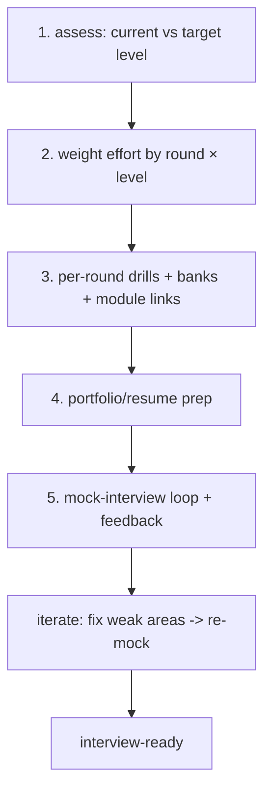

# Interview Prep Integration (Capstone: A Level-Calibrated Plan + Mock Loop)

> Assemble everything into one **personalized, level-calibrated prep plan**: assess your **current vs target level**, allocate effort across the **rounds by their weight for that level** (DSA / conceptual / machine-coding / system-design / behavioral), attach **concrete drills + question banks + module links** to each, prepare your **portfolio/resume**, and run a **mock-interview loop with feedback → iterate**. It maps the whole handbook into an interview-ready study system — turning knowledge into offers through **format-specific, out-loud, feedback-driven practice** weighted where it matters for your target role.

## Introduction

This module capstone composes formats/leveling, DSA-in-Dart, the conceptual bank, and behavioral/system-design into one executable prep plan + mock loop. It's the "how to actually prepare and land the offer" deliverable.

## Why this concept exists

The pieces (round types, drills, banks) only work when **organized into a plan** weighted for your target level and executed with **feedback loops (mocks)**. This capstone provides that system — preventing the common failures of unfocused prep (grinding DSA for a senior role) or knowledge-without-practice.

## Real-world analogy

It's a **training program for the decathlon** tailored to your division: assess current times per event, **allocate training to your weakest + highest-weighted events**, follow drills, and run **timed practice meets with a coach's feedback** (mocks) — iterating until you hit the qualifying standard for your target division (level).

## Internal Working



- **1. Assess (current vs target)** ([01_interview_formats_and_prep.md](01_interview_formats_and_prep.md)): honestly rate yourself per round (DSA/conceptual/machine-coding/system-design/behavioral) against the **target level's bar** (junior/mid/senior). Gaps = where effort goes.
- **2. Weight effort by round × level**: allocate time where it matters for the **target role**:
  - **Junior**: fundamentals conceptual + basic DSA + basic machine coding + behavioral basics.
  - **Mid**: solid conceptual + moderate DSA + clean machine coding + intro system design + behavioral.
  - **Senior**: **system design + architecture + behavioral (impact/leadership)** heavy; deep conceptual; DSA lighter. **Don't over-grind DSA for a senior role** (or under-prep it for a DSA-heavy company).
- **3. Per-round drills + banks + module links**:
  - **DSA**: pattern problems in Dart, timed, out loud ([02_dsa_in_dart.md](02_dsa_in_dart.md)).
  - **Conceptual**: rehearse the leveled Q&A bank (define→why→example→trade-offs), study linked modules ([03_flutter_dart_conceptual_questions.md](03_flutter_dart_conceptual_questions.md)).
  - **Machine coding**: timed feature builds (clean state/architecture) ([Module 56](../56%20Machine%20Coding%20Rounds/README.md)).
  - **System design**: the framework on common prompts ([Module 48](../48%20System%20Design/README.md)/[04_behavioral_and_system_design_rounds.md](04_behavioral_and_system_design_rounds.md)).
  - **Behavioral**: STAR story bank ([04_behavioral_and_system_design_rounds.md](04_behavioral_and_system_design_rounds.md)).
  - Each area **links back to the handbook modules** for depth.
- **4. Portfolio/resume** ([04_behavioral_and_system_design_rounds.md](04_behavioral_and_system_design_rounds.md)): 2-3 strong complete projects + impact-focused, backable resume bullets + clean GitHub — credibility backbone.
- **5. Mock-interview loop (the multiplier)**: **do mocks per round** (peer/mentor/platform), get **specific feedback**, identify weak areas, **fix + re-mock**. Practicing **out loud under pressure with feedback** is what converts study into performance — the single highest-ROI activity.
- **Iterate**: prep is a loop (assess → practice → mock → feedback → refine), not linear cramming; track progress against the plan; ramp intensity toward the interview date.
- **Logistics**: research each company's loop (which rounds they weight), prep your coding environment, prepare questions to ask, and manage energy across a long loop.
- **The payoff**: a **focused, leveled, feedback-driven** system that converts the handbook's knowledge into interview performance and offers — effort spent where it moves the needle for *your* target.

## Memory Representation

Not code — a **living prep plan**: a per-round × target-level effort allocation, drills/banks with status, portfolio/resume checklist, and a mock-log with feedback + action items. Iterated toward interview-ready.

## Compiler / Runtime / Engine / VM Behavior

Not applicable — a study/practice system (the technical substance is the handbook; coding/machine-coding rounds run Dart normally).

## Examples

```text
Level-calibrated effort (senior target example):
  system design .......... 30%   (framework + prompts; Module 48)
  behavioral (STAR) ...... 20%   (impact/leadership story bank)
  conceptual depth ....... 20%   (bank + linked modules)
  machine coding ......... 20%   (timed feature builds; Module 56)
  DSA .................... 10%   (patterns; lighter for many senior roles)
  (junior/mid re-weight toward fundamentals + DSA + basic machine coding)

Prep loop:
  assess (current vs target bar) -> weight by round×level -> drills+banks (module links) ->
  portfolio/resume -> MOCK + feedback -> fix weak areas -> re-mock -> interview-ready
```

```text
Per-round drill + module map:
  DSA -> pattern problems in Dart (dsa_in_dart / Modules 01-02)
  conceptual -> Q&A bank define->why->example->trade-offs (flutter_dart_conceptual / core modules)
  machine coding -> timed feature builds (Module 56)
  system design -> clarify->contract->caching/offline->trade-offs (Module 48)
  behavioral -> STAR story bank (behavioral_and_system_design)
```

## Diagrams


## Common Mistakes

| Mistake | Why it fails | Fix |
|---------|-------------|-----|
| Unfocused prep (no plan) | Wasted effort, gaps | Assess + weight by round × target level |
| Over-grinding DSA for a senior role | Misallocated | Weight toward system design/behavioral |
| Study without mocks | Untested under pressure | Mock loop + feedback (highest ROI) |
| Not calibrating to target level | Over/under-shoot | Calibrate to junior/mid/senior bar |
| Ignoring portfolio/resume | Low credibility | 2-3 strong projects + backable bullets |
| Linear cram (no iteration) | Weak areas persist | Iterate: mock → feedback → fix → re-mock |
| Ignoring company loop emphasis | Wrong focus | Research each company's rounds |
| Silent practice | No communication practice | Practice out loud everywhere |

## Best Practices

- **Assess current vs target level**, then **weight effort across rounds by their level-specific importance** (senior → system-design/behavioral heavy, DSA lighter; junior → fundamentals/DSA/basic machine-coding) — don't misallocate.
- Attach **concrete drills + question banks + handbook module links** per round (DSA/conceptual/machine-coding/system-design/behavioral) and prepare a **credible portfolio/resume**.
- Run a **mock-interview loop with feedback** (highest-ROI), practice **out loud**, **iterate** (fix weak areas → re-mock), and **research each company's loop** to focus.
- Treat prep as a **living, iterative plan** ramping toward the interview date; map everything back to the handbook for depth.

## Performance

Not runtime. "Performance" = offer outcomes: a leveled, round-weighted, mock-driven plan maximizes ROI by focusing effort where it matters for *your* target — converting the handbook's knowledge into interview performance efficiently, versus unfocused cramming.

## Advantages / Disadvantages

- **+** Focused, leveled, feedback-driven prep; effort where it counts; converts knowledge → offers; reduces anxiety via practice; iterative improvement.
- **−** Requires honest self-assessment + discipline + mock partners + time; company-loop variance; can't cram (esp. behavioral/system-design/portfolio).

## Interview Questions

1. **🟢 How do you build a prep plan?** — Assess current vs target level, weight effort across rounds by their level-specific importance, attach drills/banks/module links per round, prepare portfolio/resume, and run a mock loop with feedback → iterate.
2. **🟢 Why is the mock-interview loop high-ROI?** — It practices performing out loud under pressure with feedback — the exact skill interviews test — surfacing weak areas study alone can't.
3. **🟡 How do you weight prep for a senior vs junior target?** — Senior: system design + architecture + behavioral heavy, DSA lighter; junior: fundamentals + basic DSA + basic machine coding + behavioral basics.
4. **🟡 Why calibrate to target level + company loop?** — To avoid over/under-preparing rounds; effort should match the target bar and the company's emphasized rounds.
5. **🟡 How does each round map to the handbook?** — DSA → Dart modules; conceptual → core Flutter/Dart modules; machine coding → Module 56; system design → Module 48; behavioral → STAR prep.
6. **🔴 What's the biggest misallocation candidates make?** — Over-grinding DSA (esp. for senior roles) while under-preparing system design, behavioral, and portfolio — the rounds that often decide mid/senior offers.
7. **🔴 Why treat prep as an iterative loop?** — Weak areas persist without feedback + re-practice; assess→practice→mock→feedback→refine converges on readiness, unlike linear cramming.

## Senior Engineer Tips

- Assess honestly and weight by target level + company loop; the highest-leverage move is spending your limited time on your weakest, highest-weighted rounds — not the ones you already enjoy.
- Make mock interviews with feedback the core of your plan; reading and solving silently builds knowledge, but only out-loud practice under pressure builds interview performance.
- Prepare portfolio/resume + behavioral + system-design early (they can't be crammed) and map every round back to the handbook module for depth; iterate mock→feedback→fix until the target bar is comfortable.

## Architect Perspective

Interview prep integration turns the whole handbook into an executable, level-calibrated system: assess, weight by round × level, drill with banks + module links, prepare a credible portfolio, and iterate through a feedback-driven mock loop. It's the meta-skill of **converting knowledge into demonstrated performance where it matters** — the same prioritization/trade-off thinking the handbook teaches, applied to your own career. Done well, your real ability (built across 55+ modules) reliably converts into offers ([01_interview_formats_and_prep.md](01_interview_formats_and_prep.md), [Module 48](../48%20System%20Design/README.md), [Module 56](../56%20Machine%20Coding%20Rounds/README.md)).

## Summary

- Build a personalized, level-calibrated plan: assess current vs target, weight effort across rounds by level importance, attach drills/banks/module links, prepare portfolio/resume, and run a mock loop with feedback → iterate.
- Weight for the target (senior → system-design/behavioral heavy; junior → fundamentals/DSA); research company loops; don't misallocate (over-grinding DSA).
- Mocks + out-loud practice + iteration are the multiplier that converts handbook knowledge into offers.

## Revision Notes

- Plan: (1) assess current vs target-level bar per round (2) weight effort by round × level (senior: system design/behavioral heavy, DSA lighter; junior: fundamentals/DSA/basic machine coding) (3) per-round drills + banks + module links (DSA→dsa_in_dart/Modules 01-02; conceptual→bank/core modules; machine coding→Module 56; system design→Module 48; behavioral→STAR) (4) portfolio/resume (2-3 projects + impact bullets) (5) mock loop + feedback → iterate.
- Highest ROI = mocks (out loud, under pressure, feedback); calibrate to target + company loop; iterate (assess→practice→mock→feedback→refine); can't cram behavioral/system-design/portfolio; map everything to handbook depth.

## Practice Questions

1. How do you allocate prep effort for your target level + role?
2. Why is the mock loop the highest-ROI activity?
3. How does each round map to handbook modules for depth?

## Coding Questions

1. Build a level-calibrated, round-weighted prep plan for your target.
2. Attach drills + banks + module links to each round.
3. Design a mock-interview loop with a feedback → iterate cadence.

## Mini Project

**Personalized prep plan + mock loop (capstone — prep):** Build your interview-prep system: assess current vs target level per round; allocate effort weighted by round × level (justified for your target); attach concrete drills + question banks + handbook-module links per round (DSA/conceptual/machine-coding/system-design/behavioral); a portfolio/resume checklist; and a mock-interview loop with a feedback → fix → re-mock cadence, researched to the target company's emphasized rounds. Acceptance: honest assessment + target bar; effort weighted by round × level (not misallocated); per-round drills/banks/module links; portfolio/resume prep; mock loop with feedback + iteration; company-loop researched; treats prep as a living, leveled system converting handbook knowledge → offers.
