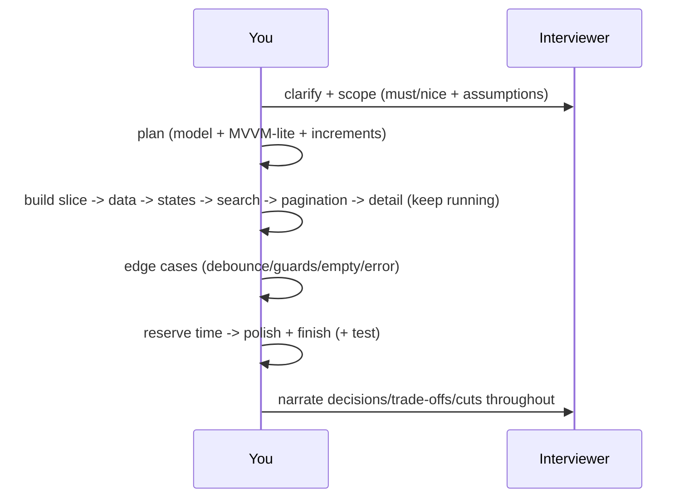

# Machine Coding Integration (Capstone: A Worked Round)

> Put it together as a **worked round** for a representative prompt (e.g., "a searchable, paginated list of items with detail"): **clarify + scope** (must-haves vs nice-to-haves + assumptions), **plan** (data model, MVVM-lite structure, state approach, increments), **build incrementally** (working slice first → layer features, keep it running), **handle edge cases** (loading/empty/error/debounce/pagination guards), **reserve time to polish + finish** (+ a quick VM test if possible), all while **communicating** and **watching the clock**. The result: a **finished, clean, right-sized, communicated** feature that scores across all five axes — the repeatable execution that wins machine-coding rounds.

## Introduction

This module capstone composes the fundamentals (evaluation axes), the approach (scope→plan→build→edge→polish), right-sized architecture (MVVM-lite), and the pattern library into one end-to-end worked round. It's the "how it all comes together under the clock" deliverable.

## Why this concept exists

The pieces only pay off when **executed together in a single timed run**: pattern recognition + right-sized structure + disciplined time-boxing + communication produce a finished, clean submission. This capstone models that full execution so you can rehearse the whole loop, not just parts.

## Real-world analogy

It's a **full timed service run** in the test kitchen: you take the order (clarify), plan the courses (plan), get a plate out fast and keep the line moving (incremental build), taste for problems (edge cases), plate + garnish before time (polish), and narrate to the judges throughout — producing a **complete, well-executed meal on time**, which is exactly what earns the score.

## Internal Working

```mermaid
flowchart TD
    Prompt[prompt: searchable + paginated list + detail] --> Clarify[1. clarify + scope: must vs nice-to-have + assumptions]
    Clarify --> Plan[2. plan: model + MVVM-lite + state (ChangeNotifier/Cubit) + increments]
    Plan --> Build[3. build incrementally: slice first -> layer, keep running]
    Build --> Edge[4. edge cases: loading/empty/error + debounce + pagination guards]
    Edge --> Polish[5. reserve time -> polish + finish (+ quick VM test)]
    Clarify & Build & Polish -.communicate + watch clock.-> Comm[think aloud + explain]
    Polish --> Done[finished, clean, right-sized, communicated -> scores 5 axes]
```

- **Prompt (representative)**: "Build a screen listing items from an API with **search** and **infinite-scroll pagination**; tapping an item opens a **detail** screen." Combines the search + pagination + navigation patterns ([04_common_problems_and_patterns.md](04_common_problems_and_patterns.md)).
- **1. Clarify + scope** (~5–8 min) ([02_approach_and_time_management.md](02_approach_and_time_management.md)): confirm data source (assume a mock/provided API), page size, search behavior; **must-haves** = list + search + pagination + loading/error + detail; **nice-to-haves** = pull-to-refresh, caching, animations. State assumptions aloud.
- **2. Plan** ([03_clean_architecture_under_pressure.md](03_clean_architecture_under_pressure.md)): **model** `Item`; **MVVM-lite** — `ItemRepository` (mock/API, `search`/`page`), `ItemListViewModel` (`ChangeNotifier`: state = items + query + loadingMore + hasMore + error; ops = `search` (debounced), `loadMore`), thin `ItemListScreen` + `ItemTile` + `ItemDetailScreen`; **increments**: static list → data → loading/empty/error → search(debounce) → pagination → detail nav → polish.
- **3. Build incrementally**: get the **list rendering fast** (static → mock data), keep it **running** each step; layer **loading/empty/error**, then **debounced search**, then **infinite-scroll** (`ScrollController` + `hasMore`/`loadingMore` guards), then **detail navigation**. Core first; app demoable throughout.
- **4. Edge cases** ([Module 38](../38%20Error%20Handling/README.md)): loading spinner, empty ("no results"), error + retry, **debounce** (~300ms, cancel stale), **pagination guards** (no refetch, stop at `hasMore == false`), input trimming — the scored functionality details.
- **5. Polish + finish + (test)**: reserve the last ~10–15% — tidy naming/dead code, ensure UI is reasonable, **self-run** all states, and (if time) a **quick VM unit test** (e.g., "search updates results", "loadMore appends + respects hasMore") — the UI-free VM makes this cheap ([Module 49](../49%20Testing/README.md)). **Nothing broken.**
- **Communicate throughout**: announce the plan + increments, explain the state choice + debounce/pagination decisions, state what you're cutting (nice-to-haves) if behind, and note "I'd add caching/DTOs/tests if this grew" (judgment) — scored heavily.
- **Time-box** (~90 min): ~8 clarify/plan, ~55 build core (list→data→states→search→pagination→detail), ~12 edge cases, ~15 polish/finish(+test); **cut nice-to-haves, not correctness/finishing** if behind; **don't rabbit-hole** (stub + move on).
- **Result = all five axes**: **functionality** (works + edge cases), **code quality** (readable MVVM-lite), **structure** (UI/VM/repo separation + sensible state), **completeness** (finished + polished), **communication** (throughout) — a strong, offer-winning submission ([01_machine_coding_fundamentals.md](01_machine_coding_fundamentals.md)).
- **Right-size to level**: junior → list + basic search + states; mid → + pagination + clean MVVM-lite + edge cases; senior → + detail + a test + trade-off narration (+ mention scaling).

## Memory Representation

Not new structures — the **executed plan**: model + MVVM-lite (UI-free VM with the search/pagination state shape + a mock repo) built in running increments, plus a time-box + communication track. The submission is a finished, clean, demoable feature.

## Compiler / Runtime Behavior

Kept compiling/running at each increment (hot reload); the VM compiles UI-free (testable); `ListView.builder` + `ScrollController` drive virtualized, paginated rendering; debounce timers cancelled on dispose.

## Flutter Engine / Dart VM Behavior

Standard: virtualized list rendering, scoped rebuilds on state changes; VM logic plain Dart (fast optional test). Nothing internals-specific beyond good rebuild habits.

## Examples

```dart
// The composed view model (MVVM-lite): search (debounce) + pagination (guards) + states
class ItemListViewModel extends ChangeNotifier {
  final ItemRepository repo; Timer? _debounce;
  final items = <Item>[]; String query = ''; int _page = 1;
  bool loading = true, loadingMore = false, hasMore = true; String? error;
  ItemListViewModel(this.repo) { _load(reset: true); }

  void search(String q) {                            // debounced search
    query = q; _debounce?.cancel();
    _debounce = Timer(const Duration(milliseconds: 300), () => _load(reset: true));
  }
  Future<void> loadMore() async {                    // pagination (guards)
    if (loadingMore || !hasMore || loading) return;
    loadingMore = true; notifyListeners(); await _fetch(); loadingMore = false; notifyListeners();
  }
  Future<void> _load({bool reset = false}) async {
    if (reset) { _page = 1; hasMore = true; items.clear(); loading = true; error = null; notifyListeners(); }
    await _fetch(); loading = false; notifyListeners();
  }
  Future<void> _fetch() async {
    try { final p = await repo.page(query, _page); items.addAll(p.items); hasMore = p.hasMore; _page++; }
    catch (_) { error = 'Failed to load'; }
  }
  @override void dispose() { _debounce?.cancel(); super.dispose(); }   // dispose!
}
// UI: thin screen binds to state -> loading/empty/error/data; ScrollController -> loadMore near bottom;
// tile onTap -> Navigator.push(ItemDetailScreen). (add try/catch UI states + retry.)
```

```text
Time box (~90 min) worked:
  0-8    clarify + scope (must/nice-to-have + assumptions) + plan (model/MVVM-lite/state/increments)
  8-63   build core: static list -> mock data -> loading/empty/error -> debounced search -> pagination -> detail nav
  63-75  edge cases (debounce cancel, pagination guards, empty/error/retry, input trim)
  75-90  polish + finish (naming/dead code/UI, self-run all states) + quick VM test if time
  throughout: communicate plan/decisions/cuts; cut nice-to-haves (not correctness/finish) if behind
```

## Diagrams



## Common Mistakes

| Mistake | Why it fails | Fix |
|---------|-------------|-----|
| Skipping clarify/scope | Builds wrong/over-scoped | Clarify + must/nice-to-have + assumptions first |
| No plan / god-widget | Thrash + low structure | Plan MVVM-lite + increments |
| Over-engineering (full Clean Arch) | No time to finish | Right-size (UI/VM/repo) |
| Gold-plating before core | No finish | Core first (list→states→search→pagination) |
| Missing edge cases (loading/empty/error/debounce/guards) | Fails functionality | Add them explicitly |
| No reserved polish/finish | Broken at buzzer | Reserve last ~15% |
| Rabbit-holing pagination detail | Blows budget | Stub/simplify + move on |
| Silent execution | Misses communication axis | Narrate throughout |

## Best Practices

- Execute the **full loop**: clarify + scope (must/nice-to-have + assumptions) → plan (model + MVVM-lite + state + increments) → build incrementally (working slice first, keep running, core first) → edge cases (loading/empty/error + debounce + pagination guards) → **reserve time to polish + finish** (+ quick VM test if possible).
- Use **right-sized MVVM-lite** (UI-free VM with the search/pagination state shape + a mock repo) and the **practiced patterns** (debounce, pagination guards, states) — recognize + instantiate, don't design from scratch.
- **Time-box aggressively** (~8/55/12/15), **cut nice-to-haves (not correctness/finishing)** if behind, **don't rabbit-hole**, and **communicate throughout** (plan/decisions/cuts/"would-add-if-grew").
- Aim to score **all five axes** (functionality/quality/structure/completeness/communication); **right-size to level**.

## Performance

Not runtime perf — the "performance" is a finished, clean, five-axis-scoring submission within the box. The composed approach + patterns + right-sizing maximize it: fast start (recognized patterns), always-demoable (increments), scored details (edge cases + communication), polished finish (reserved time).

## Advantages / Disadvantages

- **+** Repeatable, high-scoring execution (all five axes), always-demoable, finished + clean + communicated, right-sized, level-calibrated.
- **−** Requires practiced patterns + disciplined time-boxing + communication under stress; must resist over-engineering/gold-plating/rabbit-holes.

## Interview Questions

1. **🟢 Walk through a machine-coding round end-to-end.** — Clarify + scope (must/nice-to-have + assumptions) → plan (model + MVVM-lite + state + increments) → build incrementally (slice first, keep running, core first) → edge cases → reserve time to polish + finish (+ test), communicating throughout.
2. **🟢 What architecture + state do you use for a searchable/paginated list?** — MVVM-lite: thin UI + a UI-free `ChangeNotifier`/Cubit view model (items/query/loadingMore/hasMore/error + debounced search + guarded loadMore) + a simple/mock repository.
3. **🟡 How do you time-box a ~90-min round?** — ~8 clarify/plan, ~55 build core, ~12 edge cases, ~15 polish/finish(+test); cut nice-to-haves (not correctness/finishing) if behind; don't rabbit-hole.
4. **🟡 What edge cases must this prompt handle?** — Loading/empty/error + retry, debounce (cancel stale), pagination guards (no refetch, stop at `hasMore == false`), input trimming.
5. **🟡 How do you demonstrate judgment on scope/architecture?** — Right-size (MVVM-lite, no full Clean Arch), state what you're cutting, and note "I'd add caching/DTOs/tests if this grew" — building only what fits the box.
6. **🔴 How do you ensure you finish?** — Working slice early + incremental core-first build (always running) + reserved polish time + cutting nice-to-haves before correctness — never a broken half-feature at the buzzer.
7. **🔴 How does the submission score across the five axes?** — Functionality (works + edge cases), code quality (readable MVVM-lite), structure (UI/VM/repo + sensible state), completeness (finished/polished), communication (throughout).

## Senior Engineer Tips

- Rehearse the whole loop on a couple of representative prompts (searchable+paginated list, todo) until clarify→plan→incremental-build→edge-cases→polish is automatic; the round is won by smooth execution, not novel ideas.
- Keep the app running after every increment and reserve the last ~15% for polish + a quick VM test; a finished, clean, five-axis submission beats an ambitious broken one every time.
- Narrate decisions and cuts, and explicitly say what you'd add "if this grew"; that combination of finishing cleanly + communicating judgment is exactly the senior signal machine coding is looking for.

## Architect Perspective

The worked round is the synthesis of machine-coding skill: pattern recognition + right-sized MVVM-lite + disciplined time-boxing + communication, executed to a finished, clean, five-axis submission. It mirrors real engineering under constraints — scope, prioritize, build incrementally, handle edge cases, finish, communicate — which is exactly why it predicts on-the-job ability. Rehearsed until automatic, it converts the handbook's knowledge into a consistent, offer-winning performance ([01_machine_coding_fundamentals.md](01_machine_coding_fundamentals.md), [02_approach_and_time_management.md](02_approach_and_time_management.md), [03_clean_architecture_under_pressure.md](03_clean_architecture_under_pressure.md), [04_common_problems_and_patterns.md](04_common_problems_and_patterns.md)).

## Summary

- A worked round: clarify + scope → plan (model + MVVM-lite + state + increments) → build incrementally (slice first, keep running, core first) → edge cases (loading/empty/error + debounce + pagination guards) → reserve time to polish + finish (+ quick test), communicating throughout.
- Use right-sized MVVM-lite + practiced patterns; time-box aggressively; cut nice-to-haves not correctness/finishing; don't rabbit-hole.
- Produce a finished, clean, right-sized, communicated feature scoring all five axes; right-size to level.

## Revision Notes

- Worked loop: clarify+scope (must/nice-to-have + assumptions, ~8min) → plan (model + MVVM-lite: repo/VM/UI + state approach + increments) → build incrementally (static list→data→loading/empty/error→debounced search→pagination guards→detail nav, keep running, core first) → edge cases → reserve ~15% polish+finish (+quick VM test) → communicate throughout.
- VM state shape: items/query/loading/loadingMore/hasMore/error; debounced search (cancel/dispose); loadMore guards; UI-free (testable). Time-box ~8/55/12/15; cut nice-to-haves not correctness/finish; no rabbit-holes; right-size to level. Scores all five axes (functionality/quality/structure/completeness/communication).

## Practice Questions

1. Walk the full worked round for a searchable/paginated list.
2. What's the VM state shape + logic, and how do you keep it testable?
3. How do you time-box + what do you cut if behind?

## Coding Questions

1. Build the searchable/paginated list + detail (MVVM-lite) end-to-end with edge cases.
2. Add a quick VM unit test (search updates results / loadMore respects hasMore).
3. Time yourself and reflect against the five evaluation axes.

## Mini Project

**Full worked round (capstone — prep):** Do a complete timed (~90-min) machine-coding run for a representative prompt (searchable + paginated list + detail): clarify + scope (must/nice-to-have + assumptions), plan (model + MVVM-lite + state + increments), build incrementally (keep running, core first), handle edge cases (loading/empty/error + debounce + pagination guards), reserve time to polish + finish (+ a quick VM test), narrating throughout — then reflect against the five axes. Acceptance: clarified + scoped + planned; incremental build (always running, core first); MVVM-lite (UI-free VM with the search/pagination state shape + mock repo); edge cases handled; finished + polished within the box; quick VM test if time; communicated; self-scored on all five axes; right-sized to target level.
