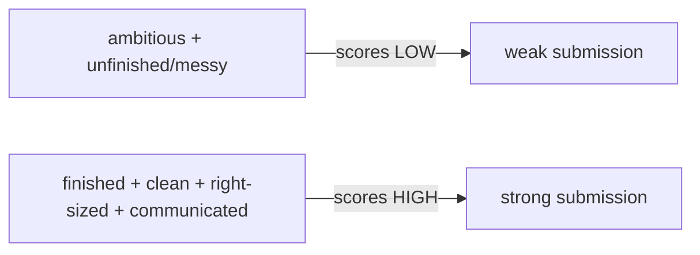

# Machine Coding Fundamentals

> A machine-coding round asks you to **build a small, working Flutter feature/app in a time box** (~60–120 min), evaluated on **five axes**: **functionality** (does it work + handle edge cases?), **code quality** (readable, idiomatic, well-named), **structure/architecture** (right-sized separation, sensible state management), **completeness** (finished + polished, not a half-feature), and **communication** (thinking aloud, clarifying, explaining choices). The winning mindset: **a finished, clean, well-structured small feature beats an ambitious unfinished mess** — scope tightly, build incrementally, keep it right-sized, and finish. It's an engineering-under-time test, not an algorithms puzzle.

## Introduction

This file establishes what machine coding is, the evaluation criteria, and the mindset — the orientation before the approach/architecture/patterns files. It reframes the round from "code fast" to "ship a clean, working feature deliberately."

## Why this concept exists

Machine coding predicts real on-the-job ability better than algorithm puzzles: can you take a loose spec and produce **working, maintainable, extensible** code under normal time constraints? Knowing exactly **how it's scored** (not just "make it run") lets you allocate effort correctly — because clean structure + a finished feature + good communication routinely beat a clever-but-broken or messy submission.

## Real-world analogy

It's a **timed cooking round judged like a restaurant service**, not a speed-eating contest: the judges taste whether the dish **works** (functionality), is **well-prepared/presented** (code quality), used a **sensible kitchen workflow** (structure), is **actually finished + plated** (completeness), and whether you **communicated your plan** as you cooked. An ambitious dish left half-raw scores worse than a simple dish executed cleanly and finished on time.

## Internal Working

```mermaid
flowchart TD
    Prompt[loose feature prompt + time box (~60-120 min)] --> Build[build a working Flutter feature]
    Build --> Eval{evaluated on 5 axes}
    Eval --> Func[functionality: works + edge cases]
    Eval --> Quality[code quality: readable/idiomatic/named]
    Eval --> Struct[structure: right-sized architecture + state]
    Eval --> Complete[completeness: finished + polished]
    Eval --> Comm[communication: think aloud + clarify + explain]
    Note[finished + clean + structured > ambitious + unfinished]
```

- **The format**: a **loose feature spec** ("build a todo app", "a searchable paginated list", "a stopwatch") + a **time box** (~1–2h), often live (screen-shared, thinking aloud) or take-home. You produce **running Flutter code**; sometimes an API is provided, sometimes mocked/local. You choose the state approach + structure.
- **Evaluation criteria (know all five — effort follows them)**:
  1. **Functionality**: does it **work** and handle **edge cases** (loading/empty/error, invalid input, boundaries)? The baseline.
  2. **Code quality**: **readable, idiomatic Dart/Flutter**, good names, small widgets/methods, no dead/duplicate code, consistent style.
  3. **Structure/architecture**: **right-sized separation** (UI vs logic vs data), a sensible **state-management** choice, extensibility — **not** a god-widget, **not** over-engineered.
  4. **Completeness**: a **finished, polished** feature (works end-to-end, reasonable UX) — **finishing matters more than scope**.
  5. **Communication**: **clarify requirements**, **think aloud**, explain decisions/trade-offs, respond to hints — assessed throughout (esp. live rounds).
- **The mindset (the key)**: **a finished, clean, well-structured small feature beats an ambitious unfinished mess.** Optimize for **shipping something solid**: scope tight, prioritize the core happy path + edge cases, keep architecture **right-sized**, and **finish + polish** — leaving nothing broken.
- **What it's NOT**: not an algorithms/DSA puzzle (that's the coding round — [Module 55](../55%20Flutter%20Interview%20Preparation/README.md)); cleverness isn't rewarded — **engineering judgment under time** is.
- **Common failure modes** (avoid — detailed in later files):
  - **Over-engineering**: full Clean Architecture + 5 layers for a todo app → no time to finish.
  - **Under-structuring**: everything in one giant `build`/`setState` god-widget → unreadable, unextensible.
  - **Poor scoping**: building gold-plated extras before the core works, or misreading the spec.
  - **Not finishing**: an impressive-but-broken half-feature.
  - **Silent coding**: no clarification/communication.
- **The winning shape**: clarify → scope → plan increments → build core (right-sized) → handle edge cases → polish → (light test if time) → communicate throughout ([approach_and_time_management.md](approach_and_time_management.md)).
- **Levels**: junior → a working feature with basic structure; mid → clean + handles edge cases + sensible state; senior → clean, extensible, well-architected, tested, with clear trade-off reasoning ([Module 55](../55%20Flutter%20Interview%20Preparation/README.md)).

## Memory Representation

Not code — a **scoring model**: the five axes you're evaluated on, and a mental priority (functionality + completeness + structure + quality + communication). The submission is a small, finished, clean Flutter feature.

## Compiler / Runtime / Engine / VM Behavior

Not applicable beyond running your Flutter code normally — machine coding is an engineering-judgment-under-time test, not a runtime/internals exam.

## Examples

```text
Evaluation axes (allocate effort here):
  functionality  -> works + edge cases (loading/empty/error/invalid)      [baseline]
  completeness   -> finished + polished end-to-end                        [finishing > scope]
  structure      -> right-sized separation + sensible state mgmt          [not god-widget, not over-eng]
  code quality   -> readable/idiomatic/named/small/no-duplication
  communication  -> clarify + think aloud + explain trade-offs            [throughout]

Mindset: a FINISHED, clean, small feature > an AMBITIOUS, unfinished mess.

Failure modes to avoid:
  over-engineering (5 layers for a todo) | under-structuring (god-widget) |
  poor scoping (gold-plating before core works) | not finishing | silent coding
```

## Diagrams



## Common Mistakes

| Mistake | Why it scores low | Fix |
|---------|-------------------|-----|
| Over-engineering (full Clean Arch for a todo) | No time to finish | Right-size architecture to the task |
| God-widget (all in one `build`/`setState`) | Unreadable/unextensible | Separate UI vs logic vs data |
| Not finishing | Incomplete = low functionality/completeness | Scope tight; finish core first |
| Gold-plating before core works | Wrong priorities | Core happy path + edge cases first |
| Ignoring edge cases (loading/empty/error) | Fails "functionality" | Handle them explicitly |
| Silent coding | Misses communication axis | Clarify + think aloud + explain |
| Treating it as an algo puzzle | Wrong lens | Engineering judgment under time |
| Messy/unnamed code | Fails "code quality" | Readable, idiomatic, well-named |

## Best Practices

- Optimize for the **five axes** (functionality, code quality, structure, completeness, communication) — allocate effort where the score is; **finishing a clean small feature beats an unfinished ambitious one**.
- Keep architecture **right-sized** (separation without over-engineering; sensible state choice); **handle edge cases** (loading/empty/error/invalid); write **readable, idiomatic** code.
- **Clarify + think aloud + explain trade-offs** throughout (communication is scored); **scope tightly** and **finish + polish** the core before extras.
- Treat it as **engineering-under-time** (not an algorithms puzzle); calibrate depth to your **target level**.

## Performance

Not runtime perf — the "performance" is your **submission score**: a finished, clean, well-structured, communicated feature. Time is the constraint, so effort must track the scoring axes (finish + structure + edge cases + communication), not cleverness.

## Advantages / Disadvantages

- **+** (As a test) predicts real engineering ability (build clean working features under time); rewards judgment/scoping/communication; practicable.
- **−** Time pressure + loose specs; easy to over/under-engineer or not finish; communication + edge cases often neglected under stress.

## Interview Questions

1. **🟢 What is a machine-coding round, and what does it test?** — Building a small working Flutter feature in a time box, evaluated on functionality, code quality, structure/architecture, completeness, and communication — engineering judgment under time, not algorithms.
2. **🟢 What's the core mindset?** — A finished, clean, well-structured small feature beats an ambitious unfinished mess — scope tight, keep it right-sized, and finish.
3. **🟡 What are the five evaluation axes?** — Functionality (works + edge cases), code quality (readable/idiomatic), structure (right-sized separation + state), completeness (finished/polished), communication (clarify/think aloud/explain).
4. **🟡 What are the common failure modes?** — Over-engineering (no time to finish), under-structuring (god-widget), poor scoping (gold-plating), not finishing, and silent coding.
5. **🟡 How does machine coding differ from the DSA/coding round?** — Machine coding tests building clean working features (structure/state/edge cases/completeness); the coding round tests algorithms/complexity.
6. **🔴 Why does finishing matter more than scope?** — An unfinished/broken feature fails functionality + completeness (the biggest axes); a smaller finished feature demonstrates working, clean, complete engineering.
7. **🔴 How do expectations scale by level?** — Junior: working + basic structure; mid: clean + edge cases + sensible state; senior: clean/extensible/well-architected/tested + trade-off reasoning.

## Senior Engineer Tips

- Anchor on the five axes and the "finished beats ambitious" rule; the most common way strong candidates fail is over-engineering or over-scoping and not finishing a clean, working feature.
- Handle loading/empty/error and communicate throughout even in a tiny app; those two (edge cases + communication) are constantly neglected under time pressure and cheaply win points.
- Calibrate scope + architecture depth to the time box and your target level — a right-sized, finished, well-named feature signals exactly the on-the-job judgment they're hiring for.

## Architect Perspective

Machine coding is the interview's closest proxy for real work: produce a clean, working, right-sized, finished feature under time while communicating. It rewards the handbook's core judgment — right-sizing architecture, choosing state management, handling edge cases, prioritizing — rather than cleverness. Understanding the five scoring axes and the "finished + clean beats ambitious + broken" mindset is the foundation for the approach, architecture, and patterns that make submissions consistently strong ([approach_and_time_management.md](approach_and_time_management.md), [clean_architecture_under_pressure.md](clean_architecture_under_pressure.md), [Module 55](../55%20Flutter%20Interview%20Preparation/README.md)).

## Summary

- Machine coding = build a small working Flutter feature in a time box, scored on functionality, code quality, structure, completeness, and communication.
- Mindset: a finished, clean, right-sized small feature beats an ambitious unfinished mess — scope tight, handle edge cases, finish + polish, communicate.
- Avoid over-engineering / under-structuring / poor scoping / not finishing / silent coding; it's engineering-under-time, not an algo puzzle; calibrate to level.

## Revision Notes

- Format: loose feature spec + time box (~60-120 min), running Flutter code, you choose state/structure; live (think-aloud) or take-home.
- Five axes: functionality (works + edge cases), code quality (readable/idiomatic/named), structure (right-sized separation + state mgmt), completeness (finished/polished), communication (clarify/think aloud/explain).
- Mindset: finished+clean+right-sized > ambitious+unfinished. Failures: over-engineering, god-widget, poor scoping/gold-plating, not finishing, silent coding. Not a DSA puzzle; level-calibrated (junior working+basic → senior clean/extensible/tested).

## Practice Questions

1. What are the five evaluation axes, and how should they guide effort?
2. Why does a finished small feature beat an ambitious unfinished one?
3. What are the common machine-coding failure modes?

## Coding Questions

1. Given a prompt, list the five-axis priorities + a scope for the time box.
2. Identify over-engineering vs under-structuring in a sample submission.
3. Enumerate the edge cases (loading/empty/error/invalid) a prompt needs.

## Mini Project

**Evaluation-criteria calibration (prep):** For two common prompts (e.g., a todo app and a searchable list), write for each: the five-axis priorities, a right-sized scope for a ~90-min box, the edge cases to handle, and the over-engineering/under-structuring traps to avoid — plus how the bar shifts for junior vs senior. Acceptance: five axes applied per prompt; right-sized scope (finish-focused); edge cases enumerated; failure-mode traps identified; level calibration; "finished + clean > ambitious + unfinished" mindset evident.
