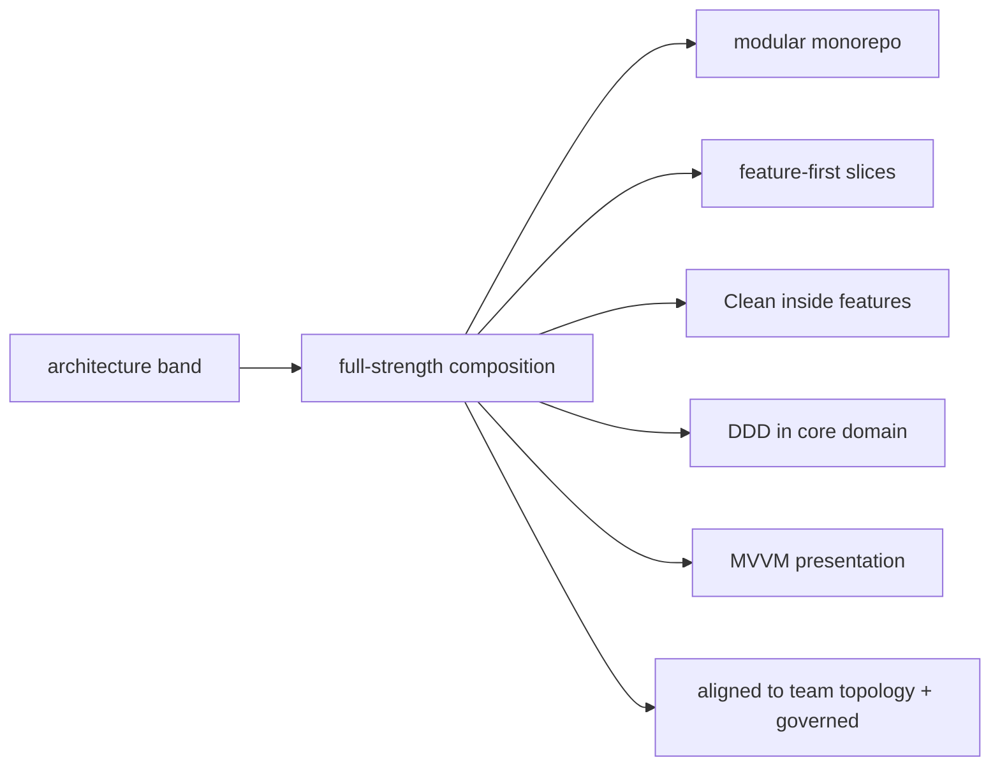

# Enterprise Architecture & Structure

> Enterprise scale demands the handbook's architecture **composed at full strength**: a **modular monorepo** (feature + shared packages with **compiler-enforced boundaries** — [Module 45](../45%20Modular%20Architecture/README.md)), organized **feature-first** ([Module 44](../44%20Feature%20First%20Architecture/README.md)) with **Clean Architecture** inside each slice ([Module 40](../40%20Clean%20Architecture/README.md)) and **DDD** in the complex core domain ([Module 46](../46%20Domain%20Driven%20Design/README.md)), presented via **MVVM** ([Module 43](../43%20MVVM/README.md)) — and, critically, **aligned to team topology** (Conway's Law: module boundaries ≈ team boundaries) with **governance** (standards/ownership/ADRs). The shared **`core`/`platform`** packages hold cross-cutting infrastructure (design system, auth, networking, config, i18n) every feature reuses. It's not new patterns — it's the **deliberate, full-strength composition** of the architecture band for many teams and years.

## Introduction

This file shows how to structure a large, multi-team enterprise Flutter app: the modular monorepo + feature-first + Clean + DDD + MVVM composition, the shared platform/core packages, team-topology alignment, and governance. It composes the architecture band ([40](../40%20Clean%20Architecture/README.md)–[47](../47%20Scalable%20Applications/README.md)) at enterprise scale.

## Why this concept exists

At enterprise scale, structure is what lets **many teams work in parallel on a coherent, evolvable codebase over years**. Without full-strength boundaries + organization, you get a tangled monolith (collisions, coupling, slow builds, no ownership). The architecture band's patterns exist precisely for this; enterprise is where you **compose all of them deliberately** and align them to how teams are organized.

## Real-world analogy

It's a **planned industrial campus** vs a garage: separate **buildings owned by departments** (modules ↔ teams), a **shared utilities plant + standards office** (core/platform packages + governance), each building internally organized to the same blueprint (feature-first + Clean inside), with the **most valuable production line engineered rigorously** (DDD in the core domain). The campus layout mirrors the **org chart** (Conway's Law) so departments operate autonomously without colliding.

## Internal Working

```mermaid
flowchart TD
    Monorepo[modular monorepo (melos)] --> Packages{packages}
    Packages --> Core[core/platform: design system, auth, networking, config, i18n, contracts]
    Packages --> Features[feature packages: feature_a, feature_b, ... (each a Clean/MVVM slice)]
    Packages --> App[app: composition root (wires features + core)]
    Features --> Internal[inside each: domain (DDD in core) + data + presentation (MVVM)]
    Features -->|depend on| Core
    Teams[team topology] -. Conway's Law .-> Features
    Governance[governance: standards/ADRs/ownership/CI] --- Monorepo
    Note[full-strength composition of the architecture band, aligned to teams]
```

- **The composition (full-strength architecture band)**:
  - **Modular monorepo** ([Module 45](../45%20Modular%20Architecture/README.md)): the app + many **packages** (feature + shared) with **compiler/build-enforced boundaries**, managed by **melos** (incremental builds, per-package versioning/ownership). The default for large, multi-team apps.
  - **Feature-first** ([Module 44](../44%20Feature%20First%20Architecture/README.md)): organized by **business capability** (feature packages), not technical layer — cohesion + team ownership.
  - **Clean Architecture inside each feature** ([Module 40](../40%20Clean%20Architecture/README.md)): domain/data/presentation with the dependency rule — testable, evolvable slices.
  - **DDD in the complex core** ([Module 46](../46%20Domain%20Driven%20Design/README.md)): bounded contexts ≈ feature/module boundaries; rich domain (aggregates/value objects) **where complexity warrants**, simpler CRUD elsewhere.
  - **MVVM presentation** ([Module 43](../43%20MVVM/README.md)): view models over use cases; consistent across features.
  - Interaction across features via **contracts + DI** (never cross-feature internals — [Module 45](../45%20Modular%20Architecture/README.md)).
- **Shared `core`/`platform` packages** (the cross-cutting backbone): design system/theming, **auth**, networking client + interceptors, **config/feature flags**, **i18n/l10n**, logging/monitoring facades, shared **contracts** + value objects. Features **depend on core** (never the reverse); core is stable/low-churn ([Module 45](../45%20Modular%20Architecture/README.md)). This is where enterprise cross-cutting concerns live ([cross_cutting_enterprise_concerns.md](cross_cutting_enterprise_concerns.md)).
- **Team topology alignment (Conway's Law)**: **module/package boundaries ≈ team boundaries** — each team **owns** feature package(s) (+ their API/tests/release), interacting via contracts. Deliberately designing modules to match teams enables **autonomy + parallel work** and avoids cross-team collisions ([Module 47](../47%20Scalable%20Applications/README.md)). Platform/core owned by a **platform team**.
- **Governance (essential at scale)** ([Module 47](../47%20Scalable%20Applications/README.md)): shared **standards** (architecture/naming/patterns) enforced by **lints + CI gates**, **CODEOWNERS**, **ADRs** (architecture decision records), architecture/security **reviews**, and a **template slice** as the canonical example. Governance keeps a many-team codebase coherent.
- **Layering vs feature-first (both, composed)**: layers (domain/data/presentation) exist **inside** features; **feature/module is the outer axis** — the app is a set of feature packages over a shared core, each internally Clean/MVVM.
- **Right-sizing (still applies)**: not every feature needs DDD (only the complex core); not every enterprise app needs full modularization on day one — **grow into** it from a clean feature-first base as team/build pressure appears ([Module 44](../44%20Feature%20First%20Architecture/README.md)/[Module 45](../45%20Modular%20Architecture/README.md)). Enterprise ≠ maximal everywhere; it's **rigor where warranted, consistently governed**.
- **It's composition, not invention**: enterprise architecture reuses the handbook's patterns — the skill is **choosing + combining + governing** them at the scale the constraints demand.

## Memory Representation

Not runtime — a **package graph + org mapping**: `app` → feature packages → `core`/`platform` (+ contracts), acyclic; features internally Clean/MVVM (DDD in the core); package boundaries mapped to owning teams; governance config (standards/ADRs/CODEOWNERS). A living architecture doc.

## Compiler Behavior

Package boundaries are **compiler/build-enforced** (declared deps + exports only — [Module 45](../45%20Modular%20Architecture/README.md)); domain layers compile framework-free (testable); lints enforce standards; incremental builds (melos) scale CI.

## Runtime Behavior

No runtime change from composition — the app runs as one binary; DI (composition root) wires features + core at startup; cross-feature calls resolve via contracts. Organization affects build/dev/team velocity + evolvability, not runtime.

## Flutter Engine / Dart VM Behavior

Standard; modular packages enable incremental compilation (build-time win). Not internals-specific.

## Examples

```text
Enterprise monorepo layout (composition of the architecture band):
  apps/app/                         # composition root (wires all features + core)
  packages/
    core/                           # design system, config/flags, i18n, logging/monitoring facades
    platform_auth/                  # auth + RBAC + SSO (shared)
    platform_network/               # networking client + interceptors + ACL to backends
    contracts/                      # cross-feature/cross-context interfaces + shared value objects
    feature_orders/                 # feature package: domain (DDD) + data + presentation (MVVM)
    feature_billing/                # ...
    feature_admin/                  # ...
  # features -> core/platform/contracts (acyclic); app -> everything (wiring)

Team topology (Conway's Law):
  team-commerce  -> feature_orders   | team-billing -> feature_billing
  team-identity  -> platform_auth    | platform-team -> core/platform_network/contracts
  # module boundaries ≈ team boundaries -> autonomy + parallel work; interact via contracts

Governance: lints + import-boundary rules + CI gates + CODEOWNERS + ADRs + a template feature slice
```

## Diagrams



## Common Mistakes

| Mistake | Why it's a problem | Fix |
|---------|-------------------|-----|
| Monolith many teams share | Collisions/coupling/slow builds | Modular monorepo (enforced boundaries) |
| Layer-first at scale | Scatters features; no ownership | Feature-first (feature=team unit) |
| Cross-feature internal imports | Coupling/cyclic | Contracts + DI (never internals) |
| DDD everywhere | Over-engineering | DDD in the complex core only |
| No team↔module alignment | Cross-team collisions | Conway's Law: module ≈ team |
| No governance | Incoherence across teams | Standards + lints/CI + CODEOWNERS + ADRs |
| Bloated/unstable core | Rebuilds everything, coupling | Curated, stable, low-churn core |
| Full modularization day one for a small app | Overhead | Grow into it from feature-first |

## Best Practices

- Compose the **architecture band at full strength**: **modular monorepo** (enforced boundaries) + **feature-first** slices + **Clean** inside + **DDD in the core** + **MVVM** presentation; interact **cross-feature via contracts + DI**.
- Put cross-cutting infrastructure in **shared `core`/`platform` packages** (design system, auth, networking, config, i18n, contracts) that features depend on; keep **core stable/low-churn**.
- **Align module boundaries to team topology** (Conway's Law) with clear **ownership** (CODEOWNERS); enforce **governance** (standards, lints, CI gates, ADRs, a template slice) for coherence.
- **Right-size**: DDD only in the complex core, grow into full modularization from feature-first; enterprise = **rigor where warranted, consistently governed** — not maximal everywhere.

## Performance

Not runtime — the payoff is **team + build + evolution velocity**: enforced boundaries + modular monorepo give incremental builds + parallel team work + safe evolution over years, where a monolith would collapse. Stable core keeps CI fast ([Module 45](../45%20Modular%20Architecture/README.md)/[Module 47](../47%20Scalable%20Applications/README.md)).

## Advantages / Disadvantages

- **+** Many teams work in parallel on a coherent, evolvable, testable codebase; enforced boundaries; ownership; incremental builds; cross-cutting reuse via core; scales over years.
- **−** Significant upfront structure + governance + tooling; requires discipline (boundaries/contracts/ownership); over-engineering risk if applied beyond the constraints; core-stability discipline.

## Interview Questions

1. **🟢 How do you structure a large multi-team enterprise Flutter app?** — A modular monorepo (enforced boundaries) organized feature-first, with Clean Architecture inside each feature, DDD in the complex core, MVVM presentation, and shared core/platform packages — aligned to team topology + governed.
2. **🟢 Where do cross-cutting concerns live?** — In shared `core`/`platform` packages (design system, auth, networking, config, i18n, contracts) that features depend on; core is stable/low-churn.
3. **🟡 How does team topology relate to architecture (Conway's Law)?** — Module/package boundaries are aligned to team boundaries (a team owns feature package(s)), enabling autonomy + parallel work; teams interact via contracts.
4. **🟡 Is enterprise architecture new patterns?** — No — it's the deliberate full-strength composition + governance of the handbook's patterns (modular/feature-first/Clean/DDD/MVVM) at the scale the constraints demand.
5. **🟡 Do you use DDD everywhere?** — No — DDD in the complex core domain (bounded contexts ≈ features), simpler CRUD elsewhere; right-size.
6. **🔴 Why enforce module boundaries + governance at scale?** — To keep a many-team codebase coherent + evolvable: enforced boundaries prevent coupling/collisions; governance (standards/lints/CI/ADRs/ownership) prevents drift.
7. **🔴 How do features interact without coupling?** — Via contracts (interfaces in a shared package) + DI wired at the app composition root — never importing another feature's internals.

## Senior Engineer Tips

- Build one exemplary feature slice (Clean/MVVM inside a package) as the template and align packages to teams from the start; consistency + team↔module alignment are what make a many-team enterprise codebase navigable and parallelizable.
- Keep the shared core/platform curated, stable, and low-churn, and route all cross-feature interaction through contracts; a bloated/unstable core or a single cross-feature internal import is where enterprise codebases start to rot.
- Right-size: DDD only in the complex core, and grow into full modularization from a clean feature-first base as team/build pressure appears — enterprise rigor is about applying the band where warranted and governing it, not maximizing every pattern everywhere.

## Architect Perspective

Enterprise architecture is the handbook's architecture band composed at full strength and governed for many teams over years: a modular monorepo of feature packages (Clean inside, DDD in the core, MVVM presentation) over a stable shared core, with cross-feature contracts, aligned to team topology (Conway's Law). It's **composition + governance + right-sizing**, not invention — the structural foundation on which enterprise cross-cutting concerns and integrations are built ([cross_cutting_enterprise_concerns.md](cross_cutting_enterprise_concerns.md), [integration_and_case_studies.md](integration_and_case_studies.md), [Module 47](../47%20Scalable%20Applications/README.md)).

## Summary

- Enterprise structure = modular monorepo + feature-first slices + Clean inside + DDD in the core + MVVM presentation + shared stable core/platform packages, interacting via contracts + DI.
- Align module boundaries to team topology (Conway's Law) with ownership + governance (standards/lints/CI/ADRs/template slice).
- It's full-strength composition + governance + right-sizing of the architecture band — not new patterns; DDD only in the complex core; grow into modularization.

## Revision Notes

- Composition: modular monorepo (melos, enforced boundaries — Module 45) + feature-first (Module 44) + Clean inside each feature (Module 40) + DDD in complex core (Module 46) + MVVM presentation (Module 43); cross-feature via contracts + DI.
- Shared core/platform packages: design system/theming, auth/RBAC/SSO, networking client + ACL, config/feature flags, i18n/l10n, logging/monitoring facades, contracts + value objects; features→core (stable/low-churn).
- Team topology: module boundaries ≈ team boundaries (Conway's Law), CODEOWNERS, platform team owns core. Governance: standards + lints/import-rules + CI gates + ADRs + template slice. Right-size: DDD in core only; grow into modularization from feature-first; composition + governance, not new patterns.

## Practice Questions

1. What patterns compose an enterprise Flutter architecture, and how?
2. How does Conway's Law shape module/team boundaries?
3. Where do cross-cutting concerns live, and why keep core stable?

## Coding Questions

1. Lay out an enterprise monorepo (app + feature + core/platform + contracts packages).
2. Map packages to owning teams (CODEOWNERS) with cross-feature contracts.
3. Show a feature package's internal Clean/MVVM structure (DDD if core).

## Mini Project

**Enterprise architecture blueprint (design):** For a multi-team enterprise app, design the structure: a modular monorepo (app + feature packages + shared core/platform + contracts, acyclic boundaries), feature-first slices with Clean/MVVM inside (DDD in the complex core), team-topology alignment (module↔team CODEOWNERS mapping, platform team owns core), cross-feature interaction via contracts + DI, and a governance plan (standards/lints/CI/ADRs/template slice) — with right-sizing notes. Acceptance: full-strength composition (monorepo/feature-first/Clean/DDD-core/MVVM); shared stable core/platform packages; contracts + DI (no cross-feature internals); team↔module alignment + ownership; governance; right-sized (DDD in core, grow into modularization).
