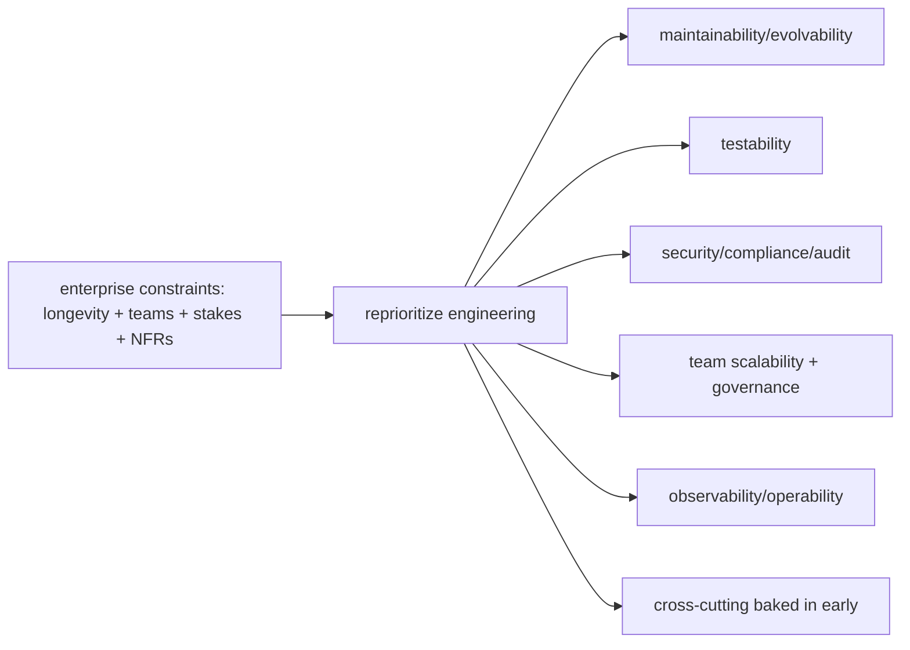

# Enterprise Fundamentals

> An "enterprise" project differs from a consumer app in **kind, not just size**: it's **long-lived** (years, many versions), built by **multiple teams**, has **high stakes** (revenue/compliance/reputation), and carries strict **non-functional requirements** — **security & compliance** (audit, data residency, regulations), **reliability/availability**, **access control (RBAC)**, **internationalization**, **multi-tenancy/white-label**, **integration** with many systems (SSO, legacy, multiple backends), and **governance** (standards, reviews, approvals). The engineering consequence: you **can't optimize for shipping fast alone** — you optimize for **maintainability, testability, security, and evolvability over years and teams**, baking cross-cutting concerns in from the start.

## Introduction

This file defines what makes a project "enterprise," its constraints/NFRs, and how those constraints reshape engineering priorities — the frame for the structure, cross-cutting-concerns, and integration files.

## Why this concept exists

Teams often apply consumer-app instincts (ship fast, minimal structure, skip cross-cutting concerns) to enterprise contexts and fail: no audit trail for a compliance review, no RBAC when roles matter, no i18n when going global, a tangled monolith many teams can't work in. Naming the enterprise constraints up front lets you architect for **the requirements that actually dominate** (security/compliance/scale/longevity/multi-team) rather than discovering them late + expensively.

## Real-world analogy

A consumer app is a **food truck** — nimble, one operator, iterate fast. An enterprise app is an **airport** — many operators (teams), decades of operation, strict safety/security/regulatory rules (compliance/audit), access zones (RBAC), signage in many languages (i18n), and dozens of integrated systems (baggage/ATC/customs = SSO/legacy/backends). You don't run an airport like a food truck; the **constraints define the engineering**.

## Internal Working

```mermaid
flowchart TD
    Enterprise[enterprise project] --> LongLived[long-lived (years/many versions)]
    Enterprise --> MultiTeam[multiple teams]
    Enterprise --> HighStakes[high stakes: revenue/compliance/reputation]
    Enterprise --> NFR{strict non-functional requirements}
    NFR --> Sec[security + compliance + audit]
    NFR --> RBAC2[access control (RBAC)]
    NFR --> Reliab[reliability/availability]
    NFR --> Intl[i18n / multi-tenant / white-label]
    NFR --> Integr[integration: SSO/legacy/multi-backend]
    NFR --> Gov[governance: standards/reviews/approvals]
    NFR --> Prio[reshapes priorities -> maintainability/testability/security/evolvability over years+teams]
```

- **What makes it "enterprise"** (the defining traits):
  - **Longevity**: lives for **years**, many releases, evolving requirements → **maintainability + evolvability** dominate; today's shortcut is tomorrow's tech-debt tax ([Module 47](../47%20Scalable%20Applications/README.md)).
  - **Multiple teams**: many contributors/teams → **clear boundaries, ownership, governance** (modular monorepo, CODEOWNERS — [Module 45](../45%20Modular%20Architecture/README.md)/[enterprise_architecture_and_structure.md](enterprise_architecture_and_structure.md)).
  - **High stakes**: money, legal, reputation on the line → **reliability, security, quality gates** are non-negotiable.
  - **Complexity**: rich domains ([Module 46](../46%20Domain%20Driven%20Design/README.md)), many integrations, many user roles/tenants.
- **The dominating non-functional requirements (NFRs)**:
  - **Security & compliance**: regulations (GDPR/HIPAA/SOC 2/PCI), **audit logging** (who did what when), data residency, encryption, privacy ([Module 37](../37%20Security/README.md)). Compliance is often a **hard requirement**, not a nice-to-have.
  - **Access control (RBAC/ABAC)**: users have **roles/permissions**; features/data gated by role — enforced **client (UX) + server (authoritative)** ([cross_cutting_enterprise_concerns.md](cross_cutting_enterprise_concerns.md)).
  - **Reliability/availability**: uptime, graceful degradation, monitoring/alerting/SLOs ([Module 52](../52%20Monitoring/README.md)).
  - **Internationalization/localization (i18n/l10n)**: many languages/locales/currencies/formats; often **RTL**; a global user base.
  - **Multi-tenancy / white-label**: one codebase serving many organizations/brands (theming, config, data isolation).
  - **Integration**: **SSO** (SAML/OIDC), **legacy systems**, **multiple backends/microservices**, third-party services — via clean boundaries/anti-corruption layers ([integration_and_case_studies.md](integration_and_case_studies.md)).
  - **Configurability**: **environment management** (dev/staging/prod + per-tenant), **feature flags**, remote config — change behavior without redeploying.
  - **Governance**: coding standards, architecture reviews, security reviews, change-approval processes, ADRs.
- **How constraints reshape engineering priorities** (the core insight): you **don't optimize for raw shipping speed** — you optimize for:
  - **Maintainability + evolvability** (clean architecture, feature-first/modular, DDD in the core — [Module 40](../40%20Clean%20Architecture/README.md)/[Module 44](../44%20Feature%20First%20Architecture/README.md)/[Module 46](../46%20Domain%20Driven%20Design/README.md)) — the code will live + change for years.
  - **Testability** (the pyramid, CI-gated — [Module 49](../49%20Testing/README.md)) — regression safety across teams/years.
  - **Security + compliance + audit** baked in from the start (retrofitting is expensive/risky).
  - **Team scalability** (boundaries/ownership/governance — [Module 45](../45%20Modular%20Architecture/README.md)/[Module 47](../47%20Scalable%20Applications/README.md)).
  - **Observability + operability** (monitoring/logging/alerting — [Module 52](../52%20Monitoring/README.md)).
  - Cross-cutting concerns (auth/RBAC/i18n/theming/config/flags) are **architected in early**, not bolted on.
- **Not every "big" app is enterprise, and vice versa**: enterprise is about the **constraints** (longevity/teams/stakes/NFRs), not just user count. **Right-size** — apply enterprise rigor where these constraints truly apply; don't over-engineer a simple internal tool.
- **The mindset shift**: from "ship features fast" (consumer/startup) to "**build a durable, secure, compliant, evolvable system across teams and years**" — while still delivering value. This module shows how the handbook's pieces compose to that end.

## Memory Representation

Not code — a **requirements + constraints model**: the enterprise traits (longevity/teams/stakes) × the NFRs (security/compliance/RBAC/reliability/i18n/multi-tenant/integration/config/governance) → an architecture + practices prioritized for maintainability/testability/security/evolvability. It's a living NFR/architecture doc.

## Compiler / Runtime / Engine / VM Behavior

Not applicable — enterprise is an organizational/requirements concern; the technical substance (architecture, security, i18n, config) is realized in later files + across the handbook.

## Examples

```text
Consumer app vs Enterprise app (priorities):
  Consumer/startup: ship features fast, minimal structure, few NFRs, one team, short horizon
  Enterprise: maintainability/evolvability over YEARS + MANY TEAMS + strict NFRs
    -> security/compliance/audit | RBAC | reliability/SLOs | i18n/l10n | multi-tenant/white-label
       | SSO/legacy/multi-backend integration | config/feature flags/envs | governance

Enterprise NFR checklist (dominates the design):
  [ ] security + compliance (GDPR/HIPAA/SOC2/PCI) + audit logging
  [ ] RBAC/ABAC (client UX + server authoritative)
  [ ] reliability/availability + monitoring/SLOs
  [ ] i18n/l10n (locales/currencies/RTL)
  [ ] multi-tenancy / white-label (theming/config/data isolation)
  [ ] integration (SSO, legacy, multiple backends, third-party)
  [ ] environment + feature-flag + remote config management
  [ ] governance (standards/ADRs/reviews/approvals) + team ownership
```

## Diagrams



## Common Mistakes

| Mistake | Why it's a problem | Fix |
|---------|-------------------|-----|
| Consumer-app instincts (ship fast, no structure) | Collapses under teams/years/NFRs | Optimize for maintainability/testability/security/evolvability |
| Skipping cross-cutting concerns | Retrofitting RBAC/audit/i18n is expensive | Architect them in early |
| Ignoring compliance/audit | Legal/regulatory failure | Treat as hard requirements (audit/GDPR/etc.) |
| Client-only access control | Bypassable | RBAC enforced server-side (client = UX) |
| No governance/ownership | Chaos across teams | Standards + ownership + reviews (Module 45/47) |
| Monolith many teams share | Collisions/coupling | Modular boundaries (Module 45) |
| Over-engineering a simple tool | Wasted effort | Right-size — enterprise rigor where constraints apply |
| No i18n/multi-tenant planning | Painful global/white-label retrofit | Plan i18n/tenancy up front if needed |

## Best Practices

- Recognize the **enterprise traits** (longevity, multiple teams, high stakes) and their **dominating NFRs** (security/compliance/audit, RBAC, reliability, i18n, multi-tenant/white-label, integration, config, governance) — and let them **drive the architecture**.
- **Reprioritize** toward **maintainability, testability, security/compliance, team scalability, and observability** over raw shipping speed — because the system lives + changes for years across teams.
- **Bake in cross-cutting concerns early** (auth/RBAC/audit/i18n/theming/config/flags) — retrofitting is expensive; enforce **security/RBAC server-side** (client = UX).
- Establish **governance + ownership** (standards, ADRs, reviews, modular boundaries); **right-size** enterprise rigor to where the constraints genuinely apply.

## Performance

Not runtime — the "performance" is **organizational + long-term**: an enterprise-appropriate architecture sustains many teams' velocity + system evolution over years (vs a consumer approach that collapses). Poorly-chosen priorities (speed over maintainability/security) cost exponentially more later (rewrites, breaches, compliance failures).

## Advantages / Disadvantages

- **+** (Enterprise rigor where warranted) durable, secure, compliant, evolvable systems supporting many teams over years; NFRs met; risk managed.
- **−** More upfront investment (structure/governance/cross-cutting concerns); slower initial shipping; over-engineering risk if applied where constraints don't hold.

## Interview Questions

1. **🟢 What makes a project "enterprise"?** — Longevity (years/many versions), multiple teams, high stakes (revenue/compliance/reputation), and strict non-functional requirements — a difference in kind, not just size.
2. **🟢 What NFRs dominate enterprise apps?** — Security & compliance (audit/GDPR/etc.), RBAC, reliability/availability, i18n/l10n, multi-tenancy/white-label, integration (SSO/legacy/multi-backend), config/feature flags, and governance.
3. **🟡 How do enterprise constraints reshape engineering priorities?** — Away from raw shipping speed toward maintainability/evolvability, testability, security/compliance, team scalability, and observability — because the system lives + changes for years across teams.
4. **🟡 Why bake cross-cutting concerns in early?** — Retrofitting RBAC/audit/i18n/theming into a mature codebase is expensive + risky; architecting them early is far cheaper.
5. **🟡 Why enforce RBAC/security server-side?** — The client is untrusted; client-side gates are UX only — authorization must be server-authoritative ([Module 37](../37%20Security/README.md)).
6. **🔴 Is every large app enterprise?** — No — enterprise is about the constraints (longevity/teams/stakes/NFRs), not user count; right-size rigor to where those constraints apply.
7. **🔴 What's the enterprise mindset shift?** — From "ship features fast" to "build a durable, secure, compliant, evolvable system across teams and years" while still delivering value.

## Senior Engineer Tips

- Identify the dominating NFRs (compliance/audit/RBAC/i18n/multi-tenant/integration) at project start and let them drive the architecture; the expensive enterprise failures come from discovering these late and retrofitting.
- Enforce security/RBAC/compliance server-side and treat audit as a first-class feature; "we'll add the audit trail later" is a common, costly regret when a compliance review arrives.
- Right-size the rigor: apply full enterprise structure/governance where longevity/teams/stakes justify it, and don't burden a genuinely small internal tool with airport-grade process.

## Architect Perspective

Enterprise fundamentals reframe the whole handbook's toolkit through the lens of dominating constraints — longevity, many teams, high stakes, and strict NFRs (security/compliance/RBAC/reliability/i18n/multi-tenant/integration/governance). These shift the optimization target from shipping speed to **maintainability, testability, security, and evolvability over years and teams**, with cross-cutting concerns architected in early. The architect's job is to recognize which constraints truly apply and compose the handbook's architecture + practices accordingly — the subject of the rest of this module ([enterprise_architecture_and_structure.md](enterprise_architecture_and_structure.md), [cross_cutting_enterprise_concerns.md](cross_cutting_enterprise_concerns.md), [Module 47](../47%20Scalable%20Applications/README.md)).

## Summary

- Enterprise = longevity + multiple teams + high stakes + strict NFRs (security/compliance/audit, RBAC, reliability, i18n, multi-tenant/white-label, integration, config, governance) — a difference in kind.
- Constraints reprioritize engineering toward maintainability/testability/security/team-scalability/observability over raw speed; cross-cutting concerns are baked in early; RBAC/security enforced server-side.
- Right-size rigor to where the constraints apply; the handbook's architecture + practices compose to meet enterprise requirements.

## Revision Notes

- Enterprise traits: long-lived (years/versions), multiple teams, high stakes (revenue/compliance/reputation), complex domains/integrations — kind, not size.
- Dominating NFRs: security+compliance+audit (GDPR/HIPAA/SOC2/PCI), RBAC/ABAC (server-authoritative + client UX), reliability/availability/SLOs, i18n/l10n (locales/currencies/RTL), multi-tenancy/white-label, integration (SSO/legacy/multi-backend/third-party), config/feature-flags/envs, governance (standards/ADRs/reviews/ownership).
- Reprioritize: maintainability/evolvability, testability, security/compliance, team scalability, observability > raw shipping speed. Bake cross-cutting concerns in early; right-size (constraints, not user count); mindset = durable/secure/compliant/evolvable across teams+years.

## Practice Questions

1. What distinguishes enterprise from consumer projects?
2. Which NFRs dominate, and how do they change priorities?
3. Why bake cross-cutting concerns in early + enforce RBAC server-side?

## Coding Questions

1. Write an enterprise NFR checklist for a given B2B app.
2. Map each NFR to the handbook module that addresses it.
3. Decide whether a given project warrants enterprise rigor (justify).

## Mini Project

**Enterprise requirements analysis (prep/design):** For a hypothetical enterprise app (e.g., a multi-tenant B2B tool), produce an NFR analysis: the enterprise traits present (longevity/teams/stakes), the dominating NFRs (security/compliance/audit, RBAC, reliability, i18n, multi-tenant/white-label, integration, config, governance), how they reshape engineering priorities (vs a consumer approach), and a mapping of each NFR to the handbook modules that address it — plus a right-sizing judgment. Acceptance: enterprise traits + dominating NFRs identified; priorities reprioritized (maintainability/testability/security/team-scale/observability); cross-cutting concerns flagged for early architecture; RBAC/security server-side; NFR→module mapping; right-sizing justified.
