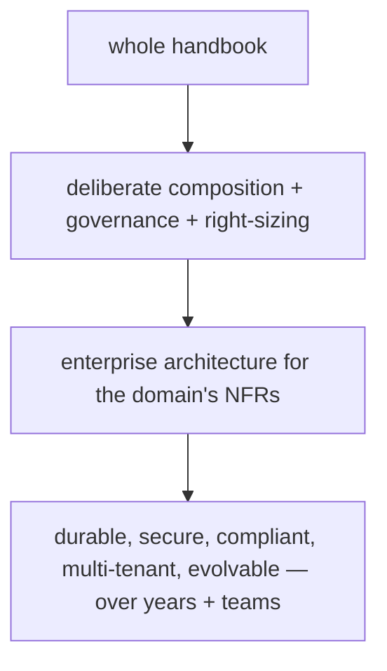

# Enterprise Integration (Capstone: A Full Enterprise Architecture)

> Assemble everything into a **documented enterprise architecture** for a realistic app (e.g., a **multi-tenant B2B tool**): a **modular monorepo** (feature packages over a shared `core`/`platform`, aligned to **team topology**) with **feature-first + Clean + DDD-in-the-core + MVVM**; **cross-cutting concerns** baked into core (**SSO auth + RBAC**, **audit**, **i18n/l10n**, **white-label theming**, **feature flags + env config**); **integrations** behind interfaces + **ACLs** (SSO, multi-backend via BFF, a legacy system); and the **supporting practices** (CI/CD, testing pyramid, monitoring/SLOs, governance/ADRs). Documented with **trade-offs, team mapping, and NFR coverage** — this is enterprise architecture as **deliberate composition of the whole handbook** for the domain's dominating requirements.

## Introduction

This module capstone composes the enterprise fundamentals, structure, cross-cutting concerns, and integrations into one coherent enterprise architecture + rationale — the "put it all together for enterprise" deliverable. It synthesizes the architecture band ([40](../40%20Clean%20Architecture/README.md)–[48](../48%20System%20Design/README.md)) + practices ([49](../49%20Testing/README.md)–[52](../52%20Monitoring/README.md)) + cross-cutting/integration into a documented whole.

## Why this concept exists

The enterprise pieces only deliver when **assembled + governed + documented** as one architecture that meets the dominating NFRs. This capstone provides that integrated exemplar, showing how structure + cross-cutting concerns + integrations + practices + team topology cohere — and cementing that enterprise architecture is composition + judgment, not invention.

## Real-world analogy

It's the **master plan for an airport**: the terminal layout (modular structure), the shared infrastructure (auth/security/signage = cross-cutting concerns), the connections to airlines/customs/ATC (integrations), the operations/safety/regulatory processes (CI-CD/testing/monitoring/governance), and the org chart running each zone (team topology) — all documented with trade-offs and how each requirement is met. One coherent, governed, evolvable system for decades of operation.

## Internal Working

```mermaid
flowchart TD
    NFRs[dominating NFRs: security/compliance/RBAC/i18n/multi-tenant/integration/reliability] --> Arch
    subgraph Arch [enterprise architecture]
      Structure[modular monorepo + feature-first + Clean + DDD-core + MVVM (team-aligned)]
      Cross[cross-cutting in core: SSO+RBAC, audit, i18n, white-label, flags/env]
      Integr[integrations behind interfaces+ACL: SSO, multi-backend(BFF), legacy]
      Practices[CI/CD + testing pyramid + monitoring/SLOs + governance/ADRs]
    end
    Arch --> Doc[document: trade-offs + team mapping + NFR coverage]
    Note[deliberate composition of the whole handbook for the domain's requirements]
```

- **1. Requirements + NFRs** ([enterprise_fundamentals.md](enterprise_fundamentals.md)): identify the app's dominating NFRs (e.g., multi-tenant B2B: security/compliance/audit, RBAC per role, SSO, i18n, white-label, multi-backend integration, reliability/SLOs, long-lived/multi-team). These **drive every decision**.
- **2. Structure** ([enterprise_architecture_and_structure.md](enterprise_architecture_and_structure.md)): **modular monorepo** — `app` (composition root) + **feature packages** (feature-first, Clean inside, **DDD in the complex core**, MVVM presentation) + **shared `core`/`platform`** (design system, auth, networking, config, i18n, contracts). **Aligned to team topology** (module ↔ team, CODEOWNERS), cross-feature via **contracts + DI**.
- **3. Cross-cutting concerns in core** ([cross_cutting_enterprise_concerns.md](cross_cutting_enterprise_concerns.md)): **SSO auth + RBAC** (server-authoritative, client-gated UX), **audit logging** (compliance), **i18n/l10n** (locales/RTL/currency), **white-label theming** (per-tenant tokens), **feature flags + remote config + env management** (redeploy-free, per-tenant/env). All shared injectable services used consistently.
- **4. Integrations behind interfaces + ACL** ([integration_and_case_studies.md](integration_and_case_studies.md)): **SSO** (OIDC/SAML → `AuthService`), **multiple backends via a BFF** (repositories hide topology), a **legacy system** wrapped in an **adapter/ACL** (+ strangler-fig migration), third-party vendors behind your interfaces — all in platform packages behind contracts; domain uninfected.
- **5. Supporting practices** ([49](../49%20Testing/README.md)–[52](../52%20Monitoring/README.md)/[Module 47](../47%20Scalable%20Applications/README.md)): **CI/CD** (incremental `melos --since`, signed builds, staged release), the **testing pyramid** (per-layer unit + widget/golden + few E2E, CI-gated), **monitoring** (crash-free rate + SLIs/SLOs + audit-adjacent telemetry), and **governance** (standards, lints, ADRs, reviews, ownership) — the operability + quality backbone.
- **6. Document (trade-offs + team map + NFR coverage)**: an **architecture doc** stating decisions + trade-offs (e.g., BFF vs direct; DDD scope; monorepo vs multi-repo), the **team↔module topology**, and **how each NFR is met** (RBAC→auth service + server; audit→audit service; i18n→l10n setup; multi-tenant→theming/config; reliability→monitoring/SLOs). ADRs record key choices.
- **The synthesis (the whole point)**: enterprise architecture = **deliberate composition + governance + right-sizing of the entire handbook** for the domain's dominating requirements — structure + cross-cutting + integrations + practices + team topology, documented. **Not new patterns** — mastery of choosing, combining, and governing them.
- **Right-sizing (still)**: DDD in the complex core only; grow modularization from feature-first; enterprise rigor where the NFRs warrant — governed and documented, not maximal everywhere.

## Memory Representation

Not runtime — a **documented architecture**: the package/module graph (feature packages + core/platform + contracts, team-mapped), the cross-cutting services, the integration boundaries (interfaces + ACLs), the practices (CI/CD/testing/monitoring/governance), and a decisions/ADR + NFR-coverage doc. A living blueprint evolving over the app's life.

## Compiler Behavior

Enforced package boundaries (deps + exports), framework-free domain (testable), lints/standards, incremental builds (melos) — all compile/build-enforced. Integrations compile against interfaces (adapters swappable). Governance partly enforced by tooling.

## Runtime Behavior

The app runs as one binary; DI composition root wires features + core + adapters at startup; RBAC gates UI (server enforces); i18n/theme resolve per locale/tenant; flags/config from remote; integrations (SSO/BFF/legacy) via adapters; monitoring reports health. Organization affects build/team/evolution; runtime = the composed system.

## Flutter Engine / Dart VM Behavior

Standard (per prior modules); modular packages enable incremental compilation; SSO may use platform webviews/deep links. Not internals-specific to the capstone.

## Examples

```text
Enterprise architecture (multi-tenant B2B) — the composed whole:
  NFRs: security/compliance/audit | RBAC per role | SSO | i18n | white-label | multi-backend | reliability/SLOs | multi-team/long-lived

  STRUCTURE (modular monorepo, team-aligned):
    apps/app (composition root)
    packages/core (design system, config/flags, i18n, logging/monitoring facades)
    packages/platform_auth (SSO + RBAC), platform_network (BFF + ACLs), contracts
    packages/feature_orders (DDD core), feature_billing, feature_admin  (Clean + MVVM inside)
    CODEOWNERS: team-commerce->orders, team-billing->billing, platform-team->core/platform

  CROSS-CUTTING (in core, used everywhere): SSO+RBAC (server-enforced) | audit | i18n/l10n | white-label theming | feature flags + env config
  INTEGRATIONS (interface+ACL, platform pkgs): SSO(OIDC/SAML)->AuthService | multi-backend->BFF | legacy->adapter (+strangler-fig) | third-party->interfaces
  PRACTICES: CI/CD (melos --since, signed, staged) | testing pyramid (CI-gated) | monitoring (crash-free + SLOs) | governance (standards/lints/ADRs/reviews)

  DOCUMENT: trade-offs (BFF vs direct; DDD scope; monorepo) + team topology + NFR coverage (RBAC/audit/i18n/tenant/reliability) + ADRs
```

```mermaid
flowchart LR
    Req[dominating NFRs] --> Structure2[modular structure (team-aligned)]
    Structure2 --> Cross2[cross-cutting in core]
    Cross2 --> Integr2[integrations via interfaces+ACL]
    Integr2 --> Practices2[CI/CD + testing + monitoring + governance]
    Practices2 --> Doc2[documented trade-offs + team map + NFR coverage]
```

## Diagrams



## Common Mistakes

| Mistake | Why it's a problem | Fix |
|---------|-------------------|-----|
| Not deriving from NFRs | Wrong/over-built architecture | Let dominating NFRs drive decisions |
| Consumer-app structure | Collapses under teams/years | Modular monorepo + feature-first + governance |
| Cross-cutting concerns bolted on | Expensive retrofit/gaps | Bake into core early (RBAC/audit/i18n/theming/flags) |
| External models leak into domain | Coupling to systems you don't control | Interface + ACL/adapter per integration |
| No testing/monitoring/CI-CD | Unreliable, un-evolvable | Pyramid + monitoring/SLOs + CI/CD |
| No governance / team↔module mapping | Incoherence/collisions | Standards/ADRs/ownership + Conway alignment |
| DDD/full modularization everywhere | Over-engineering | DDD in core; grow modularization; right-size |
| Undocumented decisions | Knowledge loss over years | Architecture doc + ADRs + NFR coverage |

## Best Practices

- **Derive the architecture from the dominating NFRs**; compose **structure** (modular monorepo + feature-first + Clean + DDD-core + MVVM, team-aligned) + **cross-cutting concerns in core** (SSO+RBAC, audit, i18n, white-label, flags/env) + **integrations behind interfaces+ACL** (SSO/BFF/legacy) + **practices** (CI/CD, testing pyramid, monitoring/SLOs, governance).
- **Bake cross-cutting concerns in early** and **enforce RBAC/audit server-side**; **isolate integrations** so the domain stays clean + swappable; **align modules to team topology** with ownership + governance.
- **Document** the architecture: decisions + **trade-offs**, **team↔module map**, **NFR coverage**, and **ADRs** — a living blueprint for years/teams.
- **Right-size**: DDD in the complex core, grow modularization from feature-first, enterprise rigor where NFRs warrant — it's **composition + governance + judgment**, not maximal everything.

## Performance

Not runtime — the payoff is **long-term organizational + system health**: many teams evolving a coherent, secure, compliant, multi-tenant app over years, with incremental builds, fast CI, safe releases, and observability. BFF reduces round-trips; monitoring/SLOs sustain reliability. Right-sizing avoids over-engineering cost.

## Advantages / Disadvantages

- **+** A durable, secure, compliant, multi-tenant, evolvable, team-scalable enterprise app; NFRs met; integrations clean; documented + governed; composition of proven patterns.
- **−** Substantial upfront + ongoing investment (structure/cross-cutting/integrations/practices/governance/docs); discipline required; over-engineering risk if NFRs don't warrant it.

## Interview Questions

1. **🟢 How do you architect an enterprise Flutter app end-to-end?** — Derive from dominating NFRs, then compose: modular monorepo + feature-first + Clean + DDD-core + MVVM (team-aligned); cross-cutting concerns in core (SSO+RBAC/audit/i18n/white-label/flags/env); integrations behind interfaces+ACL (SSO/BFF/legacy); practices (CI/CD/testing/monitoring/governance); documented with trade-offs + NFR coverage.
2. **🟢 What drives the architecture decisions?** — The dominating non-functional requirements (security/compliance/RBAC/i18n/multi-tenant/integration/reliability/longevity/multi-team) — not defaults or preferences.
3. **🟡 Where do cross-cutting concerns and integrations live?** — Cross-cutting concerns in shared core/platform services (used consistently, RBAC/audit server-enforced); integrations behind interfaces + ACLs in platform packages (domain uninfected, swappable).
4. **🟡 How do team topology and governance fit?** — Module boundaries align to teams (Conway's Law) with CODEOWNERS + contracts; governance (standards/lints/CI/ADRs/reviews) keeps a many-team codebase coherent over years.
5. **🟡 What supporting practices are essential?** — CI/CD (incremental, signed, staged), the testing pyramid (CI-gated), monitoring (crash-free + SLOs), and governance — the quality/operability backbone.
6. **🔴 Is enterprise architecture new patterns?** — No — it's the deliberate composition + governance + right-sizing of the whole handbook for the domain's requirements (DDD in the core only, grow modularization, rigor where warranted).
7. **🔴 Why document trade-offs, team mapping, and NFR coverage?** — For a long-lived, multi-team system, the rationale + ownership + how-each-requirement-is-met must be captured (ADRs/architecture doc) or knowledge/coherence is lost over years.

## Senior Engineer Tips

- Start from the NFRs and let them drive every choice; the enterprise anti-pattern is picking an architecture by habit and discovering the compliance/RBAC/i18n/integration requirements late and expensively.
- Compose + govern + document: the value you add as an architect is choosing which handbook patterns to combine, aligning them to teams, baking cross-cutting concerns in early, isolating integrations, and recording the trade-offs/NFR-coverage in ADRs — not inventing new patterns.
- Right-size relentlessly (DDD in the core, grow modularization, rigor where warranted); enterprise means governed rigor where the constraints justify it, not maximal complexity everywhere.

## Architect Perspective

This capstone is the culmination of the enterprise module and much of the handbook: an enterprise architecture is the **deliberate composition + governance + right-sizing of the whole toolkit** — modular structure, cross-cutting concerns, integrations, and engineering practices — **driven by the domain's dominating NFRs and aligned to team topology, then documented**. It's where architecture becomes an act of **judgment and synthesis** rather than pattern application: choosing what to combine, where to be rigorous, how teams map to modules, and how each requirement is met — producing a durable, secure, compliant, evolvable system for years and teams ([enterprise_fundamentals.md](enterprise_fundamentals.md), [Module 47](../47%20Scalable%20Applications/README.md), [Module 48](../48%20System%20Design/README.md), [Module 58](../58%20Senior%20Architect%20Notes/README.md)).

## Summary

- Enterprise architecture = derive from dominating NFRs, then compose structure (modular monorepo + feature-first + Clean + DDD-core + MVVM, team-aligned) + cross-cutting concerns in core (SSO+RBAC/audit/i18n/white-label/flags/env) + integrations behind interfaces+ACL (SSO/BFF/legacy) + practices (CI/CD/testing/monitoring/governance).
- Document trade-offs + team↔module topology + NFR coverage (ADRs); bake cross-cutting in early, enforce RBAC/audit server-side, isolate integrations, right-size (DDD in core, grow modularization).
- It's deliberate composition + governance + judgment of the whole handbook — not new patterns — yielding a durable, secure, compliant, evolvable, team-scalable app.

## Revision Notes

- Derive from dominating NFRs → compose: STRUCTURE (modular monorepo + feature-first + Clean + DDD-core + MVVM, team-aligned/CODEOWNERS, cross-feature contracts+DI) + CROSS-CUTTING in core (SSO+RBAC server-enforced, audit, i18n/l10n, white-label theming, feature flags + remote config + env/flavors) + INTEGRATIONS behind interfaces+ACL (SSO→AuthService, multi-backend→BFF, legacy→adapter+strangler-fig, third-party→interfaces) + PRACTICES (CI/CD melos-`--since`/signed/staged, testing pyramid CI-gated, monitoring crash-free+SLOs, governance standards/lints/ADRs/reviews).
- Document: trade-offs + team topology + NFR coverage + ADRs. Bake cross-cutting in early; isolate integrations; right-size (DDD in core, grow modularization, rigor where warranted). Enterprise = composition + governance + judgment of the whole handbook, not new patterns.

## Practice Questions

1. Walk an enterprise architecture from NFRs to documented design.
2. How do structure, cross-cutting concerns, integrations, and practices compose?
3. Why document trade-offs, team mapping, and NFR coverage?

## Coding Questions

1. Produce an enterprise architecture diagram + package/team map for a given app.
2. Show how one NFR (e.g., RBAC or multi-tenancy) is met across structure/cross-cutting/practices.
3. Write an ADR for a key decision (e.g., BFF vs direct backends).

## Mini Project

**Enterprise architecture doc (capstone — design):** For a hypothetical enterprise app (e.g., a multi-tenant B2B tool), produce a documented architecture: dominating NFRs; modular-monorepo structure (feature packages + core/platform + contracts, team↔module CODEOWNERS mapping, feature-first + Clean + DDD-in-core + MVVM); cross-cutting concerns in core (SSO+RBAC server-enforced, audit, i18n, white-label theming, feature flags + env config); integrations behind interfaces+ACL (SSO, multi-backend via BFF, a legacy adapter + migration); supporting practices (CI/CD, testing pyramid, monitoring/SLOs, governance/ADRs); and a trade-offs + NFR-coverage section. Acceptance: derived from NFRs; full composition (structure + cross-cutting + integrations + practices, team-aligned); RBAC/audit server-side; integrations isolated (ACL); documented trade-offs + team map + NFR coverage + ≥1 ADR; right-sized (DDD in core, grow modularization); presented as a coherent, governed, evolvable blueprint.
