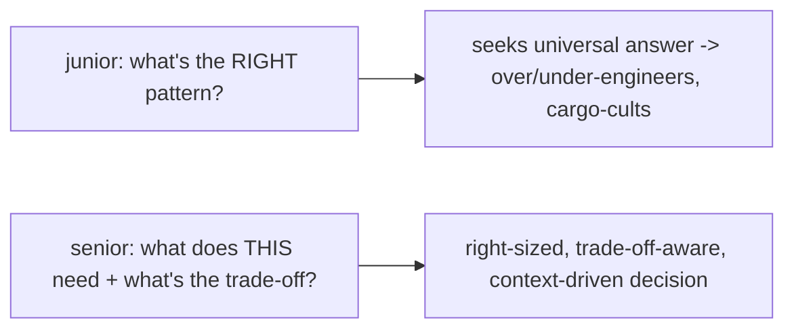

# Architectural Judgment

> The defining senior skill isn't knowing patterns — it's **judgment**: choosing the **right** approach **for this context**, which almost always means **"it depends" — followed by the deciding factors** (scale, team, lifespan, complexity, constraints, reversibility). Judgment shows up as **right-sizing** (enough architecture to serve the problem, no more — a `setState` counter and a modular monorepo are both correct *in context*), **valuing trade-offs over absolutes** (every choice costs something; name the cost), and **resisting dogma + hype** (patterns are tools, not rules; "best practices" are context-dependent). The junior asks "what's the right pattern?"; the senior asks "**what does this situation actually need, and what am I trading away?**"

## Introduction

This file articulates architectural judgment — the meta-skill underlying the whole handbook: context over dogma, right-sizing, trade-off thinking, and how it distinguishes seniority. It's the lens the rest of this module (and every prior module's "when to use" guidance) reflects.

## Why this concept exists

Knowledge without judgment produces **over-engineering** (Clean Architecture + DDD for a todo app), **under-engineering** (a god-widget monolith for a multi-team product), and **cargo-culting** (applying a pattern because it's "best practice," not because the context calls for it). Judgment is what turns a catalog of patterns into good decisions — and it's the hardest, most valuable thing to develop, because it can't be memorized, only cultivated through experience + deliberate reflection.

## Real-world analogy

Judgment is the difference between a **carpenter who owns every tool** and a **master builder who knows which tool for which job + what each choice costs**. Anyone can learn what a chisel does; the master knows *when* a chisel beats a router, when to build for a weekend vs a century, and that every material/technique trades cost against durability against speed. The tools (patterns) are prerequisites; the **judgment about applying them in context** is the craft.

## Internal Working

```mermaid
flowchart TD
    Problem[a decision to make] --> Context{gather context}
    Context --> Factors[deciding factors: scale, team, lifespan, complexity, constraints, reversibility]
    Factors --> RightSize[right-size: enough architecture to serve the problem, no more]
    Factors --> Tradeoffs[name the trade-offs: what does each option cost?]
    Tradeoffs --> Decide[decide + justify by CONTEXT, not dogma]
    Note[junior: "what's the right pattern?" | senior: "what does THIS need + what am I trading away?"]
```

- **"It depends" — with the factors (the senior answer)**: the honest answer to most architecture questions is **"it depends"** — but seniority is naming **what it depends on**: **scale** (users/data/features), **team** (size/count/experience), **lifespan** (throwaway vs decade), **complexity** (domain richness), **constraints** (compliance/perf/deadline/budget), **reversibility** (how hard to change later). A vague "it depends" is junior; **"it depends on X, Y, Z — and here's how each pushes the decision"** is senior.
- **Right-sizing (the core discipline)**: apply the **minimum architecture that serves the problem** — and recognize the minimum **varies by context**:
  - A prototype counter → `setState`; a multi-team enterprise app → modular monorepo + Clean + DDD-core ([Module 47](../47%20Scalable%20Applications/README.md)/[Module 57](../57%20Enterprise%20Projects/README.md)). **Both are correct** for their context.
  - **Over-engineering** (more than the problem needs) wastes effort + slows delivery; **under-engineering** collapses at scale. Judgment finds the fit — and **grows into** more structure as constraints appear (the handbook's recurring "right-size + grow into it").
- **Trade-offs over absolutes**: **every choice costs something** — consistency vs availability, flexibility vs simplicity, performance vs readability, speed-now vs maintainability-later. Seniority means **making trade-offs explicit + deliberate** ("we chose X, accepting Y") rather than seeking a mythical "best." There is rarely a free lunch or a universally right answer.
- **Patterns are tools, not rules; resist dogma + hype**:
  - "Best practices" are **context-dependent** — a practice ideal in one setting is over-engineering or wrong in another. **Understand the *why*** behind a pattern so you know **when it applies + when it doesn't**.
  - **Resist hype** (the newest state-management library, the trendiest architecture) — evaluate on **merit for your context**, not novelty ([staying_current_and_growth.md](staying_current_and_growth.md)).
  - **Cargo-culting** (copying a pattern without understanding why) is the failure judgment prevents.
- **Judgment is contextual + probabilistic, not algorithmic**: there's no formula; you weigh factors, accept uncertainty, make the best decision with available information, and **remain willing to revise** as you learn (esp. for reversible decisions — [decision_frameworks_and_tradeoffs.md](decision_frameworks_and_tradeoffs.md)).
- **How judgment develops** (it can't be memorized): **experience** (building + maintaining real systems, seeing decisions play out over time), **reflection** (post-mortems, "what would I do differently?"), **exposure** (many contexts/domains/scales), **mentorship** (learning others' reasoning — [leadership_and_mentorship.md](leadership_and_mentorship.md)), and **understanding fundamentals deeply** (the *why*, so you can reason from principles when the situation is novel). The handbook builds the knowledge; judgment comes from **applying + reflecting**.
- **The mindset shift (junior → senior)**: from **"what's the right/best pattern?"** (seeking a universal answer) to **"what does *this* situation need, given its constraints, and what am I trading away?"** (contextual reasoning). Seniors are comfortable with **"it depends," ambiguity, and trade-offs**; they optimize for the **actual problem**, not for looking sophisticated.

## Memory Representation

Not code — a **way of reasoning**: for any decision, gather context → identify deciding factors → right-size → name trade-offs → decide + justify by context → stay open to revision. The artifact is a **habit of contextual, trade-off-aware thinking**, not a fixed answer set.

## Compiler / Runtime / Engine / VM Behavior

Not applicable — judgment is a cognitive/decision skill. Its *outputs* (the chosen architectures/patterns) have all the compiler/runtime behavior detailed throughout the handbook; judgment is about **choosing among them well**.

## Examples

```text
"It depends" done right (senior) — pick a state-management approach:
  It depends on: app complexity, team familiarity, testability needs, and lifespan.
    trivial local UI + solo/short-lived   -> setState (right-sized)
    shared/async state + typical app       -> ChangeNotifier/Provider or Cubit (MVVM)
    complex/large + team fluent in it       -> Bloc/Riverpod
  Trade-off: more structure = more testable/scalable but more boilerplate.
  -> not "Bloc is best", but "here's what THIS context needs + the cost".

Right-sizing across contexts (all correct):
  weekend prototype     -> single file, setState, no tests
  typical app           -> feature-first + MVVM + repositories + pyramid tests
  multi-team enterprise -> modular monorepo + Clean + DDD-core + governance + full practices
  # over-engineering the prototype OR under-engineering the enterprise app = failure of judgment

Trade-offs are everywhere (name them):
  offline-first: available offline BUT sync/conflict complexity
  more layers:   testable/evolvable BUT more code + indirection
  ship-now hack: fast BUT tech-debt tax later
```

## Diagrams



## Common Mistakes

| Mistake | Why it's a failure of judgment | Fix |
|---------|-------------------------------|-----|
| Over-engineering (max architecture always) | Wastes effort, slows delivery | Right-size to the actual problem |
| Under-engineering (no structure at scale) | Collapses under teams/growth | Add structure as constraints warrant |
| Cargo-culting "best practices" | Applies patterns without context | Understand the *why*; apply when it fits |
| Chasing hype (newest = best) | Novelty over merit | Evaluate for your context |
| Seeking a universal "best" | There isn't one | Trade-offs + "it depends" + factors |
| Vague "it depends" | No reasoning shown | Name the deciding factors |
| Dogmatic rules | Context varies | Patterns are tools, not rules |
| Ignoring reversibility | Over-deliberates cheap-to-change decisions | Weigh cost of change (Module 2) |

## Best Practices

- Answer architecture questions with **"it depends" + the deciding factors** (scale, team, lifespan, complexity, constraints, reversibility) — never a dogmatic universal.
- **Right-size**: apply the **minimum architecture that serves the problem**, and **grow into** more structure as constraints appear — avoid both over- and under-engineering.
- Make **trade-offs explicit + deliberate** ("chose X, accepting Y"); treat **patterns as tools, not rules**; understand the ***why*** so you know when they apply — and **resist hype/cargo-culting**.
- **Optimize for the actual problem** (not sophistication); stay **comfortable with ambiguity + willing to revise** (esp. reversible decisions); develop judgment via **experience + reflection + fundamentals + mentorship**.

## Performance

Not runtime — judgment optimizes **decision quality + resource allocation**: right-sizing avoids wasted effort (over-engineering) and future collapse (under-engineering); trade-off awareness prevents costly blind spots. Good judgment is the highest-leverage "performance" — the difference between effort that compounds and effort that's wasted or backfires.

## Advantages / Disadvantages

- **+** Right-sized, context-appropriate decisions; effort where it matters; explicit trade-offs; resilient to hype/dogma; the core senior differentiator.
- **−** Can't be memorized (requires experience + reflection); inherently uncertain/probabilistic; "it depends" can frustrate those wanting a formula; risk of analysis paralysis if overdone (mitigated by reversibility thinking).

## Interview Questions

1. **🟢 What distinguishes senior architectural thinking from junior?** — Judgment: choosing the right approach for the context (right-sizing, trade-offs, "it depends" + factors) rather than seeking a universal "best pattern."
2. **🟢 Why is "it depends" the honest answer — and how do you make it senior?** — Because the right choice varies by context; make it senior by naming what it depends on (scale, team, lifespan, complexity, constraints, reversibility) and how each pushes the decision.
3. **🟡 What is right-sizing, and why does it matter?** — Applying the minimum architecture that serves the problem (varies by context); both over-engineering (wasted/slow) and under-engineering (collapses) are failures — right-sizing finds the fit and grows into structure as needed.
4. **🟡 Why are trade-offs central to architecture?** — Every choice costs something (consistency vs availability, flexibility vs simplicity, speed-now vs maintainability); seniority means making trade-offs explicit + deliberate rather than seeking a mythical free/best option.
5. **🟡 Why treat patterns as tools, not rules?** — "Best practices" are context-dependent; understanding the *why* lets you apply a pattern when it fits and avoid it when it doesn't — cargo-culting/dogma are failures of judgment.
6. **🔴 How does judgment develop?** — Through experience (building + maintaining real systems), reflection (post-mortems), exposure to many contexts, mentorship, and deep understanding of fundamentals — it's cultivated, not memorized.
7. **🔴 How do you avoid both over- and under-engineering?** — Right-size to the actual problem's constraints, make trade-offs explicit, weigh reversibility, and grow structure as scale/team/complexity genuinely demand it.

## Senior Engineer Tips

- Always answer "it depends" with the factors and the reasoning; the vague version signals uncertainty, but "it depends on scale/team/lifespan/reversibility, and here's how each pushes it" signals exactly the judgment being assessed.
- Right-size ruthlessly and name your trade-offs out loud ("we chose X, accepting Y because Z"); the two biggest senior failures are over-engineering for imagined future scale and picking patterns by fashion instead of fit.
- Cultivate judgment deliberately: understand the *why* behind every pattern (so you can reason from principles), reflect on how past decisions played out, and expose yourself to many contexts — knowledge is necessary but judgment is what makes you senior.

## Architect Perspective

Architectural judgment is the meta-skill the entire handbook exists to enable: knowledge of patterns, internals, and practices is the raw material, but **choosing the right approach for the context — right-sized, trade-off-aware, dogma-and-hype-resistant — is the craft**. Every module's "when to use / right-size / trade-offs" guidance was training this. Judgment is contextual, probabilistic, and cultivated (not memorized), and it's the clearest line between an implementer and an architect. The rest of this module — decision frameworks, leadership, growth — is judgment applied to deciding, communicating, and evolving ([decision_frameworks_and_tradeoffs.md](decision_frameworks_and_tradeoffs.md), [senior_architect_synthesis.md](senior_architect_synthesis.md), [Module 47](../47%20Scalable%20Applications/README.md)).

## Summary

- The defining senior skill is **judgment**: right approach for the context — "it depends" + the deciding factors (scale/team/lifespan/complexity/constraints/reversibility).
- **Right-size** (minimum architecture that serves the problem, grow into more), make **trade-offs explicit**, treat **patterns as tools not rules**, and **resist dogma/hype/cargo-culting**.
- Judgment is contextual, probabilistic, and **cultivated** (experience + reflection + fundamentals + mentorship) — the line between implementer and architect; the mindset shift is from "what's the best pattern?" to "what does *this* need + what am I trading away?"

## Revision Notes

- Judgment = choosing the right approach for the context; "it depends" + deciding factors (scale/team/lifespan/complexity/constraints/reversibility) — vague "it depends" = junior; factored = senior.
- Right-size (minimum architecture that serves the problem; over-engineering wastes/slows, under-engineering collapses; grow into structure). Trade-offs over absolutes (every choice costs; name it; no free/best universal). Patterns = tools not rules; understand the *why*; resist dogma/hype/cargo-culting.
- Contextual + probabilistic (no formula; revise, esp. reversible). Developed via experience + reflection + exposure + mentorship + fundamentals. Mindset shift: "best pattern?" → "what does THIS need + what's the trade-off?"; optimize the actual problem, comfortable with ambiguity.

## Practice Questions

1. Turn a vague "it depends" into a senior answer for a state-management choice.
2. Give an example of right-sizing across three contexts.
3. Name the trade-offs of a common architecture decision (e.g., offline-first, more layers).

## Coding Questions

1. For three app scenarios, right-size the architecture + justify by factors.
2. Write the explicit trade-off ("chose X, accepting Y because Z") for a decision.
3. Critique an over-engineered and an under-engineered design + correct each.

## Mini Project

**Judgment reflection (capstone-prep):** Write a short architectural-judgment reflection: pick 3 real decisions (yours or hypothetical), for each state the context + deciding factors, the right-sized choice, the trade-offs accepted, and (if reversible) how you'd revise — then articulate your personal rule for right-sizing + resisting dogma/hype. Acceptance: "it depends" answered with factors; right-sizing demonstrated across contexts; trade-offs made explicit per decision; patterns-as-tools + anti-dogma/hype stance; reflects the junior→senior mindset shift (what THIS needs + what's traded away).
