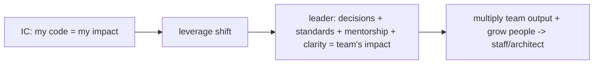

# Technical Leadership & Mentorship

> Senior impact is **multiplied through others**, not just your own code: **technical leadership** is **influence without authority** — earning trust via competence, **communicating decisions + the *why*** (docs/ADRs/diagrams), setting direction + standards, and enabling teams to do their best work. **Mentorship** grows others — pairing, code review as teaching, sharing reasoning (not just answers), and creating psychological safety. The shift is from **"I build features"** to **"I raise the whole team's output + capability"**: your leverage becomes the **decisions, standards, mentorship, and clarity** you provide, and success is measured by **the team's outcomes**, not your personal commit count.

## Introduction

This file covers the human/leadership side of seniority: influence, communication, setting standards, mentorship, and code review as teaching — the force-multiplier skills that distinguish a senior/architect beyond technical judgment ([architectural_judgment.md](architectural_judgment.md)).

## Why this concept exists

Past a certain level, an individual's direct output plateaus; **impact scales through the team**. The best technical decision is worthless if the team doesn't understand/adopt it; the best architect is limited if they don't grow others. Leadership + mentorship convert individual expertise into **organizational capability** — which is precisely what senior/staff/architect roles are hired + promoted for. Many strong engineers stall by staying purely individual contributors of code.

## Real-world analogy

A senior engineer transitioning to architect is like a **star player becoming a player-coach**: still skilled, but now their value is **making the whole team better** — calling the plays (direction/standards), explaining the strategy so everyone executes it (communication), and developing junior players (mentorship). A coach measured only by their own goals scored is missing the point; the **team's performance** is the measure.

## Internal Working

```mermaid
flowchart TD
    Senior[senior/architect] --> Influence[influence WITHOUT authority: trust via competence]
    Senior --> Communicate[communicate decisions + the WHY (docs/ADRs/diagrams)]
    Senior --> Standards[set direction + standards + guardrails]
    Senior --> Mentor[mentorship: pairing, teaching code review, sharing reasoning]
    Senior --> Safety[psychological safety + enabling autonomy]
    Influence & Communicate & Standards & Mentor & Safety --> Multiply[MULTIPLY the team's output + capability]
    Note[shift: "I build features" -> "I raise the team"; success = team outcomes]
```

- **Influence without authority (the core of tech leadership)**: seniors usually **lead without being anyone's boss**. Influence comes from **earned trust + demonstrated competence + good judgment**, not a title — you persuade via **clear reasoning + evidence + listening**, build consensus, and let the **best idea win** (not the loudest/most senior). Being right isn't enough; **bringing people along** is the skill.
- **Communication (the highest-leverage skill)**:
  - **Explain the *why*, not just the what** — decisions, trade-offs, direction (via ADRs, design docs, diagrams, talks). A decision the team doesn't understand won't be followed/maintained ([decision_frameworks_and_tradeoffs.md](decision_frameworks_and_tradeoffs.md)).
  - **Tailor to the audience** (engineers vs product vs execs); **translate** technical reality into business terms + vice versa.
  - **Write things down** — docs/ADRs/standards scale your knowledge across the team + time (esp. enterprise — [Module 57](../57%20Enterprise%20Projects/README.md)); verbal-only knowledge doesn't scale.
  - **Listen + ask questions** — leadership is dialogue, not broadcast.
- **Setting direction + standards** (guardrails, not handcuffs): establish **architecture direction, coding standards, and conventions** (enforced by lints/CI/ADRs/reviews — [Module 47](../47%20Scalable%20Applications/README.md)) that give the team a **shared way of working** + coherence, while leaving **autonomy** within the guardrails. Standards + a template/example are how you scale quality without micromanaging.
- **Mentorship (growing others)**:
  - **Pairing + shadowing**, **code review as teaching** (explain *why*, suggest not dictate, catch teachable moments — not just gatekeep), and **sharing your reasoning** (how you decided, not just the answer — teach the fishing).
  - **Sponsor + delegate**: give others stretch opportunities + ownership; **step back** so they grow (resist doing it yourself because it's faster).
  - **Meet people where they are**; adapt to junior vs mid vs senior mentees.
- **Psychological safety + culture**: create an environment where people can **ask questions, admit mistakes, disagree, and take risks** without fear — this is what actually enables learning, honesty, and good decisions. Model **humility + admitting your own unknowns/mistakes**; give **feedback kindly + specifically**; celebrate the team.
- **Code review as a leadership tool**: review to **teach + maintain quality + spread standards**, not to gatekeep or show off — be specific, kind, explain the *why*, distinguish must-fix from nit, and **approve when good enough** (perfectionism blocks flow). Reviews are a major channel for mentorship + coherence.
- **The leverage shift (IC → leader)**: from **"my code"** to **"the team's output + capability"** — your leverage becomes the **decisions, standards, mentorship, clarity, and unblocking** you provide. Success is measured by **team outcomes + the people you grew**, not personal commit count. This is the promotion path to staff/architect.
- **Balance**: seniors still stay **hands-on enough** to keep credibility + judgment sharp (don't become an ivory-tower architect disconnected from the code); it's **multiplying + building**, not only directing.

## Memory Representation

Not code — a **leadership practice**: influence (trust/reasoning), communication artifacts (ADRs/docs/diagrams), standards + guardrails, a mentorship approach (pairing/teaching review/reasoning-sharing/delegation), and a culture of psychological safety. The "output" is the team's capability + outcomes.

## Compiler / Runtime / Engine / VM Behavior

Not applicable — leadership/mentorship are human/organizational skills. Their technical outputs (standards → lints/CI, decisions → architecture) are realized across the handbook.

## Examples

```text
Influence without authority (persuade, don't command):
  weak:   "Use Bloc because I'm senior."
  strong: "Here's the problem, three options + trade-offs, and why I lean Bloc for our context —
           what am I missing?" (reasoning + evidence + listening -> consensus + best idea wins)

Communicate the WHY (scales the team):
  ADR/design doc + diagram explaining the decision, trade-offs, alternatives ->
  the team understands + maintains it (vs a verbal decree nobody remembers or follows)

Mentorship / code review as teaching:
  weak:   "Wrong. Change it." (gatekeeping)
  strong: "This works, but consider X because Y (trade-off). Here's how I'd reason about it." (teach the reasoning)
  + pairing, stretch assignments + ownership, sharing HOW you decided

Leverage shift: IC "I shipped feature X" -> leader "I set the direction/standards, unblocked + grew the team that shipped X, Y, Z"
```

## Diagrams



## Common Mistakes

| Mistake | Why it limits impact | Fix |
|---------|---------------------|-----|
| Leading by authority/title | Doesn't earn buy-in | Influence via trust/reasoning/listening; best idea wins |
| Deciding without explaining *why* | Team won't follow/maintain | Communicate the why (ADRs/docs/diagrams) |
| Verbal-only knowledge | Doesn't scale/persist | Write it down (docs/standards/ADRs) |
| Gatekeeping code review | Blocks flow, no teaching | Review to teach + maintain; approve when good enough |
| Giving answers, not reasoning | Doesn't grow others | Teach the reasoning (teach fishing) |
| Doing it yourself ("faster") | Others don't grow; you bottleneck | Delegate + sponsor + step back |
| No psychological safety | People hide mistakes, stop learning | Model humility; safe to ask/err/disagree |
| Ivory-tower architect | Loses credibility/judgment | Stay hands-on enough |

## Best Practices

- **Lead via influence, not authority**: earn trust through competence + judgment, persuade with **clear reasoning + evidence + listening**, build consensus, and let the **best idea win**.
- **Communicate the *why*** (ADRs/design docs/diagrams, tailored to the audience, written down) — decisions must be understood to be followed + maintained; set **direction + standards as guardrails** (enforced by lints/CI/ADRs) that leave autonomy.
- **Mentor to multiply**: pairing, **code review as teaching** (explain why, not gatekeep), **share your reasoning**, and **delegate + sponsor** stretch opportunities (step back so others grow).
- Create **psychological safety** (safe to ask/err/disagree; model humility + admit unknowns); **shift your leverage** from personal code to **team output + capability**, while staying **hands-on enough** to keep credibility.

## Performance

Not runtime — the "performance" is **team throughput + capability + quality**: clear decisions + standards + mentorship multiply many engineers' output and grow them, vastly exceeding any individual's direct contribution. Poor communication/gatekeeping/hoarding create bottlenecks; good leadership is the highest-leverage force multiplier in engineering.

## Advantages / Disadvantages

- **+** Multiplies team output + capability; scales knowledge (docs/standards); grows people; better decisions (consensus/best-idea); the path to staff/architect.
- **−** Requires soft skills (communication/empathy/patience) many engineers under-invest in; less direct coding; risk of ivory-tower disconnect or spreading too thin.

## Interview Questions

1. **🟢 What is technical leadership at senior level?** — Influence without authority: earning trust via competence, communicating decisions + the *why*, setting direction/standards, and enabling/multiplying the team — not commanding by title.
2. **🟢 Why is communicating the *why* the highest-leverage skill?** — A decision the team doesn't understand won't be followed or maintained; explaining rationale (ADRs/docs/diagrams) scales your knowledge across the team + time.
3. **🟡 How do you influence without authority?** — Through earned trust, clear reasoning + evidence, listening, and building consensus so the best idea wins — bringing people along, not just being right.
4. **🟡 How does mentorship multiply impact?** — By growing others' capability (pairing, teaching code review, sharing reasoning, delegating + sponsoring) so the whole team levels up — teaching the fishing, not giving fish.
5. **🟡 How should code review be used as a leadership tool?** — To teach + maintain quality + spread standards (specific, kind, explain the why, distinguish must-fix from nit, approve when good enough) — not to gatekeep or show off.
6. **🔴 What is the leverage shift from IC to leader?** — From "my code = my impact" to "decisions + standards + mentorship + clarity + unblocking = the team's impact"; success is measured by team outcomes + people grown, not personal commits.
7. **🔴 Why does psychological safety matter, and how do you create it?** — It enables learning/honesty/risk-taking/good decisions; create it by modeling humility (admitting unknowns/mistakes), giving kind specific feedback, and making it safe to ask/err/disagree.

## Senior Engineer Tips

- Optimize for team leverage: your most valuable output becomes clear decisions (with the *why* written down), good standards/guardrails, unblocking others, and growing people — not your personal commit count.
- Review code to teach and set standards, not to gatekeep; explain the reasoning, separate must-fix from nits, and approve when it's good enough — perfectionist gatekeeping kills team flow and morale.
- Delegate the work you could do faster yourself and stay hands-on enough to keep credibility; both are needed — grow others by giving real ownership, but don't become an ivory-tower architect disconnected from the code.

## Architect Perspective

Technical leadership + mentorship is where seniority's impact goes from **additive (your code)** to **multiplicative (the team's capability)**. Influence without authority, communicating the *why*, setting guardrails, and growing people convert individual expertise into organizational outcomes — the actual mandate of staff/architect roles. Combined with judgment ([architectural_judgment.md](architectural_judgment.md)) and decision frameworks ([decision_frameworks_and_tradeoffs.md](decision_frameworks_and_tradeoffs.md)), it's how an architect's thinking scales beyond what they can personally build — the human dimension of the senior-architect mindset ([senior_architect_synthesis.md](senior_architect_synthesis.md)).

## Summary

- Senior impact multiplies through others: **influence without authority** (trust/reasoning/listening), **communicate the *why*** (ADRs/docs/diagrams), set **direction + standards** (guardrails), and **mentor** (pairing/teaching review/sharing reasoning/delegating).
- Create **psychological safety** (model humility; safe to ask/err/disagree); use **code review to teach**, not gatekeep.
- The leverage shift: from "my code" to "team output + capability"; success = team outcomes + people grown — while staying hands-on enough.

## Revision Notes

- Tech leadership = influence WITHOUT authority (trust via competence/judgment, persuade with reasoning + evidence + listening, consensus, best idea wins). Communication = highest-leverage: explain the WHY (ADRs/docs/diagrams), tailor to audience, WRITE IT DOWN, listen.
- Standards/direction = guardrails (lints/CI/ADRs/template) + autonomy. Mentorship = pairing, code review as teaching (why, not gatekeep), share reasoning (teach fishing), delegate + sponsor + step back. Psychological safety = model humility/admit mistakes, safe to ask/err/disagree, kind specific feedback.
- Leverage shift IC→leader: "my code" → "decisions + standards + mentorship + clarity + unblocking = team's impact"; success = team outcomes + people grown (path to staff/architect); stay hands-on enough (avoid ivory tower).

## Practice Questions

1. How do you influence a technical decision without authority?
2. Why write down the *why*, and how does it scale the team?
3. What's the leverage shift from IC to leader, and how is success measured?

## Coding Questions

1. Turn a "because I said so" decision into a reasoned, consensus-building proposal.
2. Rewrite a gatekeeping code-review comment into a teaching one.
3. Draft a short team standard/convention + how you'd communicate + enforce it.

## Mini Project

**Leadership practice (capstone-prep):** Draft your leadership approach: how you influence without authority (a reasoned decision proposal example), how you communicate decisions (an ADR/design-doc + diagram habit), a set of team standards + how you'd enforce them (guardrails), a mentorship plan (pairing/teaching-review/delegation), and how you build psychological safety — plus the leverage shift you're targeting (IC → multiplier). Acceptance: influence-not-authority (reasoned proposal); communicate-the-why (written artifacts/diagrams); standards as guardrails + autonomy; mentorship that teaches reasoning + delegates; psychological-safety practices; explicit leverage shift to team outcomes + people grown; stays hands-on.
