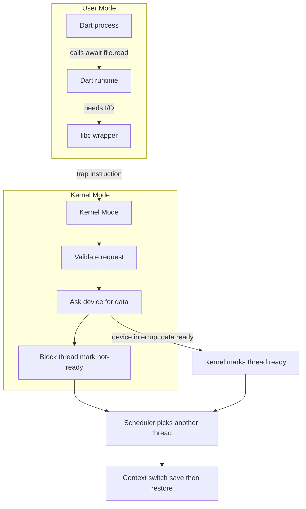
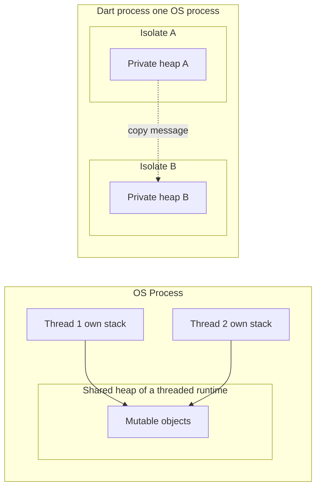
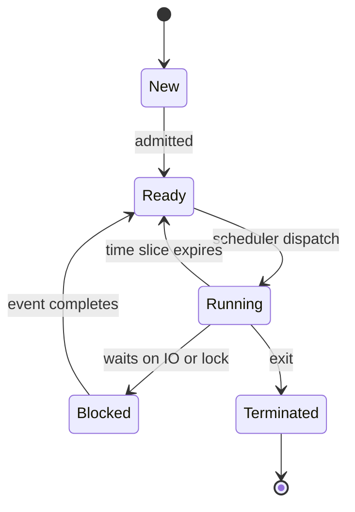

# Operating Systems & Concurrency

> An operating system is the privileged software layer that multiplexes finite hardware (CPU, memory, devices) across many programs, and concurrency is the discipline of structuring work so multiple logical flows can make progress without corrupting each other's state.

## Introduction

Every line of Dart you write eventually runs as machine instructions on a CPU that the operating system (OS) hands out in tiny slices. You never call the scheduler, you never flip the CPU into kernel mode, you never allocate a physical page — yet all of it happens on your behalf, constantly. Understanding this invisible layer is what separates an engineer who *uses* `async`/`await` from one who *knows why* Dart's concurrency model looks the way it does.

This chapter is platform-agnostic computer science first, and Dart-specific second. We build up from the kernel and syscalls, through processes and threads, into scheduling and the classic hazards of shared-memory concurrency (races, locks, deadlock), and only then explain the design decision at the heart of Dart: **isolates** — independent workers that never share mutable memory and communicate only by copying messages. That decision is not an accident or a limitation; it is a deliberate trade that eliminates entire categories of bugs the rest of this chapter will teach you to fear.

See also: [Dart isolates](../02%20Advanced%20Dart/04_isolates.md), [Dart event loop](../02%20Advanced%20Dart/01_event_loop.md), [Async & futures](../02%20Advanced%20Dart/02_async_futures.md).

## Why this concept exists

Hardware is singular and scarce; software demand is plural and unbounded. A single machine has a handful of CPU cores, one physical memory bus, and a fixed set of devices, yet users expect dozens of programs — plus the browser tab playing music, plus the OS itself — to run "at the same time." Something must arbitrate.

The OS exists to solve three problems that no single application can solve for itself:

1. **Multiplexing** — sharing one CPU and one memory across many programs so each *appears* to have the machine to itself (the illusion of a virtual machine per process).
2. **Protection** — stopping one buggy or malicious program from reading or corrupting another's memory, or from monopolizing the CPU.
3. **Abstraction** — turning messy, vendor-specific hardware (this exact SSD, that exact network card) into uniform, portable interfaces (files, sockets).

Concurrency, in turn, exists because *waiting is the common case*. Programs spend most of their life blocked on something slower than the CPU: disk, network, the user. If a program could only ever do one thing at a time and had to sit idle during every wait, both throughput and responsiveness would collapse. Concurrency lets a program (or the OS) overlap useful work with waiting. The moment you have overlapping flows touching shared data, you inherit the hazards — and the entire apparatus of locks, and the alternative of message passing, exists to manage those hazards.

## Real-world analogy

Think of a **professional kitchen**.

- The **OS is the head chef / kitchen manager** who owns the whole kitchen and decides who uses which station and for how long.
- The **CPU core is a cooking station** (there are only a few).
- A **process is a self-contained catering order** with its own dedicated pantry, cutting boards, and recipe binder — walled off from other orders so ingredients never get mixed up.
- **Threads are cooks working on the same order**, sharing that order's pantry and boards. Fast to coordinate, but if two cooks grab the same knife or the same bowl at once, chaos.
- A **context switch** is a cook stepping away from a station so another cook can use it: they must write down exactly where they were (save state) and read it back later (restore) — pure overhead that cooks nothing.
- **Isolates are separate food trucks**. Each truck has its own everything. They cannot reach into each other's pantry; if truck A needs a sauce from truck B, B *hands a copy* through the window. No shared bowl means no fight over a bowl — the entire class of "two cooks grabbed the same thing" bugs simply cannot occur.

Dart chose food trucks over cooks-sharing-a-pantry. The rest of this chapter is *why that trade is worth it*.

## Problem Statement

We want to run many logical activities on scarce hardware such that:

- Each activity makes forward progress (fairness, no starvation).
- Activities cannot corrupt each other's memory (isolation, protection).
- Interactive activities stay responsive even while others do heavy work (latency).
- Total useful work per second stays high (throughput).
- Shared data, when it exists, is never observed in a half-updated state (correctness under concurrency).

The naive approaches all fail:

- **One program, run to completion, then the next** — no responsiveness; a long task freezes everything.
- **Many OS threads sharing one heap** — fast communication, but exposes every data race, requires correct locking everywhere, and invites deadlock.
- **Many processes with no communication** — perfectly isolated but unable to cooperate.

The design space is a trade between **isolation** and **communication cost**. Dart's answer — isolates — sits deliberately toward the isolation end, and we will see exactly what it buys and what it costs.

## Internal Working

At boot, the CPU starts in **kernel mode** (also called supervisor/privileged mode) and hands control to the OS **kernel** — the always-resident core that manages memory, scheduling, and devices. The kernel then launches user programs, each running in **user mode**, a restricted state where privileged instructions (touching hardware, remapping memory) are forbidden.

A user program cannot directly read a file or open a socket. Instead it executes a **system call (syscall)**: it puts a request number and arguments in registers and executes a special trap instruction. The CPU switches to kernel mode, jumps to a fixed kernel entry point, the kernel validates and performs the operation, then returns to user mode. This mode transition is the *only* sanctioned door between your code and the hardware, and it is what makes protection possible: the kernel checks every request.

A **process** is the OS's unit of isolation: it owns a virtual address space (its private view of memory), open file descriptors, and at least one thread. A **thread** is the OS's unit of scheduling: a program counter plus a stack plus register state, representing one flow of execution. Threads within a process share that process's address space and file descriptors; processes share nothing by default.

The **scheduler** decides which ready thread runs on which core next. Because there are more threads than cores, it gives each a **time slice** (quantum), and when the slice expires — or the thread blocks on I/O — it performs a **context switch**: save the running thread's registers and program counter, pick another thread, restore *its* state. This is invisible to the program but costs real cycles (and, worse, cache and TLB churn).



The key insight: **your thread does not spin while waiting for the disk.** The kernel parks it, runs someone else, and wakes it when the device interrupts. Concurrency at the OS level is built on this park/wake cycle.

## Memory Representation

Each process gets a **virtual address space**: a contiguous-looking range of addresses that the CPU's memory management unit (MMU), directed by kernel-managed **page tables**, maps to scattered physical page frames (typically 4 KB each). Two processes can both use address `0x400000` and see completely different physical memory — that is isolation enforced by hardware.

A process's address space is conventionally laid out as:

| Region | Contents | Growth |
| --- | --- | --- |
| Text/code | Machine instructions (read-only) | Fixed |
| Data / BSS | Globals and statics | Fixed |
| Heap | Dynamically allocated objects | Grows up |
| Stacks | One per thread: locals, call frames, return addresses | Grows down |

The critical fact for concurrency: **threads in one process share the heap, code, and globals, but each thread has its own stack.** So thread-local data (locals) is safe by construction; shared heap objects are where races live.

Now the Dart mapping. A **Dart isolate has its own heap.** When you spawn a second isolate, it does *not* get a second stack in the same heap — it gets an entirely separate heap that the first isolate cannot address. There are no pointers across isolate boundaries. This is why Dart can garbage-collect each isolate independently, without stop-the-world coordination across isolates, and why sending data between isolates traditionally means **copying** (serializing the object graph into the receiver's heap). At the OS level this is still one process with multiple threads sharing one address space — but the Dart VM *refuses* to let two isolates name the same object, recreating process-like isolation inside a single process.

## Compiler Behavior

The Dart compiler and front end do not generate lock instructions, memory barriers, or thread-synchronization code the way a C++ or Java compiler must, because within a single isolate there is exactly one thread of execution — there is no shared mutable state to protect. This is a direct consequence of the language model: the compiler can assume that between two `await` points, no other Dart code in the same isolate can observe or mutate your variables. That assumption enables optimizations (it can keep values in registers across sequential statements without fear of another thread stomping them).

The compiler *does* transform `async`/`await` functions into state machines: an `async` function is rewritten so that each `await` becomes a suspension point where the function returns a `Future`, registers a continuation on the event loop, and resumes later. This is a compile-time transformation, not OS threading — the "concurrency" of a single isolate is cooperative and lives entirely in generated continuation code, not in kernel threads. See [Async & futures](../02%20Advanced%20Dart/02_async_futures.md).

For `SendPort.send`, the compiler emits an ordinary method call; the *copying* semantics are enforced by the runtime, not synthesized inline by the compiler.

## Runtime Behavior

At runtime, concurrency splits into two levels:

1. **Within an isolate** — cooperative, single-threaded. There is one **event loop** with a microtask queue and an event queue. Synchronous code runs to completion; then microtasks drain fully; then one event (timer, I/O completion, port message) is processed, which may schedule more microtasks, and so on. Nothing preempts your Dart code mid-statement. A `while (true) {}` will freeze that isolate forever because it never yields back to the loop. See [Dart event loop](../02%20Advanced%20Dart/01_event_loop.md).

2. **Across isolates** — each isolate is backed by its own OS thread (or is multiplexed by the VM's thread pool), scheduled *preemptively* by the OS. Two isolates on a multi-core machine genuinely run in parallel. They coordinate only through `SendPort`/`ReceivePort` message passing; the runtime copies the message payload into the destination isolate's heap (with special zero-copy fast paths for `TransferableTypedData` and, in newer Dart, immutable/shareable objects).

So a single Dart program combines **cooperative concurrency inside each isolate** with **preemptive parallelism between isolates**, and the OS scheduler underneath treats each isolate's thread like any other thread — giving it time slices, context-switching it, blocking it on I/O.

## Flutter Engine Behavior

Flutter's engine runs several **runner threads**, each an OS thread the platform scheduler manages independently:

| Engine thread | Runs | Notes |
| --- | --- | --- |
| Platform thread | Plugin/platform-channel code, engine setup | The OS "main" thread; must not be blocked |
| UI thread | Your Dart code + the root isolate + build/layout | One Dart isolate lives here |
| Raster thread | Rasterizing the layer tree via Skia/Impeller | GPU-facing |
| I/O thread | Asset and texture decode | Feeds the raster thread |

Your widgets' `build`, state, and business logic all run on the **UI thread's single root isolate** — cooperatively. If you do heavy synchronous work there, you block the event loop, miss the frame budget (~16 ms at 60 Hz), and the UI janks — because the raster thread has nothing new to draw or the UI thread never produced a frame. The OS is happily scheduling all four threads; the jank comes from *your* isolate monopolizing its one thread.

The fix is to offload heavy work to a **background isolate** (via `Isolate.spawn` or `compute`), which the OS schedules on a *different* core in parallel, leaving the UI thread free to keep hitting frames. See [Flutter threading model](../10%20Flutter%20Architecture/03_threading_model.md) and [Background services](../33%20Background%20Services/README.md).

## Dart VM Behavior

This is where the OS concepts and Dart converge. The Dart VM implements the isolate model as follows:

- **One mutator thread per isolate.** At any instant, at most one OS thread is executing Dart code for a given isolate. The VM may reuse threads from a pool, but the isolate's Dart code is never run by two threads simultaneously — so no in-isolate locking is required.
- **Separate heaps, independent GC.** Each isolate has its own new/old generation heap and its own garbage collector. Because no object is shared, one isolate's GC pause does not stop another isolate. This is the payoff of forbidding shared memory.
- **Event loop per isolate.** The VM drives each isolate's microtask and event queues (see [event loop](../02%20Advanced%20Dart/01_event_loop.md)).
- **Message passing by copy.** `SendPort.send(x)` deep-copies `x` into the receiver's heap (fast paths exist for typed data and `SendPort`s themselves). This is the message-passing model, not shared memory — trading communication cost for the elimination of races.
- **Isolate groups.** Modern Dart runs isolates spawned via `Isolate.spawn` in the *same isolate group*, sharing immutable program structures (code, class metadata) read-only while keeping mutable heaps separate. This slashes spawn cost and memory without reintroducing shared *mutable* state.

The mapping to the OS: an isolate ≈ a thread that behaves like a process. It uses OS threads for parallelism but adopts the *isolation discipline* of processes to stay safe.

## Examples

Offloading CPU-bound work to a background isolate so the main isolate's event loop stays responsive:

```dart
import 'dart:isolate';

// A pure, CPU-bound function: no shared state, only its argument.
int sumOfPrimes(int limit) {
  bool isPrime(int n) {
    if (n < 2) return false;
    for (var i = 2; i * i <= n; i++) {
      if (n % i == 0) return false;
    }
    return true;
  }

  var total = 0;
  for (var n = 2; n <= limit; n++) {
    if (isPrime(n)) total += n;
  }
  return total;
}

Future<void> main() async {
  // Dart 2.19+: run on a background isolate, get the result back by copy.
  final result = await Isolate.run(() => sumOfPrimes(2000000));
  print('Sum of primes: $result'); // main isolate never blocked
}
```

Manual isolate spawn with explicit message passing (the model made visible):

```dart
import 'dart:isolate';

void worker(SendPort toMain) {
  final port = ReceivePort();
  toMain.send(port.sendPort); // hand the main isolate a way to reply

  port.listen((message) {
    if (message is int) {
      toMain.send(message * message); // compute and copy result back
    } else if (message == 'stop') {
      port.close();
    }
  });
}

Future<void> main() async {
  final fromWorker = ReceivePort();
  await Isolate.spawn(worker, fromWorker.sendPort);

  SendPort? toWorker;
  await for (final msg in fromWorker) {
    if (msg is SendPort) {
      toWorker = msg;
      toWorker.send(9); // ask for 9 * 9
    } else if (msg is int) {
      print('Worker returned: $msg'); // 81
      toWorker!.send('stop');
      fromWorker.close();
    }
  }
}
```

Demonstrating that in-isolate async is cooperative, not parallel (no lock needed despite "concurrent" increments):

```dart
Future<void> main() async {
  var counter = 0;

  Future<void> bump() async {
    final local = counter;      // read
    await Future<void>.delayed(Duration.zero); // yield to event loop
    counter = local + 1;        // write
  }

  // These "run concurrently" but interleave only at await points.
  await Future.wait([bump(), bump(), bump()]);
  print(counter); // 1 -- classic lost update, but DETERMINISTIC and lock-free
}
```

The last example is subtle: even single-threaded cooperative code can have logical races *across* `await` points. The fix is to not straddle an `await` with a read-modify-write, not to add a mutex.

## Diagrams

Process vs thread vs isolate memory model:



Thread lifecycle as the OS scheduler sees it:



## Common Mistakes

**Mistake 1: Blocking the UI isolate with heavy synchronous work.**

```dart
// WRONG: parses a huge JSON string on the UI thread; frame is missed.
final data = jsonDecode(hugeString); // synchronous, seconds long
setState(() => _items = data);
```

```dart
// FIX: offload to a background isolate.
final data = await Isolate.run(() => jsonDecode(hugeString));
setState(() => _items = data);
```

**Mistake 2: Expecting a busy loop to "run in the background" without an isolate.**

```dart
// WRONG: async does NOT create a new thread; this freezes the isolate.
Future<void> crunch() async {
  var x = 0;
  for (var i = 0; i < 5000000000; i++) { x += i; } // never yields
}
```

```dart
// FIX: real parallelism needs another isolate.
Future<int> crunch() => Isolate.run(() {
  var x = 0;
  for (var i = 0; i < 5000000000; i++) { x += i; }
  return x;
});
```

**Mistake 3: Reasoning about isolates as if they shared memory.**

```dart
// WRONG: mutating a captured variable in the spawned closure does nothing
// to the original -- the value was COPIED into the other heap.
var config = {'level': 1};
await Isolate.run(() => config['level'] = 99); // change is lost
print(config['level']); // still 1
```

```dart
// FIX: return the new value and copy it back explicitly.
var config = {'level': 1};
config = await Isolate.run(() => {'level': 99});
print(config['level']); // 99
```

**Mistake 4 (general CS): the read-modify-write across a yield/await** — shown in the Examples section. The fix is to keep the critical read-modify-write synchronous (no `await` inside it), not to reach for a lock that Dart does not even provide for in-isolate code.

## Best Practices

- **Keep the UI isolate's event loop free.** Anything that runs longer than a few milliseconds and is CPU-bound belongs on a background isolate.
- **Prefer `Isolate.run` / `compute`** over manual `spawn` for one-shot work; reserve manual `ReceivePort` wiring for long-lived workers with ongoing message traffic.
- **Design messages as plain, immutable data.** Sending closures that capture large state or non-transferable objects will fail or copy expensively.
- **Batch messages.** Each `send` copies; chatty cross-isolate protocols pay repeated serialization cost. Send larger, fewer messages.
- **Use `TransferableTypedData` for large byte buffers** to move ownership instead of copying.
- **Never hold a resource while waiting for another that a peer holds** — the deadlock avoidance rule; even without OS locks, this applies to any request/response protocol between isolates.
- **Treat every `await` as a possible interleaving point** and never straddle it with a logical invariant that must hold atomically.

## Performance

- **Context switches are not free.** A switch costs on the order of 1–10 microseconds directly, but the real cost is indirect: cold CPU caches and a flushed TLB after switching address spaces. Process switches (address-space change) are pricier than thread switches (same space).
- **Isolate spawn cost** has fallen dramatically with isolate groups — from milliseconds and a fresh heap down to microseconds — because code and read-only structures are shared. Still, spawning per tiny task is wasteful; pool long-lived workers for high-frequency work.
- **Message copying is O(size of object graph).** Passing a 100 MB structure between isolates copies 100 MB. This is the price of no-shared-memory safety; mitigate with typed-data transfer or by keeping payloads small.
- **Parallel speedup is bounded by Amdahl's law.** If 90% of work parallelizes across isolates, maximum speedup is 10x no matter how many cores; the serial fraction (including message serialization) dominates at scale.
- **Cooperative scheduling has near-zero switching overhead within an isolate** — resuming a continuation is a function call, not a kernel trap — which is precisely why Dart handles thousands of concurrent `Future`s cheaply.

## Advantages

- **No data races within an isolate** by construction — the single largest source of concurrency bugs is eliminated, not merely mitigated.
- **No user-visible locks, mutexes, or memory barriers** in ordinary Dart code — simpler mental model, fewer deadlocks.
- **Independent GC per isolate** — no global stop-the-world across the whole program.
- **True parallelism available** via multiple isolates on multiple cores, without abandoning safety.
- **Fault isolation** — a crash or runaway loop in one isolate does not corrupt another's heap.

## Disadvantages

- **Communication costs a copy.** Shared-memory threading can hand off a pointer in nanoseconds; isolates must serialize. Data-heavy pipelines pay for it.
- **No shared caches or shared mutable singletons across isolates** — patterns that are trivial with threads require explicit message protocols or re-loading state per isolate.
- **More boilerplate for stateful workers** (ports, listen loops, lifecycle) than a shared-memory equivalent.
- **Not a silver bullet for logical races** — cooperative interleaving across `await` still allows lost updates; developers must still reason about atomicity.
- **Memory overhead** of duplicated state when the same data is needed in several isolates.

## Interview Questions

**Q1. What is the difference between user mode and kernel mode, and why does it exist? 🟢**
Kernel mode is a privileged CPU state that can execute any instruction and touch hardware; user mode is restricted and cannot. It exists for protection: application bugs or malware in user mode cannot directly corrupt other programs or the hardware. Crossing into kernel mode happens only through controlled syscall traps that the kernel validates.

**Q2. Process vs thread — give the one-line distinction and one consequence. 🟢**
A process is the unit of isolation with its own address space; a thread is the unit of scheduling within a process. Consequence: threads in a process share the heap (fast communication, but data races), whereas processes are isolated (safe, but must use IPC to talk).

**Q3. What exactly happens during a context switch and why is it costly? 🟡**
The scheduler saves the running thread's registers and program counter, selects another ready thread, and restores its state. Direct cost is small, but the switch cools CPU caches and — for a process switch — flushes the TLB, so subsequent memory accesses miss and stall. High switch rates thrash performance.

**Q4. Concurrency vs parallelism — are they the same? 🟢**
No. Concurrency is *structuring* work as independent flows that can be interleaved; it can happen on one core by time-slicing. Parallelism is *simultaneous execution* on multiple cores. You can have concurrency without parallelism (single-core time slicing) and the point of concurrency is to enable parallelism when cores are available.

**Q5. What is a race condition and what are the classic fixes? 🟡**
A race condition is when program correctness depends on the unpredictable timing of concurrent accesses to shared mutable state — e.g., two threads doing read-modify-write on a counter and losing an update. Fixes: mutual exclusion (mutex/lock), atomic operations, or eliminating sharing entirely (message passing / immutability). Dart takes the last route.

**Q6. Explain the four Coffman conditions for deadlock. 🔴**
Deadlock requires all four simultaneously: (1) *Mutual exclusion* — resources are non-shareable; (2) *Hold and wait* — a thread holds one resource while waiting for another; (3) *No preemption* — resources can't be forcibly taken; (4) *Circular wait* — a cycle of threads each waiting on the next. Break any one (e.g., impose a global lock ordering to kill circular wait) and deadlock is impossible.

**Q7. Mutex vs semaphore — when do you use which? 🟡**
A mutex enforces mutual exclusion for a critical section and has ownership — the locker must unlock. A counting semaphore tracks a count of available units and has no ownership — any thread may signal. Use a mutex to protect shared data; use a semaphore to limit concurrent access to N identical resources or to signal between threads.

**Q8. Why did Dart choose isolates instead of shared-memory threads? 🔴**
To make data races structurally impossible. With no shared mutable memory, there is nothing to lock, so no locks, no lock-ordering bugs, and no deadlock from data locks; each isolate also GCs independently. The trade is that inter-isolate communication requires copying messages instead of sharing pointers. Dart deemed eliminating a whole bug class worth the communication cost.

**Q9. If Dart is single-threaded per isolate, how does `async`/`await` achieve concurrency? 🟡**
`async`/`await` is *cooperative* concurrency on a single thread via the event loop. `await` suspends the function, returns a `Future`, and schedules a continuation; the event loop runs other ready work meanwhile and resumes the continuation when the awaited future completes. No OS thread is created — it is interleaving, not parallelism. See [event loop](../02%20Advanced%20Dart/01_event_loop.md).

**Q10. Can you still have a race in single-threaded Dart? 🔴**
Yes — a *logical* race across `await` points. If you read a value, `await`, then write based on the stale read, another interleaved task may have changed it, causing a lost update. It is deterministic (no OS preemption) but still a correctness bug. Fix by keeping the read-modify-write synchronous, not by locking.

**Q11. How do Flutter's engine threads map to the OS scheduler? 🟡**
Flutter runs platform, UI, raster, and I/O runner threads; each is an OS thread the platform scheduler time-slices and context-switches independently. Your Dart code and widget builds run in the root isolate on the UI thread. Blocking that isolate misses the frame budget and janks, even though the OS keeps scheduling all threads. See [Flutter threading model](../10%20Flutter%20Architecture/03_threading_model.md).

**Q12. What is Amdahl's law and why does it matter for isolate-based parallelism? 🔴**
Amdahl's law says maximum speedup is bounded by the serial fraction: if fraction s of the work is inherently serial, speedup ≤ 1/s regardless of core count. For isolates, message serialization and any coordination are serial overhead, so throwing more isolates at a problem yields diminishing returns once the serial and copy costs dominate.

## Senior Engineer Tips

- **Profile before parallelizing.** Spawning isolates for work that is dominated by I/O (already non-blocking via the event loop) adds copy cost without CPU gain. Isolates win for *CPU-bound* work.
- **Keep a warm isolate pool** for latency-sensitive repeated work; the amortized cost beats per-task spawn even with isolate groups.
- **Treat the message boundary as an API.** Version it, keep payloads schema-stable, and prefer immutable value objects to avoid copy surprises.
- **Watch for accidental large captures.** A closure sent to an isolate may drag in a big object graph; capture only what you need.
- **Use `SendPort` handshakes** for bidirectional workers, and always provide a `stop`/`close` protocol so ports and isolates are reclaimed.
- **Measure frame time, not CPU time**, when diagnosing jank — the OS may show low CPU while the UI isolate is starved by one long task.

## Architect Perspective

At system scale, the isolate model is a microcosm of the **shared-nothing architecture** that scales servers and distributed systems: independent units, no shared mutable state, communication by message. This is not coincidental — the same reasoning that makes actor systems (Erlang, Akka) resilient makes Dart isolates safe. When you design a Flutter app or a Dart backend, you are choosing where to draw isolation boundaries, and each boundary is a trade between safety/parallelism and communication cost — the identical trade an architect makes when splitting a monolith into services.

The architectural discipline: **put isolation boundaries where the communication is naturally coarse-grained** (a background sync job, an image pipeline, a compute worker) and *avoid* boundaries across chatty, fine-grained interactions (they will drown in serialization). This is the same "high cohesion, low coupling across boundaries" principle that governs module and service design. Concurrency choices are architecture choices.

## Summary

The OS multiplexes scarce hardware across many programs using processes (isolation) and threads (scheduling), protected by the user/kernel mode boundary and syscalls, and coordinated by a scheduler that time-slices and context-switches. Concurrency lets flows overlap work with waiting; parallelism runs them at once on multiple cores. Shared-memory concurrency is fast but exposes races, requiring locks and risking deadlock (the four Coffman conditions). Dart sidesteps this by choosing **isolates**: one thread per isolate, no shared mutable memory, communication by copied messages. Within an isolate, concurrency is cooperative via the event loop and `async`/`await`; across isolates, it is preemptive parallelism the OS schedules. Flutter layers this over platform/UI/raster/I/O engine threads. The result trades cheap pointer sharing for the structural elimination of data races — a trade that scales the same way shared-nothing architectures do.

## Revision Notes

- Kernel = always-resident core; kernel mode privileged, user mode restricted; syscall = the trap between them.
- Process = isolation unit (own address space); thread = scheduling unit (own stack, shared heap).
- Context switch = save/restore state; cost is mostly cache/TLB, not the save itself.
- Concurrency = interleaving structure; parallelism = simultaneous execution.
- Race = correctness depends on timing of shared-state access. Fixes: lock, atomic, or don't share.
- Deadlock needs all 4 Coffman conditions: mutual exclusion, hold-and-wait, no preemption, circular wait. Break one to prevent.
- Mutex = ownership + mutual exclusion; semaphore = count, no ownership.
- Dart isolate = thread that acts like a process: own heap, own GC, no shared mutable memory, message passing by copy.
- Within isolate: single-threaded, cooperative, event loop; `await` = suspension point; busy loop freezes it.
- Logical races still possible across `await` — keep read-modify-write synchronous.
- Flutter: platform/UI/raster/I-O threads; your code on UI-thread root isolate; block it → jank.
- Isolate groups make spawn cheap by sharing read-only code; mutable heaps stay separate.

## Practice Questions

1. Explain, in terms of park/wake, why a thread blocked on disk I/O does not waste CPU.
2. A program has 4 threads on a 2-core machine. Is it concurrent, parallel, or both? Justify.
3. Given a counter incremented by two threads without a lock, walk through an interleaving that loses an update.
4. For a system that deadlocks, identify which single Coffman condition you would break and how.
5. Why can two isolates never hold a reference to the same mutable object? Tie it to GC.
6. Describe a workload where isolates give no speedup and explain why.
7. Rewrite a read-modify-write-across-`await` bug to be correct without any lock.

## Coding Questions

1. Implement a `parallelMap<T, R>(List<T> items, R Function(T) f)` that splits the list across N isolates and merges results in order.
2. Build a long-lived "calculator" isolate that accepts `{op, a, b}` messages and replies with results over a `SendPort`, with a clean shutdown protocol.
3. Write a function that decodes a large JSON payload on a background isolate and returns a typed model, keeping `main` responsive.
4. Demonstrate a lost-update logical race in a single isolate, then fix it by restructuring around the `await`.
5. Implement a bounded worker pool of K reusable isolates that processes a queue of tasks and never spawns more than K at once.

## Mini Project

**Build a responsive image-processing pipeline in Flutter.**

Goal: a UI that stays at 60 fps while applying a CPU-heavy filter (e.g., a large convolution/blur) to a loaded image.

Requirements:
- A **worker isolate pool** (size = number of processor cores) that receives raw pixel buffers and returns filtered buffers using `TransferableTypedData` to avoid copies.
- The **UI isolate** must never block: a progress indicator animates smoothly throughout processing (prove it by animating a spinner while filtering a large image).
- A **message protocol** with request IDs so results route back to the correct pending `Future`, plus a graceful `dispose` that closes all ports and kills the isolates.
- Instrumentation: log per-frame build time on the UI isolate and total processing time, and show that offloading keeps frame time under budget versus a deliberately-wrong on-UI-thread version.

Stretch goals:
- Add Amdahl's-law measurement: chart speedup vs pool size and find the point of diminishing returns caused by serialization.
- Compare `Isolate.run` per-task versus a persistent pool and report the spawn-cost difference.

Cross-links: [isolates](../02%20Advanced%20Dart/04_isolates.md), [event loop](../02%20Advanced%20Dart/01_event_loop.md), [async & futures](../02%20Advanced%20Dart/02_async_futures.md), [threading model](../10%20Flutter%20Architecture/03_threading_model.md), [background services](../33%20Background%20Services/README.md).
