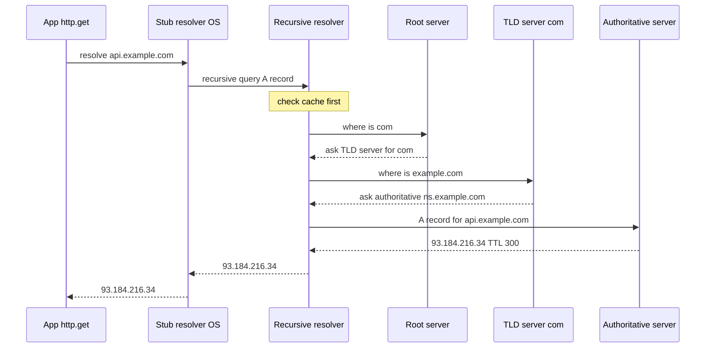
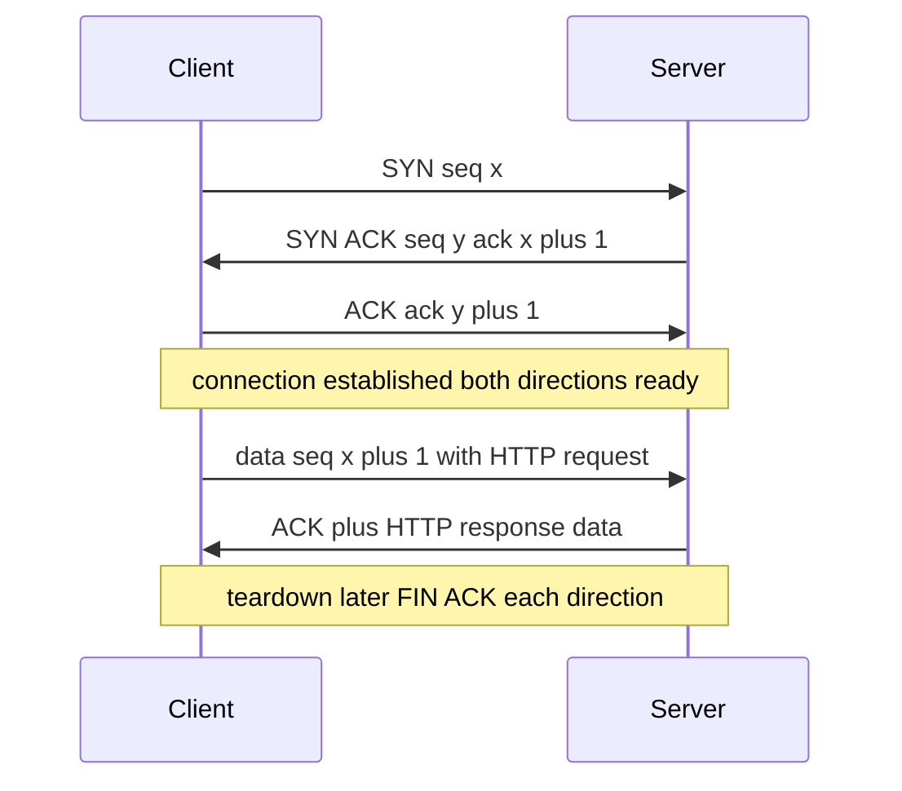
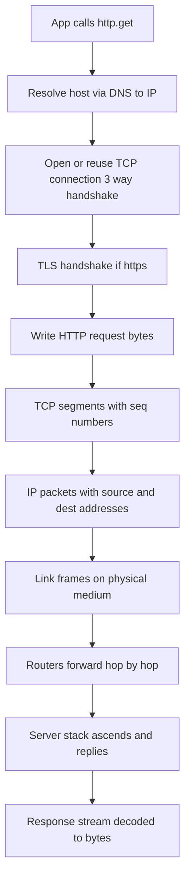
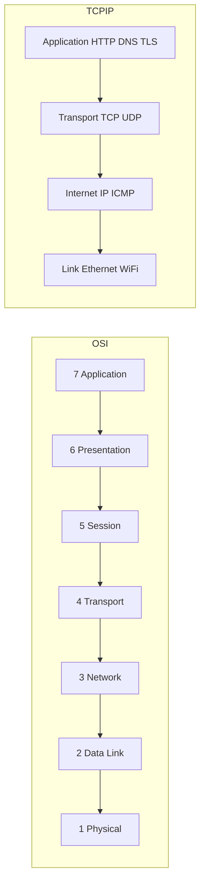

# Networking & DNS

> Networking is the layered set of protocols that turns a human-friendly request like `http.get('https://api.example.com')` into named-address lookups (DNS) and ordered, addressed packets (IP/TCP/UDP) that traverse physical links, while DNS is the distributed, cached, hierarchical directory that maps domain names to the IP addresses those packets need.

## Introduction

Every networked Flutter app — a weather widget, a chat client, a REST-backed dashboard — ultimately does one thing: it moves bytes between two machines that may be on opposite sides of the planet. Between the innocent-looking line `final res = await http.get(uri);` and the electrons on a fiber-optic cable sits one of the most carefully engineered systems humanity has built: a stack of cooperating protocols, each solving exactly one problem and hiding it from the layer above.

This chapter is deliberately **platform-agnostic computer science**. It is not about a particular HTTP client or a particular OS; it is about the invariants that hold whether you run on Android, iOS, Windows, Linux, or a browser. We start with *why* each layer exists (the WHY), then descend into *how* it works (the HOW): the OSI and TCP/IP models, IP addressing, the TCP-vs-UDP tradeoff, ports and sockets, the DNS resolution machinery, and finally the complete latency-accumulating journey of a single request.

You will leave able to answer, precisely: *What happens, in order, between `http.get` and the first byte on the wire?* — and to reason about why your app feels slow even when your server is fast.

Related reading:
- [Networking overview](../16%20Networking/README.md)
- [HTTP fundamentals](../16%20Networking/01_http_fundamentals.md)
- [HTTP and TLS](./04_http_and_tls.md)
- [Connectivity (device features)](../29%20Device%20Features/04_connectivity.md)

## Why this concept exists

Networking is layered for one dominant reason: **separation of concerns under change**. If a single monolithic protocol had to describe voltage levels on a wire, how to find a machine across the globe, how to recover a lost packet, and how to render a web page, then changing the physical medium (copper → fiber → 5G) would force rewriting everything above it. Layering means each layer only promises a narrow contract to the layer above and depends on a narrow contract from the layer below. Wi-Fi replaced Ethernet cables without HTTP noticing.

Concretely, the layers exist to solve distinct, independent problems:

- **Physical/Link layer** exists because raw hardware differs wildly — someone must turn bits into signals and deliver a frame to the *next hop* on the local network.
- **IP (the network layer)** exists because the internet is a network *of networks*; you need one global addressing scheme and a way to route a packet across many independent networks without any single machine knowing the whole map.
- **TCP/UDP (the transport layer)** exists because IP only promises *best-effort delivery of individual packets* — packets can be lost, duplicated, reordered, or corrupted. Applications need either reliability and ordering (TCP) or minimal-overhead speed (UDP).
- **DNS** exists because IP addresses are numeric, unmemorable, and *change* (a service moves data centers, scales to many servers). Humans and code want a stable name; DNS provides the indirection layer that decouples "who you want" from "where they currently are."
- **The application layer (HTTP, gRPC, etc.)** exists so that programs can agree on the *meaning* of the bytes once delivery is solved.

The deepest WHY: **indirection and abstraction let independent parts evolve independently.** DNS is indirection over addresses; IP is indirection over physical networks; TCP is an abstraction (a reliable byte stream) over an unreliable packet service. Master those three ideas and the rest is detail.

## Real-world analogy

Think of sending a physical letter internationally, which mirrors the stack almost perfectly:

- **You know a person's name, not their address.** You look them up in a phone book / directory — this is **DNS**. The directory is not one giant book; it is hierarchical: a national directory points to a regional one, which points to the local one that actually knows the street address.
- **The address (country, city, street, house number)** is the **IP address**. It is globally unique enough to route to, and structured hierarchically (country ≈ network prefix, house ≈ host).
- **The postal system's sorting and routing** is **IP routing**: no single post office knows the full route; each just forwards toward the destination region.
- **Registered mail with delivery confirmation, in-order numbered pages, and re-sending lost pages** is **TCP**. You number the pages (sequence numbers), the recipient signs for each batch (acknowledgements), and you resend anything that didn't arrive.
- **Dropping a postcard in a mailbox with no tracking** is **UDP**: cheap, fast, no guarantee it arrives or arrives in order — fine for "happy birthday," wrong for a legal contract.
- **The apartment number within a building** is the **port**: the building is the machine (one IP), and many tenants (services) live inside, each at their own door number.
- **RTT (round-trip time)** is how long a letter-and-reply takes; you can widen the truck (more **bandwidth**) but the truck still has to drive the distance (**latency**), and no amount of truck width shortens the road.

The letter-writing analogy also explains **caching**: once you've looked someone up, you write their address in your personal address book (**DNS cache with a TTL**) so you don't re-consult the national directory for every letter.

## Problem Statement

The problems this domain must solve, stated as engineering requirements:

1. **Addressing at global scale.** Uniquely identify billions of endpoints and route to any of them without a central map. → IP + hierarchical routing.
2. **Human-usable naming with late binding.** Let code target a stable name while the underlying address changes, and do it fast and resiliently. → DNS with caching and TTLs.
3. **Reliable transfer over an unreliable medium.** Deliver an ordered, complete byte stream even though the underlying packet service loses, reorders, and duplicates. → TCP (sequence/ack, retransmission, flow & congestion control).
4. **Cheap, low-latency messaging when reliability is optional.** → UDP.
5. **Multiplexing many conversations on one machine.** One host, one IP, thousands of simultaneous connections. → ports + the 4-tuple socket identity.
6. **Not blocking the app while the network is slow.** A phone's radio round-trip can take hundreds of milliseconds; the UI must stay responsive. → non-blocking I/O + an event loop (this is where Dart's `async`/`Future` connects to the OS).
7. **Predictable performance.** Understand where the milliseconds go: DNS lookup, TCP handshake, TLS handshake, RTT × number of round-trips, then bandwidth-limited transfer.

If you cannot map a network bug to one of these seven, you do not yet understand where it lives.

## Internal Working

A request descends the sending stack (each layer *encapsulates* the layer above by adding a header), crosses the network, and ascends the receiving stack (each layer *decapsulates*). Encapsulation is the mechanical heart of layering.

```
Application data          [ HTTP request bytes ]
+ TCP header       ->     [ TCP | HTTP bytes ]              (segment)
+ IP header        ->     [ IP | TCP | HTTP bytes ]         (packet/datagram)
+ Link header/trailer ->  [ Eth | IP | TCP | HTTP | CRC ]   (frame)
-> bits on the wire
```

**DNS first.** Before any TCP packet can be addressed, the name must become an IP. The resolver walks a hierarchy, usually with heavy caching so most lookups never leave the machine.



Key distinction: the **stub → recursive** query is **recursive** ("do all the work, give me the final answer"), while the **recursive resolver → root/TLD/authoritative** queries are **iterative** ("give me your best referral and I'll keep asking"). Root servers do not know the final answer; they only refer you downward. Each answer carries a **TTL**, which controls how long any cache may keep it.

**Then TCP** (for HTTP over TCP). A connection is established with the **3-way handshake** so both sides agree on starting sequence numbers before any data flows.



Inside TCP, four mechanisms provide the "reliable ordered stream" illusion:

- **Sequence numbers** label every byte so the receiver can reorder and detect gaps.
- **Acknowledgements (ACKs)** tell the sender what arrived; unacknowledged data is **retransmitted** after a timeout (RTO) or on duplicate ACKs (fast retransmit).
- **Flow control** (the receiver's advertised *window*) stops a fast sender from overrunning a slow receiver's buffer.
- **Congestion control** (slow start, congestion avoidance, e.g. Reno/CUBIC/BBR) stops senders from overrunning the *network*; the congestion window grows on success and collapses on loss. This is why a fresh connection starts slow and *ramps up* — the "slow start" cost is real for short-lived connections.

**IP** wraps each TCP segment with source/destination IP addresses and hands it to routing. Routers forward hop-by-hop using longest-prefix-match on the destination; TTL (hop limit) in the IP header prevents packets looping forever.

## Memory Representation

Networking touches memory in several concrete places worth visualizing:

- **IPv4 address:** a 32-bit unsigned integer, conventionally written as four dotted octets. `93.184.216.34` is `0x5DB8D822`. In Dart, `InternetAddress` exposes `.rawAddress` as a `Uint8List` — 4 bytes for IPv4, 16 for IPv6.
- **IPv6 address:** 128 bits, eight 16-bit groups in hex, with `::` compressing one run of zero groups. Vastly larger space (≈3.4×10³⁸) precisely because 32 bits (≈4.3 billion) ran out — the WHY behind IPv6.
- **Subnet mask / CIDR:** `10.0.0.0/24` means the top 24 bits are the *network* prefix and the low 8 bits identify hosts (256 addresses, 254 usable). The mask is a bitmask ANDed with an address to extract the network — pure bit manipulation.
- **Socket buffers:** each open socket owns kernel-side **send** and **receive** ring buffers. `write()` copies your bytes into the send buffer and returns; the kernel drains it onto the wire asynchronously. The receive buffer holds arrived-but-unread bytes; its free space *is* the flow-control window advertised to the peer.
- **The connection table:** the OS keeps a table keyed by the **4-tuple** `(srcIP, srcPort, dstIP, dstPort)` (plus protocol). This tuple *is* the identity of a connection — the same server port can serve thousands of clients because each connection differs in the client's `(IP, port)`.
- **Packet headers as structs:** a TCP header is a fixed 20-byte layout (ports, seq, ack, flags, window, checksum) plus options; IP headers similarly. Parsing is reading fixed offsets — no allocation, just field extraction.

In Dart specifically, incoming bytes surface as `List<int>` / `Uint8List` chunks delivered through a `Stream`; there is no single contiguous "message" buffer unless you assemble one, because TCP is a *stream*, not a *message* protocol.

## Compiler Behavior

**Not applicable — because networking is a runtime and operating-system concern, not a compile-time one.** The Dart compiler (whether AOT via `dart compile` for release Flutter, or the JIT/kernel path in debug) does not know or care about IP addresses, DNS, or sockets. It compiles calls to `dart:io` (`Socket`, `HttpClient`, `InternetAddress`) or `dart:html`/`package:web` (browser APIs) into ordinary function calls; the actual network work is delegated to native OS syscalls (or the browser) entirely at runtime.

The only compile-time-adjacent facts:
- The compiler resolves *which* library you imported (`dart:io` vs `dart:html`) and will fail to compile `dart:io` for the web target — a platform check, not a networking optimization.
- Constant folding may fold a constant URL string, but a hostname string is never resolved to an IP at compile time; DNS is inherently dynamic (the mapping can change minute to minute, which is the whole point of DNS).

So: no packet layout, no address, no handshake, and no retransmission logic is decided by the compiler. Everything meaningful about networking happens after the program is already running.

## Runtime Behavior

At runtime the defining characteristic is that **network I/O is non-blocking and event-loop driven**. When you call `Socket.connect(...)` you get back a `Future`; the calling isolate does *not* park on a blocked thread waiting for the SYN-ACK. Instead:

1. The runtime issues the non-blocking connect syscall (or the browser's async API).
2. Control returns immediately to the event loop, which is free to run other microtasks, animations, or handle other sockets.
3. When the OS signals the socket is writable/readable (via epoll/kqueue/IOCP under the hood), the runtime completes the `Future` or emits a `Stream` event, scheduling your `await`-continuation or listener onto the event loop.

This is why one Dart isolate can juggle thousands of concurrent connections without thousands of threads — the same reactor pattern Node.js uses. Latency is *hidden* by concurrency, not eliminated.

Runtime also owns everything the compiler could not:
- **DNS resolution** happens on demand; results are cached (OS and often resolver level) subject to TTL.
- **TCP retransmission, windowing, and congestion control** run in the OS kernel, invisible to your code — you only observe their *effects* (throughput ramping up, occasional stalls).
- **Backpressure** surfaces to you: writing to a `Socket` faster than the network drains it fills the send buffer; a well-behaved app respects `Sink` flow or uses `addStream` so it doesn't buffer unbounded data in the heap.
- **Timeouts and errors** (connection refused, host unreachable, DNS `SocketException`) are delivered as exceptions/rejected futures at runtime — never at compile time.

## Flutter Engine Behavior

Flutter itself has **no networking layer** — and that is a deliberate design fact worth stating. The Flutter engine (C++ with Skia/Impeller for rendering and the Dart runtime embedded) draws pixels and manages the platform embedding; it does *not* implement HTTP, TCP, or DNS. All networking flows through Dart libraries:

- On **native targets** (Android/iOS/desktop), `dart:io` sockets are backed by the OS network stack. The Dart runtime that the engine embeds uses the platform's non-blocking socket APIs and integrates their readiness notifications into the Dart event loop. The UI thread is not blocked because the actual `send`/`recv` happen off the platform's main path and completions are posted back as events.
- On **web**, `dart:io` is unavailable. `package:http` uses a browser-backed client that calls `fetch`/`XMLHttpRequest`; the *browser* owns DNS, TCP, TLS, connection pooling, and even enforces CORS and the same-origin policy. Your Dart code cannot open a raw TCP socket in a browser at all — a hard platform constraint, not a bug.

Practical consequence for Flutter engineers: because heavy networking and JSON decoding compete with the UI on the same isolate's event loop, **large response parsing should move to a background isolate** (e.g. `compute` / `Isolate.run`) so frame rendering (the engine's 16 ms budget at 60 Hz) is not starved. The network wait is free; the *CPU* to parse the result is not.

## Dart VM Behavior

The Dart VM (and AOT runtime) provides the concrete machinery:

- **`dart:io` sockets map to OS sockets.** `Socket`, `ServerSocket`, `RawSocket`, and `RawDatagramSocket` are thin, safe wrappers over the platform's BSD-style socket API. `RawSocket`/`RawDatagramSocket` expose the raw readiness events (`RawSocketEvent.read`, `.write`, `.closed`); `Socket` is the higher-level `Stream<Uint8List>` + `IOSink` convenience built on top.
- **Everything is a `Future` or `Stream`.** `Socket.connect` → `Future<Socket>`; incoming data → `Stream<Uint8List>` you `listen` to or `await for` over. This is the VM surfacing the OS's async readiness through Dart's event-loop concurrency model.
- **The VM's event loop bridges OS notifications.** Internally the VM runs an event-handler thread that uses epoll/kqueue/IOCP and posts completion messages to the isolate's message queue; your `async` continuations run when the isolate processes them. No user thread blocks on a socket.
- **`InternetAddress.lookup` triggers real DNS** via the platform resolver (which itself consults the OS cache, `/etc/hosts` or equivalent, then the configured recursive resolver). It returns `Future<List<InternetAddress>>` — plural because a name commonly has multiple A/AAAA records for redundancy and load balancing.
- **`HttpClient`** (in `dart:io`) implements HTTP/1.1 in Dart on top of sockets, including **connection pooling / keep-alive** — reused idle connections skip the DNS+TCP+TLS setup entirely, which is the single biggest client-side latency win.
- **Isolates and sockets:** a socket belongs to the isolate that created it; you cannot share a live `Socket` object across isolates (only send bytes via messages). Each isolate has its own event loop.

## Examples

All examples are null-safe and lint-clean. They use only `dart:io` and `dart:async` (native targets).

```dart
import 'dart:async';
import 'dart:convert';
import 'dart:io';

/// 1) DNS resolution: turn a hostname into one or more IP addresses.
///    Returns plural results — most real hosts have several A/AAAA records.
Future<void> resolveHost(String host) async {
  try {
    final List<InternetAddress> addresses = await InternetAddress.lookup(host);
    for (final InternetAddress addr in addresses) {
      final String family =
          addr.type == InternetAddressType.IPv6 ? 'IPv6' : 'IPv4';
      stdout.writeln('$host -> ${addr.address} ($family)');
    }
  } on SocketException catch (e) {
    stderr.writeln('DNS lookup failed for $host: ${e.message}');
  }
}

/// 2) Raw TCP socket: connect, send a minimal HTTP/1.1 request, read the reply.
///    Demonstrates the byte-stream nature of TCP and non-blocking reads.
Future<void> rawTcpRequest(String host, {int port = 80}) async {
  Socket? socket;
  try {
    socket = await Socket.connect(
      host,
      port,
      timeout: const Duration(seconds: 5),
    );
    stdout.writeln(
      'Connected ${socket.remoteAddress.address}:${socket.remotePort} '
      'from local port ${socket.port}',
    );

    // TCP has no message boundaries, so we frame the request ourselves
    // per the HTTP/1.1 spec (CRLF line endings, blank line ends headers).
    socket.write(
      'GET / HTTP/1.1\r\n'
      'Host: $host\r\n'
      'Connection: close\r\n'
      '\r\n',
    );

    // Data arrives as a Stream of byte chunks, not one blob.
    final StringBuffer response = StringBuffer();
    await for (final List<int> chunk in socket) {
      response.write(utf8.decode(chunk, allowMalformed: true));
    }
    final String statusLine = response.toString().split('\r\n').first;
    stdout.writeln('Status line: $statusLine');
  } on SocketException catch (e) {
    stderr.writeln('TCP error: ${e.message}');
  } finally {
    await socket?.close();
  }
}

/// 3) HttpClient: the realistic client with connection pooling / keep-alive.
Future<void> httpClientRequest(Uri uri) async {
  final HttpClient client = HttpClient()
    ..connectionTimeout = const Duration(seconds: 10);
  try {
    final HttpClientRequest request = await client.getUrl(uri);
    final HttpClientResponse response = await request.close();
    stdout.writeln('HTTP ${response.statusCode} for $uri');

    final String body = await response.transform(utf8.decoder).join();
    stdout.writeln('Received ${body.length} chars');
  } on SocketException catch (e) {
    stderr.writeln('Network error: ${e.message}');
  } on HttpException catch (e) {
    stderr.writeln('HTTP error: ${e.message}');
  } finally {
    // force: false lets pooled keep-alive connections drain gracefully.
    client.close(force: false);
  }
}

/// 4) UDP: connectionless datagrams — no handshake, no delivery guarantee.
Future<void> udpSend(String host, int port, String message) async {
  final RawDatagramSocket socket =
      await RawDatagramSocket.bind(InternetAddress.anyIPv4, 0);
  try {
    final List<InternetAddress> targets = await InternetAddress.lookup(host);
    final int sent =
        socket.send(utf8.encode(message), targets.first, port);
    stdout.writeln('Sent $sent bytes via UDP (fire and forget)');
  } finally {
    socket.close();
  }
}

Future<void> main() async {
  await resolveHost('example.com');
  await httpClientRequest(Uri.parse('http://example.com/'));
  await rawTcpRequest('example.com');
}
```

Notes tying back to theory: in example 2 the manual CRLF framing shows that TCP delivers *bytes*, not *messages* — HTTP must impose its own structure. Example 3's `HttpClient` transparently reuses connections, skipping repeat DNS/TCP/TLS. Example 4 has no `connect`/handshake because UDP is connectionless.

## Diagrams

Layered encapsulation and the descent from `http.get` to packets:



OSI-to-TCP/IP layer mapping and where each concept lives:



## Common Mistakes

- **Treating TCP as message-oriented.** One `write` does not equal one `read` on the peer. Data can arrive coalesced or split across chunks. You *must* implement framing (length-prefix or delimiter). Beginners who "read once and parse" get truncated or merged messages under real load.
- **Hardcoding IP addresses instead of names.** Defeats DNS's entire purpose; when the server moves, your app breaks. Always target the hostname and let DNS + TTL do late binding.
- **Ignoring that a name resolves to *multiple* addresses.** Using only `addresses.first` and not failing over to the next on connection error hurts resilience.
- **Not setting timeouts.** Without `connectionTimeout` / operation timeouts, a black-holed network hangs your future forever.
- **Blocking the event loop with parsing.** The network wait is async and free, but decoding a 20 MB JSON on the UI isolate janks frames. Move heavy CPU to `Isolate.run`.
- **Assuming more bandwidth fixes latency.** A chatty protocol doing many sequential round-trips is limited by RTT, not by Mbps. Adding bandwidth changes nothing.
- **Creating a new `HttpClient` per request.** Discards the connection pool, forcing a fresh DNS+TCP+TLS every time. Reuse one client.
- **Forgetting UDP has no guarantees.** Using UDP where you actually need reliability, then reinventing (badly) what TCP already does.
- **Leaking sockets.** Not `close()`-ing sockets/clients exhausts file descriptors and ephemeral ports.

## Best Practices

- **Reuse connections.** Keep one `HttpClient` (or `package:http` `Client`) alive for the app's lifetime; keep-alive amortizes setup cost.
- **Always set timeouts** on connect and on the overall operation; degrade gracefully.
- **Frame your protocol explicitly** over raw sockets (length prefix is simplest and robust).
- **Prefer names, honor TTLs, and cache DNS at the platform level** — do not roll your own long-lived DNS cache that ignores TTL (you will pin a dead IP).
- **Fail over across returned addresses** and prefer IPv6/IPv4 appropriately (Happy Eyeballs) when both exist.
- **Batch and pipeline** to reduce round-trips; combine requests, use HTTP/2 multiplexing where available to beat head-of-line RTT costs.
- **Handle backpressure**: use `addStream`/respect the sink rather than buffering unbounded outbound data.
- **Wrap all network calls in typed error handling** (`SocketException`, `HttpException`, `TimeoutException`) and surface actionable errors to the UI.
- **Move heavy decode off the UI isolate.**
- **Use TLS (`https`)** for everything; treat plaintext as a debugging-only exception. See [HTTP and TLS](./04_http_and_tls.md).

## Performance

Client-perceived latency for a *fresh* HTTPS request is a sum of largely serial costs, each roughly one or more RTTs:

1. **DNS lookup:** 0 if cached; otherwise up to a full recursive walk (tens to hundreds of ms cold).
2. **TCP 3-way handshake:** ~1 RTT.
3. **TLS handshake:** ~1 RTT (TLS 1.3) or ~2 RTT (TLS 1.2); 0-RTT resumption possible.
4. **Request/response:** ≥1 RTT for the first byte, then **bandwidth-limited** transfer of the body.

The governing intuitions:
- **Latency vs bandwidth are orthogonal.** Latency (RTT) is the *distance/time* to first byte; bandwidth is *bytes/second* once flowing. Small, chatty requests are latency-bound; large downloads are bandwidth-bound. `time ≈ RTT × round_trips + size / bandwidth`.
- **Round-trips dominate small requests.** Cutting the number of RTTs (connection reuse, TLS resumption, HTTP/2, pipelining, DoH caching) beats any bandwidth upgrade.
- **TCP slow start taxes short connections.** A new connection can't use full bandwidth immediately; the congestion window ramps. Long-lived reused connections avoid re-paying this.
- **Mobile radios add latency.** Cellular can add hundreds of ms and wake-up latency; fewer, larger transfers are radio-friendly and battery-friendly.
- **DNS caching is the cheapest win** — a warm cache turns step 1 into ~0.

Measure with these buckets (DNS / connect / TLS / TTFB / download); optimize the biggest, not the loudest.

## Advantages

- **Layering enables independent evolution** — physical media, IP versions, and app protocols change without rewriting the whole stack.
- **DNS decouples names from addresses**, enabling load balancing, failover, CDNs, and zero-downtime migrations.
- **TCP gives a simple, reliable ordered-stream abstraction**, so most app code never thinks about loss or reordering.
- **UDP gives a minimal-overhead option** for latency-critical or broadcast use (DNS itself, VoIP, games, QUIC).
- **Ports/sockets multiplex** thousands of conversations per host cheaply.
- **Non-blocking, event-loop I/O** lets a single Dart isolate handle massive concurrency without thread-per-connection cost.
- **Global, decentralized, resilient** — no single point of failure in routing or DNS root operation.

## Disadvantages

- **Layering adds header overhead and latency** (each layer's header + processing); abstractions can hide costs you must still pay.
- **TCP's reliability costs round-trips** (handshake, ACKs, slow start) and suffers **head-of-line blocking** — one lost packet stalls the whole stream (a key motivation for QUIC/HTTP/3 over UDP).
- **DNS caching can serve stale data** until TTL expires; misconfigured TTLs cause either slow propagation or excessive lookups.
- **DNS is a security/privacy weak point** — plaintext queries are observable and spoofable, motivating DNSSEC and DNS-over-HTTPS (DoH) / DNS-over-TLS.
- **NAT breaks end-to-end addressing**, complicating peer-to-peer and requiring workarounds (STUN/TURN, hole punching).
- **IPv4 exhaustion** forced NAT and the slow, still-incomplete IPv6 migration.
- **Latency is bounded by physics** (speed of light); no protocol removes the propagation delay of distance.

## Interview Questions

**Q1. Explain the TCP 3-way handshake and why 3 messages are needed. 🟢**
SYN (client picks ISN x) → SYN-ACK (server acks x, picks ISN y) → ACK (client acks y). Three messages are the minimum for *both* sides to exchange and confirm an initial sequence number, guaranteeing both directions are established and stale duplicate SYNs are rejected. Two messages can only confirm one direction.

**Q2. TCP vs UDP — when would you choose UDP? 🟢**
TCP gives reliable, ordered, congestion-controlled byte streams (HTTP, file transfer, email). UDP is connectionless, unreliable, unordered, low-overhead. Choose UDP when timeliness beats completeness or you build your own reliability: DNS queries, VoIP/video, gaming, and QUIC (which layers reliability + multiplexing over UDP to avoid TCP head-of-line blocking).

**Q3. Walk through what happens from `http.get('https://api.example.com/x')` to bytes on the wire. 🟡**
Parse URL → resolve `api.example.com` via DNS (cache → recursive resolver → root → TLD → authoritative) to an IP → open or reuse a TCP connection (3-way handshake) → TLS handshake for `https` → write the HTTP request framed with CRLFs → TCP segments the bytes with sequence numbers → IP adds addresses → link layer frames it → routers forward hop-by-hop → server ascends the stack, replies → response arrives as a byte stream, decoded to your `Response`.

**Q4. Recursive vs iterative DNS queries — who does which? 🟡**
The stub resolver sends a *recursive* query to the recursive resolver ("give me the final answer"). The recursive resolver performs *iterative* queries to root, TLD, and authoritative servers, each returning a referral rather than the final answer, until the authoritative server returns the record.

**Q5. What is a TTL in DNS and what tradeoff does it encode? 🟡**
TTL is how long any cache may retain a record. High TTL → fewer lookups, faster, but slow propagation when the record changes. Low TTL → fast failover/changes but more query load and latency. It's the classic freshness-vs-cost caching tradeoff.

**Q6. Difference between latency and bandwidth; which limits a chatty API? 🟡**
Latency (RTT) is time-to-first-byte / round-trip delay; bandwidth is throughput (bytes/s). A chatty API doing many sequential round-trips is latency-bound — more bandwidth won't help; reducing round-trips will.

**Q7. How does one server port serve thousands of clients simultaneously? 🟡**
A connection is identified by the 4-tuple `(srcIP, srcPort, dstIP, dstPort)`. The server's `(IP, port)` is fixed, but each client differs in its `(IP, port)`, so every connection is a distinct tuple in the OS connection table.

**Q8. What is NAT and what problem does it create? 🔴**
NAT maps many private (RFC 1918) addresses to one public IP by rewriting addresses/ports, conserving IPv4. It breaks end-to-end addressing: inbound connections can't reach an internal host without port forwarding, complicating P2P (needing STUN/TURN/hole punching).

**Q9. Why can TCP suffer head-of-line blocking and how does HTTP/3 address it? 🔴**
TCP delivers a single ordered byte stream; one lost segment stalls delivery of all subsequent bytes even for independent HTTP/2 streams multiplexed on it. HTTP/3 runs over QUIC (UDP), giving independent streams so loss in one doesn't block others.

**Q10. How does Dart handle network I/O without blocking threads? 🔴**
`dart:io` sockets are non-blocking; the VM uses OS readiness notifications (epoll/kqueue/IOCP) on an event-handler thread and posts completions to the isolate's event loop. `Socket.connect` returns a `Future`, data arrives via a `Stream`; `await`-continuations run on the event loop, so one isolate handles many connections with no thread-per-connection.

**Q11. Why does `InternetAddress.lookup` return a list? 🟢**
A hostname commonly maps to multiple A/AAAA records for redundancy, geo/load balancing, and IPv4+IPv6 dual stack. Clients should try alternatives on failure (and prefer per Happy Eyeballs).

**Q12. What is DNS-over-HTTPS and why does it exist? 🔴**
DoH sends DNS queries inside HTTPS to port 443, encrypting and authenticating them so on-path observers can't read or tamper with lookups and can't easily block them by port. It improves privacy/integrity over plaintext UDP DNS, at some cost to network operator visibility and caching.

## Senior Engineer Tips

- **Always profile the latency waterfall** (DNS / connect / TLS / TTFB / download) before optimizing — the bottleneck is rarely where intuition points.
- **Connection reuse is your highest-leverage lever.** One long-lived pooled client eliminates repeated DNS+TCP+TLS; verify keep-alive is actually happening (watch for `Connection: close`).
- **Design protocols to minimize round-trips**, not payload size, for interactive paths. Coalesce; prefer HTTP/2 multiplexing; consider HTTP/3 on lossy mobile networks.
- **Never trust DNS to be instant or stable.** Handle resolution failures, multiple addresses, and TTL-driven changes; don't cache IPs longer than TTL.
- **Treat the network as hostile and slow.** Timeouts, retries with jittered backoff, idempotency keys for retried writes, and circuit breakers are table stakes.
- **Keep parsing off the UI isolate**; the async wait is cheap, the CPU to decode is not.
- **Know your platform's ownership boundary.** On web the browser owns DNS/TCP/TLS/CORS; on native you control more but must manage sockets/pools yourself.

## Architect Perspective

At system scale, the network is the substrate on which availability, latency, and cost are decided:

- **DNS is a control plane.** Use it deliberately for global traffic management: geo-routing, weighted failover, blue/green cutover, CDN steering. TTL is a *policy* dial trading propagation speed against query cost and resilience.
- **Place compute near users.** Physics bounds RTT; CDNs and edge/regional deployment cut distance, which no protocol tuning can. Latency budgets should be allocated per hop.
- **Choose the transport per workload.** Reliable request/response → HTTP over TCP/QUIC; real-time/streaming/lossy → UDP-based (WebRTC, QUIC). Don't force one transport everywhere.
- **Assume partial failure.** Networks partition; design for retries, idempotency, backpressure, and graceful degradation, not for a network that "just works."
- **Security is layered too.** TLS for confidentiality/integrity in transit; DoH/DNSSEC for the naming layer; mTLS for service-to-service. Encrypt by default.
- **Observability across the stack.** Correlate client waterfalls with server traces; the truth of a "slow app" usually lives in the gaps between systems (DNS, TLS, queueing), not in any one service.

## Summary

- Networking is **layered** (OSI's 7 conceptual layers, TCP/IP's 4 practical ones) so concerns evolve independently; each layer **encapsulates** the one above.
- **IP** provides global, hierarchical, best-effort addressing/routing (IPv4 32-bit, IPv6 128-bit; subnets via CIDR; NAT to conserve IPv4).
- **TCP** turns best-effort packets into a reliable, ordered byte stream (3-way handshake, sequence/ack, retransmission, flow + congestion control) at the cost of round-trips and head-of-line blocking; **UDP** is minimal, fast, connectionless, unreliable.
- **Ports + the 4-tuple** multiplex many connections per host; a socket is the endpoint abstraction.
- **DNS** is a distributed, cached, hierarchical directory (root → TLD → authoritative), queried recursively by the stub and iteratively by the resolver, with record types (A/AAAA/CNAME/MX/TXT) and TTL-governed caching; DoH encrypts it.
- **Latency = RTT × round-trips + size / bandwidth**; reduce round-trips and reuse connections to win.
- In Dart, `dart:io` sockets are OS sockets exposed as **non-blocking, event-loop-driven Futures/Streams**; the compiler is not involved, the runtime and OS are.

### Comparison table: TCP vs UDP

| Dimension | TCP | UDP |
| --- | --- | --- |
| Connection | Connection-oriented (handshake) | Connectionless |
| Reliability | Guaranteed delivery, retransmits | Best-effort, may drop |
| Ordering | In-order byte stream | Unordered |
| Handshake | 3-way (SYN/SYN-ACK/ACK) | None |
| Flow/Congestion control | Yes | No (app must handle) |
| Header size | 20+ bytes | 8 bytes |
| Boundaries | Byte stream (no messages) | Discrete datagrams |
| Latency overhead | Higher (setup + ACKs) | Lower |
| Use cases | HTTP, TLS, email, file transfer | DNS, VoIP, gaming, QUIC/HTTP3 |

### Comparison table: OSI vs TCP/IP mapping

| OSI layer | TCP/IP layer | Examples / role |
| --- | --- | --- |
| 7 Application | Application | HTTP, DNS, TLS (usage) — app semantics |
| 6 Presentation | Application | Encoding, TLS crypto, compression |
| 5 Session | Application | Session/dialog management |
| 4 Transport | Transport | TCP, UDP — ports, reliability |
| 3 Network | Internet | IP, ICMP — addressing, routing |
| 2 Data Link | Link | Ethernet, Wi-Fi — frames, MAC |
| 1 Physical | Link | Cables, radio — bits/signals |

## Revision Notes

- 4-tuple `(srcIP, srcPort, dstIP, dstPort)` = connection identity.
- Handshake: **SYN, SYN-ACK, ACK**. Teardown: FIN/ACK each direction.
- Stub → recursive resolver = **recursive** query; resolver → root/TLD/auth = **iterative**.
- Root servers **refer**, never give final answers; authoritative servers give the record.
- Record types: **A** (IPv4), **AAAA** (IPv6), **CNAME** (alias), **MX** (mail), **TXT** (arbitrary/verification).
- TTL = cache lifetime; high = fast but stale-prone-fewer queries, low = fresh but chatty.
- IPv4 = 32 bits; IPv6 = 128 bits; CIDR `/n` = n network bits.
- NAT = many private → one public IP; breaks inbound/P2P.
- Latency ≠ bandwidth; chatty = latency-bound; big download = bandwidth-bound.
- Dart: `Socket.connect` → `Future`; incoming data → `Stream`; non-blocking, event-loop driven; compiler not involved.
- Reuse `HttpClient` for keep-alive; set timeouts; frame your own messages over TCP.

## Practice Questions

1. Draw the encapsulation of an HTTP request down to a link-layer frame, labeling each header added.
2. Given `192.168.1.0/24`, how many usable host addresses are there, and why not 256?
3. Explain why two `socket.write` calls may arrive as one `read` on the peer, and how to fix it.
4. For a static asset fetched 1000× from the same host, which setup costs can be amortized and how?
5. A record has TTL 3600 and you need to migrate servers in 5 minutes. What must you have done beforehand?
6. Why does a brand-new TCP connection not immediately use all available bandwidth?
7. Explain how one server listening on port 443 handles 10 000 simultaneous clients.
8. When would DNS-over-HTTPS *hurt* a network operator, and why might they still be forced to allow it?

## Coding Questions

1. Write a Dart function that resolves a hostname and connects to the *first address that succeeds*, trying each in turn (a mini Happy Eyeballs).
2. Implement a length-prefixed framing reader over a `Socket` `Stream<Uint8List>`: parse a 4-byte big-endian length, then that many payload bytes, emitting complete messages.
3. Build a `Future<Duration> measureDns(String host)` that times only the `InternetAddress.lookup` call and returns the elapsed time.
4. Write a `RawDatagramSocket` echo pair (sender + listener) demonstrating that UDP has no delivery guarantee (send N, count received).
5. Using `HttpClient`, fetch three URLs concurrently with `Future.wait`, each with a 5-second timeout, collecting successes and failures separately.
6. Implement exponential backoff with jitter around an `HttpClient` GET that retries only on `SocketException`/5xx, capped at 4 attempts.

## Mini Project

**Build a "Network Latency Waterfall" CLI tool in Dart.**

Goal: given a `https://` URL, print a breakdown of where the time goes — the same waterfall a senior engineer profiles.

Requirements:
1. **DNS phase:** time `InternetAddress.lookup(host)`; print every resolved address and the lookup duration.
2. **Connect phase:** time `Socket.connect` (or a `RawSocket`) to the first address on port 443; report the connect RTT and the chosen local/remote endpoints.
3. **Request phase:** use `HttpClient` to issue the GET; capture status code, time-to-first-byte, and total download time, plus body size.
4. **Report:** print a table — `DNS | Connect | TTFB | Download | Total (ms)` — and flag which phase dominated.
5. **Repeat run:** perform the whole thing twice with a shared `HttpClient` and show how much the second (warm cache + pooled connection) improves — proving connection reuse and DNS caching empirically.
6. **Robustness:** typed error handling (`SocketException`, `HttpException`, `TimeoutException`), a configurable overall timeout, and a non-zero exit code on failure.

Stretch goals:
- Add a `--count N` flag and report min/median/max per phase.
- Compare IPv4 vs IPv6 addresses separately.
- Add a UDP-based DNS timing mode and compare it to the OS resolver.
- Emit JSON output for piping into other tools.

This project cements the entire chapter: you will *see* DNS caching, the handshake cost, TTFB (RTT-bound), download (bandwidth-bound), and the payoff of connection reuse — the full journey from `http.get` down to packets, measured.

---

See also: [Networking overview](../16%20Networking/README.md) · [HTTP fundamentals](../16%20Networking/01_http_fundamentals.md) · [HTTP and TLS](./04_http_and_tls.md) · [Connectivity](../29%20Device%20Features/04_connectivity.md)
