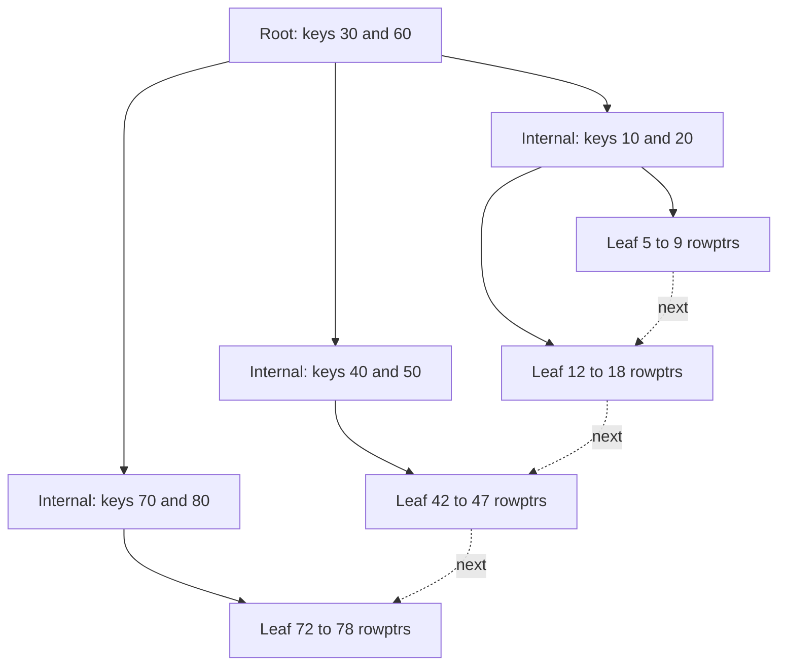
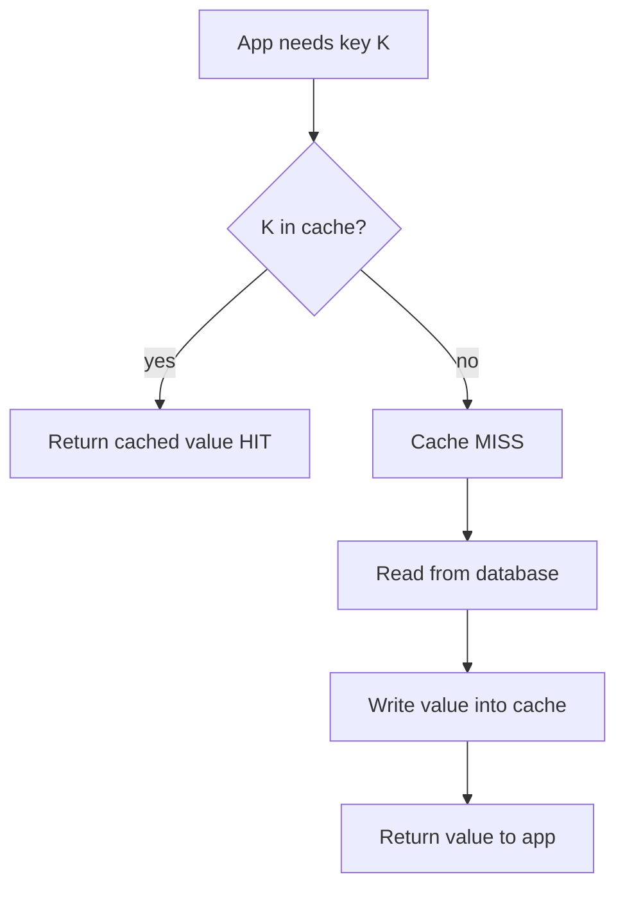
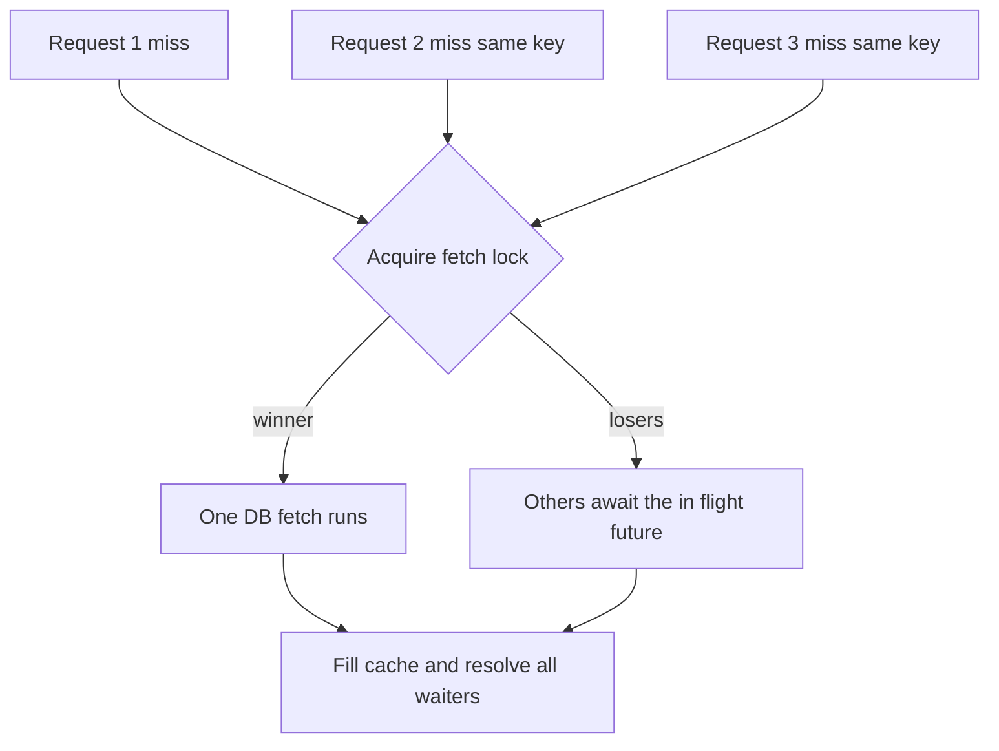

# Databases & Caching

> A database is a durable, queryable store that trades write cost for read power through indexing and transactional guarantees; a cache is a faster, smaller, disposable copy of that data placed closer to the reader — and the hardest part of both is knowing when a copy is stale.

## Introduction

Every non-trivial application eventually faces two orthogonal problems: **where does the truth live** (the database) and **how do I avoid paying the full cost of reaching the truth every single time** (the cache). These are not the same problem, but they are deeply entangled: a cache only makes sense relative to a slower source of truth, and a database's own architecture (its buffer pool, its page cache, its indexes) is itself layers of caching.

This handbook entry is platform-agnostic computer science. It covers the shape of data stores (relational vs the NoSQL family), the guarantees a store can make (ACID, isolation levels, CAP), the mechanics of how a query actually runs and how indexes make reads fast, and then the full theory of caching — strategies, eviction, invalidation, and stampede protection. Only at the end do we map all of this onto mobile: SQLite via `sqflite`/Drift, in-memory + disk caches, HTTP caching, and offline-first architecture.

The mental model to hold throughout: **reads are cheap to optimize and expensive to get wrong; writes are where correctness lives.** Databases spend enormous effort making reads fast (indexes) and writes correct (transactions). Caches make reads even faster by relaxing correctness in bounded, deliberate ways.

## Why this concept exists

Concepts in computer science exist because a naive approach fails at scale. Let us motivate each layer by the failure it prevents.

- **Why a database at all?** A flat file (or a `Map` in memory) loses data on crash, cannot be queried except by full scan, and corrupts under concurrent writes. Databases exist to provide *durability*, *query-ability*, and *concurrency control* over shared mutable state.
- **Why the relational model?** Storing the same fact in many places (denormalized blobs) means an update must find and rewrite every copy — and if it misses one, the data lies. Normalization exists to give each fact **exactly one home** so an update touches one place.
- **Why NoSQL, then?** Normalization optimizes writes and integrity but forces reads to re-join data at query time, which is expensive at massive scale and awkward for hierarchical or schema-fluid data. NoSQL families exist to optimize specific access patterns (document reads, key lookups, wide-column scans, graph traversals) by *pre-shaping* data.
- **Why ACID?** Without atomicity a transfer can debit one account and never credit the other. Without isolation two concurrent transactions can interleave into nonsense. ACID exists to let application code reason about the database *as if it were the only user*, even when it isn't.
- **Why indexes?** A table with a million rows requires a million comparisons to answer `WHERE email = ?` without help. An index exists to turn O(n) scans into O(log n) lookups — at the cost of extra writes and storage.
- **Why caching?** The source of truth is often far (network), slow (disk), or expensive (a complex join). A cache exists to *amortize* that cost across many reads by keeping a nearby copy. It trades memory and staleness risk for latency and load reduction.

The throughline: each concept trades one scarce resource (developer reasoning, write speed, memory, freshness) for another (durability, read speed, integrity, latency). Understanding the trade is understanding the concept.

## Real-world analogy

Think of a **large reference library**.

- The **archive in the basement** is the database: authoritative, complete, durable, but slow to reach — you fill out a request slip and wait.
- The **card catalog** is the index: instead of walking every shelf, you look up a title alphabetically and it tells you the exact shelf. Adding a new book means updating the catalog too (writes get slower), but finding a book is now instant.
- The **cataloging rules** ("one author record, referenced by many books") are normalization: the author's address lives in one place; if they move, you fix one card, not every book.
- **Checking out a book** is a transaction: either you get the book *and* the ledger records it, or neither happens. Two people cannot both check out the single copy — that's a lock.
- The **reserved-books shelf behind the front desk** is the cache: the most-requested titles kept close so the librarian doesn't descend to the archive each time. It's small, it's fast, and its hardest job is **knowing when a reserved copy is out of date** because the archive got a newer edition — that's cache invalidation.
- **Thundering herd** is what happens when a professor assigns one book to 300 students at 9am: everyone requests the same missing title at once and the front desk sends 300 identical slips to the basement. The fix is to send *one* slip and make the rest wait for that copy.

## Problem Statement

We want to build a system that:

1. **Never loses committed data**, even if the process crashes mid-write (durability).
2. **Answers point and range queries fast** over large datasets without scanning everything (indexing).
3. **Stays correct under concurrency** — many readers and writers at once — without them corrupting each other (transactions, isolation).
4. **Keeps related facts consistent** — no dangling references, no contradictory copies (integrity, normalization).
5. **Serves hot reads with minimal latency and load** on the source of truth (caching).
6. **Degrades gracefully** when the source of truth is unreachable — critical on mobile networks (offline-first).

The tension: goals 1–4 push toward a single, strongly-consistent, transactional store; goals 5–6 push toward distributed, relaxed-consistency copies. The engineering art is choosing *where on that spectrum each piece of data lives*, and that choice is what the rest of this document equips you to make.

## Internal Working

Two mechanisms dominate the internals: **how an index lookup finds a row**, and **how a cache-aside read decides between fast copy and slow truth**.

### B+ tree index lookup

Most relational and many NoSQL engines use a **B+ tree** for indexes. Keys are sorted; internal nodes hold only keys and child pointers (for routing); **all actual data/row pointers live in the leaves**, and leaves are linked left-to-right for efficient range scans. A lookup walks from root to leaf in O(log n) node reads.



To find key 45: at the root, 45 is between 30 and 60, go to node B; in B, 45 is between 40 and 50, descend to leaf `42..47`; scan the leaf, find 45, follow its row pointer to the actual row. Three node reads instead of a million-row scan. A range query `BETWEEN 42 AND 78` finds the start leaf then **walks the linked leaves** without revisiting the tree.

### Cache-aside read flow



The application owns the logic: check cache, on miss read the DB, then *populate* the cache for next time. The database never knows the cache exists. This is the most common mobile pattern and the easiest to reason about, at the cost of the first request always being slow (a cold miss) and the app being responsible for invalidation.

## Memory Representation

**Databases** organize data into fixed-size **pages** (commonly 4 KB–16 KB; SQLite defaults to 4 KB). A page holds many rows plus a header and a slot directory mapping row-ids to byte offsets, so rows can vary in size and be reorganized within a page without changing their id. Tables and indexes are both just collections of pages; a B+ tree node **is** a page. The engine keeps a **buffer pool / page cache** in RAM: recently touched pages stay resident so repeated access avoids disk. This is the database caching *itself* — the same idea as an application cache, one layer down.

**Indexes** store, per leaf entry, the key value plus either the full row (a *clustered* index, where the table itself is the B+ tree keyed by primary key — InnoDB, SQLite `WITHOUT ROWID`) or a pointer to the row (a *secondary/non-clustered* index).

**Caches** in memory are typically hash maps for O(1) lookup, paired with an ordering structure for eviction. An LRU cache is classically a **hash map + doubly linked list**: the map gives O(1) find, the list gives O(1) move-to-front and O(1) evict-from-back. In Dart, `LinkedHashMap` collapses both into one structure because it preserves insertion order and lets you cheaply remove and re-insert a key to mark it as recently used.

**Disk caches** (HTTP responses, images) serialize entries to files with sidecar metadata (ETag, expiry, size) and an in-memory index of what exists on disk.

## Compiler Behavior

**Not applicable — because** databases and caching are runtime data-management concerns, not language-translation concerns. A compiler (Dart AOT/JIT, or a C compiler building SQLite) translates *source code* into executable form; it has no knowledge of what rows exist, what is cached, or whether a query hits an index. The Dart compiler will happily compile `cache.get(key)` and `db.query(...)` without any idea of their runtime cost or hit rate.

The one adjacent truth worth stating: SQL itself is compiled — a **query planner/optimizer** compiles a declarative SQL string into an executable *query plan* (a tree of scan/join/sort operators). But that compilation happens inside the database engine at query time, not in the Dart compiler, and is covered under Runtime Behavior.

## Runtime Behavior

This is where all the action is.

**How a query executes (relational):**

1. **Parse** — the SQL text is tokenized and turned into an abstract syntax tree; syntax and object names are validated.
2. **Plan/optimize** — the optimizer enumerates strategies (full table scan vs index scan; join order; which index) and estimates their cost using **statistics** about table sizes and value distribution (cardinality). It picks the cheapest plan. This is why a missing or stale statistic can produce a catastrophically slow plan.
3. **Execute** — the chosen plan runs as a pipeline of operators pulling rows: e.g. *index seek → row fetch → filter → sort → limit*. Pages are pulled from the buffer pool or disk as needed.
4. **Return** — rows stream back to the client, often lazily (a cursor), so `LIMIT 10` need not materialize the whole result.

**Transactions at runtime:** a transaction accumulates changes in a write-ahead log (WAL) and/or dirty pages in memory. `COMMIT` forces the log to durable storage (the durability step — an `fsync`). Concurrent transactions acquire **locks** (or use MVCC snapshots) so their views don't corrupt each other; the isolation level chosen determines how much locking/snapshotting happens.

**Cache at runtime:** a `get` is a hash lookup (nanoseconds) that either returns a live reference or triggers a miss path (disk read, or network + DB). Eviction runs on `put` when capacity is exceeded. TTL expiry is checked lazily on read (cheap) and/or swept periodically. The dangerous runtime moments are **mass expiry** (many keys with the same TTL expiring together → stampede) and **invalidation races** (a writer updates the DB and the cache in the wrong order, leaving a stale value cached).

## Flutter Engine Behavior

**Not applicable — because** the Flutter engine (Skia/Impeller for rendering, the embedder for platform integration) is concerned with rasterizing frames and compositing layers, not with persisting or caching application *data*. The engine has no database and no data cache of your rows.

The only honest connection: the Flutter engine *does* maintain an **image cache** (`ImageCache`, tunable via `PaintingBinding.instance.imageCache`) and a shader/picture cache — these are genuine caches with eviction, and the same LRU principles apply. But your business-data database and cache live in Dart/native plugin code, not in the engine.

## Dart VM Behavior

The Dart VM runs your cache logic and your database *client* code, but the database *engine* itself is native. This distinction matters for performance.

- **SQLite is native C.** `sqflite` and Drift bind to the platform's SQLite library through the plugin channel / FFI. The actual B+ tree walks, page I/O, and transaction commits happen in native code, outside the Dart heap. Dart marshals the SQL string and parameters in and rows out.
- **Isolate and event loop discipline.** A large query or a big transaction can block for tens or hundreds of milliseconds. If that runs on the **UI isolate**, it stalls the event loop and you drop frames (jank). Rule: **push heavy DB work off the UI isolate.** Drift supports running its executor in a background isolate; `sqflite` calls are async (they hop the platform channel) but a *sequence* of many awaited queries still serializes on the DB and can starve the UI — batch them, or move the whole unit of work to an isolate.
- **In-memory caches live on the Dart heap.** An LRU `LinkedHashMap<K,V>` is ordinary Dart objects, subject to GC. Holding large values (decoded images, big lists) inflates the young/old generation and increases GC pause frequency. Cache *size in bytes*, not just entry count, for anything large.
- **`await` yields the isolate.** Between a cache miss and the DB result, the event loop is free to serve other work — good — but it also means another read for the same key can arrive before the first fills the cache, causing duplicate fetches (in-flight dedup, covered under stampede).

## Examples

Two null-safe, lint-clean Dart examples: a generic LRU cache built on `LinkedHashMap`, and a transaction pattern.

### Generic LRU cache

```dart
import 'dart:collection';

/// A fixed-capacity, least-recently-used cache.
///
/// Backed by a [LinkedHashMap], which preserves insertion order. On access we
/// remove and re-insert the key so the most-recently-used entry is always last;
/// the least-recently-used entry is therefore always first and is evicted when
/// capacity is exceeded.
class LruCache<K, V> {
  LruCache(this.capacity) : assert(capacity > 0, 'capacity must be positive');

  final int capacity;
  final LinkedHashMap<K, V> _store = LinkedHashMap<K, V>();

  int get length => _store.length;

  /// Returns the value for [key] and marks it most-recently-used, or null.
  V? get(K key) {
    if (!_store.containsKey(key)) return null;
    final V value = _store.remove(key) as V; // safe: key is present
    _store[key] = value; // re-insert at the end => most recently used
    return value;
  }

  /// Inserts or updates [key], evicting the LRU entry if over capacity.
  void put(K key, V value) {
    if (_store.containsKey(key)) {
      _store.remove(key); // refresh recency ordering
    } else if (_store.length >= capacity) {
      _store.remove(_store.keys.first); // evict least-recently-used
    }
    _store[key] = value;
  }

  bool containsKey(K key) => _store.containsKey(key);

  void remove(K key) => _store.remove(key);

  void clear() => _store.clear();
}

void main() {
  final cache = LruCache<String, int>(2);
  cache.put('a', 1);
  cache.put('b', 2);
  cache.get('a'); // 'a' is now most-recently-used; 'b' is the LRU
  cache.put('c', 3); // capacity 2 exceeded -> evicts 'b'
  print(cache.containsKey('b')); // false
  print(cache.get('a')); // 1
  print(cache.get('c')); // 3
}
```

### Transaction pattern (conceptual, sqflite-style)

The invariant: **all-or-nothing.** A transfer must debit and credit atomically. If any step throws, the whole unit rolls back and the cache is invalidated so stale reads cannot linger.

```dart
import 'package:sqflite/sqflite.dart';

/// Transfers [amount] from one account to another atomically.
///
/// Either both balance updates commit, or neither does. The transaction
/// callback runs inside a single SQLite transaction; throwing anywhere
/// inside it triggers an automatic ROLLBACK.
Future<void> transfer(
  Database db,
  LruCache<int, int> balanceCache, {
  required int fromId,
  required int toId,
  required int amount,
}) async {
  if (amount <= 0) {
    throw ArgumentError.value(amount, 'amount', 'must be positive');
  }

  await db.transaction((txn) async {
    final rows = await txn.query(
      'accounts',
      columns: ['balance'],
      where: 'id = ?',
      whereArgs: [fromId],
    );
    if (rows.isEmpty) {
      throw StateError('source account $fromId not found');
    }
    final int fromBalance = rows.first['balance']! as int;
    if (fromBalance < amount) {
      throw StateError('insufficient funds'); // rolls the whole txn back
    }

    await txn.rawUpdate(
      'UPDATE accounts SET balance = balance - ? WHERE id = ?',
      [amount, fromId],
    );
    await txn.rawUpdate(
      'UPDATE accounts SET balance = balance + ? WHERE id = ?',
      [amount, toId],
    );
  });

  // Invalidate AFTER a successful commit so the cache never serves a
  // balance that the committed transaction has superseded.
  balanceCache.remove(fromId);
  balanceCache.remove(toId);
}
```

The ordering is deliberate: **commit first, then invalidate the cache.** Invalidating before commit would open a window where a concurrent reader re-populates the cache from the *old* committed state.

## Diagrams

### Cache-aside vs write-through write paths

```mermaid
graph TD
    subgraph CacheAside["Cache aside write"]
        A1["App writes value"]
        A2["Write to database"]
        A3["Invalidate or update cache"]
        A1 --> A2 --> A3
    end
    subgraph WriteThrough["Write through"]
        B1["App writes value"]
        B2["Cache accepts write"]
        B3["Cache synchronously writes to database"]
        B4["Ack returned to app"]
        B1 --> B2 --> B3 --> B4
    end
    subgraph WriteBack["Write back"]
        C1["App writes value"]
        C2["Cache accepts write and acks fast"]
        C3["Cache flushes to database later async"]
        C1 --> C2 --> C3
    end
```



### Stampede protection with a single-flight lock



## Common Mistakes

- **Invalidating the cache before the DB write commits**, opening a race where a reader repopulates stale data. Always commit, then invalidate.
- **Caching negatives without care** — a cache miss that returns "not found" and caches it forever hides a row that later appears. Use short TTLs for negative results.
- **Uniform TTLs** so a whole batch of keys expires simultaneously → synchronized stampede. Add **jitter** to expiry times.
- **Indexing everything.** Each index is extra write cost and storage. Unused indexes only slow writes.
- **Wrong composite index column order.** An index on `(a, b)` serves `WHERE a = ?` and `WHERE a = ? AND b = ?`, but **not** `WHERE b = ?` alone (the leftmost-prefix rule). Ordering matters.
- **`SELECT *` when a covering index exists** — forcing a row fetch that the index could have satisfied entirely.
- **Running heavy queries on the UI isolate**, causing jank. Move them off.
- **Treating NoSQL as "no schema, no problem."** Schema still exists — it just moved into your application code, where the compiler can't check it.
- **Assuming default isolation is serializable.** Most databases default to Read Committed; you can still hit non-repeatable reads and phantoms.
- **N+1 queries**: one query for a list, then one query per item. Batch with a join or an `IN (...)` and cache the aggregate.
- **Unbounded caches** that grow until the app is OOM-killed. Always cap by size or count.

## Best Practices

- **Cache the source of truth, don't fork it.** The database is authoritative; the cache is disposable. Design so that dropping the entire cache only affects latency, never correctness.
- **Set an explicit TTL on everything**, even "static" data. TTL is your safety net against invalidation bugs.
- **Add jitter to TTLs** to spread expiry and prevent herds.
- **Use single-flight / request coalescing** so N concurrent misses for one key trigger one fetch.
- **Index to match your queries, not your columns.** Look at real slow queries, add the composite/covering index that serves them, and drop indexes nothing uses.
- **Keep transactions short.** Long transactions hold locks and block others. Do computation before/after, not inside, the transaction.
- **Pick the weakest isolation level that is still correct** for your workload — stronger isolation costs concurrency.
- **Normalize for the write path, denormalize deliberately for read hot-paths** — and when you denormalize, own the consistency cost explicitly.
- **On mobile, adopt offline-first**: treat the local DB as the primary store and the network as a sync layer.
- **Measure hit rate.** A cache below ~80–90% hit rate for its workload may be miscofigured or too small to be worth its complexity.

## Performance

- **Index lookup:** O(log n) node reads vs O(n) full scan. For a million rows a B+ tree of fan-out ~100 is ~3 levels deep — three page reads.
- **Writes with indexes:** each `INSERT`/`UPDATE`/`DELETE` must maintain every affected index; k indexes ≈ k extra tree updates plus the table write. This is the read/write trade in one sentence.
- **Cache hit vs miss:** an in-memory hit is nanoseconds; a disk hit is microseconds–milliseconds; a network+DB miss is tens–hundreds of milliseconds. The whole game is raising hit rate.
- **Covering index:** if the index contains every column the query needs, the engine answers from the index alone and skips the row fetch — often a 2–10x win on read-heavy queries.
- **Buffer pool / page cache:** the database's own RAM cache means a "disk" read is often a memory read. Cold cache after restart is measurably slower.
- **Stampede cost:** without coalescing, a hot key's expiry can send hundreds of identical queries at once, spiking DB load far above steady state — a self-inflicted denial of service.
- **Serialization overhead:** disk/HTTP caches pay encode/decode cost; sometimes recomputing is cheaper than deserializing a large blob.

## Advantages

- **Databases:** durability, expressive querying, integrity constraints, and safe concurrency — correctness guarantees you would otherwise re-implement badly.
- **Indexes:** turn linear scans into logarithmic lookups; enable fast sorting and range queries.
- **Normalization:** one home per fact; updates are cheap and cannot leave contradictions.
- **NoSQL:** access-pattern-shaped storage, horizontal scalability, schema flexibility for evolving/hierarchical data.
- **Caching:** dramatic latency reduction, load shedding from the source of truth, and a foundation for offline capability.
- **Offline-first:** the app remains usable without connectivity — a UX win and often a requirement on mobile.

## Disadvantages

- **Indexes** cost storage and slow every write; the wrong ones cost without helping.
- **Normalization** pushes join cost onto reads and can be awkward for deeply nested data.
- **Strong ACID/serializable isolation** limits concurrency and throughput.
- **NoSQL** typically weakens transactions and joins, pushing integrity logic into application code.
- **Caching** adds a second source of "truth" that can be stale — cache invalidation is famously one of the two hard problems.
- **Distributed consistency** (CAP) forces a choice: under a network partition you sacrifice either availability or consistency.
- **Complexity:** every layer added (cache, replica, background isolate) is another thing to reason about, monitor, and get subtly wrong.

## Interview Questions

**1. Explain the four ACID properties. 🟢**
*Atomicity*: a transaction is all-or-nothing — partial effects never persist. *Consistency*: a transaction moves the DB from one valid state to another, respecting all constraints. *Isolation*: concurrent transactions don't see each other's uncommitted intermediate state (degree tunable via isolation level). *Durability*: once committed, changes survive crashes (via WAL + fsync). Mnemonic: a bank transfer must debit *and* credit together (A), never violate the non-negative-balance rule (C), not interleave with another transfer into nonsense (I), and stay recorded after a power cut (D).

**2. What is the difference between a clustered and a non-clustered index? 🟡**
A *clustered* index stores the table rows themselves in the leaf nodes, physically ordered by the index key — there is one per table (the table *is* the index). A *non-clustered/secondary* index stores keys plus a pointer (or the primary key) to the row, requiring a second lookup to fetch the full row unless the index is *covering*. InnoDB and SQLite `WITHOUT ROWID` tables are clustered by primary key.

**3. Why do indexes speed reads but slow writes? 🟢**
Reads: the sorted B+ tree lets a lookup skip from root to leaf in O(log n) instead of scanning O(n) rows. Writes: every insert/update/delete must also update every index that covers the affected columns, keeping each tree balanced and sorted — so k indexes mean roughly k extra tree maintenance operations per write, plus the storage.

**4. What is the leftmost-prefix rule for composite indexes? 🟡**
An index on `(a, b, c)` can serve queries filtering on `a`, `a,b`, or `a,b,c` (any leftmost prefix), because the tree is sorted by `a` first, then `b`, then `c`. It cannot efficiently serve a query filtering only on `b` or only on `c`, because those columns are not the primary sort key. Design composite index column order to match your most common query's filter/sort columns.

**5. Walk through the isolation levels and the anomalies each prevents. 🔴**
*Read Uncommitted*: allows dirty reads (seeing another txn's uncommitted data). *Read Committed*: prevents dirty reads; still allows *non-repeatable reads* (a row's value changes between two reads in the same txn). *Repeatable Read*: prevents non-repeatable reads (rows you read stay stable); may still allow *phantom reads* (new rows matching your `WHERE` appear). *Serializable*: prevents all of the above, including phantoms — the result is as if transactions ran one at a time. Stronger levels cost concurrency.

**6. Compare cache-aside, read-through, write-through, and write-back. 🟡**
*Cache-aside*: app checks cache, on miss reads DB and populates cache; app owns invalidation. *Read-through*: the cache library itself loads from the DB on miss, transparent to the app. *Write-through*: writes go to the cache which synchronously writes to the DB — cache and DB always agree, writes are slower. *Write-back*: writes hit the cache and ack immediately, flushing to the DB asynchronously — fastest writes, but risk of data loss if the cache dies before flush.

**7. What is cache invalidation and why is it hard? 🔴**
Invalidation is removing or refreshing a cached value once its source of truth changes. It's hard because (a) the cache and DB are updated by separate operations, so ordering and races can leave a stale value; (b) one logical change may invalidate many derived cache entries you must track; (c) distributed caches have no single clock, so "when" is ambiguous. The pragmatic defenses are TTLs (bounded staleness), commit-then-invalidate ordering, and versioned/keyed entries.

**8. What is a cache stampede / thundering herd and how do you prevent it? 🔴**
When a hot key expires (or the cache is cold), many concurrent requests all miss simultaneously and hammer the DB with identical queries, spiking load. Prevention: *single-flight* (coalesce concurrent misses so only one fetch runs and the rest await its result), *TTL jitter* (stagger expiry so keys don't all die at once), and *early/probabilistic refresh* (refresh a value slightly before it expires under a background task).

**9. Explain the CAP theorem in one paragraph. 🟡**
In a distributed system you cannot simultaneously guarantee Consistency (every read sees the latest write), Availability (every request gets a non-error response), and Partition tolerance (the system keeps working despite dropped messages between nodes). Since network partitions are unavoidable, real systems choose between CP (refuse some requests to stay consistent) and AP (stay available but possibly serve stale data). Eventual consistency is the AP compromise: replicas converge once the partition heals.

**10. When would you choose NoSQL over relational? 🟡**
When your access pattern is well-known and you can pre-shape data to serve it in a single read (document stores for aggregate-oriented reads), when you need massive horizontal scale and can relax cross-entity transactions, when data is hierarchical/schema-fluid, or when the workload is a specific shape a specialized store nails (key-value for sessions, columnar for analytics, graph for relationship traversals). Choose relational when you need ad-hoc queries, strong multi-row transactions, and referential integrity.

**11. How does a SQL query actually execute? 🟡**
Parse (SQL text → AST, validate names) → optimize (the planner uses table statistics to pick among possible plans: which index, which join order, scan vs seek — choosing lowest estimated cost) → execute (run the plan as a pipeline of operators pulling pages from the buffer pool or disk) → return (stream rows, often lazily via a cursor). Stale statistics are a common cause of the optimizer choosing a bad plan.

**12. On mobile specifically, how do databases and caching interact? 🟡**
The local SQLite DB (via sqflite/Drift) is often the primary store in an offline-first design; the network is a sync layer. On top sit an in-memory cache (fast, volatile, LRU/size-capped) and a disk cache (images, HTTP responses with ETag/Cache-Control). Heavy DB work runs off the UI isolate to avoid jank. Reads flow cache → local DB → network; writes go to the local DB immediately and queue for sync, so the UI never waits on the network.

## Senior Engineer Tips

- **The cache must be truly optional.** If deleting the entire cache breaks correctness, you have built a second database by accident. Test by wiping it in staging.
- **Order of operations under concurrency is everything.** Memorize: write DB, commit, *then* invalidate cache. Reason about the interleaving where a reader sneaks in at each step.
- **`EXPLAIN`/`EXPLAIN QUERY PLAN` is your microscope.** Never guess whether an index is used — ask the planner. On SQLite, `EXPLAIN QUERY PLAN` shows `SCAN` (bad, full table) vs `SEARCH ... USING INDEX` (good).
- **Cache by cost, not by convenience.** Cache the expensive join result, not the trivially cheap primary-key lookup that the DB already serves from its buffer pool.
- **Watch the tail, not the mean.** A 95% hit rate can still mean the 5% misses (stampedes, cold starts) dominate p99 latency. Instrument miss latency separately.
- **Prefer bounded staleness to perfect freshness.** A 30-second TTL is usually indistinguishable from live to a user and eliminates an entire class of invalidation bugs.
- **Keep write transactions boring and short.** Compute values before opening the transaction; do only the writes inside it.

## Architect Perspective

At the system level, the questions are about **where truth lives and how consistency propagates**:

- **Data placement:** which data is authoritative in the relational core, which lives in a specialized store (search index, graph, analytics warehouse), and how they stay in sync (CDC, event streams, dual writes and their pitfalls).
- **Consistency model per feature:** a bank balance demands strong consistency; a "likes" count tolerates eventual consistency. Architects assign a consistency budget per feature rather than globally.
- **Cache topology:** per-instance in-memory caches (fast, incoherent across instances) vs a shared cache tier (coherent, network hop, its own availability concern). Mobile mirrors this: device-local cache vs server cache vs CDN.
- **Offline-first as an architecture, not a feature:** if the client owns a local DB and syncs, you inherit distributed-systems problems (conflict resolution, last-write-wins vs CRDTs, sync ordering) on every device.
- **Failure modes:** what happens when the cache is down (fall through to DB — is the DB provisioned for it?), when the DB is partitioned (CP vs AP choice), when the sync backlog grows. Design the degraded path first.
- **Cost:** indexes, replicas, and cache tiers all cost money and operational surface. The architect justifies each against measured load, not hypothetical scale.

## Summary

- A **database** provides durability, querying, integrity, and safe concurrency; a **cache** provides speed by keeping a disposable nearby copy.
- **Relational** stores normalize facts (one home each) and excel at ad-hoc queries and transactions; **NoSQL** families (document, key-value, columnar, graph) pre-shape data for specific access patterns and scale.
- **ACID** lets you reason about the DB as if you were its only user; **isolation levels** trade concurrency for the elimination of dirty/non-repeatable/phantom anomalies.
- **Indexes** (B+ trees) turn O(n) scans into O(log n) lookups, speeding reads and slowing writes; composite/covering indexes serve specific queries.
- A **query** is parsed, optimized against statistics, executed as an operator pipeline, and streamed back.
- **Caching strategies** (cache-aside, read-through, write-through, write-back) and **eviction policies** (LRU/LFU/FIFO/TTL) are chosen per workload; **invalidation** and **stampede** are the hard parts.
- On **mobile**, the local SQLite DB is often the primary store in an **offline-first** design, layered with in-memory and disk caches, with heavy work off the UI isolate.

## Revision Notes

- ACID = Atomicity, Consistency, Isolation, Durability.
- Isolation ladder: Read Uncommitted → Read Committed → Repeatable Read → Serializable; prevents dirty → non-repeatable → phantom in that order.
- B+ tree: keys in internal nodes route; data/pointers in linked leaves; O(log n) lookup, ordered range scans.
- Leftmost-prefix rule: index `(a,b,c)` serves `a`, `a,b`, `a,b,c` — not `b` alone.
- Covering index = query answered from the index alone, no row fetch.
- Write strategies: cache-aside (app-managed), read-through (cache loads), write-through (sync to DB), write-back (async to DB).
- Eviction: LRU (recency), LFU (frequency), FIFO (age of insert), TTL (wall-clock expiry).
- Two hard defenses: commit-then-invalidate; single-flight + TTL jitter for stampedes.
- CAP: under partition, pick Consistency or Availability. Eventual consistency = AP convergence.
- Mobile: local DB primary, network syncs, cache layers on top, heavy work off UI isolate.

### Comparison tables

**Relational vs NoSQL**

| Dimension | Relational (SQL) | NoSQL (document/KV/columnar/graph) |
|---|---|---|
| Schema | Fixed, enforced by engine | Flexible, enforced by app |
| Query | Ad-hoc SQL, joins | Access-pattern-shaped; joins limited |
| Transactions | Strong, multi-row ACID | Often single-key/document only |
| Integrity | Foreign keys, constraints | Application-managed |
| Scaling | Vertical mostly; sharding is work | Horizontal by design |
| Best fit | Complex relationships, ad-hoc queries | Known patterns, huge scale, hierarchical data |

**ACID vs BASE**

| Property | ACID | BASE |
|---|---|---|
| Focus | Correctness/consistency | Availability |
| Consistency | Immediate, strong | Eventual |
| Availability | May block for consistency | Prioritized |
| Typical home | Relational, single node | Distributed NoSQL |
| Trade | Less concurrency/throughput | Stale reads possible |

**Eviction policies**

| Policy | Evicts | Good when | Weakness |
|---|---|---|---|
| LRU | Least recently used | Temporal locality | One scan can flush hot items |
| LFU | Least frequently used | Stable popularity | Slow to adapt to new hot keys |
| FIFO | Oldest inserted | Simple, fair aging | Ignores actual usage |
| TTL | Whatever expired | Bounded staleness needed | Mass expiry causes stampede |

**Caching strategies**

| Strategy | Read path | Write path | Trade |
|---|---|---|---|
| Cache-aside | App checks cache, loads DB on miss | App writes DB, invalidates cache | Simple; first read slow, app owns invalidation |
| Read-through | Cache loads DB on miss | (paired with a write policy) | Transparent reads; needs cache library support |
| Write-through | From cache | Cache writes DB synchronously | Cache/DB consistent; slower writes |
| Write-back | From cache | Cache acks, flushes DB async | Fast writes; data-loss risk on cache failure |

## Practice Questions

1. Given a query `WHERE status = ? AND created_at > ?` ordered by `created_at`, what composite index would you create and in what column order? Justify with the leftmost-prefix rule.
2. Your app shows a live "unread count" that is expensive to compute. Which caching strategy and eviction/TTL policy would you use, and how would you invalidate it when a message is read?
3. A transfer occasionally leaves money "missing" under load. Which ACID property or isolation level is most likely violated, and how would you diagnose it?
4. Explain why `SELECT *` can defeat a covering index and how to fix it.
5. You observe a load spike on the DB every hour on the hour. What cache misconfiguration causes this and what is the fix?
6. For a mobile chat app, sketch the read path for a message list across in-memory cache, local DB, and network, and explain what runs on which isolate.

## Coding Questions

1. **Extend the `LruCache`** to be an **LRU cache with per-entry TTL**: entries expire after a duration and are treated as misses. Keep `get`/`put` amortized O(1) where possible.
2. **Implement a size-bounded cache** (bounded by total bytes, not entry count) given a `int Function(V) sizeOf` callback; evict LRU until under the byte budget.
3. **Implement single-flight**: a `Future<V> getOrFetch(K key, Future<V> Function() fetch)` that ensures concurrent calls for the same key trigger `fetch` only once and all callers await the same future.
4. **Write an `LfuCache`** and a small benchmark comparing hit rates of LRU vs LFU on a workload with a few very hot keys plus a stream of one-off keys.
5. **Write a transaction helper** `Future<T> inTransaction<T>(Database db, Future<T> Function(Transaction txn) body)` that runs `body` in a transaction, invalidates a provided set of cache keys only on success, and rethrows on failure.

## Mini Project

**Offline-first "Notes" module with a two-layer cache.**

Build a Flutter/Dart module that demonstrates the full stack from this document.

**Requirements:**

- **Local DB (source of truth):** a `notes` table (`id`, `title`, `body`, `updated_at`, `synced`) using `sqflite` or Drift. Add an index on `updated_at` and demonstrate `EXPLAIN QUERY PLAN` showing an index search vs a full scan.
- **Repository with cache-aside:** an in-memory `LruCache<int, Note>` in front of the DB. Reads check the cache, fall through to the DB, and populate. Writes go to the DB in a transaction, then invalidate the affected cache keys (commit-then-invalidate).
- **Single-flight** on the note-detail read so tapping the same note repeatedly triggers one DB read.
- **TTL + jitter** on a cached "notes summary" aggregate (e.g., counts) so it refreshes at most every N seconds with jitter.
- **Offline-first sync:** writes set `synced = 0` and enqueue; a background sync (simulated network) flips `synced = 1`. Demonstrate the app remaining fully usable with the network disabled.
- **Isolate discipline:** run a deliberately heavy query (e.g., a full-text-like scan over many rows) off the UI isolate and show the UI staying at 60fps.

**Stretch goals:**

- Add **conflict resolution** for sync (last-write-wins by `updated_at`, then discuss where a CRDT would be better).
- Add a **disk cache** for any attachments with size-bounded eviction and ETag-style validation.
- Instrument and log **hit rate and miss latency**, and add TTL jitter to prove stampede reduction under a burst of concurrent reads.

**Cross-links:**

- [Database — overview](../20%20Database/README.md)
- [Modeling, migrations & performance](../20%20Database/05_modeling_migrations_performance.md)
- [Caching strategies (local storage)](../15%20Local%20Storage/05_caching_strategies.md)
- [Offline-first architecture](../19%20Offline%20First/README.md)
