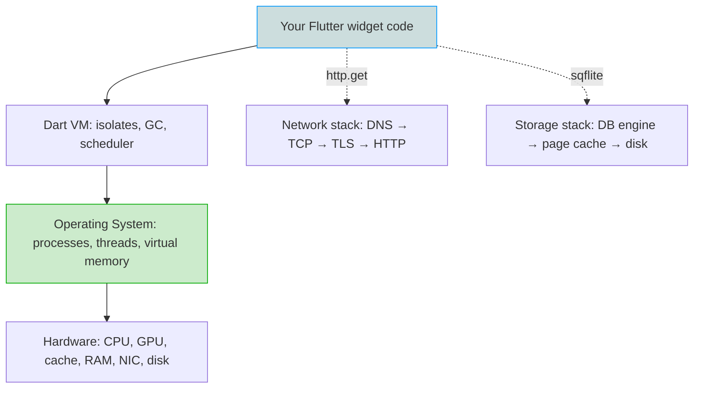

# 59 · Computer Science Foundations

> The platform-agnostic computer science a Flutter app *runs on top of* — the layer every senior is expected to reason about, and every Flutter API silently assumes.

## Why this module exists

The rest of this handbook teaches Flutter and Dart. But a `ListView` scrolls on top of an **operating system scheduler**, an `http.get` crosses a **DNS lookup → TCP handshake → TLS negotiation → HTTP exchange**, a `sqflite` query is a **B-tree index walk inside a transaction**, and every frame you paint is a **CPU→GPU handoff**. When something is slow, flaky, or insecure, the bug is very often *below* Flutter — in the CS layer.

Junior engineers debug at the API level ("`FutureBuilder` isn't updating"). Senior engineers debug at the **systems** level ("we're blocking the platform thread on a synchronous file read, and the page cache is cold because we `fsync` on every write"). This module gives you that second vocabulary.

It is deliberately **language- and framework-neutral**. Where a topic also has a Flutter-specific module, this module teaches the *concept* and links across; it never duplicates.

## What you will be able to do

- Explain **processes, threads, context switches, and scheduling** — and why Dart uses isolates instead of shared-memory threads.
- Reason about **virtual memory, stack/heap, paging, and cache hierarchy**, and why **CPU vs GPU** is the core mental model of the rendering pipeline.
- Trace a network request end-to-end: **DNS → TCP/UDP → TLS → HTTP/1.1 vs 2 vs 3**, and diagnose latency at each hop.
- Choose and defend **relational vs NoSQL**, explain **ACID, indexing, and transactions**, and design a **cache** with the right eviction and invalidation strategy.
- Pick the right **serialization format** (JSON/Protobuf/FlatBuffers) and **compression** algorithm (gzip/Brotli/zstd) for a payload.
- Speak fluently about **hashing, symmetric/asymmetric crypto, and threat modeling** as the foundation under app security.

## File index

| # | File | Topic focus | Pairs with |
|---|------|-------------|------------|
| 1 | [`01_operating_systems_and_concurrency.md`](01_operating_systems_and_concurrency.md) | Processes, threads, scheduling, context switches, multithreading, deadlock | [02 Advanced Dart · isolates](../02%20Advanced%20Dart/04_isolates.md), [33 Background Services](../33%20Background%20Services/README.md) |
| 2 | [`02_memory_and_processors.md`](02_memory_and_processors.md) | Virtual memory, stack/heap, paging, cache hierarchy, CPU vs GPU, hardware rendering | [02 Advanced Dart · memory & GC](../02%20Advanced%20Dart/13_memory_and_gc.md), [09 Rendering Pipeline](../09%20Rendering%20Pipeline/README.md) |
| 3 | [`03_networking_and_dns.md`](03_networking_and_dns.md) | OSI/TCP-IP model, IP, TCP vs UDP, sockets, ports, DNS resolution | [16 Networking](../16%20Networking/README.md) |
| 4 | [`04_http_and_tls.md`](04_http_and_tls.md) | HTTP/1.1/2/3, methods, status, caching headers, TLS handshake, certificates, pinning | [16 Networking · HTTP](../16%20Networking/01_http_fundamentals.md), [37 Security · pinning](../37%20Security/03_network_security_and_pinning.md) |
| 5 | [`05_databases_and_caching.md`](05_databases_and_caching.md) | Relational vs NoSQL, ACID, indexing, B-trees, transactions, caching & eviction | [20 Database](../20%20Database/README.md), [15 Local Storage · caching](../15%20Local%20Storage/05_caching_strategies.md) |
| 6 | [`06_compression_and_serialization.md`](06_compression_and_serialization.md) | Encodings, JSON/Protobuf/FlatBuffers, gzip/Brotli/zstd, tradeoffs | [02 Advanced Dart · JSON & serialization](../02%20Advanced%20Dart/12_json_and_serialization.md) |
| 7 | [`07_security_foundations.md`](07_security_foundations.md) | Hashing, symmetric/asymmetric crypto, key exchange, threat modeling, CIA triad | [37 Security](../37%20Security/README.md), [17 Authentication](../17%20Authentication/README.md) |

## How to read it

This module is best read **after** you are comfortable with Flutter (post Module 21) but it pays dividends at any point. Each file is self-contained and follows the [`FILE_TEMPLATE.md`](../00%20Repository%20Guide/FILE_TEMPLATE.md) — the *(Flutter Engine / Dart VM)* sections connect the CS concept back to how Flutter and the Dart VM actually use it, so nothing here is abstract trivia.

> Everything above the dotted line is the rest of this handbook. **This module is everything below it.**

## Summary

- Flutter runs on an OS, a network stack, storage engines, and silicon — this module teaches that substrate, vendor-neutral.
- Seven topic files: OS & concurrency, memory & processors, networking & DNS, HTTP & TLS, databases & caching, compression & serialization, security foundations.
- Each teaches the concept and cross-links to the Flutter-specific module, never duplicating.

## Revision Notes

- CS layer = where the *hard* bugs (slow, flaky, insecure) usually live.
- Debug at the systems level, not just the API level — that is the senior tell.
- Isolates vs threads, virtual memory, DNS→TCP→TLS→HTTP, ACID + indexes, serialization + compression, crypto + threat modeling.
