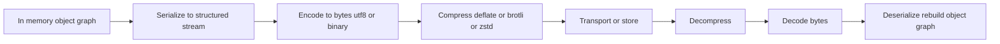
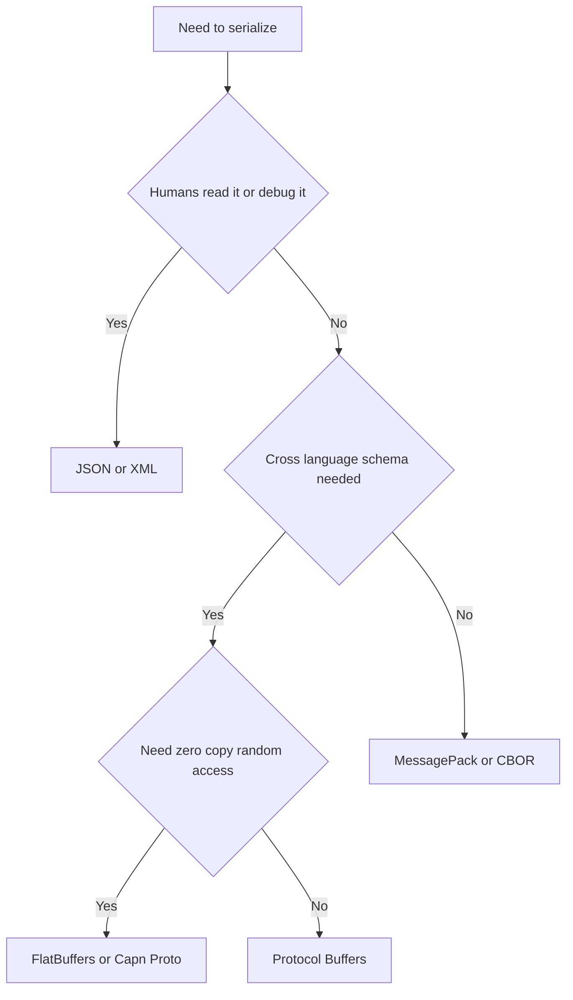
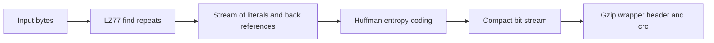

# Compression & Serialization

> Serialization turns a live in-memory object graph into a linear byte or text stream so it can be stored or transmitted and later reconstructed; compression shrinks that stream by removing statistical redundancy, trading CPU for size.

## Introduction

Every non-trivial program eventually needs to move data *out* of RAM — to disk, to a socket, to another process, to another machine. But an in-memory object is a tangle of pointers: a `User` holds a reference to a `List<Order>`, each `Order` points at a `Product`, and those addresses are meaningless the moment the process dies or the data crosses a boundary. **Serialization** is the discipline of flattening that pointer graph into a self-contained, position-independent sequence of bytes. **Deserialization** rebuilds the graph on the other side.

**Compression** is a separate, composable concern layered on top: given a byte stream, produce a shorter byte stream from which the original can be recovered (lossless) or approximated (lossy). The two are almost always used together — you serialize to JSON, then gzip the result before sending it over HTTP.

This chapter is deliberately platform-agnostic computer science. The concepts — varints, field numbers, entropy, Huffman trees, LZ77 windows — are identical whether you write Dart, Rust, or C. We then ground each idea in concrete Dart/Flutter behavior: how `json_serializable` generates code, why parsing a 5 MB JSON on the UI isolate janks your frame, and where `GZipCodec` fits.

Related reading:
- [JSON & Serialization in Dart](../02%20Advanced%20Dart/json_and_serialization.md)
- [gRPC](../16%20Networking/grpc.md)
- [REST client & interceptors](../16%20Networking/rest_client_and_interceptors.md)
- [Isolates](../02%20Advanced%20Dart/isolates.md)

## Why this concept exists

**The root problem: memory is private, transient, and pointer-based.** A running process owns a virtual address space. An object at `0x7ffd...` means nothing to a file on disk (which has no addresses, only offsets), to a peer process (different address space), or to a server written in another language (different memory layout, different type system entirely). To persist or transmit state you must convert it into a representation that carries no dependence on *this* process's memory.

Three forces make serialization non-negotiable:

1. **Persistence outlives processes.** RAM is cleared on exit; disk is not. To save state you must encode it in a durable, self-describing byte form.
2. **Boundaries break pointers.** Sockets, files, and IPC channels transport bytes, not references. A pointer is only valid inside one address space.
3. **Heterogeneity demands a lingua franca.** A Dart app talking to a Go backend cannot share `Object` layouts. They agree on a *wire format* (JSON, Protobuf) that both can produce and parse.

**Why compression exists:** bytes cost money and time — bandwidth is billed, storage is finite, and radio links are slow and battery-hungry. Real data is *redundant*: text repeats words, logs repeat timestamps, JSON repeats key names on every record. Redundancy is wasted space. Compression exists because Shannon proved that redundancy can be squeezed out down to a hard floor (entropy) without losing information. Below that floor you must discard information (lossy).

The deeper "why" running through everything: **there is no free lunch.** Human-readable formats cost size and parse speed. Compact binary formats cost readability and tooling. Compression costs CPU. Every choice in this chapter is a point on a trade-off surface, and seniority is knowing *which axis your system is actually constrained on.*

## Real-world analogy

Think of **shipping furniture**.

- **The assembled sofa in your living room** is the in-memory object: comfortable, ready to use, but full of implicit context (it sits *here*, next to *that* lamp).
- **Flat-packing it into a labeled box** is serialization: you disassemble it into parts, and — crucially — you include an *instruction sheet* so it can be reassembled. IKEA part numbers are exactly **field numbers**: the label "Part 7" means the same leg regardless of which language the instructions are printed in, and if IKEA later adds "Part 12" (a new cushion), old instructions still assemble a valid sofa — that is **backward/forward compatibility**.
- **JSON vs Protobuf**: JSON is packing each part in its own box with a full English sentence describing it taped to the outside ("this is the left armrest, made of oak…") — anyone can read it, but the boxes are bulky. Protobuf is shipping numbered parts in a single tight crate with a separate master manual (the `.proto` schema) — tiny and efficient, but useless without the manual.
- **Compression** is vacuum-sealing the packing foam: you squeeze out the air (redundancy) so more fits in the truck. **Vacuum-sealing a brick** (already-dense, incompressible data like a JPEG) wastes effort and may even make it slightly bigger — the seal itself has weight.
- **Endianness** is whether the instruction sheet reads left-to-right or right-to-left; both parties must agree or the sofa comes out backwards.

## Problem Statement

You are building a mobile app that syncs a user's shopping cart to a backend and caches it locally.

Concrete demands:
1. **Transport a `Cart` object over HTTP** to a server written in another language. You need a format both sides parse identically.
2. **Cache the cart on disk** for offline use, surviving app restarts.
3. **Minimize bytes on a metered mobile connection** — the cart can hold hundreds of line items.
4. **Evolve the schema** — next quarter you add a `giftWrap` field; last quarter's app versions and stored caches must not crash.
5. **Never jank the UI** — a large sync payload must not freeze the render loop while parsing.

Naive answers fail: raw `memcpy` of the object is unusable (pointers, GC layout). Sending uncompressed pretty-printed JSON wastes bandwidth. Parsing on the UI isolate drops frames. Adding a required field breaks old clients. This chapter's tools solve each point: **choose a wire format** (1, 2), **compress** (3), **use field numbers / optional fields** (4), **move heavy work off the UI isolate** (5).

## Internal Working

The end-to-end pipeline from live object to bytes-on-the-wire and back:



Stage by stage:

- **Serialize**: walk the object graph, resolving references into a tree (or DAG with explicit IDs to break cycles). Produce a structured representation — a map of key/value pairs, arrays, primitives.
- **Encode**: turn that structure into concrete bytes. Text formats emit UTF-8 characters; binary formats emit length-prefixed and tag-prefixed byte sequences (e.g. Protobuf varints).
- **Compress**: run an entropy/redundancy reducer over the bytes. Optional and orthogonal.
- **Transport/store**: the bytes cross the boundary — TCP, disk, IPC.
- The receiver runs the **inverse** in reverse order: decompress, decode, deserialize, allocating fresh objects in *its* address space.

**Varint encoding (the heart of Protobuf's compactness):** instead of always spending 4 or 8 bytes on an integer, a varint uses 7 data bits per byte plus a 1-bit "continuation" flag (MSB). The number 1 takes 1 byte; 300 takes 2 bytes; only genuinely large numbers cost the full width. Small numbers — overwhelmingly common — are cheap.

```
300 in binary            = 100101100
split into 7-bit groups  = 0000010 0101100
little-endian groups     = 0101100 0000010
set continuation MSBs    = 10101100 00000010   (0xAC 0x02)
```

The MSB of the first byte is 1 ("more bytes follow"); the second is 0 ("last byte"). This is why Protobuf integers are so small and why field numbers 1–15 are especially prized (their tag fits in one byte).

**Why field numbers enable schema evolution:** in Protobuf the wire format stores a *tag* per field — `(field_number << 3) | wire_type` — not the field *name*. The decoder matches by number. Therefore:
- **Unknown field number → skip it** (forward compatibility: new server, old client).
- **Expected field number absent → use default** (backward compatibility: old data, new code).
- You may **rename** a field freely (name isn't on the wire) but must **never reuse a number** for a different meaning, and must never change a field's type incompatibly. This is the entire discipline of schema evolution.

**Why compression works (entropy):** Shannon's source coding theorem says a symbol with probability `p` carries `-log2(p)` bits of information; the average is the entropy `H = -Σ p·log2(p)`. No lossless coder can beat `H` bits/symbol on average. Compression exploits the gap between a naive fixed-width encoding (e.g. 8 bits/char) and the true entropy: frequent symbols *should* get short codes.

- **Huffman coding** builds an optimal *prefix code*: repeatedly merge the two least-frequent symbols into a subtree; frequent symbols end up near the root (short codes), rare ones deep (long codes). No code is a prefix of another, so the stream is uniquely decodable without delimiters.
- **LZ77** attacks a different redundancy — *repetition*. It slides a window over past output and replaces a repeated run with a back-reference `(distance, length)`: "copy 12 bytes starting 340 bytes back." Text like repeated JSON keys compresses spectacularly.
- **DEFLATE** = LZ77 (find repeats) **then** Huffman (entropy-code the literals and the back-references). gzip is DEFLATE plus a header/CRC wrapper. This two-stage combo is why gzip is a solid general default.

## Memory Representation

**In memory**, an object is a header (class pointer / type tag, GC bits) plus fields. Reference-typed fields hold *pointers* to other heap objects. A `Cart` with 3 items is really 1 `Cart` object + 1 list backing array + 3 `Item` objects scattered across the heap, wired by addresses. Total footprint includes per-object headers and alignment padding — often far larger than the data itself.

**Serialized**, all of that collapses into a flat, contiguous span with **no pointers** — positions are implied by order and length prefixes:

- **JSON (text):** `{"items":[{"sku":"A1","qty":2}]}` — every structural character (`{`, `"`, `:`, `,`) is a literal byte; keys are repeated per record; numbers are ASCII digits. Human-readable, self-describing, bulky.
- **Protobuf (binary):** a sequence of `tag`+`value` records. `tag` is a varint encoding field number + wire type; `value` is a varint, a fixed 4/8 bytes, or a length-delimited blob. No field names, no whitespace.
- **FlatBuffers (binary):** stores a **vtable** of offsets so that fields are read *in place* by offset arithmetic — no unpacking step. The serialized buffer *is* the accessible object.

**Endianness** matters only for multi-byte fixed-width fields. Big-endian (network byte order) stores the most-significant byte first; little-endian (x86, ARM) stores least-significant first. Protobuf's `fixed32`/`fixed64` and most binary formats specify little-endian on the wire; you must byte-swap if your reader disagrees. Varints sidestep this by being defined byte-by-byte. Text JSON has no endianness — digits are digits.

## Compiler Behavior

**This is directly applicable in Dart via code generation.** Dart cannot reflect over types at runtime in release/AOT builds (tree-shaking + no `dart:mirrors`), so serialization boilerplate is generated at build time.

- `package:json_serializable` + `package:build_runner` read your annotated class and **generate `fromJson`/`toJson`** in a `*.g.dart` part file *before* the Dart compiler runs. What you ship is ordinary, statically-typed Dart — no reflection, fully tree-shakeable, AOT-friendly.

```dart
// cart.dart
import 'package:json_annotation/json_annotation.dart';
part 'cart.g.dart';

@JsonSerializable()
class Cart {
  Cart({required this.items, required this.version});
  final List<String> items;
  final int version;

  factory Cart.fromJson(Map<String, dynamic> json) => _$CartFromJson(json);
  Map<String, dynamic> toJson() => _$CartToJson(this);
}
```

`build_runner` emits `_$CartFromJson` / `_$CartToJson` in `cart.g.dart`. The compiler then sees plain code.

- **Protobuf** goes further: `protoc` with the Dart plugin compiles the `.proto` schema into Dart classes with baked-in field numbers and wire encoding. The *schema is the source of truth*; the generated code is not hand-edited.
- The Dart AOT compiler tree-shakes any generated `fromJson` you never call, and can inline small accessor methods. Because everything is statically resolved, there is no reflective dispatch cost at runtime.

The lesson: in Dart, serialization performance and correctness are largely decided at **compile/build time** by which generator you chose and how your schema is shaped.

## Runtime Behavior

At runtime, serialization is a **traversal + allocation** workload:

- **Encoding**: walk the graph, append to a growing byte buffer. Buffer growth may reallocate and copy (amortized O(n)). Text encoding also does number→string and UTF-8 conversion per value.
- **Decoding**: scan bytes, and for *every* value **allocate** — strings, `Map`s, `List`s, and finally your model objects. A JSON parse of N objects allocates roughly O(N) heap objects, all of which the GC must later reclaim. This allocation storm, not raw CPU, is usually the real cost.

Runtime concerns:
- **Streaming vs one-shot**: a one-shot parser must hold the entire input *and* the entire output tree in memory simultaneously — 2× peak. Streaming (SAX-style / chunked) parsers bound memory but complicate code.
- **Validation**: schemaless JSON means you discover a missing/mis-typed field only at runtime, when accessing it — a `null`-cast or `TypeError`. Schema formats catch shape errors at decode time.
- **Compression at runtime** is pure CPU + a working buffer (the LZ window, the Huffman tables). It adds latency but reduces bytes transferred; on a slow network the net wall-clock time usually *drops*.

## Flutter Engine Behavior

**Mostly not applicable — because serialization and compression are pure Dart/OS concerns, not rendering concerns.** The Flutter engine (Skia/Impeller, the raster and UI thread machinery) neither serializes your models nor compresses your payloads; it draws pixels.

Two honest connection points, so this isn't a dead section:
1. **The platform channel** between Dart and native (method channels) *does* serialize its arguments using the **Standard Message Codec** (a compact binary TLV format), or JSON via `JSONMessageCodec`. So the engine's messenger is itself a serialization boundary — large or frequent channel payloads pay a real encode/decode cost on both sides.
2. **Asset compression**: the engine loads bundled assets; images may be compressed (PNG/WebP) and are decoded by the engine's codecs, and `flutter build` can gzip web assets. That is compression the engine *consumes*, not logic you write.

Beyond those, keep serialization out of the engine's hot path entirely — it belongs in your data layer.

## Dart VM Behavior

**Serialization is allocation-heavy, and the Dart VM runs your Dart code on one isolate — by default the UI isolate.** That is the load-bearing fact.

- `jsonDecode` of a large payload allocates a big tree of `Map`/`List`/`String` objects. This churns the **young-generation (scavenger) GC**; a large-enough parse triggers GC pauses *on the UI isolate*, and any work there competes with the 16 ms frame budget (at 60 Hz). Result: dropped frames, visible jank.
- **The fix is `compute()` / `Isolate.run`**: move heavy parsing to a background isolate.

```dart
import 'dart:convert';
import 'package:flutter/foundation.dart'; // compute

Future<Cart> parseCartOffUiThread(String big) {
  // Runs jsonDecode + mapping on a separate isolate; UI keeps rendering.
  return compute(_decodeCart, big);
}

Cart _decodeCart(String s) =>
    Cart.fromJson(jsonDecode(s) as Map<String, dynamic>);
```

Nuances specific to the VM:
- Isolates **do not share heap memory**; the payload is *copied* (or transferred) across the isolate boundary. For a huge string the copy itself has a cost — sometimes it is cheaper to pass the raw bytes and decode there, or use `TransferableTypedData` to move a byte buffer with zero copy.
- Dart's GC is generational and pause-times scale with live-set size. Serialization creates lots of short-lived garbage, which is actually the *cheap* case for a scavenger — but only if it happens off the UI isolate so the pauses don't hit frames.
- AOT (release builds) vs JIT (debug) changes absolute speed but not the allocation shape; always profile in **profile/release mode**.

See [Isolates](../02%20Advanced%20Dart/isolates.md) for the full model.

## Examples

All examples are null-safe and lint-clean.

**1. JSON encode/decode with `dart:convert`:**

```dart
import 'dart:convert';

void jsonRoundTrip() {
  final cart = <String, dynamic>{
    'version': 3,
    'items': ['sku-A1', 'sku-B2'],
  };

  final String text = jsonEncode(cart);        // -> {"version":3,"items":[...]}
  final decoded = jsonDecode(text) as Map<String, dynamic>;

  final version = decoded['version'] as int;   // explicit casts, no dynamic leak
  final items = (decoded['items'] as List).cast<String>();
  print('v$version with ${items.length} items');
}
```

**2. Text → bytes with `utf8`:**

```dart
import 'dart:convert';

List<int> encodeBytes(String json) => utf8.encode(json);        // String -> List<int>
String decodeBytes(List<int> bytes) => utf8.decode(bytes);      // List<int> -> String
```

**3. Compress bytes with `GZipCodec` (dart:io — not available on Flutter web):**

```dart
import 'dart:convert';
import 'dart:io';

List<int> gzipJson(Object? data) {
  final String json = jsonEncode(data);
  final List<int> raw = utf8.encode(json);
  final List<int> compressed = GZipCodec().encode(raw); // DEFLATE + gzip wrapper
  return compressed;
}

Object? gunzipJson(List<int> compressed) {
  final List<int> raw = GZipCodec().decode(compressed);
  return jsonDecode(utf8.decode(raw));
}

void demo() {
  // Repetitive data compresses hugely; tiny/random data may grow.
  final big = {'rows': List.generate(1000, (i) => {'id': i, 'name': 'row'})};
  final z = gzipJson(big);
  final back = gunzipJson(z);
  print('compressed to ${z.length} bytes, restored=${back != null}');
}
```

**4. Protobuf field-number backward compatibility (conceptual note):**

Given this schema:

```proto
message Cart {
  int32 version = 1;
  repeated string items = 2;
  // Added in v2 — new, optional, brand-new field number:
  bool gift_wrap = 3;
}
```

- **Old client, new data:** an old client that only knows fields `1` and `2` receives a message containing tag `3`. It does not recognize the field number, so it **skips the bytes** and carries on — no crash. (Forward compatibility.)
- **New client, old data:** a new client reads a message written before `gift_wrap` existed. Field `3` is simply absent, so `gift_wrap` takes its **default** (`false`). (Backward compatibility.)
- The rules that make this safe: only *add* fields with *new* numbers; never *reuse* or *renumber*; keep types compatible; reserve retired numbers (`reserved 3;`). Names may change freely because names are never on the wire — only numbers are.

This is exactly what makes gRPC services deployable without lock-step client/server upgrades. See [gRPC](../16%20Networking/grpc.md).

## Diagrams

**Format decision flow:**



**Compression pipeline internals (DEFLATE):**



**Format comparison:**

| Format       | Readable | Size    | Speed      | Schema        | Zero-copy |
|--------------|----------|---------|------------|---------------|-----------|
| JSON         | Yes      | Large   | Medium     | Schemaless    | No        |
| XML          | Yes      | Largest | Slow       | Optional XSD  | No        |
| MessagePack  | No       | Small   | Fast       | Schemaless    | No        |
| CBOR         | No       | Small   | Fast       | Optional      | No        |
| Protobuf     | No       | Smallest| Fast       | Required      | No        |
| FlatBuffers  | No       | Small   | Fastest read| Required     | Yes       |

**Compression algorithm comparison:**

| Algorithm     | Ratio      | Compress speed | Decompress speed | Typical use case                          |
|---------------|------------|----------------|------------------|-------------------------------------------|
| DEFLATE/gzip  | Good       | Medium         | Fast             | Universal default, HTTP, legacy support   |
| Brotli        | Best (text)| Slow (high lvl)| Fast             | Static web assets, precompressed at build |
| zstd          | Very good  | Very fast      | Very fast        | Real-time, storage, tunable dictionaries  |

## Common Mistakes

- **Parsing large JSON on the UI isolate.** Guaranteed jank. Use `compute()`.
- **Compressing already-compressed data.** gzipping a JPEG, PNG, MP4, or another gzip stream wastes CPU and often *increases* size (overhead + incompressible input). Check the content type first.
- **Compressing tiny payloads.** Below ~1 KB the gzip header/trailer and dictionary warm-up cost more than they save; you may end up larger.
- **Reusing or renumbering Protobuf fields.** Silent data corruption — old readers interpret bytes under the old meaning. Always `reserved` retired numbers.
- **Assuming JSON preserves types.** All JSON numbers are floating-point; large 64-bit integers lose precision. IEEE-754 doubles hold only 53 bits of integer mantissa. Serialize big ints as strings.
- **Ignoring endianness** when hand-rolling binary formats across architectures.
- **Trusting `dynamic` from `jsonDecode`.** Not casting to concrete types pushes `TypeError`s deep into the app; cast at the boundary.
- **Double compression in transit.** Compressing at rest, then letting the HTTP layer compress again — pure wasted CPU on incompressible input.
- **Storing pretty-printed JSON at rest.** Indentation is pure bloat for machine-only data.
- **Forgetting cycles.** A naive recursive serializer stack-overflows on a cyclic graph; break cycles with IDs/references.

## Best Practices

- **Pick the format by constraint, not habit.** Debuggable public API → JSON. High-throughput internal RPC → Protobuf/gRPC. Read-mostly large blobs on-device → FlatBuffers.
- **Generate, don't hand-write, serialization code** (`json_serializable`, `protoc`). Hand-written `fromJson` rots and drifts from the schema.
- **Compress the transport at the edge.** Enable `Content-Encoding: gzip`/`br` on the server; let the HTTP client negotiate via `Accept-Encoding`. Don't reinvent it in app code unless you have a reason.
- **Set a compression threshold.** Only compress payloads above a size floor; skip known-incompressible content types.
- **Version your schema explicitly** — a `version` field and additive-only changes. Never make new fields required.
- **Decode off the UI isolate** for anything beyond a few KB.
- **Validate at the boundary.** Cast/validate `jsonDecode` output into typed models immediately; don't pass `Map<String, dynamic>` through the app.
- **Prefer zstd for at-rest and real-time**, Brotli for *statically precompressed* web assets (pay the slow compression once at build time).

## Performance

- **Serialization cost = traversal + allocation + byte conversion.** Decoding is usually dominated by **allocation and GC**, not arithmetic. Reducing object count (flatter schema, fewer wrapper objects) helps more than micro-optimizing the parser.
- **Binary beats text** on both size and speed: no `String`↔number conversion, no whitespace, smaller integers via varints. Protobuf payloads are commonly 3–10× smaller than equivalent JSON.
- **Compression is a CPU-for-bytes trade.** On a slow/metered link, gzip almost always *reduces* total latency because transfer time saved exceeds compress time. On localhost/loopback it can *add* latency. Measure against your real network.
- **Ratio vs speed spectrum:** zstd is the modern sweet spot (near-gzip ratio at multiples of the speed, tunable levels 1–22). Brotli at high levels wins ratio for text but is slow to compress — only worthwhile when compressed once and served many times. gzip is the safe, universally supported baseline.
- **Zero-copy formats (FlatBuffers/Cap'n Proto)** eliminate the decode step entirely: you read fields directly out of the received buffer by offset, so "parse time" is near zero and there is no allocation storm. The trade is a larger wire size and rigid schema.
- **Always profile in profile/release mode**, on a real device, over a realistic network.

## Advantages

- **Interoperability**: a well-chosen wire format lets any language/platform exchange data.
- **Persistence & transport**: state survives process death and crosses machines.
- **Compression saves bandwidth, storage, battery, and money** — often dramatically on redundant data.
- **Schema formats give safety and evolution**: compile-time typing, and additive changes without breaking peers.
- **Zero-copy formats give near-free reads** for large on-device datasets.
- **Text formats give unmatched debuggability** — you can `curl` and read the response.

## Disadvantages

- **CPU and allocation cost**: (de)serialization is rarely free; it can dominate a request's latency.
- **Text formats are bulky and slow**; JSON loses integer precision and has no schema.
- **Binary formats are opaque**: you need tooling and the schema to inspect them.
- **Schema formats add process overhead**: `.proto` files, code generation, build steps, and strict evolution discipline.
- **Compression adds latency and CPU**, and *hurts* on tiny or already-compressed data.
- **Versioning is a permanent tax** — every schema change must consider every deployed reader/writer.
- **Zero-copy formats trade size and flexibility** for read speed.

## Interview Questions

**1. 🟢 What is serialization and why can't you just copy an object's memory?**
Serialization converts an in-memory object graph into a linear, self-contained byte/text stream that can be stored or transmitted and later reconstructed. You can't `memcpy` because objects contain *pointers* (heap addresses) that are meaningless outside the originating process, plus GC/runtime metadata and layout that differ across processes, languages, and machines.

**2. 🟢 JSON vs Protobuf — when do you pick each?**
JSON: human-readable, schemaless, ubiquitous, great for public/debuggable APIs; costs size and parse speed and loses integer precision. Protobuf: compact binary, requires a schema, fast, and supports strict schema evolution via field numbers; ideal for high-throughput internal services (gRPC). Pick JSON when humans read it or you need zero setup; Protobuf when size/speed/versioning across languages matter.

**3. 🟡 How do Protobuf field numbers enable backward and forward compatibility?**
The wire format tags each field by *number*, not name. A reader that meets an unknown field number skips it (forward compat); a reader expecting a number that's absent uses the default (backward compat). Rules: only add new fields with new numbers, never reuse/renumber, keep types compatible, and `reserved` retired numbers. Names are never on the wire, so renaming is free.

**4. 🟡 Explain varint encoding and why it makes Protobuf small.**
A varint stores an integer in a variable number of bytes: 7 payload bits per byte plus a continuation MSB. Small values (the common case) use 1 byte; large values use more. Since field tags and most integers are small, and small field numbers (1–15) fit their whole tag in one byte, total size shrinks dramatically versus fixed-width encoding.

**5. 🟡 Why does compression work at all? What's the theoretical limit?**
Real data is redundant — non-uniform symbol frequencies and repeated substrings. Shannon's entropy `H = -Σ p·log2(p)` is the average bits/symbol needed; no lossless coder can beat it. Compression closes the gap between a naive fixed-width encoding and the true entropy by giving frequent symbols short codes (Huffman) and replacing repeats with back-references (LZ77). Below entropy you must lose information (lossy).

**6. 🟡 Contrast Huffman coding and LZ77.**
Huffman is an *entropy* coder: it assigns optimal-length prefix codes by symbol frequency (frequent → short). LZ77 is a *dictionary/repetition* coder: it replaces repeated substrings with `(distance, length)` back-references into a sliding window. DEFLATE/gzip runs LZ77 first, then Huffman-codes the result — attacking both repetition and symbol-frequency redundancy.

**7. 🟡 gzip vs Brotli vs zstd — trade-offs?**
gzip (DEFLATE): universal, good ratio, medium speed — the safe default. Brotli: best text ratio but slow at high levels — ideal for static assets compressed once at build time and served many times. zstd: near-gzip-or-better ratio at far higher speed, tunable, dictionary support — the modern default for real-time and at-rest use.

**8. 🔴 When does compression hurt?**
On already-compressed data (JPEG/PNG/MP4/gzip) — no redundancy to remove, so you burn CPU and may grow the output. On tiny payloads (<~1 KB) — header/trailer and dictionary warm-up overhead exceeds savings. On CPU-bound systems over fast links (loopback) — compress time can exceed transfer time saved. Always gate compression on size and content type.

**9. 🟡 What is zero-copy serialization and what does it cost?**
Formats like FlatBuffers/Cap'n Proto lay out data so fields are read directly from the received buffer via offset arithmetic — no unpack/allocate step, so reads are near-instant with no GC churn. The cost: larger wire size, a rigid schema, and less convenient mutation. Great for large read-mostly on-device data.

**10. 🔴 In Flutter/Dart, how do you keep a large JSON parse from janking the UI?**
Dart runs your code on the UI isolate by default; `jsonDecode` allocates a large object tree and triggers GC pauses that blow the 16 ms frame budget. Move parsing to a background isolate with `compute()` or `Isolate.run`. Note the payload is copied across the isolate boundary (isolates don't share heap); for very large buffers consider `TransferableTypedData` to avoid the copy.

**11. 🔴 Why does JSON lose precision on large integers, and how do you fix it?**
JSON numbers are IEEE-754 doubles, whose mantissa holds only 53 bits — integers beyond 2^53 can't be represented exactly and silently round. Fix by serializing large/64-bit IDs as *strings*, or use a binary format (Protobuf `int64`) that preserves full width.

**12. 🟡 Transport compression vs at-rest compression — what's the difference?**
Transport (`Content-Encoding: gzip`/`br`) compresses the HTTP body for the wire and decompresses on receipt — negotiated via `Accept-Encoding`, ephemeral, saves bandwidth. At-rest compresses data stored on disk/DB to save space long-term. They're independent; double-compressing (both) on incompressible content just wastes CPU.

## Senior Engineer Tips

- **The wire format is an API contract.** Treat schema changes with the same rigor as public API changes; additive-only, versioned, reviewed.
- **Measure allocations, not just time.** In managed runtimes the GC pressure from a parse is often the real cost. Fewer objects > faster loops.
- **Let infrastructure compress.** Enable gzip/br at the CDN/load balancer/server; don't hand-roll compression in app code unless you have a specific need. It's already tuned and cached.
- **Precompress static assets at build time** with Brotli-max; serve the `.br` variant. Pay the slow compression once.
- **Keep serialization out of the hot path.** Cache decoded models; don't re-parse the same payload per frame or per rebuild.
- **Cast at the boundary.** The moment data enters via `jsonDecode`, convert it into typed models and never let `Map<String, dynamic>` leak into business logic.
- **For device-local large datasets, reach for FlatBuffers** before optimizing a JSON parser — zero-copy sidesteps the whole problem.

## Architect Perspective

At system scale, serialization and compression are **coupling and cost-control decisions**, not implementation details.

- **Format choice defines your evolution envelope.** Choosing Protobuf/gRPC commits you to schema-first development and independent client/server deployment — a strong fit for microservices and versioned mobile clients. Choosing JSON keeps you flexible and debuggable but pushes validation and versioning discipline into every service by hand.
- **Boundaries are where formats change.** Public/edge APIs favor JSON (interop, tooling, debuggability); internal service mesh favors Protobuf (size, speed, evolution); on-device storage favors a compact binary or zero-copy format. A well-architected system deliberately *translates at the edge* rather than leaking an internal wire format to clients.
- **Compression is a cross-cutting concern** best centralized: at the gateway/CDN for transport, and in the storage layer for at-rest. Pushing it into individual services fragments policy and duplicates CPU cost.
- **Cost and observability**: serialization CPU, payload size, and compression ratio are real line items (egress bandwidth billing, mobile battery, p99 latency). Track them. A schema that balloons payloads is a scaling liability that surfaces only under load.
- **Governance**: field-number registries, `reserved` discipline, and a compatibility test suite (old-client/new-server round-trips) turn schema evolution from a footgun into a routine, safe operation.

## Summary

Serialization flattens a pointer-based, process-private object graph into a portable byte/text stream so it can be persisted or transmitted; deserialization rebuilds it elsewhere. **Text formats** (JSON, XML) are readable, schemaless, and bulky; **binary formats** (Protobuf, FlatBuffers, MessagePack, CBOR) are compact and fast, and schema-based ones evolve safely via **field numbers** and **varint** encoding. Compression is an orthogonal, composable layer that removes redundancy down to the **entropy** floor using **LZ77** (repetition) and **Huffman** (frequency) — combined in **DEFLATE/gzip**, with **Brotli** and **zstd** offering different ratio/speed points. Every decision is a trade-off among readability, size, speed, and schema rigor. In Dart, serialization code is **generated at build time** (`json_serializable`, `protoc`); at runtime it is **allocation-heavy**, so large parses belong **off the UI isolate** via `compute()`. Compression helps on redundant data over slow links and *hurts* on tiny or already-compressed payloads.

## Revision Notes

- Serialization = object graph → flat bytes (no pointers). Deserialization = reverse.
- Text (JSON/XML): readable, schemaless, big, slow, loses int precision. Binary: compact, fast, opaque.
- Protobuf: schema required; **tag = (field_number << 3) | wire_type**; matches by *number* not name.
- **Varint**: 7 bits/byte + continuation MSB; small numbers cheap; field numbers 1–15 = 1-byte tag.
- Schema evolution rules: add new numbers only, never reuse/renumber, `reserved` retired ones, names are free.
- Entropy `H = -Σ p·log2(p)` = lossless floor. LZ77 = repeats → back-refs; Huffman = frequency → prefix codes. DEFLATE = LZ77 then Huffman; gzip = DEFLATE + wrapper.
- gzip = safe default; Brotli = best text ratio, slow (precompress static); zstd = fast + good ratio (real-time/at-rest).
- Compression hurts on already-compressed or tiny (<~1 KB) data.
- Zero-copy (FlatBuffers/Cap'n Proto) = read by offset, no allocation; bigger wire, rigid schema.
- Dart: codegen at build time; runtime is allocation/GC-heavy; use `compute()` off the UI isolate; isolates copy payloads.
- JSON numbers are doubles (53-bit int limit) → serialize big ints as strings.
- Endianness: little-endian dominates the wire; varints avoid the issue; text has none.

## Practice Questions

1. Explain, to a junior, why you can't send a Dart object over a socket without serializing it.
2. Encode the integer 150 as a Protobuf varint by hand; show the bytes.
3. Given a schema change that adds an optional field number 4, trace what an old client does when it receives it.
4. Estimate the entropy of a source with symbols A(0.5), B(0.25), C(0.25). What's the minimum average bits/symbol?
5. You gzip a 300-byte JSON and it grows to 340 bytes. Explain why and what you'd do.
6. Pick a format for: (a) a public REST API, (b) internal high-QPS RPC, (c) a 50 MB read-only on-device index. Justify each.
7. Describe how you'd move a 4 MB JSON parse off the UI isolate and what the memory cost of doing so is.

## Coding Questions

1. **Round-trip + compress.** Write a null-safe Dart function `List<int> pack(Map<String, dynamic> data)` that JSON-encodes, UTF-8 encodes, and gzips, and its inverse `Map<String, dynamic> unpack(List<int> bytes)`. Verify `unpack(pack(x)) == x`.
2. **Off-isolate parse.** Given a `String jsonBig`, write a function that parses it into `List<Cart>` using `compute()` without blocking the UI. Include the top-level function requirement.
3. **Compression gate.** Implement `List<int> maybeGzip(List<int> input, {int threshold = 1024})` that only compresses if the input exceeds the threshold *and* the result is actually smaller, returning a 1-byte flag prefix indicating whether compression was applied. Write the matching decoder.
4. **Varint encoder.** Implement `List<int> encodeVarint(int value)` for non-negative ints (7 bits/byte + continuation MSB) and a decoder. Test with 0, 1, 127, 128, 300, 16384.
5. **Schema-safe model.** Write a `Cart.fromJson` that tolerates a missing new field `giftWrap` (defaulting to `false`) and an unexpected extra field, without throwing.

## Mini Project

**Build a "Sync Envelope" — a self-describing, versioned, optionally-compressed serialization layer.**

Goal: a small Dart package that packages any JSON-serializable payload for storage/transport with automatic compression and forward/backward-compatible versioning.

Requirements:
1. **Envelope format** (binary header + body): 1 byte format version, 1 byte flags (bit 0 = gzip applied), then the (optionally gzipped) UTF-8 JSON body. Design it so a future version byte lets old readers reject cleanly.
2. **`Envelope.pack(Object? payload, {bool compress = true})`**: JSON-encode → UTF-8 → gzip *only if* it shrinks the data *and* exceeds a threshold → prepend header. Use `dart:convert` and `dart:io`'s `GZipCodec`.
3. **`Envelope.unpack(List<int> bytes)`**: read header, branch on the gzip flag, decode, return the parsed object. Reject unknown format versions with a clear error.
4. **Off-isolate mode**: provide `Envelope.unpackAsync` that runs on a background isolate via `compute()` for large payloads.
5. **Versioned model**: a `Cart` model with `version`, `items`, and a *later-added* `giftWrap` field; write tests proving an old-format cart (no `giftWrap`) round-trips through the new code with `giftWrap == false`.
6. **Benchmark harness**: measure and print size and time for (a) plain JSON, (b) gzipped JSON, (c) a simulated already-compressed payload — demonstrating when compression helps vs hurts.

Stretch goals:
- Add a MessagePack body option behind a flag bit and compare sizes against JSON.
- Add a `Content-Encoding`-style negotiation stub simulating client/server capability exchange (see [REST client & interceptors](../16%20Networking/rest_client_and_interceptors.md)).
- Swap gzip for zstd (via a package) and re-run the benchmark to observe the speed/ratio shift.

Deliverable: the package, unit tests (round-trip, version tolerance, compression gate), and a short README table of your benchmark results.
