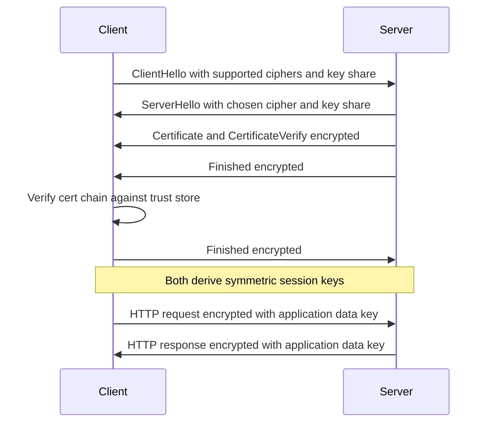
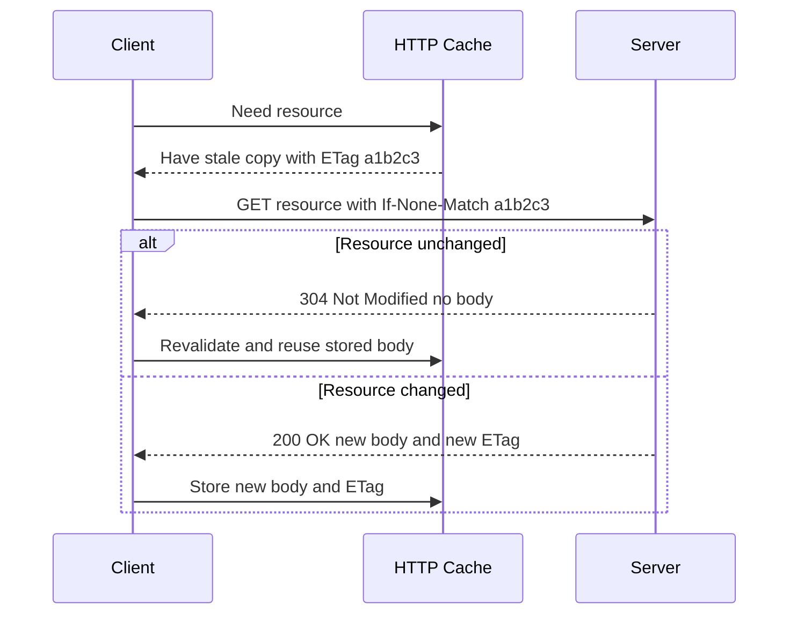
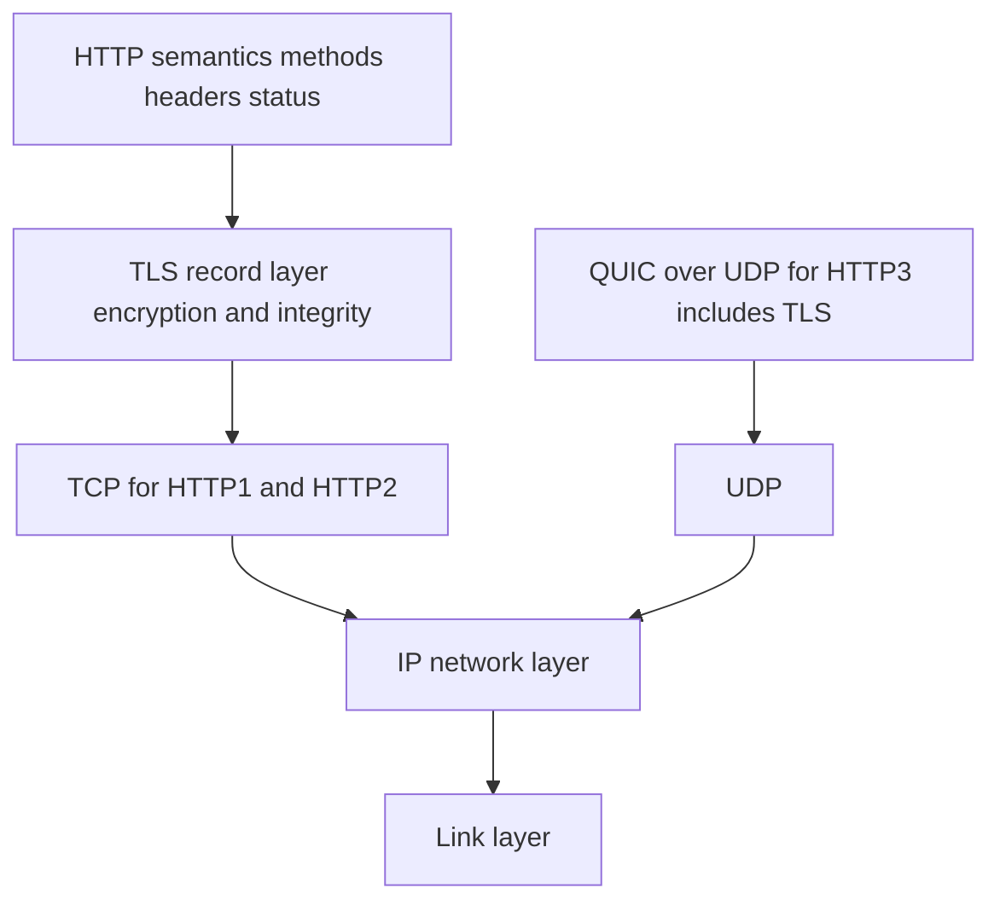
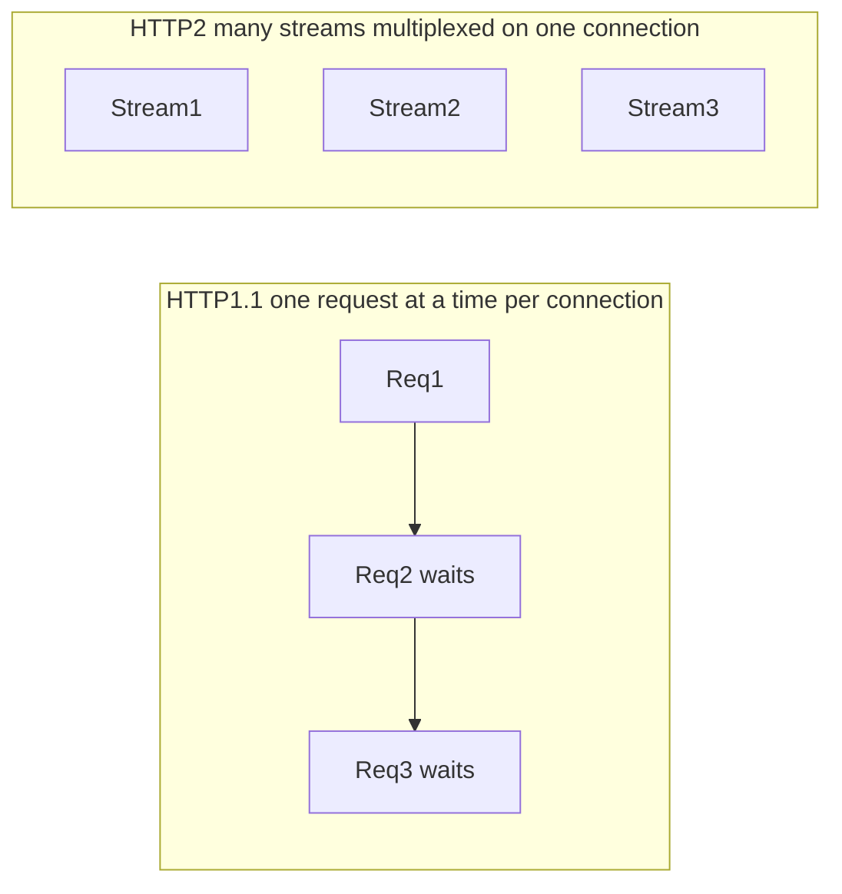

# HTTP & TLS Internals

> HTTP is a stateless, text-oriented request/response application protocol whose confidentiality, integrity, and authenticity are supplied underneath it by TLS, which uses asymmetric cryptography to authenticate a server via X.509 certificates and to agree on symmetric session keys.

## Introduction

Every network call your Flutter app makes — a REST fetch, a GraphQL query, an image download — rides on two layered protocols working together. **HTTP** defines *what* is said: a method, a target, headers, and a body flow up; a status code, headers, and a body flow back. **TLS** defines *how it is protected*: before a single HTTP byte crosses the wire, a cryptographic handshake authenticates the server and establishes keys so that everything after is encrypted and tamper-evident.

This document is internals-first. We do not start with "call `http.get`." We start with *why the protocol is shaped the way it is*, what problem each layer solves, and what actually happens on the socket, in memory, and inside the Dart VM / Flutter Engine when you make a request. By the end you should be able to reason about a captured packet trace, explain why HTTP/2 multiplexing removed head-of-line blocking at the application layer (and why HTTP/3 had to move to UDP to remove it at the transport layer), and implement certificate pinning correctly.

Cross-references for the applied Flutter side:
- [HTTP fundamentals (Networking)](../16%20Networking/http_fundamentals.md)
- [REST client and interceptors](../16%20Networking/rest_client_and_interceptors.md)
- [Network security and pinning](../37%20Security/network_security_and_pinning.md)
- [Networking and DNS foundations](./networking_and_dns.md)
- [Security foundations](./security_foundations.md)

## Why this concept exists

Before HTTP, moving a document between two machines meant a bespoke protocol per application. HTTP exists to provide **one uniform, extensible, human-readable contract** for requesting and transferring representations of resources, identified by URLs, independent of what the resource is (HTML, JSON, an image, a video segment). Its design goals were simplicity, extensibility (via headers), and statelessness so that any request could in principle be served by any server without shared session memory — which is exactly what makes horizontal scaling and CDNs possible.

TLS exists because HTTP was designed for a *trusted* network and the real internet is hostile. Any router between client and server can read, modify, or impersonate traffic. Three distinct guarantees were missing and had to be added underneath HTTP without changing HTTP itself:

- **Confidentiality** — an eavesdropper cannot read the bytes.
- **Integrity** — a man-in-the-middle cannot alter the bytes undetected.
- **Authenticity** — the client can prove it is really talking to `api.example.com` and not an impostor.

TLS is deliberately a *separate layer* precisely so HTTP stays simple: HTTP thinks it is writing to a plain socket; TLS transparently encrypts that stream. This separation of concerns is the whole reason `https://` is just `http://` over a TLS-wrapped TCP (or QUIC) connection.

## Real-world analogy

Think of **HTTP as the postal system's letter format**: a standard envelope with a "To" line (method + URL), sender metadata and instructions (headers), and contents (body); the reply comes back with a delivery stamp (status code) and its own contents. The postal service does not care whether the letter contains an invoice or a photo — the format is uniform.

**TLS is a tamper-evident, opaque diplomatic pouch with an identity check.** Before you hand over any letter, a courier shows you a **passport signed by a government you trust** (the certificate, signed by a Certificate Authority). You verify the signature chains up to a government you already recognize (the root CA in your trust store). Only then do you and the courier agree, in a way no onlooker can copy, on a **shared lockbox key** (the symmetric session key) using a clever public exchange (asymmetric key agreement). From then on every letter travels inside that locked, opaque box: onlookers see a box moving (confidentiality), cannot open or alter it undetected (integrity), and you know exactly whose passport opened it (authenticity).

**Certificate pinning** is the paranoid extra step: instead of trusting *any* passport a recognized government issues, you insist on *this specific passport* (or one signed by *this specific* internal authority) — so even a corrupt-but-recognized government cannot forge entry.

## Problem Statement

Concretely, the layered problems this topic solves:

1. **Uniform resource transfer** — how do arbitrary clients and servers agree on how to ask for and return arbitrary content? → HTTP message grammar (methods, headers, status codes).
2. **Statelessness vs. sessions** — HTTP has no memory between requests, yet apps need logins and carts. → cookies and bearer tokens re-supply state on each request.
3. **Redundant transfers** — refetching unchanged data wastes bandwidth and latency. → caching with `Cache-Control`, `ETag`, and conditional requests.
4. **Connection efficiency** — one TCP connection per request is expensive; serializing requests causes head-of-line blocking. → keep-alive → HTTP/2 multiplexing → HTTP/3 over QUIC.
5. **Security over a hostile network** — confidentiality, integrity, authenticity. → TLS handshake, certificates, chain of trust.
6. **Trust-store weaknesses on mobile** — a single compromised or malicious CA can MITM your users. → certificate/public-key pinning.

## Internal Working

### HTTP message anatomy

An HTTP/1.1 request is literally text on the wire:

```
GET /v1/users/42?expand=profile HTTP/1.1\r\n
Host: api.example.com\r\n
Accept: application/json\r\n
Authorization: Bearer eyJhbGci...\r\n
If-None-Match: "a1b2c3"\r\n
\r\n
```

- **Request line**: method, request-target, protocol version.
- **Headers**: case-insensitive `Name: Value` pairs, one per line, terminated by a blank line (`\r\n\r\n`).
- **Body** (optional): length delimited by `Content-Length` or `Transfer-Encoding: chunked`.

A response mirrors it:

```
HTTP/1.1 200 OK\r\n
Content-Type: application/json\r\n
ETag: "a1b2c3"\r\n
Cache-Control: max-age=60\r\n
Content-Length: 137\r\n
\r\n
{ "id": 42, "name": "Ada" }
```

### TLS 1.3 handshake (sequence)



The key insight: in TLS 1.3 the client sends its key share *in the very first message*, so after only **one round trip** both sides have exchanged public key material, derived the shared secret via an ephemeral (EC)DHE exchange, and can encrypt application data. The certificate is sent *encrypted*, and the `CertificateVerify` message is a signature over the handshake transcript proving the server owns the private key matching the certificate.

### HTTP conditional request / 304 flow (sequence)



### Statelessness and how state is added

HTTP itself keeps *no* memory: the server does not inherently know request N+1 came from the same client as request N. State is re-supplied on every request:

- **Cookies** — the server sends `Set-Cookie: session=abc; HttpOnly; Secure; SameSite=Lax`; the client echoes `Cookie: session=abc` on subsequent requests. Server-side session storage maps the opaque id to state.
- **Bearer tokens (JWT/OAuth)** — the client sends `Authorization: Bearer <token>`; the token itself (often signed and self-contained) carries identity/claims, so the server can be truly stateless.

Both work *because* HTTP faithfully replays headers — the statelessness of the protocol is preserved; state lives in the payload of well-known headers.

## Memory Representation

- **On the wire**: HTTP/1.1 is UTF-8/ASCII text; the body is raw bytes. There is no length-prefixing of headers — parsers scan for `\r\n` delimiters, which is why malformed line endings and header smuggling are historically dangerous.
- **In the Dart VM**: an `HttpClientRequest`/`HttpClientResponse` exposes headers as an `HttpHeaders` object (effectively a `Map<String, List<String>>` — a header name can legally repeat). The body is exposed as a `Stream<List<int>>` of byte chunks, *not* a preloaded `String`; you decode it (e.g. `utf8.decoder`) lazily. This streaming representation means a 1 GB download does not materialize fully in the heap unless you collect it.
- **HTTP/2 in memory**: headers are not stored as text but as entries in an **HPACK dynamic table** — an indexed, per-connection dictionary. A repeated header like `authorization` may be transmitted as a single index byte referencing a previously seen value. Both endpoints maintain synchronized copies of this table in memory.
- **TLS session state**: after the handshake, each endpoint holds symmetric keys, IVs, and sequence numbers in memory (never sent again). TLS 1.3 also allows a **resumption PSK** (pre-shared key ticket) to be cached so a later connection can skip the full handshake.

## Compiler Behavior

HTTP and TLS are runtime protocols, not language constructs, so the Dart compiler (`dart compile`, or the AOT/JIT pipelines) does **not** specialize them. What the compiler *does* affect:

- **Constant folding of literals** — your header names and URLs are ordinary `String` constants; if declared `const`, they are canonicalized once in the constant pool rather than reallocated per call.
- **Tree shaking** — in AOT builds, `dart:io` `HttpClient` code you never reference can be shaken out; on Flutter web, `dart:io` is unavailable at compile time and referencing it fails compilation, steering you to `package:http`/`dart:html` (`XMLHttpRequest`/`fetch`).
- **No inlining of crypto** — the TLS implementation is not Dart; it is native (BoringSSL) linked into the runtime, so the compiler treats it as an opaque FFI/native boundary.

The upshot: there is no compile-time knowledge of protocol versions or cipher suites; those are negotiated at runtime against the peer and the OS libraries.

## Runtime Behavior

At runtime a request proceeds through distinct phases, each with its own latency and failure mode:

1. **DNS resolution** — hostname → IP (see [networking and DNS](./networking_and_dns.md)). Cached by OS.
2. **TCP connect** (or QUIC/UDP for HTTP/3) — a three-way handshake (SYN/SYN-ACK/ACK) for TCP.
3. **TLS handshake** — 1-RTT (TLS 1.3) or 2-RTT (TLS 1.2), unless resumed (0-RTT/session ticket).
4. **Request send** — headers then body written to the encrypted stream.
5. **Server processing** — time-to-first-byte.
6. **Response stream** — chunks arrive; the runtime surfaces them as they land.
7. **Connection reuse** — with keep-alive/HTTP-2, the socket stays open in a pool for the next request, amortizing steps 1–3.

Runtime errors are layered: DNS failure, connection refused, TLS certificate rejection (thrown as `HandshakeException` in Dart), and finally HTTP-level errors expressed as *status codes* (a `404` is a perfectly successful transaction at the network layer — only the application semantics indicate "not found").

## Flutter Engine Behavior

Flutter itself has **no HTTP stack of its own** — networking is delegated to Dart libraries running on the Dart runtime that the engine embeds. What is engine-relevant:

- **Native/mobile/desktop targets**: `dart:io`'s `HttpClient` runs in the Dart isolate; TLS is performed by **BoringSSL**, which the Flutter engine bundles (the engine ships its own copy rather than relying on the OS TLS library on all platforms). The set of trusted root CAs comes from `SecurityContext.defaultContext`, which is seeded from the platform/engine trust store.
- **Image and asset loading**: `Image.network` ultimately uses the same `HttpClient` machinery, so pinning/proxy settings you configure can affect image loading too.
- **Web target**: there is no Flutter/Dart TLS at all. The **browser** performs the TLS handshake and certificate validation. Consequently **you cannot pin certificates on Flutter web**, cannot set arbitrary restricted headers, and are bound by CORS — the browser is in charge. Any pinning strategy must therefore live on native platforms only.

## Dart VM Behavior

- `dart:io HttpClient` is implemented atop the VM's native socket layer. TLS is not written in Dart; the VM calls into **BoringSSL** through native code. `SecureSocket`, `SecurityContext`, and `badCertificateCallback` are the Dart-visible seams into that native TLS engine.
- **Connection pooling**: a single `HttpClient` instance keeps a pool of persistent connections keyed by host+port+scheme and reuses them (`maxConnectionsPerHost`, `idleTimeout`). Creating a new `HttpClient` per request throws away this pooling and forces fresh TLS handshakes — a common performance bug.
- **`SecurityContext`**: wraps a native TLS context. You can add trusted certificates (`setTrustedCertificates`), client certificates for mutual TLS (`useCertificateChain` + `usePrivateKey`), or start from an empty context (`SecurityContext(withTrustedRoots: false)`) to trust *only* your pinned roots.
- **`badCertificateCallback`**: invoked by the VM when the default chain validation *fails*. Returning `true` overrides the failure. It is the hook people (mis)use for pinning — correct usage validates the leaf's public-key hash, not blindly returns `true`.
- **Isolates**: HTTP work is asynchronous and event-loop driven; the actual socket I/O runs on the VM's native I/O threads, so a download does not block the Dart isolate. Large body decoding, however, does run on the isolate and can jank the UI if not offloaded.

## Examples

All examples are null-safe and lint-clean.

### 1. Setting headers with `package:http`

```dart
import 'package:http/http.dart' as http;

Future<Map<String, dynamic>> fetchUser(String id, String token) async {
  final uri = Uri.https('api.example.com', '/v1/users/$id');
  final response = await http.get(
    uri,
    headers: <String, String>{
      'Accept': 'application/json',
      'Authorization': 'Bearer $token',
    },
  );

  if (response.statusCode == 200) {
    return jsonDecode(response.body) as Map<String, dynamic>;
  }
  throw HttpException('Unexpected status ${response.statusCode}');
}
```

### 2. ETag caching with a conditional request (`dart:io HttpClient`)

```dart
import 'dart:convert';
import 'dart:io';

/// Sends If-None-Match and reuses the cached body on 304.
Future<String> fetchWithEtag(
  HttpClient client,
  Uri uri, {
  String? cachedEtag,
  String? cachedBody,
}) async {
  final request = await client.getUrl(uri);
  request.headers.set(HttpHeaders.acceptHeader, 'application/json');
  if (cachedEtag != null) {
    request.headers.set(HttpHeaders.ifNoneMatchHeader, cachedEtag);
  }

  final response = await request.close();

  if (response.statusCode == HttpStatus.notModified && cachedBody != null) {
    // 304: nothing changed, reuse what we stored.
    return cachedBody;
  }

  final body = await response.transform(utf8.decoder).join();
  // Caller should persist response.headers.value(HttpHeaders.etagHeader)
  // together with `body` for the next call.
  return body;
}
```

### 3. Certificate pinning done properly (SPKI public-key hash)

The realistic, recommended approach is **public-key (SPKI) pinning**: pin the SHA-256 hash of the certificate's Subject Public Key Info, not the whole certificate (which rotates on renewal). `badCertificateCallback` should *only* accept a certificate whose key matches a known pin — never blanket-return `true`.

```dart
import 'dart:convert';
import 'dart:io';
import 'package:crypto/crypto.dart';

/// Set of allowed SHA-256 hashes of the server's public key (SPKI),
/// base64-encoded. Keep a backup pin so key rotation does not brick the app.
const Set<String> _pinnedSpkiSha256 = <String>{
  'AAAAAAAAAAAAAAAAAAAAAAAAAAAAAAAAAAAAAAAAAAA=', // primary
  'BBBBBBBBBBBBBBBBBBBBBBBBBBBBBBBBBBBBBBBBBBB=', // backup
};

HttpClient createPinnedClient() {
  final client = HttpClient();
  client.badCertificateCallback = (X509Certificate cert, String host, int port) {
    // NOTE: dart:io does not expose raw SPKI bytes directly; production code
    // typically pins via a native/platform plugin (e.g. an HttpClientAdapter
    // with a proper SPKI extractor). This illustrates the decision logic:
    // compute the pin from the presented cert and compare against allow-list.
    final der = cert.der; // full cert DER as a fallback surface
    final digest = sha256.convert(der);
    final presentedPin = base64.encode(digest.bytes);
    return _pinnedSpkiSha256.contains(presentedPin);
    // Returning `true` unconditionally would DISABLE all TLS validation.
  };
  return client;
}
```

> Reality check: `X509Certificate` in `dart:io` exposes only limited fields. Extracting the *SPKI* (rather than the whole DER, which changes on renewal) usually requires a platform plugin or a package such as an HTTP client adapter that supports SPKI pinning. Prefer a maintained pinning solution over hand-rolled `badCertificateCallback` logic, and see [network security and pinning](../37%20Security/network_security_and_pinning.md).

### 4. Trusting ONLY your own CA (empty root context)

```dart
import 'dart:io';

/// Build a client that trusts a single internal CA and nothing else.
HttpClient createInternalCaClient(List<int> caPem) {
  final context = SecurityContext(withTrustedRoots: false)
    ..setTrustedCertificatesBytes(caPem);
  return HttpClient(context: context);
}
```

## Diagrams

### Layering of HTTP over TLS over transport



### Multiplexing: HTTP/1.1 vs HTTP/2



## Common Mistakes

- **Creating a new `HttpClient` (or `Dio`) per request**, destroying connection pooling and forcing a fresh TLS handshake every time.
- **`badCertificateCallback = (a, b, c) => true`** — this disables ALL TLS validation, turning HTTPS into unauthenticated encryption vulnerable to trivial MITM. Never ship this.
- **Pinning the whole certificate instead of the public key**, so a routine certificate renewal (same key or same CA) bricks the app.
- **No backup pin** — a single pin plus lost key = permanently unreachable app until users update.
- **Treating a 3xx/4xx/5xx as a thrown exception in low-level clients** — `dart:io` does not throw on 404; you must check `statusCode`.
- **Ignoring `Cache-Control`/`ETag`** and refetching identical payloads, wasting battery and bandwidth.
- **Storing tokens in cookies without `HttpOnly`/`Secure`/`SameSite`**, or in `Authorization` headers logged to crash reporters.
- **Assuming pinning works on Flutter web** — it cannot; the browser owns TLS.
- **Blocking the isolate decoding huge bodies** instead of streaming or offloading.
- **Forgetting `Host` (HTTP/1.1) / `:authority` (HTTP/2) semantics** and SNI when hosting multiple domains on one IP.

## Best Practices

- Reuse a **single long-lived client** with a connection pool; close it on app shutdown.
- Prefer **`Cache-Control` + `ETag` conditional requests**; let 304s save bandwidth.
- Use **TLS 1.3** where available; disable legacy protocol versions and weak ciphers server-side.
- For pinning, pin the **SPKI SHA-256**, keep **≥2 pins** (current + backup/next), and have a remote kill-switch or short app-update cadence for rotation.
- Send only the headers you need; keep tokens out of logs; set `Secure`, `HttpOnly`, `SameSite` on cookies.
- Use **bearer tokens with short lifetimes + refresh** rather than long-lived credentials.
- Centralize networking in one layer with **interceptors** for auth, retries, and logging (see [REST client and interceptors](../16%20Networking/rest_client_and_interceptors.md)).
- Set sensible **timeouts** (connect, idle, total) and implement **retry with backoff + jitter** for idempotent methods only.
- Validate that pinning still lets you rotate — test the backup pin path.

## Performance

- **Connection reuse dominates**: the TCP + TLS handshake can cost 2–4 RTTs; amortizing it across many requests is the single biggest win. Keep-alive → HTTP/2 → HTTP/3 each reduce handshake and blocking costs.
- **Head-of-line blocking**: in HTTP/1.1 a slow response blocks everything behind it on that connection; browsers worked around this with 6 parallel connections. HTTP/2 multiplexes many logical streams over one connection, removing *application-layer* HOL blocking — but a single lost TCP packet still stalls all streams (*transport-layer* HOL blocking) because TCP delivers in order. **HTTP/3 over QUIC** gives each stream its own delivery context over UDP, so one lost packet only stalls its own stream.
- **HPACK header compression** (HTTP/2) shrinks repetitive headers (cookies, auth) from hundreds of bytes to a few index bytes per request.
- **TLS 1.3** cuts the handshake from 2-RTT (1.2) to 1-RTT, with optional **0-RTT resumption** for repeat visits (with replay caveats).
- **Caching** eliminates whole round trips; a 304 avoids re-sending the body; a fresh cache hit avoids the network entirely.
- **Body streaming** avoids large heap spikes and lets you start processing before download completes.

## Advantages

- **Uniform, extensible, human-readable** contract that has scaled from documents to APIs to streaming.
- **Statelessness** enables horizontal scaling, load balancing, and CDNs.
- **Layered security** via TLS without changing HTTP semantics.
- **Rich caching model** that reduces latency, cost, and load.
- **Version evolution is largely transparent** to application code — the same `GET /users` works over 1.1, 2, or 3.
- **Strong, well-audited cryptography** (TLS 1.3) with forward secrecy by default.

## Disadvantages

- **Statelessness pushes complexity up** — every request re-carries auth/session data.
- **Text framing (HTTP/1.1)** is verbose and parser-error-prone (request smuggling).
- **TCP HOL blocking** limits HTTP/2 on lossy networks; HTTP/3 needs UDP, which some networks throttle or block.
- **PKI trust model is fragile** — any trusted CA can issue for any domain; hence CT logs and pinning.
- **Pinning is operationally risky** — mismanaged rotation can brick clients.
- **TLS adds handshake latency and CPU**, mitigated but not eliminated by 1.3 and resumption.

## Interview Questions

**Q1. What does "HTTP is stateless" mean, and how do apps maintain sessions? 🟢**
The protocol keeps no memory between requests; each request is independent. State is re-supplied per request via cookies (`Set-Cookie`/`Cookie`, often mapping to server-side session storage) or bearer tokens (`Authorization: Bearer`, frequently self-contained JWTs). This preserves scalability because any server can handle any request as long as the client resends the identifying header.

**Q2. Explain the status code classes. 🟢**
1xx informational, 2xx success (200 OK, 201 Created, 204 No Content), 3xx redirection/conditional (301, 304 Not Modified), 4xx client error (400, 401, 403, 404, 409, 429), 5xx server error (500, 502, 503, 504). The class communicates who is responsible and whether a retry makes sense.

**Q3. Walk through an ETag conditional request. 🟢**
Server returns a body with `ETag: "v1"`. Client caches both. Next time it sends `If-None-Match: "v1"`. If unchanged, the server replies `304 Not Modified` with no body and the client reuses its cached copy; if changed, `200` with a new body and new ETag. This saves bandwidth on unchanged resources.

**Q4. What three guarantees does TLS provide, and how? 🟡**
Confidentiality (symmetric encryption of the record layer), integrity (AEAD/MAC detects tampering), and authenticity (the server proves ownership of a private key matching a certificate that chains to a trusted CA). Symmetric keys are agreed via an ephemeral (EC)DHE exchange authenticated by the certificate.

**Q5. Why does TLS use both asymmetric and symmetric cryptography? 🟡**
Asymmetric crypto solves key distribution and authentication (no shared secret needed beforehand) but is slow. Symmetric crypto is fast but needs a shared key. So TLS uses asymmetric key exchange *once* to authenticate and derive a shared symmetric session key, then encrypts all bulk data symmetrically.

**Q6. Differences between the TLS 1.2 and 1.3 handshakes? 🔴**
1.3 removes a round trip (1-RTT vs 2-RTT) by having the client send its key share in the ClientHello; it encrypts the certificate; it removes legacy/insecure ciphers (RSA key transport, static DH, RC4, CBC-mode MACs) and mandates forward-secret (EC)DHE and AEAD ciphers; and it supports 0-RTT resumption. Net result: faster and more secure by default.

**Q7. What is SNI and why does it exist? 🟡**
Server Name Indication is a TLS extension in the ClientHello carrying the target hostname, so a server hosting many domains on one IP can present the correct certificate *during* the handshake (before HTTP's `Host` header is even sent, since that is encrypted). Encrypted Client Hello (ECH) further hides SNI.

**Q8. What is head-of-line blocking and how do HTTP/2 and HTTP/3 address it? 🔴**
HOL blocking is when a delayed message stalls those behind it. HTTP/1.1 has it at the application layer (one response at a time per connection). HTTP/2 multiplexes streams to fix *application-layer* HOL, but a lost TCP segment still stalls all streams (transport-layer HOL). HTTP/3 runs over QUIC/UDP, giving each stream independent loss recovery, so a lost packet only blocks its own stream.

**Q9. What is HPACK? 🟡**
HTTP/2's header compression: a static table of common headers plus a per-connection dynamic table, with Huffman coding. Repeated headers (cookies, auth) are sent as small indices instead of full text, drastically reducing overhead. It was also designed to resist the CRIME compression attack (HTTP/3 uses QPACK to avoid HOL issues in the header table).

**Q10. What is the chain of trust and how is a certificate validated? 🔴**
A leaf certificate is signed by an intermediate CA, which is signed (transitively) by a root CA present in the client's trust store. Validation checks: signature at each link, validity dates, the hostname matches the certificate's SAN, revocation status (CRL/OCSP), and that key usage/basic-constraints are appropriate. If the chain terminates at a trusted root and all checks pass, the certificate is accepted.

**Q11. What is certificate pinning and why do mobile apps use it? 🔴**
Pinning restricts trust to a specific certificate or public key rather than the whole CA system, defeating MITM even by a compromised/malicious-but-trusted CA (or a user-installed root). Mobile apps use it because they control both client and server and face hostile networks, corporate proxies, and users who may install custom roots. Best practice is SPKI hash pinning with a backup pin and a rotation plan.

**Q12. Why can't you pin certificates on Flutter web? 🟡**
On web, the browser performs TLS and certificate validation; Dart never sees or controls the handshake and `dart:io`/`SecurityContext` is unavailable. So pinning, custom trust stores, and `badCertificateCallback` only exist on native platforms.

## Senior Engineer Tips

- Treat `badCertificateCallback` as a loaded gun: the only acceptable non-null implementation compares a computed pin against an allow-list; anything that can return `true` for an untrusted cert is a vulnerability.
- Pin the **key**, not the cert, and always ship a **backup pin**; wire pins to a config you can update out-of-band so you can rotate without an app-store release.
- Log the *negotiated* protocol and cipher in debug builds — knowing whether you actually got HTTP/2 or fell back to 1.1 explains latency mysteries.
- Reuse clients; watch `idleTimeout` and `maxConnectionsPerHost`. Connection churn is the most common self-inflicted latency source.
- Make retries **idempotent-only** and add jitter; blind retries on `POST` cause duplicate side effects.
- Distinguish "network failed" from "server said no" — surface status codes, not just exceptions, so callers can react correctly (401 → refresh token, 429 → back off).

## Architect Perspective

- **Where does trust live?** Decide between platform trust store (simplest, CA-based), private CA (internal PKI, trust only your root), or pinning (tightest, highest ops cost). Match to threat model: consumer app on hostile Wi-Fi vs. internal service mesh.
- **Protocol strategy**: prefer HTTP/2 for API multiplexing; adopt HTTP/3 where the client population is on lossy mobile networks and your edge/CDN supports it. Keep application code protocol-agnostic.
- **Caching as architecture**: push `Cache-Control`/`ETag` decisions to the API contract; use CDNs for static/edge-cacheable resources; design idempotent, cacheable `GET`s.
- **Statelessness enables scale**: prefer stateless token auth for horizontal scaling; if using server-side sessions, plan for a shared session store.
- **Observability**: standardize on an interceptor layer for tracing, metrics (TTFB, handshake time), and correlation IDs. See [REST client and interceptors](../16%20Networking/rest_client_and_interceptors.md).
- **Operational safety of security controls**: pinning, HSTS, and cert rotation must have runbooks; a security control that can brick your fleet is a reliability risk.

## Summary

HTTP is a uniform, stateless, extensible request/response protocol; state (sessions, auth) is layered on via cookies and tokens carried in headers. Efficiency evolved from HTTP/1.1 keep-alive, through HTTP/2 multiplexing + HPACK, to HTTP/3 over QUIC/UDP to defeat transport-layer head-of-line blocking. Caching (`Cache-Control`, `ETag`, conditional 304s) removes redundant transfer. Security comes from TLS underneath HTTP: it provides confidentiality, integrity, and authenticity by authenticating the server via an X.509 certificate that chains to a trusted CA and by deriving a fast symmetric session key through an authenticated asymmetric key exchange (1-RTT in TLS 1.3). SNI lets one IP serve many certs. On native Flutter, `dart:io HttpClient` uses BoringSSL and lets you customize trust via `SecurityContext` and `badCertificateCallback`; certificate pinning (ideally SPKI-hash with a backup pin) hardens mobile apps against CA compromise — but is impossible on web, where the browser owns TLS.

## Revision Notes

- Request = request-line + headers + blank line + optional body; response = status-line + headers + body.
- Status classes: 1xx info, 2xx ok, 3xx redirect/conditional, 4xx client, 5xx server.
- Stateless → cookies (`Set-Cookie`/`Cookie`) or `Authorization: Bearer`.
- Caching: `Cache-Control` (freshness), `ETag` + `If-None-Match` → 304 (revalidation).
- 1.1 keep-alive (HOL blocking) → 2 multiplex + HPACK + (deprecated) push → 3 QUIC/UDP (per-stream loss recovery).
- TLS guarantees: confidentiality, integrity, authenticity.
- TLS 1.3 = 1-RTT, encrypted cert, forward-secret ECDHE, AEAD only; 1.2 = 2-RTT.
- Chain of trust: leaf → intermediate → root in trust store; check signature, dates, hostname/SAN, revocation.
- Symmetric session key derived via asymmetric (EC)DHE; SNI selects the cert during handshake.
- Pin SPKI hash + backup pin; never `badCertificateCallback => true`; no pinning on web.
- Reuse one `HttpClient`; native uses BoringSSL.

## Practice Questions

1. Given `Cache-Control: max-age=0, must-revalidate` and an `ETag`, describe exactly what the next request sends and the two possible responses.
2. Draw the packet exchange for a first-visit HTTPS request over TLS 1.3 including TCP and handshake round trips; count the RTTs to first byte.
3. Explain why HTTP/2 did not fully solve head-of-line blocking and what specifically HTTP/3 changed.
4. A user installs a corporate root CA. Explain how this enables MITM and how pinning defends against it.
5. Why is the certificate sent encrypted in TLS 1.3 but not in 1.2? What does that protect?
6. Describe a safe certificate-pin rotation procedure that never bricks live clients.

## Coding Questions

1. Implement a caching wrapper that stores `(etag, body)` per URL and automatically adds `If-None-Match`, returning cached bodies on 304. (Extend Example 2.)
2. Write a function that, given a set of allowed SPKI base64 hashes, builds an `HttpClient` that rejects any server whose leaf key is not pinned, and unit-test the reject path with a non-matching hash.
3. Build an interceptor that logs the negotiated HTTP protocol version, TLS handshake duration, and time-to-first-byte for each request.
4. Implement idempotent retry-with-backoff-and-jitter for `GET`/`PUT`/`DELETE` only, respecting `Retry-After` on 429/503.
5. Given a raw HTTP/1.1 response string, parse it into status code, headers map (`Map<String, List<String>>`), and body, handling repeated headers.

## Mini Project

**Build a hardened, cache-aware API client for a Flutter app.**

Requirements:
1. A single long-lived `HttpClient`/`Dio` instance with connection pooling and sensible timeouts.
2. **Conditional caching**: persist `ETag` + body per endpoint (e.g. via `shared_preferences` or a small DB); send `If-None-Match`; serve 304s from cache. Honor `Cache-Control: max-age` for a local freshness window before revalidating.
3. **Certificate pinning** (native only): SPKI-hash pinning with a primary + backup pin, loaded from remote config so pins can rotate without an app release; gracefully no-op on web with a clear log line.
4. **Auth**: `Authorization: Bearer` with automatic refresh on 401 and a single-flight lock so concurrent 401s trigger only one refresh.
5. **Resilience**: idempotent retry with backoff + jitter, `Retry-After` support, and typed errors distinguishing transport failures from HTTP status errors.
6. **Observability**: an interceptor logging method, URL, status, negotiated protocol, handshake time, and TTFB in debug builds.
7. Tests: 304 revalidation path, pin-mismatch rejection, token-refresh single-flight, and retry backoff.

Stretch: add HTTP/3 support detection and fall back cleanly; add a remote "kill switch" that can disable pinning in an emergency rotation. See [network security and pinning](../37%20Security/network_security_and_pinning.md) and [security foundations](./security_foundations.md).
