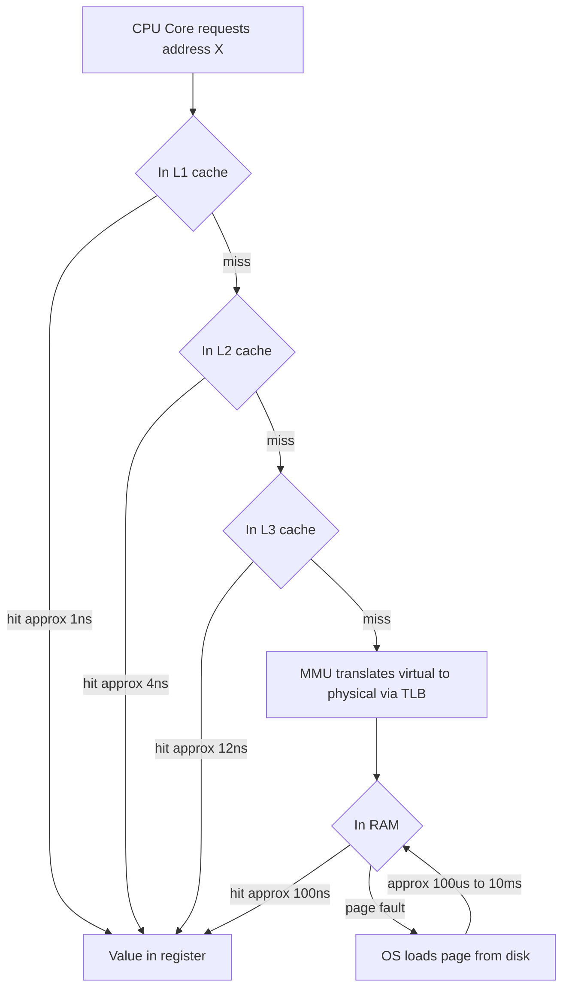
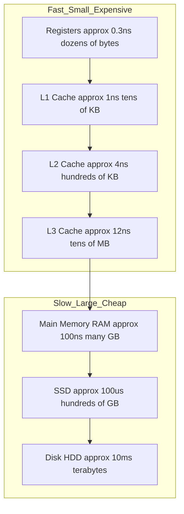
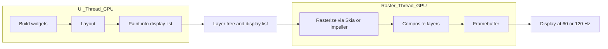

# Memory & Processors

> A computer is a hierarchy of progressively slower, larger, cheaper memories feeding two very different engines — a latency-optimized CPU and a throughput-optimized GPU — and almost all performance work is about respecting that hierarchy and that split.

## Introduction

Every line of Dart you write eventually becomes bytes moving between silicon that stores data (memory) and silicon that transforms it (processors). You cannot reason about performance, jank, allocation cost, or why a `ListView` stutters without a working mental model of *where* data lives and *how far* the processor has to reach to get it.

This chapter is deliberately platform-agnostic first. We build the universal model — memory hierarchy, stack vs heap, virtual memory, garbage collection, CPU vs GPU — and only then map it onto the Dart VM and the Flutter engine. The payoff: when you later read [Advanced Dart: memory & GC](../02%20Advanced%20Dart/memory_and_gc.md) or the [Rendering Pipeline](../09%20Rendering%20Pipeline/README.md), the internals will already feel obvious.

The single most important idea: **data has a location, locations have a cost, and the cost differs by orders of magnitude.** A register access and a disk access differ by roughly the ratio of one second to several months. Good engineers keep hot data close.

## Why this concept exists

Processors got fast far quicker than memory got fast. This is the *memory wall*: since the 1980s CPU clock speeds and instructions-per-cycle grew exponentially, while DRAM latency improved only modestly. A modern core can execute a few instructions per nanosecond, but a main-memory fetch costs ~100 ns — hundreds of wasted instruction slots.

Two structural responses emerged, and they are the reason this entire chapter exists:

1. **Caching hierarchy.** Insert small, fast, expensive memories (registers, L1/L2/L3 SRAM) between the core and slow DRAM, and bet that programs reuse data (temporal locality) and touch neighbors (spatial locality). The bet usually pays off, which is why cache-friendly code is fast code.
2. **Specialized parallelism.** One kind of workload (branchy, sequential, latency-sensitive) wants a smart core that predicts and reorders — the CPU. Another kind (uniform math over millions of elements) wants thousands of dumb-but-numerous lanes — the GPU. Rendering is the canonical mix of both, which is why the CPU/GPU split *is* the rendering pipeline.

Garbage collection and virtual memory exist for a parallel reason: manual memory management and single-address-space machines did not scale to safe, multiprogrammed, allocation-heavy software. Both trade a little runtime overhead for enormous gains in safety and programmer productivity.

## Real-world analogy

Think of a chef (the CPU core) cooking in a kitchen.

- **Registers** are the few ingredients already in the chef's hands.
- **L1 cache** is the cutting board right in front of them.
- **L2/L3 cache** is the counter and the nearby shelf.
- **RAM** is the pantry across the kitchen.
- **Disk/SSD** is the warehouse across town — you send a truck and wait.

A great chef minimizes trips to the warehouse by staging what they'll need on the counter (caching) and grabbing whole boxes rather than single items (cache lines, spatial locality).

The **GPU** is not a smarter chef — it is a stadium of 5,000 line cooks who can each only flip one identical burger, but all at once. Useless for a delicate seven-course tasting menu (branchy CPU work); unbeatable for grilling a million identical patties (rasterizing millions of pixels).

## Problem Statement

We need to answer, precisely:

- Where does a Dart object live, and what does it cost to read it?
- Why is stack allocation nearly free and heap allocation not?
- How does the OS give every process the illusion of its own huge, contiguous memory?
- Why does the Dart VM pause (sometimes) to collect garbage, and how does Flutter's build-heavy style stress it?
- Why does the same frame sometimes jank on the UI thread and sometimes on the raster thread — and why is that a CPU-vs-GPU question?

Concretely, the engineering problem is *latency and predictability*: keep the 16.67 ms frame budget (60 Hz) — or 8.33 ms at 120 Hz — while allocating objects, walking widget trees, and pushing pixels.

## Internal Working

The processor never talks to disk or even directly to RAM on the hot path. It talks to registers and caches; hardware and the OS conspire to fill those from below.

A memory read walks *up* the hierarchy on a miss:



Key mechanics layered into that diagram:

- **Cache lines.** Memory moves in fixed blocks, typically 64 bytes, not single words. Reading one `int` pulls in its 7 neighbors for free. This is why contiguous arrays crush linked structures.
- **MMU + page tables.** Programs use *virtual* addresses. The Memory Management Unit translates them to *physical* frames using page tables. Pages are typically 4 KB.
- **TLB (Translation Lookaside Buffer).** A tiny cache of recent virtual→physical translations. A TLB miss means walking page tables in memory — extra latency.
- **Page fault.** If a virtual page has no physical frame (never loaded, or swapped out), the CPU traps to the OS, which finds/loads the page. A *minor* fault just maps an existing frame; a *major* fault hits disk and is catastrophically slow.

## Memory Representation

Two regions dominate a running program's address space:

**Stack** — per-thread, grows/shrinks with function calls. Each call pushes a *stack frame* holding return address, saved registers, and local variables. Allocation is a single pointer decrement; deallocation is automatic on return. Fast, cache-hot, but bounded (stack overflow) and LIFO-only.

**Heap** — process-wide pool for objects whose lifetime outlives a single call or whose size isn't known at compile time. Allocation asks an allocator for a block; reclamation is manual (C/C++), or automatic via GC (Dart, Java, Go).

In Dart specifically:

- Primitive locals and references live conceptually on the stack (or in registers).
- All Dart *objects* (`List`, `String`, class instances, boxed numbers) live on the Dart **heap**, managed by the VM's garbage collector.
- `const` values are **canonicalized**: identical compile-time constants are deduplicated to a single shared instance, allocated once and never collected.

```dart
class Point {
  const Point(this.x, this.y);
  final int x;
  final int y;
}

void demo() {
  // `p` is a local reference living on the stack/register;
  // the Point object it refers to lives on the Dart heap.
  final p = Point(1, 2);

  // Canonicalization: a and b are the SAME heap object.
  const a = Point(3, 4);
  const b = Point(3, 4);
  assert(identical(a, b)); // true — one allocation, shared forever.

  // Non-const: two distinct heap allocations.
  final c = Point(3, 4);
  final d = Point(3, 4);
  assert(!identical(c, d)); // true — c and d are different objects.

  print('${p.x} ${a.x} ${c.x} ${d.y}');
}
```

## Compiler Behavior

The compiler (Dart's AOT `dart2native`/`gen_snapshot`, or the JIT in `dartdevc`/VM) makes several memory-relevant decisions before anything runs:

- **Register allocation.** Frequently used locals are kept in CPU registers instead of the stack when possible — the fastest storage there is.
- **Escape analysis (limited in Dart).** If an object provably never escapes a scope, an optimizing compiler may avoid heap allocation entirely (scalar replacement). Dart's AOT compiler does some of this; do not rely on it.
- **`const` folding & canonicalization.** Constant expressions are evaluated at compile time and interned into a read-only data section — zero runtime allocation and shared identity, as shown above.
- **Inlining.** Small methods are inlined to remove call overhead and enable further optimization; this changes what ends up on the stack.
- **Layout.** Field order and object headers are fixed at compile time so field access is a constant offset from the object pointer — a single load, cache-line friendly.

WHY it matters: the compiler is your first cache-locality ally. `const`, `final`, and small immutable objects give it the most room to keep things in registers and read-only memory.

## Runtime Behavior

At runtime the interplay is:

- **Function calls** push/pop stack frames. Deep recursion risks stack overflow because the stack is a fixed, small region (often ~1 MB per isolate thread).
- **Object creation** (`new`/implicit) bumps a pointer in the current heap region (bump-pointer allocation in young space — very fast) until that region fills, which triggers GC.
- **Dereferencing a reference** is a memory load whose cost depends entirely on where the target sits in the hierarchy. A freshly allocated, still-cache-hot object is cheap; a long-lived object cold in RAM costs ~100 ns.
- **Fragmentation.** Over time, freeing variable-sized heap blocks leaves holes. *External fragmentation*: enough free memory exists but not contiguously, so a large allocation fails. *Internal fragmentation*: allocator rounds requests up to size classes, wasting the slack. Compacting collectors (like Dart's) fight external fragmentation by relocating live objects together.

## Flutter Engine Behavior

Flutter renders a frame as a pipeline split cleanly along the CPU/GPU line — and understanding this split is how you diagnose jank.

**On the CPU (UI thread, runs Dart):**
1. Build — run `build()` methods, producing/updating the Element and RenderObject trees.
2. Layout — compute sizes and positions.
3. Paint — record drawing commands into a **layer tree / display list** (a list of "draw this rect, this text, this path" ops). Nothing is drawn yet; this is a *recording*.

The layer tree is then handed to the **raster thread**.

**On the GPU (raster thread, via Skia or Impeller):**
4. Rasterize — turn the display list into actual pixels: tessellate paths, run fragment shaders, composite layers, and hand the framebuffer to the compositor/display.

This is why jank has two distinct signatures:

- **UI-thread-bound jank** — expensive `build()`, huge widget trees, synchronous work, or GC pauses blow the CPU portion of the budget. Fix in Dart: cache, `const`, split builds, move work off-thread.
- **Raster-bound (GPU) jank** — too many layers, expensive shaders, large `saveLayer`/blur/opacity, shader compilation stalls. Fix in painting: fewer layers, cheaper effects, Impeller's precompiled shaders.

Impeller exists largely to eliminate one classic GPU-bound stall: Skia compiled shaders *on demand* at runtime (first-frame jank); Impeller precompiles them. See [rasterization with Skia and Impeller](../09%20Rendering%20Pipeline/rasterization_skia_impeller.md).

The mental model to carry: **CPU builds/lays out/paints a description; GPU turns the description into pixels.** They run on different threads and different silicon, so profile them separately (DevTools shows UI vs Raster timelines).

## Dart VM Behavior

The Dart VM uses a **generational, mostly-concurrent, compacting garbage collector** — designed exactly for Flutter's allocation storm.

Two generations:

- **Young space (new generation).** A small region collected by a **scavenger** (a copying, semi-space Cheney collector). Allocation is a pointer bump. Collection copies the *live* objects to the other semi-space and discards the rest wholesale — cost is proportional to *survivors*, not garbage. Since most objects die young (the *generational hypothesis*), the vast majority of a `build()`'s temporary widgets/objects are reclaimed almost for free.
- **Old space (old generation).** Objects that survive enough scavenges are *promoted* here. Old space is collected by **mark-sweep** (find reachable objects, sweep the rest) with **compaction** (relocate survivors to remove fragmentation). Runs less often, does more work.

WHY this maps so well to Flutter: a single frame's `build` allocates thousands of short-lived objects (Widgets are cheap, immutable, throwaway configuration). Generational GC makes those allocations and their reclamation cheap. But if a `build` allocates *too* much, a scavenge can still fire mid-frame and eat into the 16 ms budget — a GC pause is UI-thread jank.

Practical levers: minimize per-frame allocations, promote reuse via `const` widgets (never allocated in the hot path at all), and avoid retaining short-lived objects in long-lived fields (that forces promotion to old space and pressures the slower collector). Deep dive: [Advanced Dart memory & GC](../02%20Advanced%20Dart/memory_and_gc.md).

## Examples

**1. Cache locality — row-major vs column-major traversal.** Same work, wildly different speed because of cache lines.

```dart
import 'dart:typed_data';

int sumRowMajor(Float64List m, int n) {
  var total = 0.0;
  for (var r = 0; r < n; r++) {
    for (var c = 0; c < n; c++) {
      total += m[r * n + c]; // sequential addresses -> cache-friendly
    }
  }
  return total.toInt();
}

int sumColMajor(Float64List m, int n) {
  var total = 0.0;
  for (var c = 0; c < n; c++) {
    for (var r = 0; r < n; r++) {
      total += m[r * n + c]; // jumps n*8 bytes each step -> cache-hostile
    }
  }
  return total.toInt();
}
```

For a large `n`, `sumRowMajor` can be several times faster despite identical arithmetic — because it walks memory in cache-line order.

**2. Allocation pressure — reuse vs re-allocate in a hot loop.**

```dart
// BAD: allocates a fresh List every call; feeds the young-space GC.
List<int> scaledBad(List<int> src, int k) {
  return src.map((x) => x * k).toList(); // new list + new closure each call
}

// BETTER: write into a caller-owned buffer; zero per-call heap growth.
void scaledInto(List<int> src, int k, List<int> out) {
  for (var i = 0; i < src.length; i++) {
    out[i] = src[i] * k;
  }
}
```

**3. `const` to skip allocation entirely in `build`.**

```dart
// The const SizedBox is canonicalized once; rebuilding this widget
// re-uses the same heap object instead of allocating per frame.
const spacer = SizedBox(height: 8);
```

## Diagrams

**Memory hierarchy pyramid** — smaller and faster at the top, larger and slower at the bottom:



**CPU to GPU rendering handoff** — the split that defines the frame:



## Common Mistakes

- **Ignoring cache locality.** Choosing pointer-chasing structures (linked lists, maps) for tight numeric loops where a contiguous `List`/`typed_data` would keep the CPU fed.
- **Allocating in the hot path.** Building throwaway lists, closures, and objects inside `build()` or per-frame callbacks, then blaming "Flutter" for the resulting GC jank.
- **Confusing the two threads.** Assuming all jank is Dart/UI-thread. Blur, `saveLayer`, and opacity groups are GPU-bound and won't show up as slow Dart code.
- **Treating stack and heap the same.** Deep recursion overflowing the stack; assuming a local object is "free" when it's actually a heap allocation.
- **Over-trusting `const`.** Forgetting that only compile-time-constant expressions canonicalize; anything with a runtime value still allocates.
- **Fearing GC into premature optimization.** Micro-pooling every object; the scavenger already makes short-lived allocation cheap.

## Best Practices

- Keep hot data **contiguous and small**; prefer `typed_data` (`Uint8List`, `Float64List`) for numeric buffers.
- Make widgets `const` wherever possible — the single biggest, cheapest allocation win in Flutter.
- Reuse buffers across frames/iterations instead of reallocating.
- Split large `build()` methods so only the parts that changed rebuild; keep the per-frame allocation count low.
- Profile UI thread and Raster thread **separately** in DevTools before optimizing.
- Access memory in **the order it is laid out** (row-major, forward iteration).
- Let the GC do its job for short-lived objects; only pool objects that are large, expensive to construct, or provably hot.

## Performance

The numbers everyone should internalize (orders of magnitude; exact values vary by hardware):

| Operation | Approx latency | Relative (1 ns = 1 s) |
|---|---|---|
| L1 cache reference | ~1 ns | 1 second |
| Branch mispredict | ~3 ns | 3 seconds |
| L2 cache reference | ~4 ns | 4 seconds |
| Mutex lock/unlock | ~17 ns | 17 seconds |
| Main memory (RAM) reference | ~100 ns | ~2 minutes |
| Compress 1 KB (fast) | ~2 µs | ~33 minutes |
| Read 1 MB sequentially from RAM | ~50 µs | ~14 hours |
| SSD random read | ~150 µs | ~1.7 days |
| Round trip within datacenter | ~500 µs | ~5.8 days |
| Read 1 MB sequentially from SSD | ~1 ms | ~11 days |
| Disk seek (HDD) | ~10 ms | ~4 months |
| Read 1 MB from spinning disk | ~20 ms | ~7.5 months |
| Network round trip CA to Netherlands | ~150 ms | ~5 years |

The takeaways behind the table:
- **RAM is ~100× slower than L1.** Cache misses, not arithmetic, dominate most "slow" loops.
- **Sequential beats random by orders of magnitude** at every level (prefetching + cache lines).
- **A branch mispredict costs as much as several cache hits** — predictable branches matter in tight loops.
- **Disk is a different universe.** Any disk access on a frame path is game over for smoothness; that's what page faults and cold I/O cost you.

For Flutter-specific memory tuning, see [Performance: memory optimization](../21%20Performance/memory_optimization.md).

## Advantages

- **Caching hierarchy** delivers near-register speed for well-behaved programs at RAM prices — an enormous cost/performance win, transparently.
- **Virtual memory** gives isolation, protection, and the illusion of abundant contiguous memory; enables demand paging and memory-mapped files.
- **Garbage collection** eliminates use-after-free and double-free bugs, and generational GC makes idiomatic allocation-heavy code (like Flutter's) cheap.
- **CPU/GPU specialization** lets each engine be excellent at its workload instead of mediocre at both.

## Disadvantages

- **Caches are invisible and non-portable.** Cache-hostile code is slow with no compile error; behavior differs across CPUs.
- **Virtual memory adds translation overhead** (TLB misses, page walks) and page faults can cause unpredictable stalls.
- **GC introduces pauses and non-determinism** — a scavenge mid-frame is jank; you trade control for safety.
- **The CPU/GPU split adds coordination cost** — thread hand-off, synchronization, and two separate performance ceilings you must both respect.
- **Fragmentation** wastes memory and can cause allocation failure even with "enough" free space.

## Interview Questions

**1. Walk me through the memory hierarchy and rough latencies. 🟢**
Registers (~0.3 ns) → L1 (~1 ns) → L2 (~4 ns) → L3 (~12 ns) → RAM (~100 ns) → SSD (~100 µs) → HDD (~10 ms). Each level is larger, slower, and cheaper per byte. Caches exist to bridge the ~100× gap between the core and RAM by exploiting temporal and spatial locality.

**2. Stack vs heap — what goes where and why is one faster? 🟢**
Stack holds call frames and locals; allocation is a pointer bump and deallocation is automatic on return, so it's fast and cache-hot but LIFO and size-bounded. Heap holds objects with dynamic size or lifetime; allocation involves an allocator and reclamation needs GC or manual `free`. In Dart, all objects live on the heap; references/primitives live on stack/registers.

**3. What is a cache line and why does it make row-major iteration faster? 🟡**
Memory transfers in fixed blocks (typically 64 bytes). Reading one element loads its neighbors for free. Row-major traversal touches consecutive addresses, so each cache line is fully used; column-major jumps a row-stride each step, wasting most of every loaded line and causing far more misses.

**4. Explain virtual memory, the MMU, TLB, and a page fault. 🟡**
Programs use virtual addresses; the MMU translates them to physical frames via page tables (pages ~4 KB). The TLB caches recent translations to avoid page-table walks. A page fault occurs when a virtual page isn't mapped to a physical frame — the OS traps, loads/maps the page (from disk on a major fault, ~ms), and resumes. Minor faults are cheap; major faults are extremely slow.

**5. Internal vs external fragmentation, and how do compacting collectors help? 🟡**
Internal fragmentation is wasted space inside an allocated block (rounding to size classes). External fragmentation is free memory scattered in non-contiguous holes so a large request fails despite sufficient total free space. Compacting collectors relocate live objects together, eliminating external fragmentation and restoring large contiguous free regions.

**6. Describe mark-sweep and generational GC. 🟡**
Mark-sweep: traverse from roots marking reachable objects, then sweep (reclaim) the unmarked. Generational GC splits the heap by age: a small young generation collected frequently and cheaply (most objects die young), and an old generation collected rarely. Survivors are promoted young→old. It exploits the generational hypothesis to make common short-lived allocation nearly free.

**7. How does Dart's GC work and why does it suit Flutter? 🔴**
Dart uses a generational, compacting, mostly-concurrent collector. Young space uses a copying scavenger (cost proportional to survivors); old space uses mark-sweep-compact. Flutter's `build` allocates masses of short-lived immutable widgets, which the scavenger reclaims cheaply — a near-perfect match. Excessive per-frame allocation can still trigger a scavenge inside the frame budget, causing jank.

**8. CPU vs GPU — architectural differences and when to use each. 🟡**
CPU: few powerful cores, deep pipelines, branch prediction, out-of-order execution, large caches — optimized for latency and branchy sequential work. GPU: thousands of simple lanes executing in SIMD/SIMT lockstep — optimized for throughput on uniform, data-parallel work. Use CPU for control-heavy logic; GPU for massively parallel math like shading millions of pixels.

**9. Why is the CPU/GPU split the mental model of Flutter rendering? 🔴**
The UI thread (CPU) runs Dart to build, lay out, and paint — producing a layer tree / display list (a *description* of the frame). The raster thread hands that to the GPU (Skia/Impeller) which rasterizes and composites pixels. Build/layout/paint = CPU; rasterize = GPU. This is why jank splits into UI-thread-bound vs raster-bound, diagnosed on separate DevTools timelines.

**10. What causes raster-thread (GPU-bound) jank specifically? 🔴**
Too many layers to composite, expensive fragment shaders, `saveLayer`, blurs, and opacity/clip groups, plus runtime shader compilation stalls (classic with Skia's on-demand compilation). Fixes: reduce layer count, avoid costly effects, and use Impeller which precompiles shaders to eliminate first-use compilation jank.

**11. What is branch prediction and what does a mispredict cost? 🟡**
A pipelined CPU guesses the outcome of a branch and speculatively executes ahead. A correct guess is free; a mispredict flushes the pipeline (~10–20 cycles, on the order of a few ns), comparable to several cache hits. Predictable, sorted, or branchless code runs measurably faster in tight loops.

**12. How does `const` in Dart interact with allocation and the heap? 🟢**
Compile-time constants are evaluated at compile time and *canonicalized* — identical constants become one shared, immortal heap object placed in read-only data. This means zero allocation in the hot path and shared identity (`identical(a, b)` is true). In Flutter, `const` widgets are not re-allocated on rebuild, cutting GC pressure.

## Senior Engineer Tips

- **Measure locality with a profiler, not intuition.** Cache misses are invisible in source; use DevTools/OS profilers and look at the actual timeline, not guesses.
- **Count allocations per frame.** In DevTools memory view, a healthy frame's young-gen churn should be modest. Spikes correlate with GC-induced jank.
- **`const` propagates.** A `const` constructor lets *callers* be `const` too. Mark leaf widgets `const`-constructible to unlock canonicalization up the tree.
- **Prefer `typed_data` for numeric hot paths** — it's contiguous, unboxed, and cache-friendly, unlike `List<double>` which may box.
- **Know which thread you're fighting.** Before optimizing, confirm whether the red bar is UI (Dart/CPU) or Raster (GPU). Optimizing the wrong side wastes days.
- **Avoid retaining short-lived objects in long-lived collections** — it forces promotion to old space and shifts load onto the slower mark-sweep collector.

## Architect Perspective

At system scale, the memory hierarchy and CPU/GPU split reappear as *architecture*:

- The latency table generalizes: L1→RAM→disk→network is the same "each hop is orders of magnitude slower" law. Datacenter round trips, cross-region calls, and cold-storage reads are just lower tiers of the same pyramid. Design to keep hot data at the highest affordable tier (CDN edge caches, in-memory caches, local SQLite before network).
- **Batching and locality** scale up: coalesce network requests the way cache lines coalesce memory reads; page/stream large datasets the way the OS pages memory.
- **Specialization scales up:** offload parallel work (image processing, ML inference) to GPU/accelerators or isolates/workers, mirroring the CPU/GPU division on-device.
- **Predictability is a feature.** GC pauses, page faults, and shader compilation are all *tail-latency* sources. Architecting for smooth p99 means eliminating unpredictable stalls (precompile shaders, pre-warm caches, avoid sync I/O on hot paths) — the same discipline whether the unit is a frame or an API request.

## Summary

Computers are built around one uncomfortable truth: processors are far faster than memory. The response is a **hierarchy** (registers → caches → RAM → disk) whose latencies span ~7 orders of magnitude, and **specialized processors** (latency-optimized CPU, throughput-optimized GPU). Programs are fast when they respect locality and keep hot data high in the hierarchy.

The **stack** is cheap, automatic, and bounded; the **heap** holds dynamic objects and needs reclamation. **Virtual memory** (MMU, pages, TLB, page faults) gives isolation and the illusion of abundant contiguous memory. **Garbage collection** — especially generational, as in the Dart VM — makes allocation-heavy code safe and, for short-lived objects, cheap.

In Flutter, the CPU/GPU split *is* the rendering pipeline: the UI thread builds/lays out/paints a display list; the raster thread rasterizes it on the GPU. This split explains why jank is either UI-thread-bound or raster-bound, and why generational GC and `const` canonicalization are your primary tools for keeping the frame budget.

## Revision Notes

- Hierarchy: registers ~0.3 ns, L1 ~1 ns, L2 ~4 ns, L3 ~12 ns, RAM ~100 ns, SSD ~100 µs, HDD ~10 ms.
- Cache line ≈ 64 bytes; page ≈ 4 KB; TLB caches virtual→physical translations.
- Stack: pointer-bump, auto-free, LIFO, bounded. Heap: allocator + GC, dynamic lifetime.
- Fragmentation: internal (rounding slack) vs external (scattered free space, fixed by compaction).
- GC: mark-sweep marks reachable then sweeps; generational splits young (scavenger, cheap) / old (mark-sweep-compact).
- Dart VM: generational + compacting; young = copying scavenger, old = mark-sweep-compact; survivors promoted.
- CPU = few smart cores, branch prediction, deep pipelines. GPU = thousands of SIMD lanes, throughput.
- Flutter frame: CPU build→layout→paint→display list; GPU rasterize→composite→framebuffer.
- Jank is UI-thread-bound (Dart/GC) OR raster-bound (layers/shaders/blur); Impeller precompiles shaders.
- `const` = compile-time canonicalized, shared, zero hot-path allocation.

## Practice Questions

1. Convert the L1-vs-RAM latency ratio into the "1 ns = 1 s" human scale and explain what it implies for loop design.
2. Given a 2D array stored row-major, which loop nesting order minimizes cache misses and why?
3. Explain the sequence of events, step by step, when a program dereferences a pointer to a page that has been swapped to disk.
4. Why does the generational hypothesis make a copying scavenger cheap even for programs that allocate constantly?
5. A Flutter screen janks. Describe how you'd determine whether it's UI-thread-bound or raster-bound, and give one fix for each case.
6. Why can two `const Point(3,4)` values be `identical`, but two `Point(3,4)` (non-const) values cannot?

## Coding Questions

1. **Locality benchmark.** Write a Dart program that times `sumRowMajor` vs `sumColMajor` (from Examples) over a 2048×2048 `Float64List` and reports the ratio. Explain the result.
2. **Allocation counter.** Write a loop that builds 1,000,000 small objects two ways — reusing one mutable buffer vs allocating a new object each iteration — and compare wall-clock time. Relate the difference to young-space GC.
3. **`const` proof.** Write code using `identical()` to demonstrate canonicalization of `const` objects and non-canonicalization of runtime-constructed equivalents.
4. **Stack depth.** Write a recursive function and empirically find the approximate recursion depth at which Dart throws a stack overflow; then rewrite it iteratively with an explicit heap-allocated stack.
5. **Branch cost.** Sum only the values above a threshold in a large `Int32List`, once with the array sorted and once unsorted, and measure the difference; explain via branch prediction.

## Mini Project

**Build a "Frame Budget Visualizer" in Flutter.**

Goal: internalize the CPU/GPU split and allocation cost by watching them live.

Requirements:
1. A screen with a slider controlling `N`, the number of animated items (widgets) on screen (100 → 20,000).
2. Two render modes toggled by a switch:
   - *Allocation-heavy*: each item rebuilt with freshly allocated, non-`const` widgets and a new gradient/`saveLayer` per item.
   - *Optimized*: `const` widgets where possible, buffers reused, effects minimized.
3. Overlay a rolling FPS counter and, using `SchedulerBinding`/`Timeline`, display separate approximate UI-thread and raster-thread frame times.
4. Add a "GC pressure" readout using `dart:developer` / DevTools observations, and note in the UI when frame time spikes coincide with allocation spikes.

Deliverable: a short write-up answering — *At what N does each mode start to jank? Is the bottleneck UI-thread or raster? Which single change (const-ification, fewer layers, buffer reuse) bought the most budget?* Correlate your findings with the memory hierarchy and CPU/GPU concepts in this chapter, and cross-reference [the rendering pipeline](../09%20Rendering%20Pipeline/README.md) and [memory optimization](../21%20Performance/memory_optimization.md).
