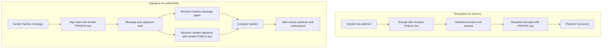
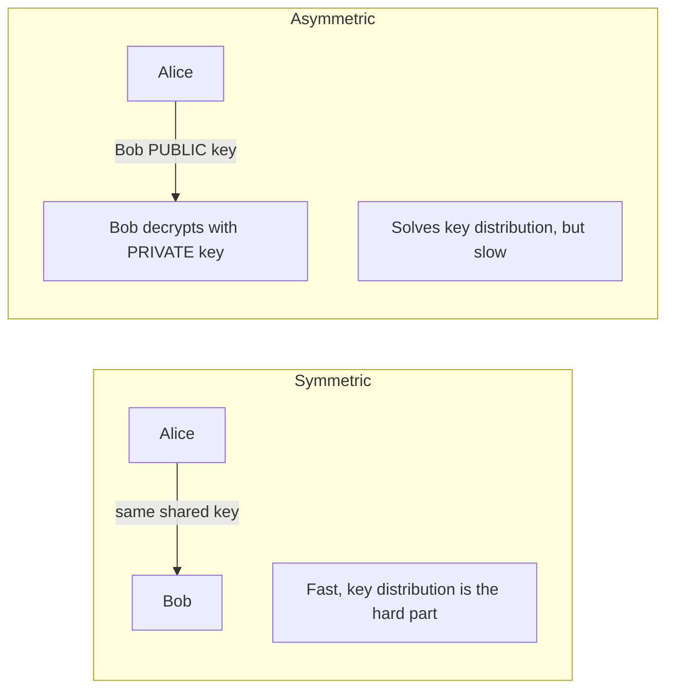
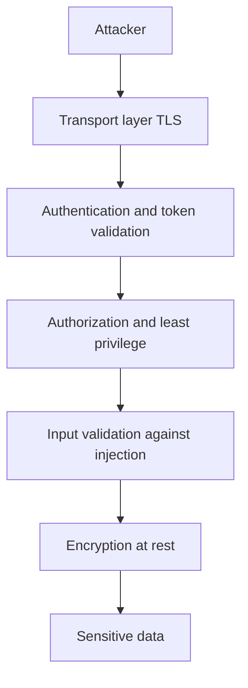

# Security Foundations

> Security is the discipline of preserving **confidentiality, integrity, and availability** of data using cryptographic primitives (hashing, symmetric/asymmetric encryption, signatures) plus authentication, authorization, and threat modeling — and the golden rule is *never roll your own crypto* and *never trust the client*.

## Introduction

Every "secure" app you build stands on a small pile of computer-science primitives that have nothing to do with Flutter, Dart, or even mobile. A login screen, an HTTPS request, an encrypted database, a signed JWT — all of them are just applications of four ideas: **hash it, encrypt it (symmetric), exchange a key (asymmetric), and prove who signed it (signatures)**.

This chapter is deliberately **platform-agnostic**. We are not learning `flutter_secure_storage` here (that lives in [../37%20Security/secure_storage_and_encryption.md](../37%20Security/secure_storage_and_encryption.md)). We are learning *why* it works, so that when you read that a token is "HMAC-SHA256 signed" or that storage uses "AES-GCM with a Keychain-backed key," you know exactly what each word buys you and what it does not.

The single most important literacy this chapter installs is the difference between **encoding, hashing, and encryption** — three operations that look similar to a beginner and that interviewers love to conflate on purpose.

## Why this concept exists

Security primitives exist because the world assumes an **adversary on the wire and on the device**. Concretely:

- **Data travels over networks you do not control.** Wi-Fi, ISPs, and cell towers can read and modify traffic. We need *confidentiality* (they cannot read it) and *integrity* (they cannot silently change it) — this is what encryption + authentication tags provide, and it is the whole point of TLS ([./http_and_tls.md](./http_and_tls.md)).
- **Data rests on devices that get stolen, rooted, or shared.** A stolen phone should not leak passwords or tokens. Hence hashing (so the server never stores a recoverable password) and encryption-at-rest.
- **You cannot trust identities by default.** Anyone can claim to be `admin`. *Authentication* answers "who are you," *authorization* answers "what may you do," and *non-repudiation* (signatures) answers "can you later deny you did it."
- **Humans reuse weak passwords.** A database breach must not immediately hand attackers usable passwords elsewhere. Slow, salted password hashing (bcrypt/scrypt/Argon2) exists precisely to make cracking expensive.

These primitives are old, peer-reviewed, and battle-tested. The reason "never roll your own crypto" is a law rather than a suggestion is that the failure modes (timing side channels, nonce reuse, padding oracles) are invisible to functional testing — the code "works" while being completely broken.

## Real-world analogy

Think of a **bank and its physical security**, mapping each primitive to something tangible:

- **Confidentiality** = a locked safe. Only key-holders see inside.
- **Integrity** = a tamper-evident seal on a package. You can tell if someone opened it, even if they could see through the wrapper.
- **Availability** = the bank being *open*; a vault you can never open is useless.
- **Authentication** = showing your ID at the counter ("who are you").
- **Authorization** = your account permissions ("you may withdraw from *this* account only").
- **Non-repudiation** = your ink signature on a withdrawal slip — later you cannot claim "that wasn't me."
- **Hashing** = a document shredder that also prints a unique fingerprint of what it ate: you can verify a document matches the fingerprint, but you can never reconstruct the document from the fingerprint.
- **Symmetric encryption** = one shared key for a padlock; both parties hold identical copies.
- **Asymmetric encryption** = a mailbox with a public slot (anyone can drop letters in → public key) and a private key only you own to open it.
- **Digital signature** = a wax seal made from *your* signet ring (private key); anyone with a picture of your ring's imprint (public key) can confirm it is genuinely yours.

## Problem Statement

We must solve these concrete problems with math, not trust:

1. **Store a password so that a database dump does not reveal it** — even the server admin must not be able to read it.
2. **Send a secret over a hostile network** to someone we have never met, without pre-sharing a key in person.
3. **Detect any tampering** of a message, deliberate or accidental.
4. **Prove authorship** so the sender cannot deny it and no one can forge it.
5. **Verify identity** of a remote party (is this really `bank.com`?).
6. Do all of the above **fast enough** for a phone, and **correctly** despite a motivated attacker.

The rest of the chapter maps each problem to a primitive and shows where the traps are.

## Internal Working

The two hardest primitives to intuit are **asymmetric encryption** and **digital signatures** — they use the same key pair but in opposite directions. Encryption uses the *recipient's* keys for secrecy; signing uses the *sender's* keys for authenticity.



Key mental model:

- **Public key encrypts, private key decrypts** → confidentiality. Anyone can send *you* a secret; only you can read it.
- **Private key signs, public key verifies** → authenticity + integrity + non-repudiation. Only *you* can produce the signature; anyone can check it.

In practice asymmetric crypto is slow, so TLS uses it only briefly to agree on a shared symmetric key (via key exchange), then switches to fast symmetric encryption — see below and [./http_and_tls.md](./http_and_tls.md).

## Memory Representation

- **Keys and digests are just byte arrays.** A SHA-256 digest is 32 bytes (256 bits). An AES-256 key is 32 bytes. An RSA-2048 key is ~256 bytes of modulus plus exponent; an ECC P-256 key is ~32 bytes — one reason ECC is preferred on mobile.
- **In Dart these are `Uint8List` / `List<int>`.** The `crypto` package returns a `Digest` whose `.bytes` is a `List<int>`; you rarely keep the raw string.
- **Secret material must be minimized in memory.** Unlike C, Dart/managed runtimes give you *no reliable way to zero out* a key after use — the GC may copy or retain it. This is a fundamental limitation: sensitive keys ideally live in platform secure hardware (Keychain, Keystore, StrongBox), and Dart only holds *handles*, not raw key bytes. That is exactly what secure storage does ([../37%20Security/secure_storage_and_encryption.md](../37%20Security/secure_storage_and_encryption.md)).
- **Salts and IVs/nonces are also byte arrays**, stored *alongside* the ciphertext or hash in the clear — they are not secret, only unique/random.

## Compiler Behavior

**Not applicable — because** cryptographic security is a property of *runtime data and algorithms*, not of how source compiles. The Dart compiler (AOT/JIT/`dart2js`) does not know or care that a `Uint8List` holds a key; it applies the same optimizations as to any bytes.

Two caveats worth stating so you do not over-trust the compiler:

- Compilers may **eliminate "dead" writes** that zero out a buffer, defeating attempts to wipe secrets — another reason not to rely on in-language secret wiping.
- Compilers may introduce **data-dependent branches/timing** that leak information; constant-time guarantees come from the *crypto library's* implementation, never from the compiler. This is a core reason to *never roll your own crypto*.

## Runtime Behavior

At runtime the security guarantees are enforced by:

- **The algorithm's math** (e.g., AES rounds, modular exponentiation) executed by a vetted library.
- **Randomness quality.** Salts, IVs, nonces, and keys must come from a **cryptographically secure RNG** (`Random.secure()` in Dart, backed by the OS CSPRNG). A regular `Random()` is predictable and catastrophic here.
- **Correct parameter use.** GCM must never reuse a (key, nonce) pair; CBC needs a random IV per message; RSA needs proper padding (OAEP for encryption, PSS for signatures). Runtime misuse — not weak math — is how real systems break.
- **Verification before use.** For authenticated encryption (GCM) the tag is checked at decrypt time; a failed tag must *abort* — you must not use partially-decrypted plaintext.

## Flutter Engine Behavior

**Not applicable — because** the Flutter engine (Skia/Impeller rendering, the embedder, the platform channel bus) performs no cryptography and defines no security primitives. Any crypto either runs in Dart (via `crypto`/`pointycastle`) or is delegated over platform channels to native OS APIs (Keychain, Keystore, `SecureRandom`). The engine only *ferries bytes*; it neither strengthens nor weakens them.

## Dart VM Behavior

- **Crypto is CPU-bound.** Hashing a large file, running Argon2, or doing RSA operations are pure computation. On the Dart VM they run **synchronously on whatever isolate calls them** — and the UI runs on the *main* isolate.
- **Therefore: hash/encrypt large data on a background `Isolate`.** A multi-hundred-millisecond `sha256` over a big blob on the main isolate will **jank the UI** (dropped frames). Use `Isolate.run` (Dart 2.19+) or `compute` for anything non-trivial. Password KDFs (Argon2/scrypt) are *deliberately slow* — always off the UI isolate.
- **Pure-Dart crypto (`pointycastle`) is slower than native.** It is portable but not hardware-accelerated. For heavy symmetric encryption prefer native platform crypto (which may use AES-NI) via a plugin.
- **The VM's CSPRNG (`Random.secure()`)** delegates to the OS entropy source; it is safe to seed keys/nonces with it. `Random()` (the default) uses a fast, *insecure* PRNG — never use it for security.

## Examples

Dart has **no built-in AES**. The `crypto` package covers hashing and HMAC; for AES you need `pointycastle` (pure Dart) or a platform plugin. All examples below are null-safe and lint-clean.

```dart
import 'dart:convert';
import 'dart:math';
import 'dart:typed_data';

import 'package:crypto/crypto.dart';

/// SHA-256 of a UTF-8 string. Deterministic, one-way, 32-byte digest.
String sha256Hex(String input) {
  final Digest digest = sha256.convert(utf8.encode(input));
  return digest.toString(); // lowercase hex
}

/// HMAC-SHA256: keyed hash for message authentication / JWT signing.
/// Verifies BOTH integrity and authenticity (needs the shared secret).
String hmacSha256(String message, List<int> secretKey) {
  final Hmac mac = Hmac(sha256, secretKey);
  return mac.convert(utf8.encode(message)).toString();
}

/// Cryptographically secure random bytes — for salts, IVs, nonces, keys.
/// NEVER use Random() (non-secure) for these.
Uint8List secureRandomBytes(int length) {
  final Random rng = Random.secure();
  final Uint8List bytes = Uint8List(length);
  for (int i = 0; i < length; i++) {
    bytes[i] = rng.nextInt(256);
  }
  return bytes;
}

/// Constant-time comparison: avoid `==` on secrets/MACs to prevent
/// timing side channels. `crypto`-style compare walks the whole buffer.
bool constantTimeEquals(List<int> a, List<int> b) {
  if (a.length != b.length) return false;
  int diff = 0;
  for (int i = 0; i < a.length; i++) {
    diff |= a[i] ^ b[i];
  }
  return diff == 0;
}

void main() {
  print(sha256Hex('hello')); // 2cf24dba5fb0a30e26e83b2ac5b9e29e...

  // A salt makes identical passwords hash differently across users.
  final Uint8List salt = secureRandomBytes(16);
  final String saltedDemo = sha256Hex('correct horse${base64Encode(salt)}');
  print('salted (DEMO ONLY, NOT for real passwords): $saltedDemo');

  final List<int> key = secureRandomBytes(32); // 256-bit HMAC key
  final String tag = hmacSha256('transfer 100 to bob', key);
  print('HMAC tag: $tag');
}
```

> **Important:** the salted-SHA-256 line above is a *demonstration of salting*, **not** a real password scheme. Real password storage MUST use a slow KDF — **Argon2id** (preferred), **scrypt**, or **bcrypt** — via a dedicated package (e.g. `argon2` / `dargon2`, `bcrypt`), never a raw fast hash. See Common Mistakes.

**AES note (pointycastle):** for AES-GCM you would use `GCMBlockCipher(AESEngine())` from `pointycastle`, supplying a 12-byte random nonce and reading back the auth tag. It is verbose and easy to misuse; on mobile prefer native platform crypto. The takeaway for this CS chapter: **AES-GCM = confidentiality + integrity in one pass; a fresh nonce per message is mandatory.**

## Diagrams

**Symmetric vs asymmetric — who holds what key:**



**Defense in depth — layered controls so one failure is not fatal:**



## Common Mistakes

- **Confusing encoding with encryption.** Base64 and hex are *reversible with no key* — they hide nothing. "I Base64'd the password" is not security. (See the dedicated table below.)
- **Using a fast hash (MD5, SHA-1, plain SHA-256) for passwords.** GPUs compute *billions* of SHA-256/sec; a fast hash makes cracking trivial. Passwords need *deliberately slow* KDFs.
- **No salt / reused salt.** Without a unique per-user salt, identical passwords produce identical hashes and rainbow tables apply.
- **Using MD5 or SHA-1 anywhere security-relevant.** Both have practical collisions — never for signatures/certificates.
- **Reusing an IV/nonce with GCM.** Nonce reuse under the same key catastrophically breaks GCM (leaks the auth key). Nonces must be unique per message.
- **Using `Random()` instead of `Random.secure()`** for keys/salts/IVs — predictable output.
- **Comparing secrets/MACs with `==`.** Early-exit comparison leaks length/prefix via timing. Use constant-time compare.
- **Rolling your own crypto** or "lightly modifying" an algorithm. Always use vetted libraries.
- **CBC without integrity.** CBC alone is malleable and vulnerable to padding-oracle attacks; use authenticated encryption (GCM) or encrypt-then-MAC.
- **Trusting the client.** Client-side validation is UX, not security. Enforce every rule on the server.
- **Hashing large data on the UI isolate** → dropped frames (see Dart VM Behavior).

## Best Practices

- **Never trust the client; enforce authZ on the server.**
- **Passwords → Argon2id** (fall back to scrypt/bcrypt) with per-user random salt; never store recoverable passwords.
- **Symmetric → AES-256-GCM** (authenticated) with a unique nonce per message.
- **Asymmetric → prefer ECC (Ed25519/X25519, P-256)** over RSA on mobile for smaller keys and speed; if RSA, use OAEP (encrypt) / PSS (sign), ≥ 2048-bit.
- **Integrity of API messages/tokens → HMAC-SHA256** (see [../17%20Authentication/token_auth_jwt.md](../17%20Authentication/token_auth_jwt.md)).
- **Randomness → always `Random.secure()`** / OS CSPRNG.
- **Store keys in platform secure hardware** (Keychain/Keystore), not in Dart memory or source ([../37%20Security/secure_storage_and_encryption.md](../37%20Security/secure_storage_and_encryption.md)).
- **Threat model early** (STRIDE), reduce attack surface, apply least privilege and defense in depth.
- **Heavy crypto off the UI isolate.**
- **Never roll your own crypto.** Use `crypto`, `pointycastle`, or native APIs.

## Performance

- **Hashing:** SHA-256 is fast (~GB/s with hardware). Large inputs still cost real milliseconds — background them.
- **Password KDFs are slow *by design*** (tunable cost). Argon2 also uses memory to resist GPUs. Tune parameters so a single verify takes ~100–500 ms on your server — expensive for attackers, tolerable for one login.
- **Symmetric (AES-GCM)** is very fast, especially with AES-NI hardware; suitable for bulk data. Pure-Dart `pointycastle` is markedly slower than native.
- **Asymmetric is orders of magnitude slower** than symmetric — that is *why* TLS uses it only for the handshake/key exchange, then switches to a symmetric session key.
- **ECC beats RSA** in key size and per-operation cost at equivalent security — a meaningful win on constrained mobile devices.

## Advantages

- **Provable, math-based guarantees** rather than obscurity.
- **Composable primitives**: the same hashing/encryption/signature blocks build TLS, JWTs, secure storage, and code signing.
- **Public algorithms, secret keys** (Kerckhoffs's principle): security depends only on the key, so algorithms can be openly reviewed.
- **Non-repudiation** via signatures enables trust between strangers (PKI, app stores).

## Disadvantages

- **Extremely easy to misuse.** Correct math + wrong nonce = broken system, with no functional symptom.
- **Key management is the hard, unglamorous part** — losing a key loses the data; leaking it loses everything.
- **Performance and battery cost** on mobile, especially pure-Dart implementations.
- **No secure memory wipe** in managed runtimes; secrets linger.
- **Cryptography does not fix logic flaws** — broken authorization or injection bypass all the crypto entirely.

## Interview Questions

**1. What is the difference between encoding, hashing, and encryption? 🟢**
Encoding (Base64/hex) transforms data into another representation for transport/storage — **reversible, no key, zero security**. Hashing is a **one-way** function producing a fixed-size digest — irreversible, used for integrity and password storage. Encryption is **reversible with a key** and provides confidentiality. Trap: Base64 is *not* encryption.

**2. Why is SHA-256 wrong for storing passwords? 🟡**
Because it is *fast* — attackers compute billions of guesses per second on GPUs. Passwords need a **deliberately slow, salted** KDF (Argon2id/scrypt/bcrypt) so each guess is expensive. Salts also defeat rainbow tables and make identical passwords hash differently.

**3. What is a salt and what problem does it solve? 🟢**
A unique random value stored (in the clear) per password/hash. It ensures identical passwords produce different hashes, defeats precomputed rainbow tables, and forces attackers to crack each hash individually.

**4. Symmetric vs asymmetric encryption — when do you use each? 🟡**
Symmetric (AES) uses one shared key: fast, great for bulk data, but key distribution is hard. Asymmetric (RSA/ECC) uses a public/private pair: solves key distribution but is slow. Real systems combine them — asymmetric to exchange a key, then symmetric for the data (exactly what TLS does).

**5. In asymmetric crypto, which key encrypts and which signs? 🔴**
For **confidentiality**: encrypt with the recipient's *public* key, decrypt with their *private* key. For **signatures**: sign with the sender's *private* key, verify with the sender's *public* key. Same pair, opposite direction, opposite purpose.

**6. How does Diffie-Hellman let two strangers agree on a secret over a public channel? 🔴**
Both parties exchange public values and combine them with their own private secret; the math (modular exponentiation / ECDH) lets each compute the *same* shared secret, while an eavesdropper cannot derive it from the public values alone. TLS uses (EC)DHE to derive **ephemeral session keys**, giving forward secrecy — see [./http_and_tls.md](./http_and_tls.md).

**7. What is the difference between a digital signature and an HMAC? 🟡**
Both prove integrity + authenticity. **HMAC** uses a *shared secret* — anyone who can verify can also forge, so no non-repudiation. **Digital signatures** use a *private key* — only the holder can sign, anyone can verify with the public key, giving **non-repudiation**. HMAC is faster; signatures scale to strangers.

**8. Explain AES-GCM vs AES-CBC. 🔴**
CBC is a mode providing confidentiality only; it needs a random IV and a *separate* MAC, and is prone to padding-oracle attacks if misused. GCM is **authenticated encryption** — confidentiality *and* an integrity tag in one pass — but the (key, nonce) pair must never repeat. Prefer GCM.

**9. What does the CIA triad stand for, and where do auth and non-repudiation fit? 🟢**
Confidentiality (only authorized can read), Integrity (data not tampered), Availability (accessible when needed). Authentication (who you are) and Authorization (what you may do) gate confidentiality/integrity; non-repudiation (cannot deny an action) is provided by signatures and extends the model.

**10. What is a MITM attack and how does TLS prevent it? 🟡**
A man-in-the-middle intercepts and possibly alters traffic between two parties. TLS prevents it via **certificates** (PKI proves the server's identity so you are not talking to an imposter) plus encrypted, integrity-protected channels. Certificate pinning further reduces the risk of a rogue CA.

**11. What is STRIDE and why threat-model? 🔴**
STRIDE enumerates threat categories: **S**poofing, **T**ampering, **R**epudiation, **I**nformation disclosure, **D**enial of service, **E**levation of privilege. Threat modeling systematically finds where each applies to your system so you add controls *before* shipping rather than after a breach.

**12. Why "never roll your own crypto"? 🟡**
Because correctness is invisible to testing: timing side channels, weak randomness, nonce reuse, and padding bugs produce code that "works" while being broken. Vetted libraries have survived years of expert review; your bespoke implementation has not.

## Senior Engineer Tips

- Treat **randomness as a security-critical dependency** — audit every `Random()` in the codebase; only `Random.secure()` for anything cryptographic.
- **Encrypt-then-authenticate**, and prefer AEAD (GCM/ChaCha20-Poly1305) so you cannot forget the MAC.
- Keep **keys out of source, logs, and crash reports.** Scan for accidental secret logging.
- Use **constant-time comparison** for tokens, MACs, and password hashes' equality checks.
- Push heavy crypto to **isolates**; measure with the frame timeline so a KDF or big hash never janks the UI.
- **Rotate keys** and design for rotation from day one; assume any key will eventually leak.
- Prefer **platform crypto for AES** (hardware-accelerated, hardware-backed keys) over pure Dart when possible.

## Architect Perspective

- **Security is a system property, not a feature.** The weakest layer sets your actual security; a perfect cipher behind a broken authorization check protects nothing. Design **defense in depth** and **least privilege** so a single failure is contained.
- **Draw trust boundaries explicitly.** The client is *outside* your trust boundary — validate and authorize on the server. Everything crossing the network needs confidentiality + integrity.
- **Choose a crypto policy centrally** (approved algorithms: AES-GCM, Argon2id, Ed25519; banned: MD5, SHA-1, DES, ECB) and enforce it via shared libraries so teams cannot misuse primitives ad hoc.
- **Plan key lifecycle** (generation, storage in HSM/Keychain/Keystore, rotation, revocation) as first-class infrastructure — it is where real systems fail.
- **Threat-model each new surface** (new endpoint, new integration, new storage) with STRIDE, and minimize attack surface aggressively.
- Cross-cutting references: overall model and OWASP in [../37%20Security/security_model_and_owasp.md](../37%20Security/security_model_and_owasp.md); the security index at [../37%20Security/README.md](../37%20Security/README.md).

## Summary

Security reduces to a handful of primitives serving the CIA triad plus authentication, authorization, and non-repudiation. **Hashing** (SHA-256; Argon2/scrypt/bcrypt for passwords) gives one-way integrity. **Symmetric encryption** (AES-GCM) gives fast confidentiality + integrity with a shared key and unique nonce. **Asymmetric encryption** (RSA/ECC) solves key distribution — public key encrypts, private key decrypts; private key signs, public key verifies. **Key exchange** (Diffie-Hellman) lets strangers derive a shared session key, powering TLS. **Signatures and HMAC** prove authenticity and integrity. Above all: **encoding ≠ hashing ≠ encryption**, **never roll your own crypto**, and **never trust the client**.

## Revision Notes

- CIA = Confidentiality, Integrity, Availability. Add AuthN, AuthZ, Non-repudiation.
- Encoding = reversible, no key (Base64). Hashing = one-way. Encryption = reversible with key.
- Password hashing: Argon2id > scrypt > bcrypt. **Never** MD5/SHA-1/plain SHA-256. Always salt.
- Symmetric = one key, fast, AES-GCM. Asymmetric = key pair, slow, RSA/ECC.
- Public encrypts / private decrypts. Private signs / public verifies.
- GCM = authenticated (nonce must be unique). CBC = needs separate MAC, padding-oracle risk.
- Diffie-Hellman = shared secret over public channel → TLS session keys → forward secrecy.
- HMAC = shared secret, no non-repudiation. Signature = private key, non-repudiation.
- `Random.secure()` only. Constant-time compare for secrets. Crypto off the UI isolate.
- Dart has no built-in AES → `pointycastle` or native. Never roll your own crypto.

## Comparison Tables

**Encoding vs Hashing vs Encryption (the classic trap):**

| Property | Encoding (Base64/hex) | Hashing (SHA-256, Argon2) | Encryption (AES, RSA) |
|---|---|---|---|
| Purpose | Represent bytes safely | Integrity / fingerprint | Confidentiality |
| Reversible? | Yes, trivially | No (one-way) | Yes, **with the key** |
| Needs a key? | No | No (HMAC/KDF add a secret) | Yes |
| Fixed-size output? | No | Yes | No (grows with input) |
| Provides secrecy? | **No** | No | Yes |
| Example misuse | "Base64 = secure" | SHA-256 for passwords | ECB mode / nonce reuse |

**Symmetric vs Asymmetric:**

| Aspect | Symmetric | Asymmetric |
|---|---|---|
| Keys | One shared secret | Public + private pair |
| Speed | Very fast | Slow (100x+) |
| Key distribution | Hard (the problem) | Solved by design |
| Typical algorithms | AES, ChaCha20 | RSA, ECC (Ed25519, ECDH) |
| Data size | Bulk data | Small data / key exchange / signatures |
| Used in TLS for | Session data | Handshake / key exchange |

**Use this / not that:**

| Task | Use this ✅ | Not that ❌ |
|---|---|---|
| General hashing | SHA-256, SHA-3 | MD5, SHA-1 |
| Password storage | Argon2id, scrypt, bcrypt | plain SHA-256/MD5, no salt |
| Symmetric encryption | AES-256-GCM, ChaCha20-Poly1305 | DES, 3DES, AES-ECB, CBC without MAC |
| Asymmetric / signatures | ECC (Ed25519/X25519), RSA-2048+ OAEP/PSS | RSA < 2048, PKCS#1 v1.5 (legacy), textbook RSA |
| Randomness | `Random.secure()` / OS CSPRNG | `Random()` |
| Message auth | HMAC-SHA256 | homemade `hash(secret + msg)` |

## Practice Questions

1. Explain to a junior why Base64-encoding a token is not "encrypting" it.
2. Given a leaked database of `SHA-256(password)` hashes, why is it nearly cracked already? What should have been used?
3. Draw the key directions for (a) sending a secret to Bob and (b) Bob signing a document.
4. Why does TLS use asymmetric crypto for only a fraction of a second?
5. What breaks if you reuse a nonce with AES-GCM under the same key?
6. When would you choose HMAC over a digital signature, and vice versa?
7. Map each STRIDE letter to a concrete mitigation in a Flutter app talking to a REST API.
8. Why must heavy hashing run off the main isolate, and how would you do it?

## Coding Questions

1. Write a null-safe Dart function that returns the lowercase hex SHA-256 of a string using the `crypto` package.
2. Implement `generateSalt(int length)` using `Random.secure()` returning a `Uint8List`.
3. Implement HMAC-SHA256 signing and a **constant-time** verify function for a message + shared key.
4. Write `compute`/`Isolate.run` wrapper that hashes a large `Uint8List` off the UI isolate and returns the digest.
5. (Design, no code) Sketch how you would encrypt a note with AES-GCM using `pointycastle`: what inputs (key, nonce, plaintext) and outputs (ciphertext, tag) are involved, and where does the nonce come from?
6. Write a function that detects a common bug: given two code paths comparing a token, identify which uses `==` (unsafe) and rewrite it constant-time.

## Mini Project

**"CryptoLab" — a Flutter learning app that makes the three operations tangible.**

Build a small app (this is a CS exercise; keep real secrets out of it) with three tabs:

1. **Encode tab** — Base64/hex encode & decode. Show that decode fully recovers input with no key. Label it clearly: *"reversible, not secure."*
2. **Hash tab** — enter text, pick SHA-256; show the digest updates deterministically. Add a per-entry random **salt** (via `Random.secure()`) and show that the same password yields different hashes with different salts. Include a note: *"real passwords use Argon2id — this is a demo of salting, not storage."* Hash large pasted text on a background isolate and display timing.
3. **Sign/Verify tab** — using HMAC-SHA256 with an in-memory key, sign a message and verify it. Flip one character and show verification fails. Implement verification with **constant-time compare** and comment on why.

**Stretch goals:**
- Add an AES-GCM encrypt/decrypt tab using `pointycastle`, generating a fresh 12-byte nonce per message and showing that decrypt fails if you tamper with the ciphertext (tag check).
- Persist a demo key in `flutter_secure_storage` and discuss why the key lives in the platform keystore, not Dart memory — cross-link [../37%20Security/secure_storage_and_encryption.md](../37%20Security/secure_storage_and_encryption.md).
- Add a "Threat Model" screen listing STRIDE categories for the app and one mitigation each.

**Learning outcomes:** you will *feel* the difference between encoding, hashing, and encryption; internalize salting, nonces, secure randomness, constant-time comparison, and off-isolate crypto; and connect these primitives to real Flutter security via [../37%20Security/README.md](../37%20Security/README.md), token auth ([../17%20Authentication/token_auth_jwt.md](../17%20Authentication/token_auth_jwt.md)), the OWASP model ([../37%20Security/security_model_and_owasp.md](../37%20Security/security_model_and_owasp.md)), and TLS ([./http_and_tls.md](./http_and_tls.md)).
