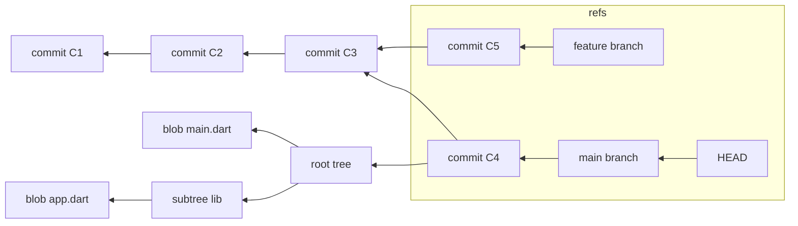
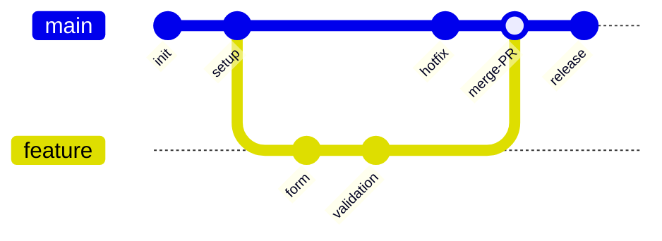
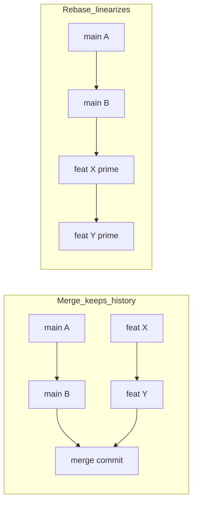

# Version Control with Git
> Git is a distributed, content-addressable filesystem that models a project's history as an immutable directed acyclic graph of snapshots, with branches and tags as cheap movable pointers into that graph.

## Introduction
Version control is the discipline of recording *how* a codebase changes over time so that any past state can be recovered, any change can be attributed, and many people can work in parallel without overwriting each other. Git is the de facto standard. What makes Git worth understanding at the internals level is that it is not a "diff database" the way older systems (SVN, CVS) were — it is a small key-value store of immutable objects on top of which every command is a graph operation. Once you see the object model, commands like `rebase`, `reset`, and `cherry-pick` stop being magic incantations and become obvious manipulations of pointers and snapshots.

This handbook is a *practice* topic: it teaches how a professional team actually uses Git day to day, but it grounds every workflow in what Git is doing to its objects and refs underneath.

## Why this concept exists
Before version control, teams shared code by copying folders (`project_final_v2_REALFINAL/`) and emailing zip files. That approach fails on every axis that matters:
- **No history**: you cannot see what changed, when, or why.
- **No attribution**: you cannot blame a regression on a specific change.
- **No parallelism**: two people editing the same file overwrite each other.
- **No safe experimentation**: trying a risky idea means risking the whole project.
- **No auditable release**: you cannot say "production is exactly commit X."

Git exists to make history a *first-class, tamper-evident, distributed* data structure. Because each commit is addressed by the SHA-1/SHA-256 hash of its content (including its parent), history cannot be silently rewritten — any change to any ancestor changes every descendant hash. Because every clone is a full copy of the graph, there is no single point of failure and most operations are local and instant.

## Real-world analogy
Think of Git as a **library of numbered photographs of your project**, plus a wall of sticky notes.
- Each **commit** is a full photograph (snapshot) of every file at a moment in time — not a list of edits, a whole picture.
- Photographs are filed by a fingerprint of their contents (the SHA), so identical photos are stored once and no photo can be altered without changing its fingerprint.
- Each photo has a note on the back saying "the photo before this one was #abc123" — that back-reference chains the photos into history.
- **Branches** and **HEAD** are sticky notes you stick onto whichever photo is "current." Moving a branch is just peeling the note off one photo and sticking it on another — the photos never move.

Merging is taking two lines of photographs that diverged and producing a new photo that reconciles both. Rebasing is *re-shooting* your photos as if you had started from a later point in the other line's history.

## Problem Statement
A team of engineers must simultaneously:
1. Develop multiple features and fixes in parallel.
2. Keep an always-releasable mainline.
3. Recover any historical state and understand why each change was made.
4. Integrate work from many contributors with minimal collision.
5. Tie a deployed artifact to an exact, verifiable source state.

The core question is: *what data structure lets many people evolve a shared codebase independently and reconcile safely, while keeping history immutable and auditable?* Git's answer is a content-addressable object store shaped as a commit DAG, with mutable refs layered on top.

## Internal Working
Git stores four object types, each addressed by the hash of its content:

- **blob** — the raw bytes of a file (no filename, no metadata).
- **tree** — a directory listing: names → (mode, blob hash | subtree hash). Trees give blobs their filenames and nest to form the directory structure.
- **commit** — a snapshot pointer: the root tree hash, zero or more parent commit hashes, author/committer, timestamp, and message.
- **tag** (annotated) — a named, signed pointer to a commit with its own message.

**Refs** are just files containing a hash. A branch (`refs/heads/main`) is a pointer to a commit. `HEAD` usually points to a branch (`ref: refs/heads/main`); when it points directly at a commit you are in "detached HEAD." The **index** (staging area) is a binary file listing the tree you are *about* to commit.

Because each commit names its parents, commits form a **directed acyclic graph**. A merge commit simply has two (or more) parents.



The arrows point from child to parent because a commit knows its ancestors, never its descendants. Reachability from a ref is what keeps objects alive; unreachable objects are eventually garbage-collected.

## Memory Representation
On disk, everything lives under `.git/`:

- `.git/objects/` — the object database. A **loose object** is stored at `objects/ab/cdef...` where `ab` is the first two hex digits of the SHA and the rest is the filename. The file is the object's content, zlib-compressed, prefixed with a header like `blob 128\0`.
- `.git/refs/heads/<branch>`, `.git/refs/tags/<tag>` — plain files containing a 40-char (SHA-1) hash. Often collapsed into `.git/packed-refs`.
- `.git/HEAD` — the symbolic ref for the current branch.
- `.git/index` — the staging area (a sorted list of path/blob/stat entries).
- `.git/config`, `.git/hooks/`, `.git/logs/` (the reflog).

As history grows, thousands of loose objects are inefficient, so `git gc` compresses them into **packfiles** (`.git/objects/pack/*.pack` + `.idx`). Packfiles store objects **delta-compressed** against similar objects — this is where "Git stores snapshots, not diffs" gets nuanced: the *model* is snapshots, but the *storage* uses deltas as a compression detail, transparent to the model.

Content addressing means deduplication is automatic: two identical files anywhere in history share one blob; an unchanged file across 1000 commits is one blob referenced by 1000 trees.

To inspect the raw store:
```bash
git cat-file -t <sha>     # object type: blob | tree | commit | tag
git cat-file -p <sha>     # pretty-print object content
git rev-parse HEAD        # resolve a ref to its SHA
```

## Compiler Behavior
Not applicable — because Git is a version-control tool operating on files as opaque bytes; it never compiles or parses Dart. Compilation of your Flutter/Dart code is handled separately by the Dart toolchain and is unrelated to how Git stores or moves commits.

## Runtime Behavior
Git commands are graph and pointer manipulations over the object store and refs:

- **commit** — writes blobs/trees for the staged content, writes a new commit object whose parent is the current `HEAD` commit, then advances the current branch ref to the new commit.
- **branch** — writes a new ref file pointing at a commit. O(1), no copying.
- **checkout/switch** — moves `HEAD` and rewrites the working tree + index to match the target commit's tree.
- **merge** — finds the merge base (common ancestor); if one side is an ancestor of the other, does a **fast-forward** (just moves the ref). Otherwise creates a new **merge commit** with two parents combining both trees.
- **rebase** — replays your commits one-by-one onto a new base, creating *new* commits with new SHAs (old ones become unreachable). Rewrites history.
- **cherry-pick** — applies the diff introduced by one commit as a new commit on the current branch.
- **reset** — moves the current branch ref to another commit. `--soft` keeps index+worktree; `--mixed` (default) resets index, keeps worktree; `--hard` resets both (destructive to uncommitted work).
- **revert** — creates a *new* commit that undoes a previous commit's changes; history is preserved (safe on shared branches).
- **stash** — saves worktree+index as special commits stored off to the side, then restores a clean worktree.

The **reflog** (`git reflog`) records every movement of `HEAD` and branch tips, so "lost" commits from a bad reset/rebase are usually recoverable for ~90 days.

## Flutter Engine Behavior (if applicable)
Not applicable — because the Flutter engine renders and runs your app at runtime; it has no involvement in how source history is recorded. Git operates purely on repository files.

## Dart VM Behavior (if applicable)
Not applicable — because the Dart VM executes Dart bytecode/AOT code; version control happens entirely at the source/tooling layer and never touches VM execution.

## Examples
Create a feature branch, commit atomically, and push:
```bash
git switch -c feature/login-form        # create + switch to a branch
# ... edit files ...
git add lib/features/auth/login_form.dart
git commit -m "Add email/password login form widget"
git push -u origin feature/login-form   # set upstream tracking branch
```

Keep a feature branch current with `main` via rebase (clean, linear history):
```bash
git switch feature/login-form
git fetch origin
git rebase origin/main                  # replay my commits on top of latest main
# resolve any conflicts, then:
git push --force-with-lease             # safe force: fails if remote moved unexpectedly
```

Resolve a merge conflict:
```bash
git switch feature/login-form
git merge main
# Git marks conflicts in files with <<<<<<< ======= >>>>>>>
#   edit each conflicted file to the correct combined result
git add lib/features/auth/login_form.dart   # mark as resolved
git commit                                   # completes the merge
git merge --abort                            # or bail out entirely
```

Undo safely on a shared branch vs. locally:
```bash
git revert a1b2c3d           # new commit undoing a1b2c3d (safe on main)
git reset --hard HEAD~1      # drop last commit locally (never on shared history)
git reflog                   # find and recover a lost commit
git reset --hard HEAD@{2}
```

A clean Pull Request flow:
```bash
git switch main && git pull --ff-only
git switch -c fix/cart-total-rounding
# make one focused change + tests
git add -A && git commit -m "Fix cart total rounding to 2 decimals"
git push -u origin fix/cart-total-rounding
# open PR, request review, address feedback with fixup commits:
git commit --fixup HEAD
git rebase -i --autosquash origin/main   # tidy before merge
git push --force-with-lease
```

Tagging a release:
```bash
git tag -a v1.4.0 -m "Release 1.4.0: checkout revamp"
git push origin v1.4.0
```

## Diagrams
Merge vs rebase, and a trunk-based-style branching flow:



Conceptually, **merge** keeps both histories and adds a join point, while **rebase** rewrites the feature commits onto the new base to produce a straight line:



## Common Mistakes
- **Committing secrets** (API keys, `.env`, keystores). Correction: add them to `.gitignore` *before* the first commit; if already committed, rotate the secret immediately and purge with `git filter-repo` — deleting the file in a new commit does NOT remove it from history.
- **Force-pushing to a shared branch** (`git push -f` to `main`). Correction: never force-push shared branches; on your own branch use `--force-with-lease`, which refuses to clobber commits you have not seen.
- **Giant PRs** (5000 lines, 40 files, mixed concerns). Correction: keep PRs small and single-purpose; split refactors from features. Reviewers approve small PRs carefully and rubber-stamp huge ones.
- **`git reset --hard` losing work.** Correction: check `git stash` or `git reflog`; prefer `git revert` for shared history.
- **Committing generated/build artifacts** (`build/`, `.dart_tool/`, `*.g.dart` if generated in CI). Correction: gitignore them; commit only source.
- **Vague messages** ("fix", "wip", "update"). Correction: write an imperative subject explaining the change and a body explaining *why*.
- **Merging without pulling** and pushing stale refs. Correction: `git fetch` and rebase/merge before pushing.
- **One branch reused for many features.** Correction: one branch per unit of work.

## Best Practices
- Commit **atomically**: one logical change per commit, with tests included in the same commit.
- Write **imperative** subject lines ("Add", "Fix", "Remove") under ~50 chars, blank line, then a body explaining rationale and tradeoffs.
- Keep branches short-lived; integrate with mainline daily to avoid divergence pain.
- Protect `main` with branch protection: require PR review, green CI (see [CI pipeline and automation](../50%20CI%20CD/02_ci_pipeline_and_automation.md)), and up-to-date branches.
- Use `--force-with-lease`, never `--force`, and never rewrite public history.
- Maintain a curated `.gitignore` (start from a language/framework template) and a `.gitattributes` for line endings and LFS.
- Tag releases with **semantic versioning** and let CI cut releases from tags (see [delivery and release](./05_delivery_and_release.md)).
- Review PRs against the team's checklist (see [code quality and review](./03_code_quality_and_review.md)).

## Performance
- **Repo size** grows with history and large binaries. Blobs are deduplicated, but a big file committed once stays in history forever unless rewritten.
- **Packfiles + delta compression** (`git gc`, `git repack`) shrink the object store dramatically and speed up transfers; run gc periodically (Git auto-gcs).
- **Shallow clone** (`git clone --depth 1`) fetches only recent history — huge win for CI where full history is unneeded.
- **Partial/sparse checkout** (`--filter=blob:none`, `git sparse-checkout`) helps with large monorepos, fetching blobs/paths on demand.
- **Large files**: binaries bloat every clone. Use **Git LFS**, which stores a small pointer in Git and the blob in a separate store, keeping the DAG lean.
- Fewer, well-packed objects and shorter histories in CI reduce clone time from minutes to seconds.

## Advantages
- Distributed: every clone is a full backup; most operations are local and fast.
- Immutable, tamper-evident history via content addressing.
- Cheap branching/merging enables true parallel development.
- Rich ecosystem (hosting, CI, code review, hooks).
- Powerful history tools: `bisect`, `blame`, `reflog`, `cherry-pick`.

## Disadvantages
- Steep mental model; commands are inconsistent and easy to misuse destructively.
- Poor at large binaries without LFS.
- Rewriting history is dangerous and confuses collaborators.
- Very large monorepos strain vanilla Git without extra tooling (scaling, VFS, sparse checkout).

## Interview Questions

**🟢 1. Is a Git commit a diff or a snapshot?**
A snapshot. A commit points to a full root tree describing every file's state. Diffs are computed on demand by comparing two trees. Packfiles use delta compression internally, but that is a storage optimization, not the model.

**🟢 2. What is the difference between `git fetch` and `git pull`?**
`fetch` downloads remote objects and updates remote-tracking refs (`origin/main`) without touching your working branch. `pull` is `fetch` followed by a `merge` (or `rebase` with `--rebase`) into your current branch.

**🟢 3. What is the staging area (index)?**
An intermediate layer between the working tree and the repository that holds the exact tree you will commit next. It lets you craft commits selectively with `git add` rather than committing everything changed.

**🟡 4. `git merge` vs `git rebase` — when do you use each?**
Merge preserves true history and creates a merge commit; use it to integrate completed branches, especially shared ones. Rebase rewrites your commits onto a new base for linear history; use it to keep a *local, unpushed* feature branch current. Never rebase commits others have based work on.

**🟡 5. `git reset` vs `git revert`?**
`reset` moves a branch pointer (optionally altering index/worktree) and rewrites history — appropriate locally. `revert` creates a new commit that undoes a prior commit, preserving history — the safe choice on shared branches.

**🟡 6. What does `--force-with-lease` do that `--force` doesn't?**
It refuses the push if the remote branch has advanced beyond what your local remote-tracking ref recorded, preventing you from silently overwriting a teammate's pushed commits. Plain `--force` clobbers unconditionally.

**🟡 7. How does Git know two files with the same content are identical?**
Content addressing: the file's bytes hash to the same SHA, producing one blob object. This gives automatic deduplication across the repo and history.

**🔴 8. A secret was committed and pushed. What now?**
Treat it as compromised: rotate/revoke the credential immediately. Then purge it from history (`git filter-repo` or BFG), force-push, and have everyone re-clone. Deleting the file in a new commit is insufficient — it remains in every ancestor.

**🔴 9. Explain fast-forward vs. no-fast-forward merges.**
If the target branch tip is an ancestor of the source, Git can just move the pointer forward (fast-forward), producing no merge commit and a linear history. `--no-ff` forces a merge commit even when a fast-forward is possible, preserving an explicit record that a branch was merged.

**🔴 10. How would you find which commit introduced a bug across 500 commits?**
`git bisect`: mark a known-good and known-bad commit; Git binary-searches, checking out midpoints for you to test. In ~log2(N) steps it pinpoints the offending commit. Can be automated with `git bisect run <test-script>`.

**🔴 11. What keeps an object from being garbage-collected?**
Reachability from a ref (branch, tag, HEAD, stash, or reflog entry). Unreachable objects past the grace period are removed by `git gc`. This is why the reflog can rescue "lost" commits.

**🟡 12. Monorepo vs polyrepo — one tradeoff each way.**
Monorepo: atomic cross-project changes and unified tooling, but needs scaling tooling and disciplined CI. Polyrepo: strong isolation and independent release cadence, but cross-cutting changes span many repos and dependency/version coordination gets hard.

## Senior Engineer Tips
- Learn the object model once; every command becomes predictable. `git cat-file -p HEAD` and `git log --graph --oneline --all` are your microscopes.
- Configure `pull.rebase = true` (or `--ff-only`) to avoid accidental merge-commit noise on pulls.
- Use `git commit --fixup` + `rebase -i --autosquash` to keep review history clean without manual squashing.
- Set up `git rerere` so repeated conflict resolutions are remembered and reapplied.
- Use `git worktree` to check out multiple branches simultaneously without stashing.
- Keep `.gitattributes` authoritative for line endings (`* text=auto`) to end CRLF/LF wars across OSes.
- Sign commits/tags (GPG/SSH) where provenance matters.

## Architect Perspective
At org scale the branching model and repo topology are strategic:
- **Trunk-based development** with short-lived branches and feature flags scales best for continuous delivery: everyone integrates to `main` many times a day, CI enforces quality, and releases are cut from trunk. It minimizes merge debt and pairs naturally with CI/CD.
- **Git Flow** suits products with scheduled, versioned releases and long support windows (e.g. desktop/on-prem), but its many long-lived branches add integration overhead and slow feedback.
- **GitHub Flow** is the pragmatic middle: `main` is always deployable, work happens on branches merged via PR.

**Monorepo vs polyrepo** is an org-design decision. A monorepo (managed with tooling like Melos for Dart — see [monorepo and Melos](../45%20Modular%20Architecture/02_monorepo_and_melos.md)) gives atomic cross-package refactors, one source of truth, and shared CI, at the cost of needing sparse checkout, affected-package build graphs, and strong CI to keep the trunk green. Polyrepos give teams autonomy and blast-radius isolation but push integration complexity into dependency/version management. Choose based on how coupled your components are and how much platform tooling you can invest in.

| Concern | Git Flow | GitHub Flow | Trunk-Based |
|---|---|---|---|
| Long-lived branches | Many (develop, release, hotfix) | One (main) + short PR branches | Only main; branches live hours/days |
| Release model | Scheduled, versioned | Continuous | Continuous, feature-flag gated |
| Merge/integration cost | High | Low | Lowest |
| Best for | Versioned/on-prem products | Web apps, most teams | High-velocity CD orgs |
| CI reliance | Moderate | High | Very high |

## Summary
Git is a content-addressable object store (blobs, trees, commits, tags) shaped into an immutable commit DAG, with branches, tags, and HEAD as cheap movable pointers and the index as the staging layer between working tree and repository. Understanding this model demystifies every operation: commits add nodes, branches move pointers, merges join histories, rebases replay commits as new nodes, and resets/reverts differ only in whether they rewrite history. Professionally, teams pair this model with a branching strategy (usually GitHub Flow or trunk-based), small atomic commits, disciplined PRs, protected mainlines, and CI to keep a shared codebase moving fast and safely.

## Revision Notes
- Four objects: **blob** (bytes), **tree** (dir listing), **commit** (snapshot + parents), **tag**.
- Everything is addressed by SHA of its content → dedup + tamper-evidence.
- Three stages: **working tree → index (staging) → repository**.
- Branch = pointer to a commit; HEAD = pointer to current branch; refs are files holding a hash.
- Merge = new commit, keeps history; rebase = new commits, linear, rewrites history.
- reset moves the branch (rewrites); revert adds a commit (safe on shared).
- `--force-with-lease` over `--force`; never rewrite public history.
- Objects: loose → packed via `gc`; deltas are a storage optimization.
- SemVer: MAJOR.MINOR.PATCH; tag releases.

## Practice Questions
1. Draw the object graph produced by two commits where only one file changed. How many blob objects exist?
2. Explain, in pointer terms, exactly what `git switch -c feature` and then `git commit` do to refs and HEAD.
3. When is a merge a fast-forward, and how do you force a merge commit anyway?
4. Why does deleting a committed secret in a new commit fail to secure it? What is the correct remediation?
5. Contrast the disk representation of a fresh repo (loose objects) with one after `git gc`.
6. Give a scenario where rebasing is the wrong choice and merging is correct.

## Coding Questions
1. **Inspect the store.** In any repo, run `git cat-file -p HEAD`, then follow the tree hash with `git cat-file -p <tree>`, then a blob. *Acceptance:* you can name the type and content of each object and explain how a commit reaches a file's bytes.
2. **Craft two atomic commits.** Make two unrelated one-line changes and commit them separately using `git add -p`. *Acceptance:* `git log --oneline` shows two focused commits with imperative messages; neither mixes concerns.
3. **Rebase cleanly.** Create a feature branch, add two commits, add a commit to `main`, then rebase the feature onto `main`. *Acceptance:* `git log --graph --oneline --all` shows linear history with new SHAs for the feature commits.
4. **Resolve a real conflict.** Create divergent edits to the same line on two branches and merge them. *Acceptance:* conflict markers resolved, `git status` clean, resulting file correct.
5. **Recover a lost commit.** `git reset --hard HEAD~1`, then restore it via `git reflog`. *Acceptance:* the "lost" commit is back on a branch.
6. **Squash before merge.** Use `git commit --fixup` and `git rebase -i --autosquash`. *Acceptance:* review branch collapses to intended commits.

## Mini Project
**Team Git simulation for a Flutter feature.**

Build a small Flutter package repo and simulate a two-developer workflow end to end:
1. Initialize the repo, add a sensible Flutter `.gitignore` (ignore `build/`, `.dart_tool/`, `*.iml`, local env files), and make an initial commit tagged `v0.1.0`.
2. Enable trunk-based discipline: protect `main` conceptually (only merge via PR), and create two feature branches representing two developers editing overlapping files (e.g. both touch `lib/main.dart` and a shared widget).
3. Developer A merges first via a fast-forward-avoided PR (`--no-ff`). Developer B rebases onto the updated `main`, resolves the resulting conflict, and opens a clean PR with an atomic history (use `--autosquash`).
4. Introduce a deliberate regression, then locate it with `git bisect run` against a test script.
5. Cut a release: bump to `v0.2.0` following SemVer, tag it, and write CHANGELOG entries. Wire a placeholder CI check (see [CI pipeline and automation](../50%20CI%20CD/02_ci_pipeline_and_automation.md)) that must pass before merge.

**Acceptance criteria:** `git log --graph --oneline --all` shows a coherent, mostly-linear history; no build artifacts or secrets are tracked; both PRs are small and single-purpose; the regression commit is identified by bisect; `v0.1.0` and `v0.2.0` tags exist and follow SemVer; the review process matches [code quality and review](./03_code_quality_and_review.md) and release steps match [delivery and release](./05_delivery_and_release.md).
