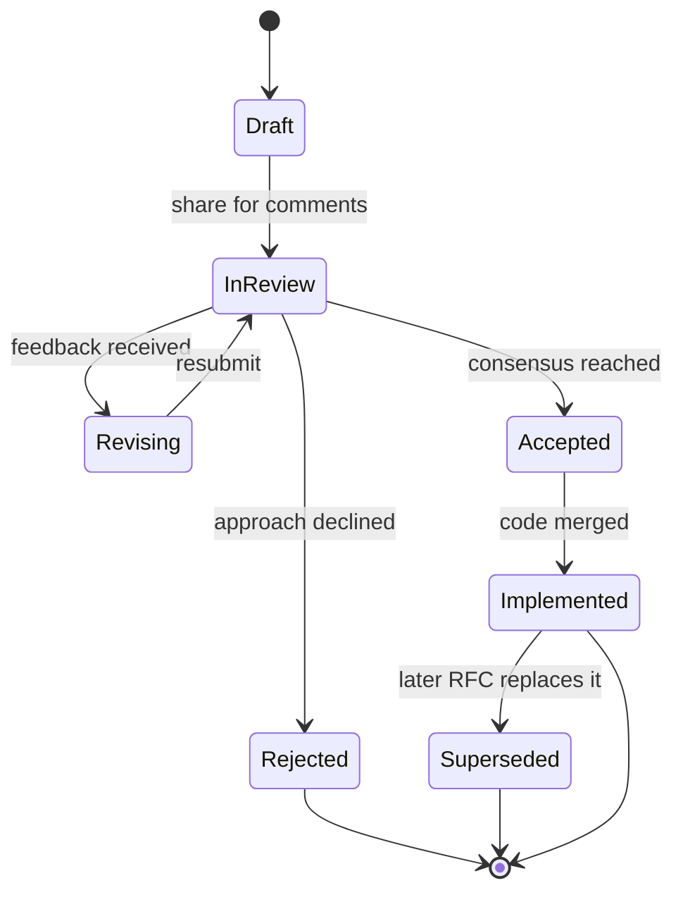
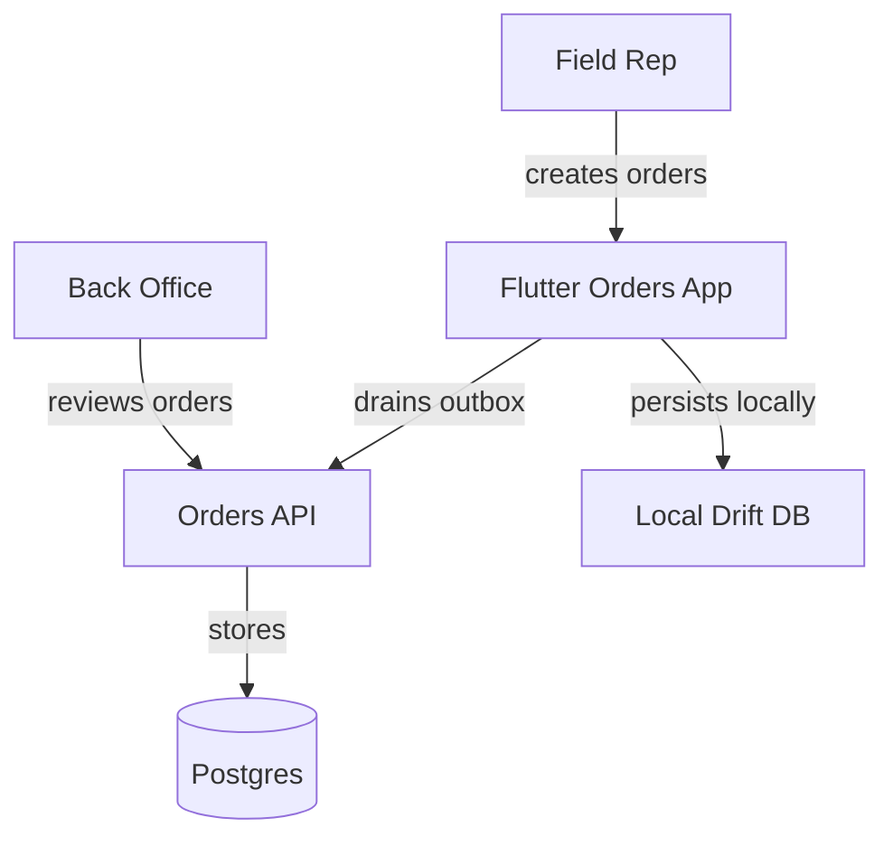

# Documentation, RFCs & Design Docs

> Documentation is the deliberate act of moving knowledge out of individual heads and into a durable, discoverable, shared artifact — and RFCs/design docs are that act applied *before* the code exists, so that thinking is reviewed instead of just merged.

## Introduction

Code tells you *what* the system does right now. It almost never tells you *why* it does it that way, what was tried and rejected, or what will break if you change it. That "why" lives in people's heads — until those people go on vacation, switch teams, or leave.

Documentation is the engineering discipline of externalizing that knowledge. It spans a spectrum: from a one-line `///` comment above a function, to a README, to a multi-page **RFC** (Request For Comments) that proposes a design before anyone writes code, to an **ADR** (Architecture Decision Record) that freezes a single decision forever.

This chapter is about the *writing craft* — how to write docs people actually read, how to structure a design doc that survives review, and why the act of writing is itself a thinking tool. It is deliberately vendor-neutral: the same practices apply whether you ship Flutter, a backend, or firmware.

> This topic overlaps module 58's material on decision records. Here we focus on **writing** — structure, prose, audience. For the *decision-making* side (how to weigh tradeoffs, decision frameworks), see [Decision Frameworks & Tradeoffs](../58%20Senior%20Architect%20Notes/02_decision_frameworks_and_tradeoffs.md).

## Why this concept exists

Engineers under-document for predictable, human reasons — and each one has a team-level cost:

| Why engineers skip docs | What it costs the team |
|---|---|
| "The code is self-documenting" | Code shows *what*, never *why*; intent is lost |
| "I'll remember" | You won't; and you're now the single point of failure (**bus factor = 1**) |
| "Writing is slower than coding" | True locally, false globally — every future reader re-derives what you knew |
| "It'll be stale in a month" | Stale-but-dated beats absent; and staleness is a maintenance problem, not a reason to never write |
| "Nobody reads docs" | Nobody reads *bad* docs; audience-targeted docs get read |

The three concrete failure modes documentation prevents:

1. **Bus factor.** If knowledge lives only in one person, the team stalls the moment that person is unavailable. Docs raise the bus factor.
2. **Onboarding cost.** A new hire with good docs is productive in days; without them, they interrupt senior engineers for weeks.
3. **Re-litigated decisions.** Without a record of *why* a decision was made, teams re-argue it every 6 months. An ADR ends the argument: "we decided this, here's the context, here are the consequences."

RFCs exist for a fourth reason: **catching design mistakes when they are cheap.** A flaw found in a doc costs an hour to fix; the same flaw found in production costs a rewrite.

## Real-world analogy

Think of a hospital patient chart. No single nurse or doctor holds the full history in their head — the chart does. Shift changes happen constantly, yet care is continuous because the *chart* is the memory, not any individual. A verbal handoff ("the patient in bed 3 is fine") is a stale comment; the written chart is documentation.

A **design doc** is the pre-surgery plan the surgical team reviews together *before* the first incision — goals, risks, contingencies, what happens if things go wrong. You would not want a surgeon who "figures it out as they go." An **ADR** is the immutable line in the record: "administered drug X at 14:32 because of Y" — you never edit it later; if the situation changes you add a *new* entry.

## Problem Statement

A team of six ships a Flutter app. The engineer who built the offline-sync layer leaves. Six months later:

- A bug appears in conflict resolution. Nobody knows whether "last-write-wins" was a deliberate choice or an accident.
- A PM asks to add multi-device sync. The team spends a full sprint re-discovering constraints the original engineer already knew.
- A new hire spends two weeks reading source code to understand what a half-page doc could have explained in twenty minutes.

The knowledge existed — it just never left one person's head. The problem this chapter solves: **how to reliably externalize engineering knowledge in forms that match how it will be consumed.**

## Internal Working

Documentation is not one thing; it is a *spectrum*, each type serving a different audience and lifespan. And the RFC has a defined lifecycle from draft to accepted.

**The documentation spectrum:**

| Doc type | Lives where | Answers | Audience | Lifespan |
|---|---|---|---|---|
| Code comment (`//`) | Inline in code | Why *this line* is weird | The next code reader | Same as the line |
| Doc comment (`///`) | Above a symbol | How to *use* this API | API consumers | Same as the API |
| README | Repo root | How to build/run this | New contributors | Life of the repo |
| API docs (dartdoc) | Generated site | Full API surface | External + internal users | Regenerated each release |
| Runbook | Wiki / repo | How to operate this in prod | On-call engineers | Life of the service |
| Wiki | Confluence / repo | Broad "how things work" | Whole team | Long, decays fastest |
| Changelog | `CHANGELOG.md` | What changed per version | Upgraders | Append-only, forever |
| RFC / design doc | Repo `docs/` | *Why* we will build it this way | Reviewers, future you | Frozen once accepted |
| ADR | `docs/adr/` | One decision + consequences | Future maintainers | Immutable, forever |

The RFC lifecycle — the path a design proposal travels:



The key insight: an RFC is **socialized** — deliberately circulated — during `InReview`. The comments *are* the value. A doc nobody comments on either was perfect or nobody read it, and it's rarely the former.

## Memory Representation

*Repurposed: institutional / organizational memory.*

In a normal chapter this section covers bytes in RAM. Here we repurpose it, because documentation *is* a form of memory — just at the organizational layer instead of the machine layer.

A running program keeps state in memory so it doesn't have to recompute everything. A team keeps *decisions and rationale* in documentation so it doesn't have to re-derive them. The analogy is exact:

| Machine memory | Organizational memory |
|---|---|
| RAM (fast, volatile) | What's in engineers' heads today |
| Disk (durable) | Docs, ADRs, RFCs in the repo |
| Cache eviction | An engineer leaving = memory lost |
| Persisting to disk | Writing it down before it's lost |
| Cache miss → recompute | Undocumented decision → re-litigated |

Docs are the team's **write-to-disk** operation. An ADR is a durable record that survives the "process" (the engineer) exiting. This is why ADRs are *immutable*: you don't corrupt old memory, you append new records — exactly like an append-only log.

## Compiler Behavior

*Here, partly applicable — via **dartdoc**.*

Dart ships a documentation generator, `dartdoc`. It is not the compiler proper, but it is a tool in the toolchain that reads your source the way a compiler does and produces an artifact from it.

What dartdoc does:

- Parses your `.dart` files and extracts every **doc comment** — comments written with `///` (or `/** */`) directly above a declaration.
- Treats the doc-comment text as **Markdown**.
- Resolves **symbol references** written in square brackets — `[SomeClass]`, `[myMethod]` — into hyperlinks to that symbol's page.
- Generates a static HTML site documenting your public API surface (or the whole thing with `--include-dependencies`-style flags).

```bash
dart doc .          # generates docs into doc/api/
```

Two consequences worth internalizing:

1. **Doc comments are compiled artifacts, not throwaway text.** A broken `[symbolRef]` produces a dartdoc warning, just like a type error produces a compiler warning. The `public_member_api_docs` lint even *fails your build* if public members lack docs, when enabled.
2. **`///` is semantically distinct from `//`.** The analyzer associates `///` with the following declaration; `//` is ignored by dartdoc. Using `//` for API documentation means it never reaches the generated site.

So: the doc generator turns your `///` comments into the same API reference site you use when you read Flutter's own documentation. Your comments and Flutter's are processed by the identical tool.

## Runtime Behavior

*Repurposed: how docs are consumed and kept fresh.*

Documentation has no runtime in the program-execution sense — it never runs. But it does have a *consumption* lifecycle that behaves like a runtime for the team:

- **Read path:** a developer hits a question → searches the wiki/README/API docs → finds (or fails to find) an answer. *Time-to-answer* is the latency metric.
- **Refresh path:** code changes → the doc that described it is now wrong → someone must update it. If nothing forces this, docs *decay*. Decay is the documentation equivalent of a memory leak: unnoticed until it causes a crash (a wrong doc that misleads someone).
- **Invalidation:** the dangerous state is a doc that is *confidently wrong*. A missing doc makes you ask a human; a wrong doc makes you ship a bug. This is why "delete stale docs" is a legitimate maintenance action.

The mechanism that keeps docs fresh: **co-location + review**. Docs living in the repo (docs-as-code) get changed in the same PR as the code, and the reviewer catches the mismatch. Docs in a separate wiki drift because nothing links their fate to the code's.

## Flutter Engine Behavior (if applicable)

Not applicable — because documentation is an authoring-time and human-process artifact. The Flutter engine (Skia/Impeller rasterization, the C++ shell, platform channels) never reads, executes, or is affected by your prose or design docs. Doc comments are stripped from compiled output and have zero presence in the running engine.

## Dart VM Behavior (if applicable)

Not applicable — because doc comments and design docs are discarded before execution. The Dart VM (JIT/AOT compilation, garbage collection, isolates) operates on compiled kernel/machine code from which comments have been removed. Documentation influences the *humans* who write the code the VM runs, never the VM itself.

## Examples

### 1. A Dart doc comment with `///` and symbol references

```dart
/// A store that persists key-value pairs locally and syncs them when online.
///
/// Values are written immediately to the local cache and queued for upload.
/// Use [flush] to force a sync, or rely on the automatic retry described in
/// [SyncPolicy]. Reads always return the local value; see [get].
///
/// ```dart
/// final store = OfflineStore(policy: SyncPolicy.eager);
/// await store.put('theme', 'dark');
/// ```
///
/// Throws a [StateError] if used after [dispose] has been called.
class OfflineStore {
  /// Writes [value] under [key] to the local cache and queues an upload.
  ///
  /// Returns once the value is durably in the local cache — **not** once it
  /// has synced to the server. To await the server round-trip, call [flush].
  Future<void> put(String key, String value) async {
    // ...
  }

  /// Forces any queued writes to sync now, completing when the server acks.
  ///
  /// Prefer this over polling; it respects the backoff in [SyncPolicy].
  Future<void> flush() async {
    // ...
  }

  /// Reads the locally cached value for [key], or `null` if absent.
  String? get(String key) => throw UnimplementedError();

  /// Releases resources. Calling any method afterward throws [StateError].
  void dispose() {}
}
```

Note the craft: the first sentence is a **standalone summary** (dartdoc uses it as the tooltip/list description), `[symbol]` refs link to other declarations, an example is fenced, and each comment says *why/contract* (`not once it has synced`) rather than restating the signature.

### 2. A filled-in mini RFC

```markdown
# RFC 0007: Offline Write Queue for the Orders Screen

Status: Accepted   Author: A. Rao   Date: 2026-06-30   Reviewers: 3

## Context / Problem
Field reps create orders in areas with no connectivity. Today a failed
network call drops the order and the rep must retype it. We lose ~30
orders/week to this.

## Goals
- Orders created offline are never lost.
- Reps see clear "pending sync" state per order.

## Non-Goals
- Offline *edits* to server-created orders (future RFC).
- Conflict resolution beyond last-write-wins.

## Proposed Design
Wrap order creation in a local durable queue (Drift table `outbox`).
A background worker drains the queue with exponential backoff when
connectivity returns. UI reads reflect queued state via a stream.

## Alternatives Considered
- **In-memory queue:** rejected — lost on app kill.
- **Full CRDT sync:** rejected — over-engineered for create-only, non-Goal.

## Tradeoffs
Gain durability + simplicity; accept last-write-wins can silently drop a
concurrent server change (acceptable: orders are append-only).

## Risks
- Queue never drains if backoff has a bug → add a max-age alert.
- Duplicate submission on retry → server dedupes on client-generated UUID.

## Rollout Plan
Behind flag `offline_orders`. 5% → 50% → 100% over two weeks, watching
the duplicate-order metric.
```

### 3. A one-page ADR (context → decision → consequences)

```markdown
# ADR 0012: Use client-generated UUIDs for order IDs

Status: Accepted   Date: 2026-06-30

## Context
The offline write queue (RFC 0007) may retry a submission after a network
timeout, risking duplicate orders. IDs were previously assigned by the server.

## Decision
Clients generate a v4 UUID for each order at creation time. The server treats
the ID as idempotency key and rejects duplicates.

## Consequences
- (+) Retries are naturally idempotent; no duplicates.
- (+) Orders have a stable ID before ever reaching the server.
- (-) Client trust: a malicious client could forge IDs — mitigated by
      server-side ownership checks.
- (-) UUIDs are larger than sequential ints in the DB index.
```

## Diagrams

When a diagram beats prose: any time the relationships between more than ~three things matter more than the things themselves — sequences, hierarchies, data flow. Prose is linear; systems are not.

**C4 model levels** (progressive zoom): **Context** (system + external actors) → **Container** (apps/services/DBs) → **Component** (parts inside one container) → **Code** (classes; rarely worth drawing). Pick the level that answers the reader's question; don't draw all four by default.

**Sequence vs component:** use a *sequence* diagram to show *ordering over time* (who calls whom, in what order); use a *component* diagram to show *static structure* (what talks to what). "How does login work?" → sequence. "What are the pieces?" → component.

C4 Level-1 context diagram for the offline-orders feature:



## Common Mistakes

| Mistake | Why it hurts | The fix |
|---|---|---|
| Doc describes **what**, not **why** | `// increments i` adds nothing; the code already says that | Document intent/contract: `// retry once — the gateway 500s on cold start` |
| **Stale** docs left in place | A confidently-wrong doc ships a bug | Update docs in the *same PR* as the code; delete docs you can't maintain |
| Design doc written **after** the fact | It becomes a rubber-stamp, not a review; mistakes are already shipped | Write the RFC *before* coding, when changing course is cheap |
| **No non-goals** | Scope creeps; reviewers argue about things you never intended to build | Always include a Non-Goals section — it's as important as Goals |
| Doc written for the **wrong audience** | Too much detail for a PM, too little for an implementer | State the audience at the top; write to them |
| **Symbol refs as plain text** in `///` | No hyperlink in generated docs | Use `[SymbolName]` so dartdoc links it |
| Everything in a **wiki** far from code | Drifts instantly; nobody updates it | Docs-as-code: keep them in the repo next to what they describe |

## Best Practices

- **Write the first sentence to stand alone.** dartdoc, search results, and tooltips show only that sentence.
- **Docs-as-code.** Keep docs in the repo, in Markdown, reviewed via PR. Their fate is tied to the code's.
- **One decision per ADR, and never edit an accepted one.** Supersede with a new ADR instead.
- **Goals *and* Non-Goals.** Bounding the scope is half the value of a design doc.
- **Socialize RFCs early.** Share a rough draft for comments; the feedback is the point.
- **Say why, not what.** The code is the source of truth for *what*; docs own *why*.
- **Assign an owner.** A doc with no owner is a doc that will go stale.
- **Prefer a diagram** when relationships dominate; keep node labels short and plain.
- **Enable the `public_member_api_docs` lint** for published packages to make undocumented public APIs a build issue.

## Performance

*Repurposed: documentation's performance is measured in team-level latencies, not milliseconds.*

| Metric | What it measures | Good docs move it |
|---|---|---|
| **Onboarding time** | Days until a new hire ships confidently | Weeks → days |
| **Time-to-find-an-answer** | Latency from question to answer | Interrupt-a-senior → self-serve in minutes |
| **Decision-reversal rate** | How often decisions are re-litigated | ADRs drop it toward zero |
| **Bus factor** | People who must be present for the team to function | Raises it above 1 |
| **Incident MTTR** | Time to resolve a prod incident | A runbook cuts it dramatically |

If you cannot measure a doc's effect on one of these, ask whether it should exist.

## Advantages

- Raises the bus factor; knowledge survives people leaving.
- Slashes onboarding cost — the biggest hidden tax on growing teams.
- Ends re-litigation of settled decisions (ADRs).
- Catches design flaws while they're cheap to fix (RFCs).
- Writing forces clarity — you cannot write a muddy design doc for a design you don't actually understand.
- Enables async, distributed collaboration — reviewers comment on their own schedule.

## Disadvantages

- Costs time up front; the payoff is deferred and diffuse.
- Can go stale and mislead if not maintained — sometimes worse than nothing.
- Over-documentation buries the important docs under trivial ones.
- Requires cultural buy-in; a lone documenter on an indifferent team burns out.
- Bad docs (what-not-why, wrong audience) can create false confidence.

## Interview Questions

**🟢 1. What's the difference between `//` and `///` in Dart?**
`//` is an ordinary comment ignored by the doc generator. `///` is a *doc comment* — dartdoc associates it with the following declaration, parses it as Markdown, and includes it in the generated API site. Use `///` for anything documenting a public API.

**🟢 2. What is an ADR and how does it differ from an RFC?**
An ADR (Architecture Decision Record) captures *one* decision in a fixed context→decision→consequences format; it's short and immutable. An RFC is a broader proposal for a design, written *before* implementation and circulated for comments. RFC = "should we build it this way?"; ADR = "we decided X, here's why, forever."

**🟢 3. Why write docs at all if code is self-documenting?**
Code documents *what* it does, never *why* it does it that way, what alternatives were rejected, or what constraints shaped it. That "why" is exactly the knowledge that's expensive to lose and impossible to recover from the code alone.

**🟡 4. When would you write a design doc / RFC?**
When a change is (a) hard to reverse, (b) affects multiple people or teams, (c) has non-obvious tradeoffs, or (d) will be re-questioned later. Skip it for small, local, easily-reverted changes. Rule of thumb: if getting it wrong costs more than a day, write the doc first.

**🟡 5. Why include a "Non-Goals" section?**
It bounds scope explicitly, prevents scope creep, and stops reviewers from arguing about things you never intended to build. It's often more clarifying than the Goals section.

**🟡 6. What makes a doc go stale, and how do you prevent it?**
Staleness happens when code changes but the doc doesn't. Prevent it with docs-as-code (docs in the repo, updated in the same PR, caught by the reviewer) and by assigning each doc an owner. Docs in a separate wiki drift fastest.

**🟡 7. What does dartdoc do with your comments?**
It parses `///` comments as Markdown, uses the first sentence as the summary, resolves `[SymbolName]` references into hyperlinks, and generates a static HTML API site. Broken symbol refs produce warnings.

**🔴 8. How do you decide between a sequence diagram and a component diagram?**
A sequence diagram shows *ordering over time* — who calls whom, in what order (best for "how does this flow work?"). A component diagram shows *static structure* — what depends on what (best for "what are the pieces?"). Choose by the question the reader is asking.

**🔴 9. Explain the C4 model and when to use each level.**
C4 is four zoom levels: Context (system + external actors), Container (deployable apps/services/DBs), Component (parts inside one container), Code (classes). You draw the level that answers the reader's question — Context for stakeholders, Container/Component for engineers. Code-level is rarely worth drawing.

**🔴 10. Why is the *writing* of a design doc valuable even before anyone reviews it?**
Writing forces you to make implicit reasoning explicit. You cannot write a clear "alternatives considered" section for alternatives you never actually considered. The act surfaces gaps in your own thinking — the doc is a thinking tool first, a communication tool second.

**🔴 11. An accepted ADR's decision turns out wrong. Do you edit it?**
No. ADRs are immutable. You write a *new* ADR that supersedes it, referencing the old one and explaining what changed. The historical record of *why you once thought X* is itself valuable — editing it destroys that memory.

**🟡 12. How do you write for the right audience?**
State the audience at the top and calibrate depth to it: a PM needs goals and tradeoffs, not class names; an implementer needs the interface contracts and edge cases. One doc trying to serve everyone serves no one — split it if the audiences diverge.

## Senior Engineer Tips

- **Write the RFC before you're sure.** If you already know the answer, you've skipped the thinking the doc exists to force.
- **Put the summary first.** Busy reviewers read the first paragraph and the headings. Bury the lede and you lose them.
- **A comment that says *what* is a code smell** — it usually means the code isn't clear. Fix the code; save comments for *why*.
- **Delete docs you can't keep alive.** A wrong doc is a liability. Honesty about what you'll maintain beats aspirational completeness.
- **Link liberally.** A doc that cross-references related docs (and code) becomes a navigable map, not an island.
- **Treat doc review like code review** — see [Code Quality & Review](./03_code_quality_and_review.md). Comments on a design are cheaper than comments on a PR.

## Architect Perspective

At scale, an architect cannot be in every room or on every PR. Their leverage comes almost entirely through **written artifacts**: RFCs, ADRs, and the standards docs that shape how dozens of engineers make decisions without asking. Documentation is the architect's primary instrument of *influence at a distance*.

A healthy **RFC culture** is one of the strongest signals of engineering maturity. It means: significant decisions are written down and reviewed before they're built; disagreement happens on the doc (cheap) instead of in production (expensive); and the org accumulates a searchable memory of *why* it is the way it is. The architect's job is often less "make the decision" and more "establish the process by which good decisions get made and recorded."

This connects directly to system-design practice — see [System Design](../48%20System%20Design/README.md) — where the design doc *is* the deliverable, and to the team practices in [Agile & Collaboration](./02_agile_and_collaboration.md), where RFC review is how distributed teams align asynchronously.

## Summary

Documentation externalizes knowledge that otherwise dies in individual heads, raising the bus factor, cutting onboarding cost, and ending re-litigated decisions. It's a spectrum — from `///` comments to READMEs to RFCs to immutable ADRs — each matched to an audience and lifespan. Design docs and RFCs apply this *before* code exists, so thinking is reviewed while mistakes are still cheap; the act of writing itself forces clarity. Keep docs alive with docs-as-code and clear ownership, write *why* not *what*, and reach for a diagram when relationships dominate. dartdoc turns your `///` comments into the same API site you rely on for Flutter itself.

## Revision Notes

- `///` = doc comment (dartdoc reads it); `//` = ignored. First sentence must stand alone.
- Spectrum: comment → doc comment → README → API docs → runbook → wiki → changelog → RFC → ADR.
- RFC = proposal before building, socialized for comments. ADR = one decision, immutable, context→decision→consequences.
- RFC sections: Context/Problem, Goals, **Non-Goals**, Proposed Design, Alternatives, Tradeoffs, Risks, Rollout.
- Write a design doc when the change is hard to reverse, cross-team, non-obvious, or will be re-questioned.
- C4: Context → Container → Component → Code. Sequence = time; Component = structure.
- Docs-as-code prevents staleness. Say why, not what. Assign an owner.
- dartdoc: Markdown, `[symbol]` links, first-sentence summary, static HTML.

## Practice Questions

1. List the documentation spectrum from smallest to largest scope, and name each one's primary audience.
2. Give a real change you'd write an RFC for, and one you deliberately wouldn't. Justify both.
3. Rewrite a "what" comment (`// loop over users`) into a useful "why" comment.
4. For "how does offline sync recover after reconnect?", pick sequence vs component diagram and explain why.
5. Why must ADRs be immutable? What do you do when the decision becomes wrong?
6. Name three team-level metrics that good documentation improves, and how you'd measure one.

## Coding Questions

1. **Doc-commented API.** Write a `RateLimiter` class in Dart with `///` doc comments on the class and every public member. Use at least two `[symbol]` references and one fenced code example. Ensure it would pass the `public_member_api_docs` lint.
2. **Write an RFC.** For the feature "push-notification preferences synced across a user's devices," write a complete RFC with all standard sections (Context, Goals, Non-Goals, Proposed Design, Alternatives, Tradeoffs, Risks, Rollout).
3. **Write an ADR.** Capture the decision "store notification preferences server-side as the source of truth (not per-device)" in context→decision→consequences format, listing at least two positive and two negative consequences.
4. **Fix stale docs.** Given a function whose doc comment describes behavior the signature no longer matches, correct the comment and explain what process would have prevented the drift.

## Mini Project

**Write a complete design doc / RFC for an offline-sync feature in a Flutter app.**

Deliverable: a single Markdown file, `docs/rfc/0001-offline-sync.md`, containing every standard section, that a real team could review.

Required sections and what to cover:

- **Status / Author / Date / Reviewers** header.
- **Context / Problem** — describe a real scenario: users edit records offline; today edits are lost or conflict. Quantify the pain if you can.
- **Goals** — e.g. edits made offline eventually reach the server; users see per-record sync state; no data loss on app kill.
- **Non-Goals** — e.g. real-time collaboration, cross-user merge, offline media upload.
- **Proposed Design** — the sync architecture: local durable store (Drift/Isar), an outbox queue, a background sync worker with backoff, conflict strategy (state your choice — e.g. last-write-wins with a `updatedAt` vector), and how the UI observes sync state via streams. Include a **C4 container diagram** in Mermaid.
- **Alternatives Considered** — at least two (e.g. full CRDT sync; server-authoritative with no offline writes) with why each was rejected.
- **Tradeoffs** — what you gain and what you knowingly give up.
- **Risks** — e.g. queue never drains, duplicate submissions, clock skew breaking last-write-wins — each with a mitigation.
- **Rollout Plan** — feature flag, staged percentage rollout, the metric you watch to decide whether to proceed or roll back.

Then, alongside it, write **one ADR** (`docs/adr/0001-conflict-strategy.md`) capturing just the conflict-resolution decision from the RFC, in context→decision→consequences format.

Success criteria: a peer who has never seen the feature can read the RFC and correctly explain *why* it's built this way, what it explicitly won't do, and what could go wrong — without asking you a single question. That is documentation doing its job.
