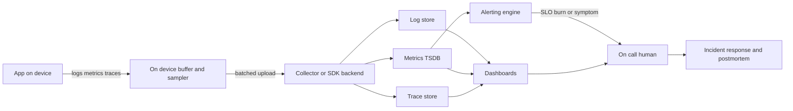
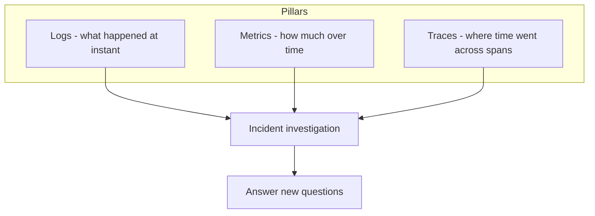
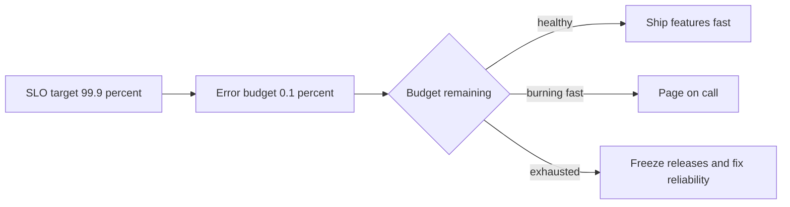

# Observability as an Engineering Practice

> Observability is the discipline of designing a system so its external outputs — logs, metrics, and traces — let you answer new, unanticipated questions about its internal state without shipping new code.

## Introduction

Monitoring tells you *whether* the thing you were worried about happened. Observability lets you *investigate* the thing you never thought to worry about. This distinction is the whole chapter.

Most teams start with monitoring: a dashboard of CPU, a crash-rate alert, a "requests per second" graph. That answers **known-unknowns** — questions you already knew to ask. But production fails in ways nobody predicted. Observability is the property that, when a novel failure appears, your telemetry is rich enough to slice, filter, and correlate your way to the cause — without a redeploy.

This file lives in the *Software Engineering Practices* module. It is deliberately about the **practice and discipline** layer, not the tooling. The mechanics of monitoring live in [Monitoring](../52%20Monitoring/README.md), and the mechanics of emitting logs live in [Logging](../39%20Logging/README.md). Here we care about: how you decide what to emit, how you alert on it, how you respond when it fires, and how reliability targets govern how fast you ship.

## Why this concept exists

Software behaves differently in production than on your machine. The gap grows with scale, concurrency, third-party dependencies, and — for mobile — the fact that your code runs on a device you do not own, on a network you do not control, for a user you cannot interview.

Observability exists because **you cannot predict every failure mode**, so you cannot pre-build a dashboard for every one. Predefined dashboards catch the failures you imagined. The outage that pages you at 3am is, almost by definition, the one you didn't imagine. If your system only emits the numbers you thought to graph, you are blind to everything else.

The practice discipline exists on top of that because raw telemetry is worthless without judgement: log everything and you get a noisy, expensive, PII-leaking haystack; alert on everything and your team stops reading alerts; graph everything and nobody looks at any of it. Observability-as-practice is the set of decisions that keep signal high and cost, noise, and risk low.

## Real-world analogy

A **car dashboard** is monitoring: the fuel gauge, speedometer, and check-engine light are predefined signals for predefined concerns. They are excellent — until something happens the manufacturer didn't put a light for.

**A mechanic's diagnostic port (OBD-II)** is observability: it exposes the engine's internal state as structured data so a technician can ask questions the dashboard never anticipated — "why does the misfire only happen when the engine is warm and turning left?" The car was *designed to be interrogable*. That design choice — instrumenting the engine so unforeseen questions are answerable — is exactly what observability asks of software.

Monitoring is the dashboard light. Observability is the diagnostic port.

## Problem Statement

You ship a Flutter app. A subset of users report that "checkout sometimes hangs." You have:

- A crash-free-users metric sitting at 99.6% (looks fine).
- A dashboard of average API latency (looks fine).
- No idea which users, which flow, which network conditions, or which backend call.

Averages hid a tail. The crash metric didn't fire because it wasn't a crash — it was an ANR-like hang. You cannot reproduce it. You cannot ask "show me the checkout traces for users on 3G in region X where the payment span exceeded 5s" because you never emitted spans, correlation IDs, or the dimensions you'd need to slice by.

The problem this chapter solves: **how to instrument, alert, and respond so that the next "sometimes it hangs" is answerable from data you already collect.**

## Internal Working

Telemetry flows from the device, through a collector, into backends, and out to humans as dashboards and alerts. The three pillars converge during an incident.



Key points in the flow:

- **On-device buffer and sampler** — telemetry is not sent immediately; it is batched, sampled, and held while offline. This is the biggest difference from server observability.
- **Collector** — normalizes, enriches (adds app version, OS, region), and fans out to the right store per pillar.
- **Alerting engine** reads primarily from **metrics** (cheap to evaluate continuously), fires on **symptoms / SLO burn**, and pages a human.
- The human uses **dashboards + traces + logs together** to diagnose, then feeds learning back via a **postmortem**.

## Memory Representation

*Repurposing note: "memory representation" here means the **state each telemetry type retains** — the shape of what is stored — plus what the device holds before upload. It is not about Dart heap layout.*

| Pillar | State shape retained | Read pattern |
|---|---|---|
| **Logs** | Append-only **event stream** — discrete, timestamped, high-detail records. High volume, retained short. | Search / filter by field |
| **Metrics** | **Time-series** — pre-aggregated numbers keyed by name + labels, bucketed over time. Low volume, retained long. | Aggregate over time |
| **Traces** | **Span tree** — a causal parent/child tree of timed operations sharing one trace ID. Medium volume, often sampled. | Follow one request end to end |

On-device state before upload:

- A **ring buffer** of recent log/breadcrumb events (bounded, oldest dropped) attached to the next crash report.
- A **counter/gauge aggregation buffer** so metrics are summed locally and flushed periodically, not sent per-event.
- A **persistence queue** on disk so telemetry survives app kill and network loss, replayed on next launch. This is why mobile telemetry arrives **delayed and out of order**.

## Compiler Behavior

**Not applicable — because** observability is a runtime and operational concern, not a language-level one. The Dart compiler (`dart compile`, the AOT/JIT pipelines) does nothing observability-specific: it does not inject spans, aggregate metrics, or wire crash handlers. Instrumentation is ordinary application code and SDK calls that exist at runtime. The only adjacent compile-time detail is that AOT release builds strip symbols, so crash stack traces need **symbolication** via uploaded debug symbols (dSYM / ProGuard mapping / Dart symbol files) — but that is a build-artifact concern handled by your reporting SDK, not compiler semantics.

## Runtime Behavior

At runtime, telemetry is emitted through **hooks** and **error surfaces**, then buffered and shipped:

- **Explicit instrumentation** — you call `log.info(...)`, `metrics.increment(...)`, `tracer.startSpan(...)` at meaningful points.
- **Global error hooks** capture the unforeseen (see Dart VM Behavior below): `FlutterError.onError`, `PlatformDispatcher.instance.onError`, and a `runZonedGuarded` boundary around `runApp`.
- **Zones** (`Zone`) let you install a `runZonedGuarded` handler that catches async errors escaping the framework, and can also override `print` to route stdout into your structured logger.
- **Batching & sampling** — the SDK accumulates events and flushes on a timer, on batch-size threshold, or on background transition. Traces are typically **head-sampled** (decide at span start) to cap volume.
- **Offline buffering** — events persist to disk and replay when connectivity returns; expect duplicates and clock skew, and design idempotent, timestamp-tolerant analysis.

The runtime contract: instrumentation must be **cheap and non-blocking** on the hot path (frame builds, gesture handlers). Do the work of formatting/uploading off the critical path.

## Flutter Engine Behavior (if applicable)

Applicable. The Flutter engine is itself a telemetry source for **performance observability**:

- The engine reports **frame timings** via `SchedulerBinding.instance.addTimingsCallback`, exposing `buildDuration` and `rasterDuration` per frame. Frames exceeding the budget (~16ms at 60Hz) are **jank**.
- The engine emits **timeline events** consumable by DevTools' performance view and by `dart:developer` `Timeline` spans — the on-device analogue of distributed tracing for the UI thread and raster thread.
- Real-user jank metrics (e.g., "slow frame %" and "frozen frame %") are derived from these callbacks and are a first-class mobile SLI, not a lab-only number.

So the engine gives you the raw signal for a **UI-performance SLO**; you decide sampling and what to ship.

## Dart VM Behavior (if applicable)

Applicable and central. The Dart VM's error-propagation model is *how* uncaught failures reach your reporter:

- **Synchronous framework errors** surface through `FlutterError.onError`.
- **Uncaught async errors in the platform dispatcher** (errors with no Flutter/zone handler) surface through `PlatformDispatcher.instance.onError` — returning `true` marks them handled.
- **Errors escaping a guarded zone** surface through the `runZonedGuarded` callback, which is why `runApp` is wrapped in one.
- **Isolate errors** — errors in other isolates don't cross automatically; add an `Isolate.current.addErrorListener` / `addOnErrorListener` port if you spawn isolates.

Together these three-to-four surfaces are the VM-level net that turns "the app just died" into a structured, symbolicated crash event.

## Examples

Structured logging with levels + correlation ID, global error wiring to a reporter, and a simple counter — null-safe and lint-clean.

```dart
import 'dart:async';
import 'package:flutter/foundation.dart';
import 'package:flutter/widgets.dart';

/// Severity levels, aligned with module 39 logging conventions.
enum LogLevel { debug, info, warning, error }

/// Minimal structured logger: emits a single map per event so backends can
/// index by field. A correlation id links every log in one user flow.
class StructuredLogger {
  StructuredLogger(this._sink);
  final void Function(Map<String, Object?> event) _sink;

  void log(
    LogLevel level,
    String message, {
    required String correlationId,
    Map<String, Object?> fields = const <String, Object?>{},
  }) {
    _sink(<String, Object?>{
      'ts': DateTime.now().toUtc().toIso8601String(),
      'level': level.name,
      'msg': message,
      'correlationId': correlationId,
      ...fields,
    });
  }
}

/// A tiny counter metric that aggregates locally and reports on flush.
class Counter {
  int _value = 0;
  void increment([int by = 1]) => _value += by;
  int drain() {
    final int v = _value;
    _value = 0;
    return v;
  }
}

/// Pretend crash reporter (Crashlytics/Sentry stand-in).
Future<void> reportToCrashReporter(
  Object error,
  StackTrace stack, {
  bool fatal = false,
}) async {
  // In real code: FirebaseCrashlytics.instance.recordError(...) etc.
  debugPrint('CRASH fatal=$fatal: $error');
}

void main() {
  // 1. Synchronous Flutter framework errors.
  FlutterError.onError = (FlutterErrorDetails details) {
    FlutterError.presentError(details);
    unawaited(reportToCrashReporter(details.exception, details.stack ?? StackTrace.current, fatal: true));
  };

  // 2. Uncaught async errors at the platform dispatcher.
  PlatformDispatcher.instance.onError = (Object error, StackTrace stack) {
    unawaited(reportToCrashReporter(error, stack, fatal: true));
    return true; // handled
  };

  // 3. Everything escaping the zone around runApp.
  runZonedGuarded<void>(
    () => runApp(const _App()),
    (Object error, StackTrace stack) {
      unawaited(reportToCrashReporter(error, stack));
    },
  );
}

class _App extends StatelessWidget {
  const _App();
  @override
  Widget build(BuildContext context) => const SizedBox.shrink();
}
```

Usage tying it together:

```dart
final StructuredLogger log = StructuredLogger(debugPrint as void Function(Map<String, Object?>));
final Counter checkoutStarted = Counter();

void onCheckoutTapped(String correlationId) {
  checkoutStarted.increment();
  log.log(LogLevel.info, 'checkout started',
      correlationId: correlationId, fields: <String, Object?>{'step': 'tap'});
}
```

## Diagrams

The three pillars and what each answers:



SLO error-budget burn governing release pace:



## Common Mistakes

| Mistake | Why it hurts | Fix |
|---|---|---|
| **Log everything at `info`/`debug`** | Noise, storage cost, and PII leaks (emails, tokens, locations) | Log decisions and errors, not every value; scrub PII; use levels |
| **Alert on causes** (CPU high, pod restarted) | Fires constantly, often when users are fine → **alert fatigue** | Alert on **symptoms/SLO burn** the user feels |
| **Vanity metrics** (total signups ever) | Big number, no decision changes from it | Track actionable, rate-based SLIs |
| **No correlation ID** | Cannot stitch a user's flow across logs/services | Generate one per flow, propagate it (see [Logging](../39%20Logging/README.md)) |
| **Dashboards nobody reads** | False confidence; broken graphs go unnoticed | Fewer dashboards tied to SLOs; delete the rest |
| **Averages only** | Tail latency and rare hangs hide behind the mean | Track p95/p99 histograms |
| **Unbounded label cardinality** (userId as a metric label) | Time-series explosion, cost blowup, slow queries | Keep labels low-cardinality; put IDs in logs/traces |

## Best Practices

- **Instrument for questions, not for graphs.** Ask "what would I need to debug the next unknown outage?" and emit that.
- **One correlation ID per user flow**, propagated app → network header → backend, so all three pillars join.
- **Structured logs** (key/value maps), consistent field names, explicit levels — never free-text-only.
- **Metrics are low-cardinality and aggregatable**; identifiers belong in logs and traces.
- **Sample deliberately**: keep 100% of errors, sample the happy path. Make sampling decisions visible in the data.
- **Every alert links to a runbook** and maps to an SLO or user-visible symptom.
- **Scrub PII at the source** (before it leaves the device), not "later in the pipeline."
- **Crash-free users / sessions** is your headline mobile SLI; pair it with slow/frozen-frame rate.
- Treat observability as a **release gate**: no feature ships to a flow you can't observe.

## Performance

Telemetry is not free — on mobile it competes for **CPU, battery, and the user's data plan**:

- **Hot-path cost**: never format strings or serialize JSON on the frame-build path when disabled; guard with level checks. Emit cheaply, process off-thread.
- **Batching** amortizes network/radio wake-ups; frequent tiny uploads drain battery (radio tail energy) more than periodic batches.
- **Sampling** caps trace/log volume and cost; head-sampling is cheapest.
- **High-cardinality metrics** are the classic cost bomb: each unique label combination is a stored series. `userId`/`requestId` as labels can create millions of series and dominate your bill and query latency.
- **Network/offline**: buffer to disk, upload on Wi-Fi where possible, respect background execution limits.
- **Symbolication** happens server-side, so release builds stay small and fast; only debug-symbol artifacts are uploaded.

## Advantages

- Answer **unforeseen** questions without a redeploy — faster incident resolution (lower MTTR).
- Correlate across pillars to find root cause, not just "something is wrong."
- SLOs give an **objective, shared definition of "good enough."**
- Error budgets turn reliability-vs-velocity from an argument into a policy.
- Better product decisions from real-user data (network, device, region distributions).

## Disadvantages

- **Cost**: storage, egress, and vendor bills scale with volume and cardinality.
- **Overhead**: CPU/battery/network on device; latency if done on the hot path.
- **Complexity**: three pillars, sampling, and correlation add moving parts.
- **Privacy risk**: telemetry is a PII leak waiting to happen if unscrubbed.
- **Noise if undisciplined**: too many signals is as blinding as too few.
- **Mobile blind spots**: sampled, delayed, and incomplete — you never see 100% of reality.

## Interview Questions

**🟢 What is the difference between monitoring and observability?**
Monitoring watches predefined signals for known failure modes (known-unknowns) via dashboards and alerts. Observability is a property of the system: its outputs are rich enough that you can ask *new* questions about internal state (unknown-unknowns) without shipping code. Monitoring is a subset/consumer of observability.

**🟢 Logs vs metrics vs traces — when do you reach for each?**
Logs: discrete events with full detail — best for "what exactly happened at this moment," worst at aggregation and cost at volume. Metrics: aggregated numbers over time — best for trends, alerting, and cheap long retention, worst at explaining a single event and at high cardinality. Traces: causal span timelines — best for "where did the time/latency go across services," worst at long-term storage and usually sampled. Use metrics to detect, traces to localize, logs to explain.

**🟢 What is an error budget?**
`1 − SLO`. If your SLO is 99.9% success, your error budget is 0.1% of events allowed to fail per window. It is a currency: while budget remains, ship features fast; when it burns too fast or exhausts, freeze feature releases and spend engineering on reliability. It converts reliability-vs-speed into an explicit, data-driven policy.

**🟢 Define SLI, SLO, SLA.**
SLI is the measured indicator (e.g., % of requests under 300ms). SLO is the internal target for that SLI (e.g., 99.9%). SLA is the external, contractual promise to customers, usually looser than the SLO, with penalties. SLI is fact, SLO is goal, SLA is contract.

**🟡 Why alert on symptoms rather than causes?**
Causes (high CPU, restarts) fire often without user impact, causing alert fatigue and desensitization. Symptoms (error rate up, latency SLO burning) map to what users actually feel, so every page is actionable. You investigate causes *after* a symptom pages you.

**🟡 What is cardinality and why does it matter for metrics?**
Cardinality is the number of unique label-value combinations. Each combination is a stored time series. High-cardinality labels (userId, requestId, URLs with IDs) multiply series count, exploding cost and slowing queries. Keep metric labels low-cardinality; put unique identifiers in logs and traces.

**🟡 How do you capture uncaught errors in a Flutter app?**
Wire `FlutterError.onError` for sync framework errors, `PlatformDispatcher.instance.onError` for uncaught async platform errors (return `true`), and wrap `runApp` in `runZonedGuarded` for zone-escaping async errors. Forward all three to the crash reporter. Add isolate error listeners for spawned isolates.

**🟡 What's a correlation ID and how does it work across a user flow?**
A unique ID generated at the start of a logical flow and attached to every log/span/request it produces, propagated as a header to the backend. It lets you reconstruct one user's journey across app, network, and services from otherwise disconnected records.

**🔴 Why is mobile observability fundamentally harder than server?**
You don't own the device or network; telemetry is sampled, delayed, buffered offline, arrives out of order and duplicated; you can't attach a debugger to a user's phone; battery/data constraints cap what you can send; and privacy law/PII rules limit what you may log. You reason from incomplete, lagging samples, not a live, complete stream.

**🔴 How does an error budget govern release velocity in practice?**
Releases are gated on remaining budget. Healthy budget → normal or accelerated shipping. Fast burn → page and slow down. Exhausted → automatic feature freeze; only reliability fixes ship until the budget recovers over the rolling window. This makes reliability a shared, enforced constraint rather than a preference.

**🔴 What makes a good postmortem, and what is the "five whys"?**
Blameless (focus on systems, not individuals), factual timeline, clear impact, contributing factors, and concrete action items with owners. "Five whys" is iteratively asking "why did that happen?" (~5 times) to move past the proximate cause to the systemic root — e.g., crash → null response → no schema validation → no contract test → no CI gate.

**🔴 Mitigation before diagnosis — why?**
During an incident the priority is stopping user pain (roll back, feature-flag off, shed load), not understanding root cause. Diagnosis can take hours; users are hurting now. Stabilize first, investigate after, learn in the postmortem.

## Senior Engineer Tips

- **Add the correlation ID before you think you need it.** Retrofitting it mid-incident is impossible.
- **Delete telemetry aggressively.** Unread dashboards and never-fired alerts are liabilities, not assets.
- **Test your alerts.** An alert that never fired is not "healthy" — it may be broken. Fault-inject to verify.
- **Log at the boundary.** Every network call and every external dependency gets a structured log with the correlation ID.
- **Keep a "golden signals" view**: latency, traffic, errors, saturation — plus crash-free users for mobile.
- **PII scrubbing is a code-review checklist item**, not a hope.
- **Write the runbook when you write the alert**, while you still remember what it means.

## Architect Perspective

Observability is a **design requirement, not an afterthought**. At architecture time you decide: what correlation ID scheme, what field naming standard, what sampling policy, what the SLOs are, and which flows are "unobservable" (and therefore not allowed to ship). Bolting telemetry on after launch produces exactly the blind spots that cause the outage you can't debug.

At the org level, the architect's leverage is **standards**: one logging schema, one tracing propagation format, one metrics naming convention, one crash reporter, one incident process. Fragmentation — every team inventing its own fields — makes cross-service correlation impossible precisely when you need it most.

Crucially, **SLOs govern release velocity**. The architect frames reliability not as "be careful" but as an error-budget policy wired into the release pipeline (cross-link: [Delivery and Release](./05_delivery_and_release.md)). This aligns product pressure and reliability into one negotiable currency, owned by the whole org rather than argued per-launch.

## Summary

Monitoring answers questions you already knew to ask; observability lets you ask new ones from the system's outputs. The three pillars — **logs** (discrete events), **metrics** (aggregated time-series), **traces** (causal span trees) — complement each other: metrics detect, traces localize, logs explain. Discipline keeps it useful: structured logs with levels and a correlation ID, low-cardinality metrics, symptom-based alerting tied to SLOs, and every alert backed by a runbook. **SLI/SLO/SLA** define "good enough," and the **error budget** ties reliability to release pace. Incident response is a practiced discipline: mitigate before you diagnose, run blameless postmortems, ask the five whys. On mobile the hard truth is that you don't own the device: telemetry is sampled, delayed, offline-buffered, and privacy-constrained, so crash-free-users, ANR/hang rates, and jank become your headline signals. Design observability in from the start — it is an architectural requirement, not a patch.

## Revision Notes

- Monitoring = known-unknowns; observability = unknown-unknowns.
- Pillars: logs (event stream), metrics (time-series), traces (span tree).
- Error budget = 1 − SLO; governs how fast you ship.
- Alert on **symptoms / SLO burn**, not causes. Every alert → runbook.
- Global error net: `FlutterError.onError` + `PlatformDispatcher.instance.onError` + `runZonedGuarded`.
- Mobile: sampled, delayed, offline-buffered, PII-limited; crash-free-users + ANR + jank.
- Keep metric labels low-cardinality; put IDs in logs/traces.
- Incident: mitigate → diagnose → blameless postmortem → five whys.

## Practice Questions

1. Write one sentence distinguishing monitoring from observability without using the words "known" or "unknown."
2. You have a rising p99 latency but flat averages — explain why and which pillar you'd use next.
3. Given SLO 99.95% over 30 days, compute the error budget in minutes of allowed failure.
4. Name three things you must **never** put in a log for a Flutter app in a regulated market.
5. A metric labeled by `sessionId` costs a fortune — explain the mechanism and the fix.
6. Draft a symptom-based alert for checkout and contrast it with a cause-based one you'd delete.
7. Explain why mobile telemetry can show fewer errors than actually occurred.

## Coding Questions

**1. Wire a global error handler to a reporter.**
Acceptance criteria:
- `FlutterError.onError`, `PlatformDispatcher.instance.onError` (returns `true`), and `runZonedGuarded` around `runApp` are all set.
- Every path forwards `(error, stack)` to a single `reportToCrashReporter` function with a `fatal` flag.
- No unawaited-future lint warnings; null-safe; compiles clean under `flutter analyze`.

**2. Define 3 SLIs + SLOs for a Flutter app.**
Acceptance criteria: choose three user-visible indicators (e.g., crash-free sessions, checkout success rate, cold-start p95), each with a measurable SLI definition, a numeric SLO target, a measurement window, and the resulting error budget. Justify why each is a symptom users feel.

**3. Add a correlation ID to logs.**
Acceptance criteria:
- A single ID is generated at flow start and threaded through every log in that flow.
- The ID is attached as a field in structured output and as an outbound HTTP header.
- Two different concurrent flows never share an ID; demonstrate with a short test.

## Mini Project

**Instrument a small Flutter feature end-to-end.**

Pick one feature (e.g., "add to cart → checkout"). Deliver:

1. **Structured logs** — key/value events at flow boundaries with `LogLevel` and a per-flow `correlationId`, PII-scrubbed. (Reuse the `StructuredLogger` above; see [Remote Logging & Observability](../39%20Logging/04_remote_logging_and_observability.md) for shipping them.)
2. **One metric** — a counter `checkout_started_total` and a histogram `checkout_duration_ms`, both low-cardinality (label by result: success/failure only).
3. **Crash capture** — the three-handler global error net forwarding to a reporter (Crashlytics/Sentry stand-in; see [Crash Reporting](../52%20Monitoring/02_crash_reporting.md)).
4. **One SLO** — "99% of checkouts complete under 4s over a rolling 7 days," with its error budget computed.
5. **One alert rule** — page when the checkout success SLI burns budget at >2× the sustainable rate for 30 minutes; attach a one-paragraph runbook (first action: feature-flag checkout to the previous flow — mitigate before diagnose).

Deliverable: a short doc + working code showing a single checkout producing correlated logs, an incremented metric, a recorded duration, and — when you throw a test error — a captured crash event carrying the same `correlationId`.

---

**See also:** [Monitoring](../52%20Monitoring/README.md) · [Logging](../39%20Logging/README.md) · [Remote Logging & Observability](../39%20Logging/04_remote_logging_and_observability.md) · [Crash Reporting](../52%20Monitoring/02_crash_reporting.md) · [Delivery and Release](./05_delivery_and_release.md)
