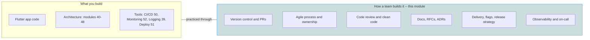

# 60 · Software Engineering Practices

> The craft *around* the code — how professional engineers version, review, document, ship, and observe software as a team — the difference between "can code" and "is an engineer."

## Why this module exists

You can be excellent at Dart and Flutter and still fail on a real team, because ~half of senior engineering is not writing code — it is the **practices** that let many people change one codebase safely, repeatedly, for years:

- A feature works on your machine but the **PR** is unreviewable, so it sits for three days.
- The **release** breaks prod because there was no flag to turn it off and no way to roll back.
- An incident happens and nobody can answer *"is it broken, for whom, since when?"* because there is no **observability**.
- A decision made in a hallway is re-litigated every quarter because it was never written into a **design doc**.

These are not Flutter problems — they are **engineering** problems, and every product company interviews for them ("tell me about your code review process," "how do you do releases," "walk me through an incident"). This module teaches that layer, vendor- and framework-neutral.

Where a topic already has a tool-level module in this handbook (CI/CD, Monitoring, Logging, Deployment), this module teaches the **discipline and decision-making** — *why* you gate a merge, *how* you choose a release strategy, *what* makes a system observable — and cross-links to the mechanics rather than repeating them.

## What you will be able to do

- Use **Git** with intent: branching model, atomic commits, rebase vs merge, resolving conflicts, and a clean PR — plus a mental model of Git's object store.
- Run inside an **Agile** team: sprints, estimation, stand-ups, retros — and collaborate through **code ownership** and clear boundaries.
- Give and receive **code reviews** that improve the code without stalling it, and apply **clean-code / refactoring** discipline continuously.
- Write the documents engineers actually rely on: **READMEs, RFCs / design docs, and ADRs** — and know which to reach for.
- Ship safely: **CI/CD as a practice**, **feature flags**, **release strategies** (canary, blue-green, staged rollout), and **App Store / Play Store** publishing.
- Make a system **observable** — logs, metrics, traces — and reason about SLIs/SLOs, alerting, and on-call as a discipline.

## File index

| # | File | Practice focus | Pairs with (mechanics) |
|---|------|----------------|------------------------|
| 1 | [`01_version_control_git.md`](01_version_control_git.md) | Git object model, branching, PRs, rebase vs merge, GitHub/GitLab flow, monorepo vs polyrepo | [45 Modular · monorepo & melos](../45%20Modular%20Architecture/02_monorepo_and_melos.md) |
| 2 | [`02_agile_and_collaboration.md`](02_agile_and_collaboration.md) | Agile/Scrum/Kanban, estimation, ceremonies, code ownership, working in a team | [58 Senior Architect Notes · leadership](../58%20Senior%20Architect%20Notes/03_leadership_and_mentorship.md) |
| 3 | [`03_code_quality_and_review.md`](03_code_quality_and_review.md) | Clean code, refactoring, code review, linters, engineering best practices | [04 SOLID](../04%20SOLID%20Principles/README.md), [49 Testing](../49%20Testing/README.md) |
| 4 | [`04_documentation_and_design_docs.md`](04_documentation_and_design_docs.md) | READMEs, RFCs / design docs, ADRs, diagrams, writing for engineers | [58 · decision frameworks & ADRs](../58%20Senior%20Architect%20Notes/02_decision_frameworks_and_tradeoffs.md) |
| 5 | [`05_delivery_and_release.md`](05_delivery_and_release.md) | CI/CD as practice, feature flags, canary/blue-green/staged rollout, store publishing | [50 CI CD](../50%20CI%20CD/README.md), [51 Deployment](../51%20Deployment/README.md) |
| 6 | [`06_observability_as_practice.md`](06_observability_as_practice.md) | Logs/metrics/traces, SLI/SLO/SLA, alerting, on-call, incident response | [52 Monitoring](../52%20Monitoring/README.md), [39 Logging](../39%20Logging/README.md) |

## How this module relates to the rest of the handbook

> The other modules give you the *artifact and the tools*. This module gives you the *practices that turn a group of coders into an engineering team*.

## Summary

- Half of senior engineering is the craft around the code: version control, process, review, docs, delivery, observability.
- Six topic files, each teaching the discipline vendor-neutrally and cross-linking to the tool-level module where one exists.
- These are exactly the behaviors product companies interview for beyond coding ability.

## Revision Notes

- "Works on my machine" is not done — reviewable PR, safe release, and observability are part of done.
- Git object model → branching → PR; Agile ceremonies → ownership; review + clean code; RFC/ADR docs; flags + release strategy; logs/metrics/traces + SLOs.
- Where a tool module exists (50/51/52/39), this module owns the *why and how-as-a-team*; the tool module owns the *mechanics*.
