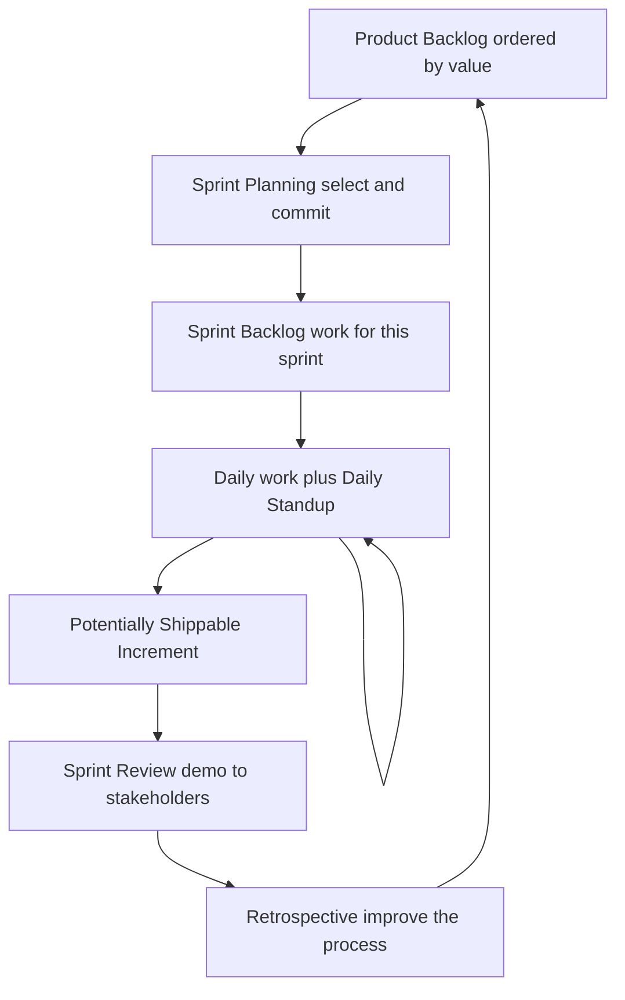
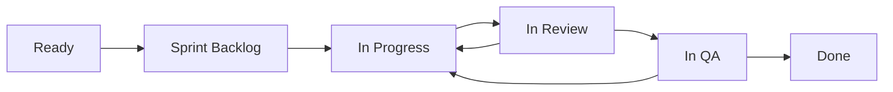
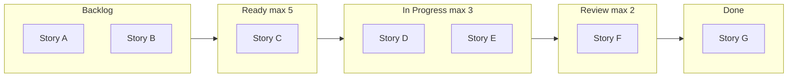

# Agile & Team Collaboration

> Agile is a set of values and iterative practices that lets a team deliver working software in short feedback loops, adapting to change instead of committing to a fixed plan made when the team knew the least.

## Introduction

Agile is not a tool, a certification, or a Jira board. It is a way of organizing engineering work around **short cycles, frequent delivery, and continuous feedback**. The bet is simple: for software, the plan is always wrong at the start, so you should optimize for *changing the plan cheaply* rather than for *executing a plan perfectly*.

This handbook entry is a **practice** topic, not a language topic. There is no bytecode, no widget tree, no garbage collector. Instead we treat the *process itself* as the system: the "state" is where work lives (backlog, board columns), the "runtime" is what happens during a sprint or a day, and "performance" is team throughput. We cover Scrum, Kanban, estimation, user stories, Definition of Done, collaboration mechanics, and code ownership — then trace a single Flutter feature from ticket to production.

Related practice topics:
- [Leadership & Mentorship](../58%20Senior%20Architect%20Notes/leadership_and_mentorship.md)
- [Version Control with Git](./version_control_git.md)
- [Code Quality & Review](./code_quality_and_review.md)
- [Testing Fundamentals & the Pyramid](../49%20Testing/testing_fundamentals_and_pyramid.md)

## Why this concept exists

**Waterfall failed for software.** The waterfall model — requirements, then design, then implementation, then testing, then release, each phase completed before the next begins — was borrowed from construction and manufacturing. It assumes the requirements are knowable up front and stable. For software, both assumptions are false:

- **Requirements are discovered, not specified.** Users cannot tell you what they want until they see something. The most expensive requirements bugs are the ones baked into a spec that nobody validated for six months.
- **The cost of change grows exponentially in waterfall.** A requirement change after the design is frozen forces rework of everything downstream. So waterfall projects resist change — and ship the wrong thing, on time.
- **Integration is deferred to the end**, where all the risk piles up. The "90% done for 90% of the time" problem.
- **Feedback arrives too late to act on.** You learn the product is wrong at the demo, after the budget is spent.

Agile exists to invert this. Instead of one long bet, you make many small bets. You build a thin working slice, show it to real users, and let what you learn reshape the next slice. **Change stops being a failure of planning and becomes the expected input to planning.**

**Why story points beat hours** (previewing the estimation section): hours are an absolute promise about the future that a person is bad at making and gets punished for missing. Points are a *relative* measure of size/complexity/risk that the team calibrates against itself. Points let you forecast with *velocity* (empirical throughput) instead of heroics, and they de-couple "how big" from "how long," which is exactly the coupling that makes hour-estimates a lie.

## Real-world analogy

**Cooking a tasting menu for a guest whose tastes you don't know.**

Waterfall: interview the guest once, then disappear into the kitchen for eight hours and serve all twelve courses at once. If they hate the salt level, you find out after everything is plated and cold.

Agile: serve one small course, watch their face, adjust the seasoning, serve the next. Each course is a **sprint**. The reactions are **feedback**. The running menu you keep re-prioritizing is the **backlog**. You never cook more than you can serve and taste in one sitting — that limit is your **WIP limit**. By the end, the meal fits *this* guest, because you steered continuously instead of guessing once.

## Problem Statement

A team of five is building a Flutter app. The stakeholders keep changing their minds. Some features turn out harder than expected; others turn out unnecessary once seen on-screen. Management wants a date. Engineers want to not be blamed for a date invented before the code existed. QA keeps receiving half-finished features called "done." Two developers keep editing the same files and stepping on each other.

We need a process that:
1. Delivers something usable and demonstrable at a regular cadence.
2. Makes forecasting honest and data-driven rather than a guess under pressure.
3. Defines unambiguously when work is *actually* finished.
4. Coordinates who works on what and who owns which code.
5. Absorbs changing requirements without collapsing.

Agile — usually via Scrum or Kanban — is the answer, and this document is the map.

## Internal Working

The core of Scrum is a repeating loop. Work flows from an ordered **product backlog**, a slice is pulled into a **sprint**, built, reviewed, and shipped as an **increment**, then the team reflects and repeats.



A single story also moves through **states** on the board:



Each state transition is a handoff with an entry condition. A story cannot enter **In Progress** unless it met the **Definition of Ready**; it cannot reach **Done** unless it met the **Definition of Done**.

## Memory Representation

Repurposed: *where the state of work physically lives.*

| "Memory location" | What it holds | Volatility |
|---|---|---|
| **Product backlog** | Every known desirable piece of work, ordered by value. The long-term store. | Constantly re-prioritized; never "full" |
| **Sprint backlog** | The subset the team committed to *this* sprint, plus the plan to build it. | Fixed at planning; owned by the dev team |
| **Board columns** (To Do / In Progress / Review / Done) | The live position of each work item — like a program counter per story. | Changes many times a day |
| **WIP limit** | The max cards allowed in a column at once. | A constraint, not storage — it caps concurrency |
| **Increment** | The sum of all Done items, integrated and shippable. | Append-only; grows each sprint |

The key insight: the board is the team's **shared working memory**. A card in "In Progress" with no owner and no movement for three days is a *leaked reference* — work that is allocated but not running.

## Compiler Behavior

**Not applicable — because** Agile is an organizational process, not source code. Nothing here is compiled, type-checked, or lowered to an intermediate representation. The closest analogue is a linting/validation step: a Definition of Ready acts like a compile-time gate that rejects malformed work items before they enter the sprint, and a CI pipeline acts like the actual compiler for the *code* the process produces (see [Version Control with Git](./version_control_git.md)).

## Runtime Behavior

Repurposed: *what actually happens during a sprint and during a day.*

**A day (the daily stand-up, ~15 min, same time, standing up):** each dev answers three questions in service of one goal — *are we still on track to meet the sprint goal?* Not "what did you do" for a manager, but "what is blocking us and where do we need to swarm." Blockers surface here and get an owner; deep discussions are taken *offline* ("let's park that and take it after").

**A sprint (typically 2 weeks):**
- Day 1: **Sprint planning.** PO presents top backlog items; team clarifies, estimates, and commits to a **sprint goal** and a sprint backlog it believes is achievable.
- Days 1–9: build. Continuous integration, code review, testing. The burndown chart tracks remaining work.
- Mid-sprint: **backlog refinement** (grooming) — the PO and team prepare and estimate upcoming stories so the *next* planning is fast.
- Day 10: **Sprint review** (demo the increment to stakeholders; collect feedback into the backlog) followed by **retrospective** (the team inspects its own process and picks 1–2 concrete improvements).

The sprint is **time-boxed**: the date is fixed, the scope flexes. If work won't fit, you cut scope, not quality, and never silently extend.

## Flutter Engine Behavior (if applicable)

**Not applicable — because** the Flutter engine renders widgets and drives the raster/UI threads; it has no notion of sprints, backlogs, or ceremonies. Process practices influence *what* the engine eventually runs and *how confidently*, but they do not execute on it.

## Dart VM Behavior (if applicable)

**Not applicable — because** the Dart VM executes Dart code (JIT in debug, AOT in release). Agile governs the humans who write that code, not the VM. No isolate, no GC pause, no JIT tier corresponds to a stand-up or a retro.

## Examples

### A well-formed user story with acceptance criteria

```
Title: Offline caching of the product catalog

As a shopper on a flaky connection,
I want the product catalog to load from a local cache when I'm offline,
so that I can keep browsing without a network round-trip.

Acceptance Criteria (Gherkin style):
  Given I have opened the catalog at least once while online
    And I am now offline
   When I open the catalog screen
   Then I see the last-synced products within 300 ms
    And a banner reads "Offline - showing cached data"

  Given I am offline
   When I pull to refresh
   Then the refresh fails gracefully with a retry affordance
    And no data is lost

Out of scope: offline mutations (add-to-cart while offline) - tracked separately.
```

This story is **INVEST**: Independent, Negotiable, Valuable, Estimable, Small, Testable.

### A Definition of Done checklist

```
Definition of Done (applies to EVERY story before it can be "Done")
[ ] Code merged to main via reviewed PR (>=1 approval)
[ ] Meets acceptance criteria (verified by PO or QA)
[ ] Unit + widget tests written; coverage not decreased
[ ] Analyzer clean (flutter analyze, no new warnings)
[ ] Formatted (dart format) and CI green
[ ] No new TODOs without a linked ticket
[ ] Documentation / changelog updated if user-facing
[ ] Feature behind a flag if partially rolled out
[ ] Deployed to staging and smoke-tested
```

### A CODEOWNERS snippet (`.github/CODEOWNERS`)

```
# Default owners for everything
*                       @org/mobile-core

# Feature areas
/lib/features/catalog/  @org/catalog-team
/lib/features/payments/ @org/payments-team @jane-lead

# Cross-cutting concerns need extra eyes
/lib/theme/             @org/design-system
/pubspec.yaml           @org/mobile-core @org/release-eng
**/*.arb                @org/localization
```

A matching PR touching `/lib/features/payments/` will auto-request review from `@org/payments-team` and `@jane-lead`, enforcing **weak ownership** with a required approval gate.

## Diagrams

**Kanban board with WIP limits:**



When "In Progress" hits its WIP limit of 3, nobody pulls a new card — instead the team **swarms** the card closest to Done. Limiting WIP is how Kanban converts "everyone is busy" into "work actually finishes."

## Common Mistakes

| Mistake | Why it hurts | The fix |
|---|---|---|
| **Stand-up as status theater** — reporting to a manager, one by one, robotically | Wastes 15 min/day, surfaces no blockers, treats people as progress bars | Direct it at the *sprint goal* and blockers; take details offline; skip if nothing to coordinate |
| **Estimating in hours** | Punishes people for being wrong about the future; couples size to speed | Estimate relative size in **points**; forecast with velocity |
| **No Definition of Done** | "Done" means five different things; bugs and tech debt ship silently | Write an explicit, checkable DoD the whole team agrees to |
| **Sprints that always overflow** | Team over-commits; morale erodes; forecasts become fiction | Commit to less; use *actual* velocity, not aspirational |
| **Backlog is a junk drawer** | 800 stale items, nothing prioritized, planning is chaos | PO ruthlessly orders and prunes; refine continuously |
| **Retro with no action** | Same problems every sprint; team stops believing in retros | Pick 1–2 concrete actions with owners; review them next retro |
| **Changing scope mid-sprint** | Destroys the one stable box the team has | Protect the sprint; new work goes to the backlog for next planning |
| **Story "won't fit" so it lives across sprints** | Zero delivered value, no feedback, invisible progress | Split it vertically into shippable slices |

## Best Practices

- **Slice stories vertically**, not by layer. A slice should go from UI to data and deliver observable value, not "build the repository layer" (invisible to users).
- **Keep the sprint goal singular and memorable.** If you can't state it in one sentence, you committed to too much.
- **Refine continuously** so planning is a confirmation, not a discovery session.
- **Make the board honest.** A card's column must reflect reality *now*. Stale boards rot trust.
- **Separate Definition of Ready from Definition of Done** — one gates entry, one gates exit.
- **Automate the DoD where possible** — CI enforces tests, format, analyzer, coverage so "done" isn't a matter of opinion.
- **Timebox ceremonies** and start on time regardless of who is late.
- **Prefer async by default, sync for ambiguity** (see Collaboration mechanics below).

### Collaboration mechanics

- **Async vs sync:** Default to async (written PRs, docs, threaded discussion) — it scales across time zones, creates a record, and protects deep-work focus. Switch to sync (call, pairing) when the topic is ambiguous, emotionally charged, or ping-ponging past ~3 round trips.
- **RACI** clarifies decisions: **R**esponsible (does the work), **A**ccountable (one person, owns the outcome), **C**onsulted (two-way input), **I**nformed (one-way notice). Exactly one A per decision.
- **Pair programming:** two devs, one keyboard — great for hard problems, onboarding, and knowledge transfer; raises the **bus factor**.
- **Mob programming:** the whole team on one problem — reserved for the highest-risk or highest-alignment work.

## Performance

Repurposed: *team flow metrics.* You optimize the *system of work*, not individual utilization.

| Metric | Definition | What it tells you |
|---|---|---|
| **Velocity** | Points completed per sprint (rolling average) | Forecasting capacity — *not* a productivity KPI to compare across teams |
| **Cycle time** | Time from "In Progress" to "Done" | How fast work flows once started; the number to shrink |
| **Lead time** | Time from request created to delivered | The customer's experience of speed |
| **Throughput** | Items completed per unit time | Delivery rate, complements velocity |
| **Flow efficiency** | Active time / total time (active + waiting) | Often <15% — most time is *waiting*, not working. Attack the waits (review queues, handoffs) |
| **WIP** | Items in progress right now | High WIP = high cycle time (Little's Law: `Cycle time = WIP / Throughput`) |

The counter-intuitive lesson: to go faster, **lower WIP**. Finish before you start. Utilization near 100% *increases* delay, exactly like a full disk or a saturated CPU queue.

## Advantages

- Delivers usable software early and often; risk is discovered while it's cheap.
- Absorbs changing requirements as normal input.
- Tight feedback loops steer toward the *right* product, not just a shipped one.
- Empirical forecasting (velocity) beats up-front guessing.
- Improves morale and ownership — the team commits to its own plan and improves its own process.
- Continuous integration keeps the product shippable, avoiding big-bang integration risk.

## Disadvantages

- **Cargo-culting**: teams adopt the rituals without the values and get meetings without benefit.
- Requires genuine stakeholder availability; an absent PO starves the backlog.
- Weak fit for truly fixed-scope, fixed-date, fixed-contract work (some regulated/hardware contexts).
- Metrics are easily weaponized (velocity as a stick), which corrupts the estimates.
- Ceremony overhead can dominate for tiny teams; discipline is required to keep it lightweight.
- Long-term architecture can be neglected if every sprint chases the nearest feature.

## Interview Questions

**🟢 1. What are the four values of the Agile Manifesto?**
Individuals and interactions **over** processes and tools; working software **over** comprehensive documentation; customer collaboration **over** contract negotiation; responding to change **over** following a plan. Crucially: the items on the right have value, but we value the items on the left *more*.

**🟢 2. Scrum vs Kanban — when would you pick each?**
Scrum: time-boxed sprints, fixed roles/ceremonies, commitment to a sprint goal — good when work is plannable in batches and stakeholders want a cadence. Kanban: continuous flow, WIP limits, no sprints, pull-based — good for unpredictable, interrupt-driven work like support or ops. Many teams run "Scrumban."

**🟢 3. What is a story point and why not estimate in hours?**
A point is a relative measure of size/complexity/uncertainty, calibrated to the team. Hours are absolute promises humans estimate poorly and get punished for missing; points decouple size from speed and let velocity do the forecasting empirically.

**🟡 4. Explain Definition of Done vs Definition of Ready.**
DoR gates *entry*: a story is ready to be worked (clear, estimated, dependencies known, acceptance criteria written). DoD gates *exit*: objective, checkable conditions every story must meet to be called done (merged, tested, CI green, deployed to staging, criteria verified). One prevents starting garbage; the other prevents shipping garbage.

**🟡 5. What makes a good user story? (INVEST)**
Independent, Negotiable, Valuable, Estimable, Small, Testable. Written as "As a [role] I want [capability] so that [benefit]," with explicit acceptance criteria. It should deliver a vertical slice of value, not a horizontal technical layer.

**🟡 6. What are WIP limits and why do they speed a team up?**
A cap on concurrent work per board column. By Little's Law, cycle time = WIP / throughput, so cutting WIP cuts cycle time. Lower WIP forces finishing over starting, exposes bottlenecks, and reduces context-switching — the team delivers faster by doing fewer things at once.

**🔴 7. Behavioral: How do you handle a story that won't fit in a sprint?**
First, don't carry it across sprints — that delivers zero feedback. Split it **vertically** into thin end-to-end slices that each ship value (e.g., "show cached list read-only" before "cache with refresh" before "offline mutations"). If it genuinely can't be split, it's a spike/epic: create a time-boxed research spike to reduce uncertainty, then decompose. Escalate to the PO to re-prioritize the slices. The anti-pattern is a giant WIP card dragging across three sprints.

**🔴 8. Behavioral: A stakeholder wants to add scope mid-sprint. What do you do?**
Protect the sprint. Acknowledge the value, put it in the backlog, and make the trade-off visible: adding it now means dropping something of equal size (the PO decides which). If it's a true emergency (production incident), that's a different track — abort/replan the sprint transparently rather than quietly overloading the team. The sprint's stability is what makes forecasting possible.

**🟡 9. Explain code ownership models.**
Strong: only the owner edits their files. Weak: an owner exists but others may contribute with review. Collective: anyone may change anything, guarded by tests, standards, and review. Collective maximizes bus factor and flow but needs strong CI discipline; strong ownership creates deep expertise but bottlenecks and single points of failure.

**🟡 10. What is bus factor and how do you raise it?**
The number of people who can be "hit by a bus" before the project stalls — i.e., how concentrated critical knowledge is. Raise it with pairing/mobbing, rotating ownership, documentation, collective ownership, and CODEOWNERS that list teams rather than individuals.

**🔴 11. Your velocity is dropping. How do you investigate?**
Don't treat velocity as productivity — investigate flow. Check cycle time and flow efficiency: is work stuck in review/QA (a bottleneck, not slow devs)? Is WIP too high? Did estimates inflate under pressure? Was the team interrupted by unplanned work or attrition? Look at the retro history. Velocity is a planning tool; a drop is a signal to find waits, not to push people.

**🔴 12. Behavioral: The daily stand-up feels useless. How do you fix it?**
Diagnose the failure mode. If it's status theater, re-anchor it on the sprint goal and blockers, not on reporting to a manager; take detailed discussions offline; walk the board right-to-left (focus on finishing). If truly nothing needs coordinating on a given day, skip it — the ritual serves the team, not vice versa.

## Senior Engineer Tips

- **Estimate uncertainty, not effort.** A point spike usually means "we don't understand this yet" — resolve the unknown with a spike before committing.
- **The board is a diagnostic instrument.** Read it right-to-left: cards piling up in Review mean your bottleneck is review capacity, not coding — swarm there.
- **Say "no" via the backlog, not in the moment.** "Great idea — let's rank it against everything else" reframes scope creep as prioritization.
- **Automate the boring half of the DoD.** Anything a human "remembers to check" will eventually be forgotten; move it into CI. See [Code Quality & Review](./code_quality_and_review.md).
- **Protect deep work.** Default async; batch your interruptions; a fragmented senior is a bottleneck multiplier.
- **Vertical slices always.** If a story has no demoable outcome, it's a task, not a story.
- **Retro actions need owners and a due date**, or they're wishes.

## Architect Perspective

At one team, Scrum "just works." Across dozens of teams, the hard problems are **dependencies and communication topology**, not ceremonies.

- **Conway's Law:** "Organizations design systems that mirror their communication structure." If three teams own one screen, you'll get three seams in that screen. So architects use the **Inverse Conway Maneuver**: shape team boundaries to match the *desired* architecture. Team topology *is* system design.
- **The Spotify model** (Squads, Tribes, Chapters, Guilds) is one attempt at scaling autonomy: squads are autonomous cross-functional teams; chapters/guilds share expertise horizontally so autonomy doesn't fragment standards. Treat it as inspiration, not a template — Spotify itself doesn't run it verbatim.
- **Cross-team dependencies are the enemy of flow.** Every hand-off adds queue time (flow efficiency drops). Architect for **loosely coupled, independently deployable** modules so teams don't block each other — the same modularity argument as clean architecture, applied to org design.
- **Alignment vs autonomy:** high autonomy without alignment yields divergence; high alignment without autonomy yields bottlenecks. The architect's job is to set clear standards (alignment) and then get out of the way (autonomy) — mirroring the mentorship stance in [Leadership & Mentorship](../58%20Senior%20Architect%20Notes/leadership_and_mentorship.md).
- **Scaling frameworks** (SAFe, LeSS, Scrum@Scale) formalize cross-team planning, but each adds process weight; adopt only the coordination you actually need.

## Summary

Agile replaced waterfall because software requirements are discovered, not specified, and change is cheaper to embrace than to resist. **Scrum** organizes work into time-boxed sprints with clear roles (PO owns *what*, Scrum Master owns *how the process runs*, dev team owns *how it's built*), artifacts (product backlog, sprint backlog, increment), and ceremonies (planning, stand-up, review, retro). **Kanban** optimizes continuous flow with WIP limits. Estimation uses relative **story points** and empirical **velocity** rather than dishonest hour promises. **User stories** capture value ("As a… I want… so that…") and are gated by **Definition of Ready** on entry and **Definition of Done** on exit. Collaboration balances async and sync, uses RACI for decisions, and raises **bus factor** through pairing and collective ownership backed by **CODEOWNERS**. The whole point is a tight feedback loop that steers toward the right product while keeping it shippable.

## Revision Notes

- Waterfall fails because requirements are discovered and change cost grows exponentially.
- Manifesto: individuals/interactions, working software, customer collaboration, responding to change — over the right-hand items.
- Scrum roles: PO (what/priority), Scrum Master (process/blockers), Dev team (how/build).
- Artifacts: product backlog → sprint backlog → increment.
- Ceremonies: planning → daily stand-up → review → retrospective.
- Kanban = continuous flow + WIP limits; no sprints.
- Points = relative size; velocity = empirical forecast; hours = punished guesses.
- INVEST for stories; Given/When/Then for acceptance criteria.
- DoR gates entry, DoD gates exit.
- Little's Law: cycle time = WIP / throughput → lower WIP to go faster.
- Ownership: strong / weak / collective; CODEOWNERS enforces review; bus factor = knowledge concentration.
- Conway's Law: system mirrors org communication; Inverse Conway to design teams.

### Scrum vs Kanban

| Aspect | Scrum | Kanban |
|---|---|---|
| Cadence | Fixed time-boxed sprints | Continuous flow |
| Commitment | Sprint goal + sprint backlog | No sprint commitment; pull as capacity frees |
| Roles | PO, Scrum Master, Dev team | No prescribed roles |
| Change mid-cycle | Discouraged (protect the sprint) | Allowed any time (re-prioritize backlog) |
| Core metric | Velocity | Cycle time / throughput |
| Board reset | Per sprint | Persistent |
| Best for | Plannable, batchable work | Interrupt-driven, unpredictable work |

### Waterfall vs Agile

| Aspect | Waterfall | Agile |
|---|---|---|
| Planning | Big up-front, fixed | Continuous, adaptive |
| Delivery | One release at the end | Incremental, frequent |
| Feedback | Late (at the end) | Early and continuous |
| Change | Costly, resisted | Expected, embraced |
| Risk | Concentrated at integration/release | Spread and surfaced early |
| Docs | Comprehensive up front | Just enough, just in time |

### Ownership models

| Model | Who edits | Pros | Cons |
|---|---|---|---|
| **Strong** | Only the owner touches their code | Deep expertise, clear accountability | Bottlenecks, low bus factor, blocked PRs |
| **Weak** | Owner exists; others contribute via review | Balance of expertise + flow; CODEOWNERS fit | Owner can still be a review bottleneck |
| **Collective** | Anyone may change anything | High bus factor, fast flow, no gatekeeping | Needs strong tests/standards; diffusion of responsibility |

## Practice Questions

1. Rewrite a vague ticket "make the app faster" into a proper INVEST user story with acceptance criteria.
2. Your "In Review" column always has 6 cards while "In Progress" has 1. What does the board tell you, and what do you change?
3. A manager wants to compare Team A's velocity (40) to Team B's (25) to judge productivity. Explain why this is invalid.
4. Draft a Definition of Ready for your team (at least 5 items).
5. Give a RACI for the decision "which state management approach will the app use."
6. Explain, using Little's Law, why cutting WIP from 8 to 4 could roughly halve cycle time.
7. Your PO is unavailable for two sprints. List three concrete consequences and one mitigation.

## Coding Questions

Repurposed as practical process exercises.

1. **Break an epic into stories.** Epic: "User can manage their account." Produce at least four vertically-sliced user stories, each in "As a… I want… so that…" form, each with 2–3 Given/When/Then acceptance criteria, and assign relative points (1/2/3/5/8).
2. **Write a CODEOWNERS file** for a Flutter repo with `lib/features/auth`, `lib/features/feed`, `lib/design_system`, and `pubspec.yaml`, mapping each to a plausible team, with a catch-all default.
3. **Author a Definition of Done** tailored to a Flutter app that includes analyzer, formatting, widget tests, golden tests, and staged deployment. Then mark which items can be enforced automatically in CI vs which need a human.
4. **Design a Kanban board** (as a table or Mermaid) with columns and WIP limits for a 4-person team, and write one rule for what happens when a column hits its limit.
5. **Convert an hour estimate to points.** Given a team whose "3-point" story historically took ~2 days, forecast how many sprints 34 remaining points will take at a velocity of 18/sprint.

## Mini Project

**Run a simulated 2-week sprint for a small Flutter feature.**

Goal: deliver "Offline caching of the product catalog" (the example story above) plus a couple of supporting stories.

Steps:
1. **Set up the board** (paper, Trello, or GitHub Projects) with columns: Ready, In Progress (WIP 2), In Review (WIP 2), In QA, Done. Write your DoR and DoD and pin them to the board.
2. **Backlog & refinement:** write 4–6 stories (catalog cache read, offline banner, pull-to-refresh graceful failure, cache invalidation, analytics event). Give each acceptance criteria and estimate in points via **planning poker** (everyone reveals a card simultaneously; discuss outliers; re-vote).
3. **Sprint planning:** pick a one-sentence sprint goal ("Users can browse the catalog offline"). Commit only to the points your (assumed) velocity supports.
4. **Simulate the days:** for five "days," hold a 2-minute stand-up, move cards, and inject one realistic blocker (e.g., "the cache library has a bug"). Practice swarming instead of starting new work when WIP is full.
5. **Trace one story ticket→production:** Ready → branch off main → implement behind a feature flag → open PR (CODEOWNERS auto-requests the catalog team) → review + CI (analyzer, tests, goldens) → merge → deploy to staging → PO verifies acceptance criteria → flag flipped on → Done. Cross-reference [Version Control with Git](./version_control_git.md) and [Testing Fundamentals & the Pyramid](../49%20Testing/testing_fundamentals_and_pyramid.md).
6. **Sprint review:** demo the working offline mode. Record one piece of feedback and add it to the backlog.
7. **Retrospective:** list what went well / what didn't / one action item with an owner. Measure your **velocity** (points actually Done) and note your longest **cycle time** — that's the bottleneck to attack next sprint.

Deliverables: the filled board, the story cards with criteria, the DoD/DoR, one CODEOWNERS file, and a short retro note. Success = a demoable increment and an honest velocity number you can plan the *next* sprint with.
