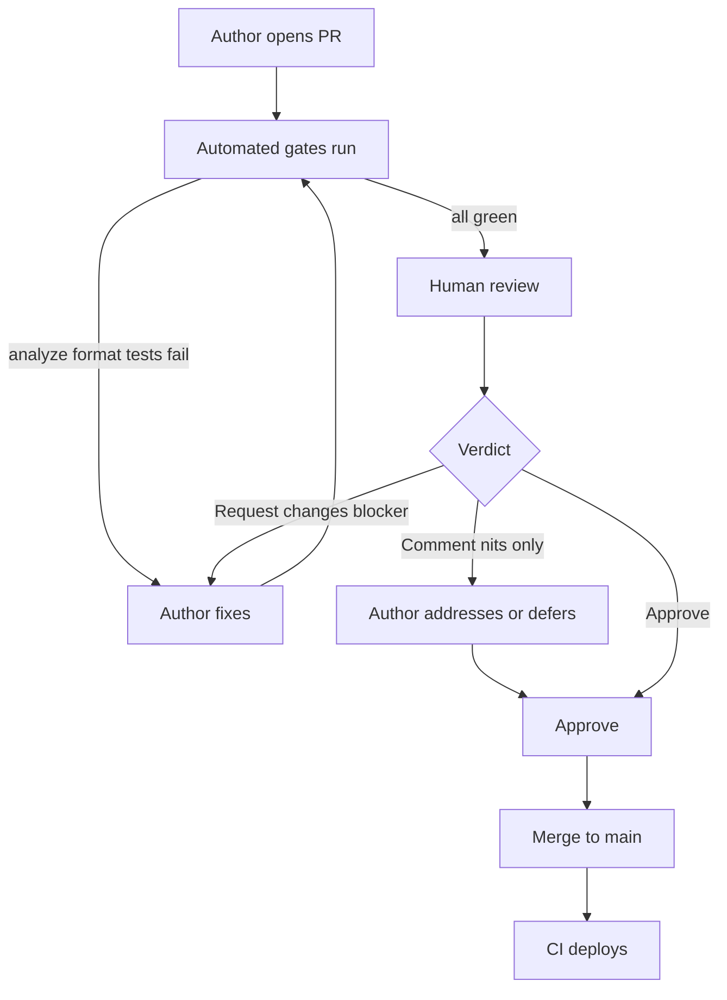
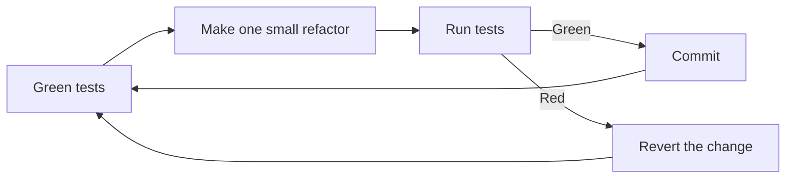
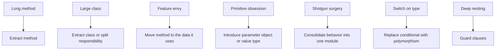
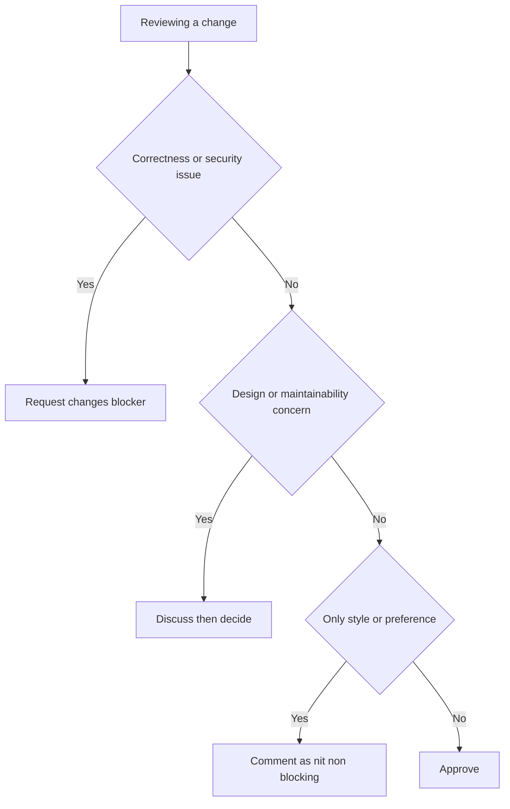

# Code Quality, Clean Code & Code Review

> Code quality is the discipline of keeping software cheap to change safely — through readable, testable, correct code and the review practices that protect it over time.

## Introduction

Most of a software system's lifetime cost is spent *after* the first version ships: reading, understanding, changing, and fixing code that already exists. "Quality" is not a subjective aesthetic — it is a measurable property of how expensive the *next* change will be. This chapter treats quality as an **economic argument** and gives you the concrete practices — clean-code principles, refactoring, code review, and static analysis — that lower that cost.

Quality has four load-bearing dimensions:

| Dimension | Question it answers | Failure symptom |
|---|---|---|
| Readability | Can a peer understand this in one pass? | "I have to run it to know what it does." |
| Maintainability | How cheap is the next change? | One feature touches ten files (shotgun surgery). |
| Testability | Can behavior be verified in isolation? | Untestable without a live network/DB. |
| Correctness | Does it do the right thing on all inputs? | Passes happy path, crashes on null/edge. |

These are vendor-neutral engineering ideas; we illustrate them with Dart/Flutter, but the same reasoning applies in any language.

## Why this concept exists

Code is written once and read hundreds of times. The dominant cost is **change over time**, and that cost compounds:

- A bug found in review costs minutes; the same bug in production costs hours plus a customer-trust tax.
- A confusing name is a small toll paid by *every* future reader, forever.
- Duplicated logic (WET — "write everything twice") means every change must be made in N places, and the one you forget becomes the outage.

The core insight: **software's value is not the code that exists today, but the code you can safely write tomorrow.** Clean code and review exist to keep the marginal cost of change flat rather than exponential. Uncontrolled complexity makes each change slower and riskier until the team's velocity collapses — the classic "big ball of mud."

This is why quality is a *business* concern, not a developer vanity project. A team that spends 20% up front on reviews and refactoring routinely spends far less than 100% later untangling a system nobody dares touch.

## Real-world analogy

Think of a **professional kitchen**. Clean-as-you-go (the boy-scout rule: leave the station cleaner than you found it) keeps the kitchen operating at speed all night. Skip it, and by the dinner rush every surface is blocked, orders collide, and mistakes ship to tables.

- Meaningful names = clearly labelled containers; nobody confuses salt for sugar.
- Small functions = one station does one thing well.
- Code review = the head chef tasting a dish *before* it leaves the pass — cheap to fix now, expensive to recall from the customer.
- Linters/formatters = the health inspector's checklist, automated so humans discuss the food, not the floor.

A dirty kitchen can still serve dinner — for a while. Then it can't.

## Problem Statement

Without quality practices, predictable failures emerge:

1. **The code no one understands.** The original author left; the code is the only spec, and it's unreadable.
2. **The change that breaks three unrelated things.** Hidden coupling; no tests to catch it.
3. **The review that's a formality.** Rubber-stamped PRs let defects through; giant PRs make real review impossible.
4. **The bikeshed review.** Reviewers argue about brace style (a linter's job) while a real logic bug sails past.
5. **The frozen module.** So fragile that "don't touch it" becomes policy, and features route around it, accreting more mud.

The goal of this chapter: make code that is *safe and cheap to change*, and build a review culture that catches defects early while staying kind, specific, and fast.

## Internal Working

Two lifecycles power this practice. First, a pull request from open to merge:



Second, the refactor-under-test loop — the only *safe* way to improve code without changing behavior:



The discipline: tests must be green *before* you start, each refactoring step is tiny and behavior-preserving, and you re-run tests after every step so any break is attributable to the last move.

## Memory Representation

*Repurposed:* instead of RAM layout, this section is about **human working memory — cognitive load**, because that is the real "memory" clean code optimizes for.

Human working memory holds roughly 4–7 chunks at once. Every unclear name, deep nesting level, or long function forces the reader to hold more state in their head simultaneously. When you exceed the limit, comprehension fails and bugs slip in.

Clean code is a cognitive-load-reduction strategy:

| Technique | What it removes from working memory |
|---|---|
| Meaningful names | The need to remember what `x`, `data2`, `tmp` mean. |
| Small functions | You reason about one function, not 200 lines at once. |
| Single level of abstraction | You aren't juggling "high-level intent" and "byte fiddling" in the same breath. |
| Guard clauses / shallow nesting | Fewer open mental brackets ("if inside if inside for…"). |
| Making illegal states unrepresentable | You needn't remember "this is only valid when that flag is set." |

A good name is a *cache entry*: it lets the reader recall a whole concept from one token. That is the sense in which this chapter has a "memory representation."

## Compiler Behavior

Here the section genuinely applies: Dart ships a first-class **static analyzer** that enforces much of what we call quality, before any code runs.

- **`dart analyze`** performs static analysis: type errors, unused variables, dead code, null-safety violations, and lint-rule breaches. It uses the same analysis engine as the IDE.
- **`dart format`** deterministically reformats code, ending all whitespace/brace debates.
- **Lints** are configurable rules layered on top. `package:lints` (recommended set) and the stricter `package:flutter_lints` are common baselines.
- **`analysis_options.yaml`** is the control file: choose a lint set, toggle individual rules, and set the analyzer to fail on issues.

```yaml
# analysis_options.yaml
include: package:flutter_lints/flutter.yaml

analyzer:
  language:
    strict-casts: true
    strict-raw-types: true
  errors:
    # promote selected lints to hard errors (fail CI)
    unawaited_futures: error
    avoid_dynamic_calls: error
  exclude:
    - "**/*.g.dart"
    - "**/*.freezed.dart"

linter:
  rules:
    prefer_const_constructors: true
    prefer_final_locals: true
    always_declare_return_types: true
    require_trailing_commas: true
    avoid_print: true
```

The analyzer is a *compile-time quality gate*: it turns whole classes of review nits ("you forgot `final`", "unawaited future") into automated, non-negotiable feedback — freeing human reviewers to think about design and correctness. Custom lints (via `custom_lint` / `analyzer_plugin`) let a team encode its own rules, e.g. "no direct `DateTime.now()` in domain code."

## Runtime Behavior

*Repurposed — limited applicability:* clean code is overwhelmingly a **compile-time and human concern**, with essentially **zero runtime cost**. Extracting a method, renaming a variable, or adding guard clauses does not change observable behavior — that is the definition of refactoring.

The one honest tension: **readability vs micro-performance**. Occasionally the clearest code is marginally slower — e.g., a readable `.map().where().toList()` chain allocates intermediate iterables versus one hand-rolled loop. The engineering rule:

1. Write it clearly first.
2. Measure with a profiler (see Performance).
3. Optimize only the proven hot path, and leave a comment explaining *why* the code is now less obvious.

99% of code is not hot. Sacrificing clarity for imagined speed is premature optimization — a code smell in itself.

## Flutter Engine Behavior

**Not applicable — because** code quality and review are process/design practices that operate on source before it is ever compiled or rendered. The Flutter engine (Skia/Impeller rasterization, the C++ shell, platform channels) is entirely indifferent to whether your Dart is clean or filthy; it only ever sees compiled output. Widget-level *performance* practices belong in the rendering chapters, not here.

## Dart VM Behavior

**Not applicable — because** refactoring is behavior-preserving by definition, so JIT/AOT compilation, isolate scheduling, and garbage collection see no semantic difference between "before" and "after" clean-up. Names and function boundaries are largely erased or inlined by the AOT compiler; the VM neither rewards nor penalizes readable code at runtime.

## Examples

**1. Bad naming → good naming (intent in the name).**

```dart
// BEFORE — what is d? what is 7?
bool chk(User u, int d) => DateTime.now().difference(u.t).inDays > d;

// AFTER — the name is the documentation
bool isSubscriptionExpired(User user, {required int graceDays}) {
  final daysSinceRenewal = DateTime.now().difference(user.lastRenewedAt).inDays;
  return daysSinceRenewal > graceDays;
}
```

**2. Long function → extract method + single level of abstraction.**

```dart
// BEFORE — one function mixing validation, calculation, formatting
String buildInvoice(List<LineItem> items, double taxRate) {
  var subtotal = 0.0;
  for (final i in items) {
    if (i.quantity <= 0) throw ArgumentError('bad qty');
    subtotal += i.unitPrice * i.quantity;
  }
  final tax = subtotal * taxRate;
  final total = subtotal + tax;
  return 'Subtotal: \$${subtotal.toStringAsFixed(2)}\n'
      'Tax: \$${tax.toStringAsFixed(2)}\n'
      'Total: \$${total.toStringAsFixed(2)}';
}

// AFTER — each function reads at one level of abstraction
String buildInvoice(List<LineItem> items, double taxRate) {
  _validate(items);
  final subtotal = _subtotal(items);
  final tax = subtotal * taxRate;
  return _format(subtotal: subtotal, tax: tax);
}

void _validate(List<LineItem> items) {
  for (final item in items) {
    if (item.quantity <= 0) {
      throw ArgumentError.value(item.quantity, 'quantity', 'must be positive');
    }
  }
}

double _subtotal(List<LineItem> items) =>
    items.fold(0.0, (sum, i) => sum + i.unitPrice * i.quantity);

String _format({required double subtotal, required double tax}) =>
    'Subtotal: \$${subtotal.toStringAsFixed(2)}\n'
    'Tax: \$${tax.toStringAsFixed(2)}\n'
    'Total: \$${(subtotal + tax).toStringAsFixed(2)}';
```

**3. Nested conditionals → guard clauses.**

```dart
// BEFORE — arrow-shaped code, high cognitive load
String discountLabel(User? user) {
  if (user != null) {
    if (user.isActive) {
      if (user.isPremium) {
        return 'Premium discount';
      } else {
        return 'Standard discount';
      }
    } else {
      return 'Inactive';
    }
  } else {
    return 'Guest';
  }
}

// AFTER — flat, early returns, easy to scan
String discountLabel(User? user) {
  if (user == null) return 'Guest';
  if (!user.isActive) return 'Inactive';
  return user.isPremium ? 'Premium discount' : 'Standard discount';
}
```

**4. Replace conditional with polymorphism + make illegal states unrepresentable.**

```dart
// BEFORE — switch on a type tag, easy to forget a case
double area(String kind, double a, double b) {
  switch (kind) {
    case 'circle':
      return 3.14159 * a * a; // b ignored — illegal-state smell
    case 'rect':
      return a * b;
    default:
      throw ArgumentError('unknown shape');
  }
}

// AFTER — sealed class: compiler enforces exhaustive handling
sealed class Shape {
  double get area;
}

final class Circle extends Shape {
  Circle(this.radius);
  final double radius;
  @override
  double get area => 3.14159 * radius * radius;
}

final class Rectangle extends Shape {
  Rectangle({required this.width, required this.height});
  final double width;
  final double height;
  @override
  double get area => width * height;
}

// Adding a new Shape now forces every switch to handle it — fail fast, at compile time.
```

**5. Introduce parameter object (primitive obsession → cohesive type).**

```dart
// BEFORE — a "data clump" of primitives passed everywhere
void book(String city, String country, String zip, double lat, double lng) {}

// AFTER — the concept has a name and can validate itself
class Location {
  Location({
    required this.city,
    required this.country,
    required this.zip,
    required this.lat,
    required this.lng,
  });
  final String city;
  final String country;
  final String zip;
  final double lat;
  final double lng;
}

void book(Location location) {}
```

## Diagrams

Code smell → refactoring map:



Review verdict decision:



## Common Mistakes

| Mistake | Why it hurts | Fix |
|---|---|---|
| Nitpicking style in review | Wastes human attention; demoralizes | Automate style with formatter+linter; humans review design |
| Rubber-stamping ("LGTM" unread) | Defects slip through; review becomes theatre | Require a specific comment or question per review; rotate reviewers |
| Giant PRs (1000+ lines) | Impossible to review well; reviewers skim | Keep PRs small and single-purpose; stack/split changes |
| Premature abstraction | Wrong abstraction is costlier than duplication | Follow "rule of three"; apply YAGNI; wait for real duplication |
| Refactoring without tests | Silent behavior changes | Add characterization tests first, then refactor |
| Comments that restate code | Rot into lies; add noise | Delete WHAT comments; keep WHY comments only |
| Mixing refactor + feature in one PR | Reviewer can't tell intent from accident | Separate "pure refactor" PRs from behavior changes |
| Blocking on personal preference | Slows the team; breeds resentment | Distinguish nit from blocker explicitly; defer to author on ties |

## Best Practices

- **Names carry intent.** A variable's name should make a comment unnecessary. Prefer `remainingRetries` over `n`.
- **Functions do one thing** and stay at one level of abstraction. If you need "and" to describe it, split it.
- **Guard clauses over nesting.** Handle edge cases first, return early, keep the happy path un-indented.
- **DRY, but not dogmatically.** Deduplicate *knowledge*, not incidental similarity. Two things that look alike but change for different reasons should stay separate.
- **KISS / YAGNI.** Build for today's requirement; don't speculate. Delete dead code — version control remembers it.
- **Boy-scout rule.** Every PR leaves the touched code slightly cleaner.
- **Comments explain WHY.** The code shows what; comments justify non-obvious decisions and link to tickets.
- **Fail fast.** Validate inputs at boundaries; throw or assert on impossible states rather than limping onward.
- **Make illegal states unrepresentable** with sealed classes, enums, and required fields (ties to [SOLID](../04%20SOLID%20Principles/README.md)).
- **Consistency over cleverness.** A codebase that reads the same everywhere is faster to work in than a collection of individually brilliant tricks.
- **Review small, review fast.** Aim for sub-day review latency; long-open PRs rot and force painful rebases.
- **Feedback is kind + specific + actionable.** "This function is confusing" is none of those; "Extracting the validation into `_validate` would make the intent clearer — wdyt?" is all three.

## Performance

*Repurposed to team-level metrics*, because that is where "code quality" pays off measurably:

| Metric | What it measures | Healthy signal |
|---|---|---|
| Review latency | Time from PR open to first review | Hours, not days |
| PR size | Lines changed per PR | Small; large PRs correlate with missed defects |
| Defect-escape rate | Bugs reaching production vs caught in review | Trending down |
| Change-failure rate | % of deploys causing incidents (DORA) | Low and stable |
| Lead time for change | Commit to production | Short — a proxy for maintainability |

Quality practices move these numbers: automated gates cut review latency (humans stop policing style), small PRs cut defect-escape, and clean code cuts lead time because changes are safer.

The **readability-vs-performance tradeoff** is real but narrow: profile first, optimize the measured hot path only, and document why the optimized code is less obvious. Everywhere else, clarity wins because developer time is the scarce resource, not CPU cycles.

## Advantages

- Lower total cost of ownership — cheaper, safer changes over the system's life.
- Faster onboarding; new engineers read intent, not archaeology.
- Fewer production defects; problems caught in review and by the analyzer.
- Shared understanding and bus-factor resilience across the team.
- Reviews spread knowledge and enforce standards without a central gatekeeper.

## Disadvantages

- Up-front time cost; discipline is easy to skip under deadline pressure.
- Review can become a bottleneck or a politics arena if done poorly.
- "Clean" is partly subjective; teams need agreed conventions to avoid endless debate.
- Over-applied (gold-plating, premature abstraction) it wastes effort and adds complexity.
- Requires cultural buy-in; tools alone don't create quality.

## Interview Questions

1. 🟢 **What does "code quality" actually mean, and why is it an economic argument?**
   Quality = readability, maintainability, testability, correctness. It's economic because most software cost is *change over time*; clean code keeps the marginal cost of the next change flat instead of exponential. You're optimizing for the code you'll safely write tomorrow.

2. 🟢 **DRY vs WET vs KISS vs YAGNI — define each.**
   DRY: don't duplicate *knowledge*. WET: the anti-pattern of writing the same thing repeatedly. KISS: keep it simple. YAGNI: don't build what you don't need yet. They balance each other — DRY without judgment causes premature abstraction, which YAGNI/KISS restrain.

3. 🟢 **What is refactoring, precisely?**
   A *behavior-preserving* change to code's structure to improve its internal quality. If observable behavior changes, it's not refactoring — it's a feature or a bug. Hence it requires test coverage to do safely.

4. 🟡 **Walk me through how you review a PR.**
   First I read the description and linked ticket to understand *intent*. I check CI/analyzer are green so I'm not reviewing style manually. I read tests to see what behavior is claimed, then the diff for correctness and edge cases (null, empty, error paths), then design/maintainability. I flag blockers (correctness, security) clearly, mark preferences as non-blocking "nits", ask questions rather than dictate, and keep feedback kind, specific, actionable. I approve if there's no blocker, even with open nits I trust the author to weigh.

5. 🟡 **How do you give feedback that lands well?**
   Kind + specific + actionable. Critique the code, not the person; explain the *why*; suggest a concrete alternative; distinguish must-fix from preference; use "we/this" not "you". Praise good bits too — review isn't only fault-finding.

6. 🟡 **Name four code smells and their refactorings.**
   Long method → extract method; large class → extract class; feature envy → move method to the data it uses; primitive obsession → introduce a value type/parameter object; switch-on-type → replace conditional with polymorphism.

7. 🟡 **How does `dart analyze` differ from `dart format`, and what's `analysis_options.yaml` for?**
   `analyze` is static analysis — finds type errors, dead code, lint violations. `format` deterministically reformats whitespace. `analysis_options.yaml` configures the analyzer: which lint set, individual rule toggles, promoting lints to errors, and excludes. Together they automate the mechanical parts of review.

8. 🔴 **What's the danger of DRY, and how do you decide when *not* to deduplicate?**
   The wrong abstraction is more expensive than duplication because it couples things that change independently. Two code blocks that look identical but change for *different reasons* should stay separate (Single Responsibility). Rule of three: tolerate duplication until you've seen it three times and understand the shared axis of change.

9. 🔴 **How do you refactor a legacy module with no tests?**
   Write *characterization tests* first — tests that pin the current behavior, warts included — using the module as an oracle. Once green, refactor in tiny steps, re-running tests each step. Introduce seams (dependency injection) to make it testable. See [Testing](../49%20Testing/README.md).

10. 🔴 **"Make illegal states unrepresentable" — what does it mean in Dart?**
    Design types so invalid combinations can't be constructed: `required` fields, non-nullable types, enums/sealed classes instead of stringly-typed tags, and factory constructors that validate. The compiler then enforces invariants, moving whole bug classes from runtime to compile time — fail fast, statically.

11. 🟡 **How do you keep code review from becoming a bottleneck?**
    Small PRs, SLA on review latency, automate style/lint, distinguish nits from blockers, allow "approve with comments", rotate reviewers, and let authors merge after addressing blockers without a second full round for trivia.

12. 🔴 **When does clean code conflict with performance, and how do you resolve it?**
    Rarely, and only in hot paths (e.g., iterator chains allocating vs a manual loop). Resolve by: write clear first, profile, optimize only the measured hot spot, and document why the optimized code is less obvious. Never trade clarity for unmeasured speed.

## Senior Engineer Tips

- Review the **tests first** — they tell you what the author *intended*; the implementation tells you what they *did*.
- Separate refactor PRs from feature PRs. A diff that both moves code and changes behavior is un-reviewable.
- Prefix non-blocking comments with `nit:` so juniors know what's optional. It changes the whole tone.
- If you can't understand the code in one pass, that *is* the review finding — say so, kindly.
- Automate every rule you find yourself repeating in reviews into a lint. Say it once to a human, then to the linter forever.
- Leave the campsite cleaner, but scope the cleanup to what you touched; don't sneak a rewrite into a bugfix.
- Approve generously with nits; block only on correctness, security, and genuine design harm. Trust your teammates.

## Architect Perspective

At scale, the challenge is **enforcing standards without becoming the bottleneck**:

- **Quality gates in CI**, not in a person's head: `dart analyze` with warnings-as-errors, `dart format --set-exit-if-changed`, coverage thresholds, and required green checks before merge. The pipeline is the tireless first reviewer.
- **Codified standards.** A shared `analysis_options.yaml` (published as an internal lint package) means "the style" is a dependency, not a wiki page nobody reads. Custom lints encode architecture rules ("domain layer must not import Flutter").
- **Distribute review authority.** CODEOWNERS routes PRs to the right eyes; you scale by growing reviewers, not by funnelling everything through architects.
- **Guardrails over gates where possible.** Prefer analyzers and templates that make the right thing easy over manual approvals that make everything slow.
- **Measure the system, not the people.** Track DORA metrics and defect-escape rate; use them to find process friction, never to rank individuals.
- **Manage technical debt explicitly.** A visible debt backlog and a "boy-scout" budget per sprint keep quality from being perpetually deprioritized. Tie module boundaries to [SOLID](../04%20SOLID%20Principles/README.md) and [Design Patterns](../05%20Design%20Patterns/README.md) so the architecture itself resists rot.

## Summary

Code quality is the economics of change: readable, maintainable, testable, correct code keeps the next change cheap and safe. Clean-code principles (meaningful names, small single-purpose functions, single level of abstraction, guard clauses, WHY-comments, DRY/KISS/YAGNI, boy-scout rule) reduce human cognitive load. Code smells signal where to refactor — behavior-preserving structural improvement done safely under test coverage. Code review is the human quality gate: kind, specific, actionable feedback; small PRs; low latency; nits distinguished from blockers; boring parts automated. The Dart analyzer, formatter, and `analysis_options.yaml` enforce mechanical quality at compile time so humans focus on design and correctness. It ties directly to SOLID, testing, and version control.

## Revision Notes

- Quality = readability + maintainability + testability + correctness; justification = cost of change over time.
- Refactoring = **behavior-preserving**; requires tests; small steps, re-run tests each step.
- Smell → refactoring: long method→extract; large class→extract class; feature envy→move method; primitive obsession→value type; switch-on-type→polymorphism; deep nesting→guard clauses.
- Review verdict: blocker (correctness/security) → request changes; preference → non-blocking nit; else approve.
- `dart analyze` = static analysis; `dart format` = formatting; `analysis_options.yaml` = config, includes lint set + rule toggles + errors + exclude.
- Fail fast; make illegal states unrepresentable; consistency over cleverness.
- Compiler Behavior IS applicable (the analyzer). Flutter Engine / Dart VM: not applicable — refactoring is behavior-preserving. Memory→cognitive load; Runtime/Performance→repurposed.

## Practice Questions

1. Explain to a non-technical manager why spending time on code review saves money. Use the cost-of-change argument.
2. Give one example each of a WHY comment (keep) and a WHAT comment (delete).
3. You see the same 5-line block in three files. Walk through your decision on whether to DRY it up.
4. A teammate's PR is 1,400 lines mixing a refactor and a feature. What do you ask for, and why?
5. List the four dimensions of quality and give a Dart symptom of each being violated.
6. Rewrite a 4-level-nested `if` (of your choosing) using guard clauses.
7. When is it correct to *keep* duplicated code? Justify with the "axis of change" idea.

## Coding Questions

**Q1 — Guard-clause refactor.** Given:

```dart
double? price(Map<String, dynamic> json) {
  if (json.containsKey('item')) {
    final item = json['item'];
    if (item is Map) {
      if (item.containsKey('price')) {
        final p = item['price'];
        if (p is num) {
          return p.toDouble();
        }
      }
    }
  }
  return null;
}
```
Acceptance criteria: null-safe; max one level of nesting; behavior identical for all inputs; lint-clean under `flutter_lints`; guard clauses used.

**Q2 — Extract method + name for intent.** Refactor a 40-line `buildInvoice`-style function so each function is under ~10 lines and reads at a single level of abstraction. Acceptance: no function does more than one thing; all names reveal intent; a unit test asserting the output exists and passes before and after (behavior-preserving).

**Q3 — Replace conditional with polymorphism.** Convert a `switch (kind)` over `'circle' | 'rect' | 'triangle'` into a `sealed class Shape` hierarchy. Acceptance: adding a fourth shape causes a *compile-time* error anywhere a shape is exhaustively handled; no `default`/`else` fallthrough for known shapes.

**Q4 — Write an `analysis_options.yaml`.** Produce a config that: includes `package:flutter_lints/flutter.yaml`; enables `prefer_final_locals`, `always_declare_return_types`, `require_trailing_commas`, `avoid_print`; promotes `unawaited_futures` to an error; enables `strict-casts`; excludes generated files (`*.g.dart`, `*.freezed.dart`). Acceptance: `dart analyze` runs without config errors; a stray `print()` produces a warning; an unawaited future fails the analysis.

## Mini Project

**Refactor a deliberately messy Dart file to clean, under tests.**

Starting point — a "cart total" utility with multiple smells (poor names, long method, deep nesting, primitive obsession, magic numbers):

```dart
// messy: cart.dart  (DO NOT SHIP)
double calc(List l, String c, bool m) {
  double t = 0;
  for (var i = 0; i < l.length; i++) {
    if (l[i]['q'] > 0) {
      if (l[i]['p'] > 0) {
        t = t + l[i]['q'] * l[i]['p'];
      }
    }
  }
  if (c == 'SAVE10') {
    t = t - t * 0.1;
  }
  if (m == true) {
    t = t + 5;
  }
  return t;
}
```

**Steps (do them in this order):**

1. **Pin behavior first.** Write characterization tests covering: empty cart, valid items, zero/negative quantities, the `SAVE10` coupon, and the membership-shipping flag. Get them green against the messy code. See [Testing](../49%20Testing/README.md).
2. **Introduce types** (primitive obsession → value objects): `CartItem` with `quantity`/`unitPrice`, a `Coupon` sealed/enum type, and a `ShippingOption`. Make illegal states unrepresentable.
3. **Extract methods** at one level of abstraction: `_subtotal`, `_applyCoupon`, `_shipping`.
4. **Flatten nesting** with guard clauses; name everything for intent; replace magic numbers (`0.1`, `5`) with named constants.
5. **Re-run tests after every step** — they must stay green (behavior-preserving).
6. **Self-review the diff** as if it were a PR: is any function doing two things? Any name still cryptic? Any nit a linter should own?

**Target shape:**

```dart
class CartItem {
  CartItem({required this.quantity, required this.unitPrice});
  final int quantity;
  final double unitPrice;
  double get lineTotal => quantity > 0 && unitPrice > 0 ? quantity * unitPrice : 0;
}

enum Coupon { none, save10 }

class Cart {
  Cart(this.items);
  final List<CartItem> items;
  static const _shippingFee = 5.0;
  static const _save10Rate = 0.10;

  double total({Coupon coupon = Coupon.none, bool memberShipping = false}) {
    final subtotal = _subtotal();
    final discounted = _applyCoupon(subtotal, coupon);
    return discounted + _shipping(memberShipping);
  }

  double _subtotal() => items.fold(0.0, (sum, item) => sum + item.lineTotal);

  double _applyCoupon(double amount, Coupon coupon) =>
      coupon == Coupon.save10 ? amount * (1 - _save10Rate) : amount;

  double _shipping(bool memberShipping) => memberShipping ? _shippingFee : 0.0;
}
```

**Acceptance criteria:** all characterization tests still pass; zero `dart analyze` issues under `flutter_lints`; no function exceeds ~10 lines; no magic numbers; no `dynamic`/`Map` primitive obsession remains; the change is committed as a **pure refactor** (no behavior change) with a message that says so. Optionally record the before/after in [version control](./version_control_git.md) as two separate commits.
