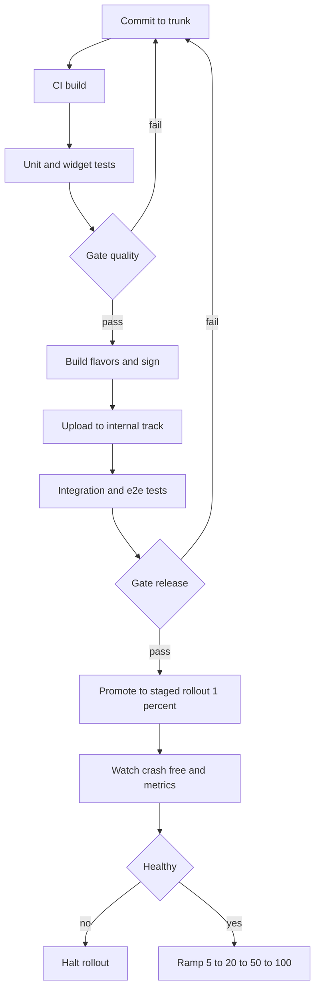
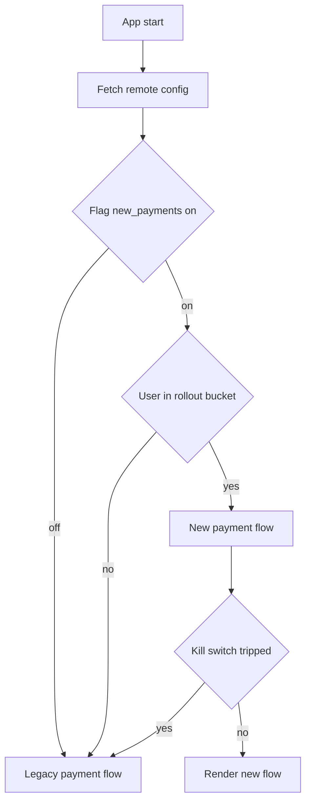
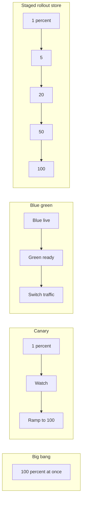

# Delivery & Release Engineering

> Delivery is the *practice* of keeping software releasable at all times through small, automated, gated batches; **release** is the *decision* to expose new behaviour to users — and feature flags exist to keep those two things separate.

## Introduction

Most engineers conflate three words that mean very different things: **integrate**, **deploy**, and **release**. You *integrate* code many times a day. You *deploy* a build to an environment. You *release* a capability to users. On a server you can blur these because you control the runtime and can roll back in seconds. On mobile you cannot — once a user installs version `2.3.0`, that binary lives on their device until *they* choose to update, and the store's rollout controls are coarse and slow.

This chapter is about the *practice and decision layer* of shipping software, applied to Flutter and mobile. It is deliberately vendor-neutral: the pipeline YAML lives in module 50, the store submission steps live in module 51. Here we answer the harder questions — *which* release strategy, *why*, and *when* — and the central mobile insight that shapes all of them: **you can't easily roll back an installed app, so the levers that matter are staged rollout, remote config, feature flags, and forced-update paths.**

- Mechanics of the pipeline: [../50%20CI%20CD/README.md](../50%20CI%20CD/README.md)
- Store submission steps: [../51%20Deployment/store_setup_and_submission.md](../51%20Deployment/store_setup_and_submission.md)
- Deployment overview: [../51%20Deployment/README.md](../51%20Deployment/README.md)

## Why this concept exists

Software used to ship on CDs once a year. A bug meant a recall. To reduce that risk, teams batched *everything* into a big, rare, terrifying release — which, paradoxically, made each release *more* dangerous because so much changed at once. The insight of Continuous Delivery is inverted: **the smaller and more frequent the change, the lower the risk of each one**, because less changed, the blast radius is smaller, and the fault is easy to locate.

But "release often" collides with "features take weeks to finish" and "the mobile store takes days to review and can't roll back". The resolution is **decoupling deploy from release**:

- **Deploy** the code (even unfinished code) behind an *off* flag, continuously.
- **Release** the capability later by flipping the flag — independent of any build.

This is why feature flags exist. They convert a scary, irreversible, all-at-once *release event* into a reversible, gradual, runtime *configuration change*. On mobile, where the binary is frozen on the device, this decoupling is not a nicety — it is the only practical way to control and unwind a release without shipping a new build.

## Real-world analogy

Think of a **theatre with a stage curtain**.

- **Building the set** (deploy) happens behind a closed curtain, repeatedly, whenever the crew is ready. The audience sees nothing.
- **Raising the curtain** (release) is a separate decision, made when the show is ready and the house is full.
- A **dimmer switch** (staged rollout / rollout %) lets you raise the curtain on one section of seats first.
- A **fire alarm / stop button** (kill switch) drops the curtain instantly if something catches fire — *without* tearing down the set.

Building the set and raising the curtain are different acts, controlled by different people at different times. A team that only has "open the curtain fully, all at once, and the only undo is to demolish the theatre" is doing a big-bang release. Feature flags give you the dimmer and the fire alarm.

## Problem Statement

You are shipping a payments rewrite in a Flutter app with 2M installs.

- The rewrite took 6 weeks; merging it as one giant PR is a review and integration nightmare.
- If it's broken, an App Store rollback means **submitting a new build and waiting for review** — hours to days — while every affected user is stuck on the broken binary.
- You want to expose it to 1% of users first, watch crash-free rate, then ramp.
- If crash-free rate drops, you need to disable it in **seconds, without a new build**.
- Some enterprise customers must *never* get it until legal signs off.

A big-bang "merge and release to 100%" approach fails every one of these constraints. The requirement set forces you toward: trunk-based development with the feature behind a flag, a deployment pipeline with gates, a staged store rollout, remote-config-backed flags for the runtime kill switch, and a forced-update path for the day you truly must retire a bad binary.

## Internal Working

Two mechanisms combine: the **deployment pipeline** (how a commit becomes a store build, with gates) and the **feature flag** (how a runtime decision gates a code path). The pipeline gets *code onto devices*; the flag decides *whether users see it*.



The flag then sits *inside* the shipped binary and decides the path at runtime:



The gates are the heart of the pipeline: a change only advances when the prior stage passes. The flag is the heart of the release: the *same binary* can serve the old or new path depending on config fetched at runtime.

## Memory Representation

*Repurposed:* here "memory" means **where release state physically lives**, because release state is data, not just code.

| State | Lives in | Latency to change | Who owns |
|---|---|---|---|
| Flag defaults | Compiled into the binary (`--dart-define` / const) | New build only | Engineering |
| Flag overrides | Remote config service (Firebase Remote Config, LaunchDarkly, etc.) | Seconds to minutes | Eng / PM |
| Rollout % | App/Play store console | Minutes to hours | Release manager |
| Rollout bucket | Derived on-device from a stable user/install hash | Instant (deterministic) | Client logic |
| Min supported version | Remote config or a backend endpoint | Seconds | Eng |

The key repurposing: **a release is a distributed state machine whose state is split across the binary, the remote config, and the store**. The reason flags feel powerful is that they *move* release state from the slow-to-change binary tier into the fast-to-change remote tier. The reason mobile is hard is that some state (the binary itself) can only change at store speed. See [../18%20Firebase/observability_and_messaging.md](../18%20Firebase/observability_and_messaging.md) for the remote-config transport.

## Compiler Behavior

*Partly applicable.* Release engineering touches the Dart/Flutter build in a few concrete ways:

- **Build modes**: `flutter run` (debug, JIT), `flutter build --profile`, `flutter build --release` (AOT). Store builds are always `--release`.
- **Flavors**: `--flavor prod` / `--flavor staging` select platform-side build configs (bundle id, signing, icons) so staging and prod are separate installable apps.
- **Compile-time config**: `--dart-define=FLAG_X=true` injects values read via `String.fromEnvironment` / `bool.fromEnvironment`. These are *compile-time constants*, so the tree-shaker can **eliminate the dead branch entirely** when a flavor hardcodes a flag off — a compile-time flag differs from a runtime flag precisely in that it can be shaken out.
- **Tree-shaking per flavor**: because dead `const`-guarded branches are removed, a compile-time-disabled feature adds no code to that flavor's binary. Runtime flags (remote config) cannot be shaken out — both branches ship.

The decision *compile-time vs runtime flag* is therefore also a *binary-size and security* decision, not just a convenience one.

## Runtime Behavior

This is where flags actually earn their keep. At runtime the app:

1. **Fetches remote config** on start (and optionally on resume), with a sensible fetch interval and a cached fallback so a network failure degrades to last-known-good values, never to a crash.
2. **Evaluates flags** against fetched config plus a locally-derived rollout bucket (a stable hash of the install id modulo 100), so a "20% rollout" is deterministic per install and doesn't flip on every launch.
3. **Honours kill switches** — a boolean that, when true, forces the legacy path regardless of the feature flag, giving an instant runtime disable without a new build.
4. **Checks minimum supported version** — compares the running app version against a remote `min_version`; if below, shows a blocking "please update" screen (forced update).

The critical runtime property: **all of this is data-driven**, so the *same installed binary* changes behaviour when config changes — no redeploy, no review, seconds of latency.

## Flutter Engine Behavior (if applicable)

Not applicable in a per-request sense — the Flutter engine does not participate in flag evaluation or rollout. The only release-relevant note: each *release build* embeds an AOT-compiled snapshot that the engine loads; there is one such snapshot per binary, so you cannot hot-swap engine-level code via a flag. Anything requiring new *native/engine* code genuinely needs a new store build — which is exactly why kill switches must live in Dart-level runtime logic, not in engine features.

## Dart VM Behavior (if applicable)

Brief and relevant: **debug builds run on the Dart VM's JIT; release (store) builds are AOT-compiled** (`dart2native`-style ahead-of-time machine code, no JIT). This means:

- You cannot rely on JIT-only behaviour (hot reload, `dart:mirrors`) in a released app.
- A flag branch that only executes in release must be tested in a `--profile`/`--release` build, because JIT vs AOT can differ in timing and (rarely) in behaviour around deferred loading.
- The AOT snapshot is immutable per release — reinforcing that runtime flags gate *which compiled path runs*, they never introduce new compiled code.

## Examples

A minimal, null-safe, lint-clean feature-flag abstraction with a remote-config-backed implementation, plus a forced-update check and a `--dart-define` snippet.

```dart
/// Contract for evaluating feature flags at runtime.
abstract interface class FeatureFlags {
  bool isEnabled(String key, {bool fallback = false});

  /// A kill switch always wins over a normal flag.
  bool isKilled(String key);
}

/// Deterministic 0..99 bucket from a stable install id.
int rolloutBucket(String installId) {
  return installId.hashCode.abs() % 100;
}

/// Remote-config-backed implementation. `config` is the raw fetched map
/// (already cached with last-known-good fallback by the transport layer).
class RemoteConfigFlags implements FeatureFlags {
  RemoteConfigFlags({
    required Map<String, Object?> config,
    required String installId,
  })  : _config = config,
        _bucket = rolloutBucket(installId);

  final Map<String, Object?> _config;
  final int _bucket;

  @override
  bool isEnabled(String key, {bool fallback = false}) {
    if (isKilled(key)) return false;
    final enabled = _config['${key}_enabled'] as bool? ?? fallback;
    if (!enabled) return false;
    final rollout = (_config['${key}_rollout_pct'] as num?)?.toInt() ?? 0;
    return _bucket < rollout;
  }

  @override
  bool isKilled(String key) => _config['${key}_kill'] as bool? ?? false;
}
```

```dart
/// Forced-update gate. Compares running version against a remote minimum.
class VersionGate {
  const VersionGate(this.minSupported);

  /// Semantic version the backend/remote-config declares as the floor.
  final Version minSupported;

  bool mustUpdate(Version current) => current < minSupported;
}

/// Tiny SemVer value type (major.minor.patch), comparable.
class Version implements Comparable<Version> {
  const Version(this.major, this.minor, this.patch);

  factory Version.parse(String raw) {
    final parts = raw.split('.').map(int.parse).toList(growable: false);
    return Version(parts[0], parts[1], parts[2]);
  }

  final int major;
  final int minor;
  final int patch;

  @override
  int compareTo(Version other) {
    final byMajor = major.compareTo(other.major);
    if (byMajor != 0) return byMajor;
    final byMinor = minor.compareTo(other.minor);
    if (byMinor != 0) return byMinor;
    return patch.compareTo(other.patch);
  }

  bool operator <(Version other) => compareTo(other) < 0;

  @override
  bool operator ==(Object other) =>
      other is Version &&
      major == other.major &&
      minor == other.minor &&
      patch == other.patch;

  @override
  int get hashCode => Object.hash(major, minor, patch);
}
```

```bash
# Build flavor with a compile-time flag (tree-shaken when false).
flutter build appbundle \
  --release \
  --flavor prod \
  --dart-define=ENABLE_NEW_PAYMENTS=false \
  --build-name=2.3.0 \
  --build-number=430
```

## Diagrams

Comparison of the strategies you actually choose between on mobile:



Blue-green is a *server* pattern (two identical environments, flip a router); on mobile the closest analogue is the flag flip — old path is "blue", new path is "green", both live in one binary. **Staged rollout is the store-native form of canary** and is the strategy you use for the binary itself, while feature flags give you canary-*within*-a-binary.

## Common Mistakes

| Mistake | Why it hurts | Fix |
|---|---|---|
| Treating deploy == release | You can't ship unfinished code; releases become big and rare | Deploy behind an off flag; release by flipping it |
| No kill switch | A bad release needs a new build + store review to disable | Every risky feature ships with a remote kill switch |
| Never cleaning up flags | Flag debt: combinatorial code paths, dead branches, confusion | Track flag age; remove after full rollout; treat as a ticket |
| 100% rollout on day 1 | Full blast radius; no early signal | Staged rollout 1→5→20→50→100 with health checks |
| No forced-update path | You can never retire a truly broken binary | Ship a min-version gate from v1, before you need it |
| Compile-time flag for something you must toggle live | Can't change without a new build | Use runtime/remote flag for anything you may disable in prod |
| Flag with no default / no fallback | Network failure at start = undefined behaviour | Cached last-known-good + safe compile-time default |

## Best Practices

- **Trunk-based development**: short-lived branches, merge to trunk daily, keep trunk releasable — this is what *enables* continuous delivery.
- **Small batches**: many small releases beat one big one; smaller blast radius, easier bisection.
- **Everything automated & gated**: no manual step in the path to production except the deliberate *release* decision.
- **Flag hygiene**: name flags with owner + created date, set an expiry, and delete them once at 100% for two stable releases.
- **Kill switch first**: add the off-switch before the feature, not after the incident.
- **Ship the forced-update gate early**, ideally in your very first release, since you can only *use* it in versions that already contain it.
- **Deterministic buckets**: hash a stable install id so rollout % is stable per user.
- **Observe every release**: wire crash-free rate and key metrics as rollout gates — see [./observability_as_practice.md](./observability_as_practice.md).

## Performance

*Repurposed:* the performance of a *delivery system* is measured by the **DORA metrics**, not by latency.

| Metric | What it measures | Elite ballpark |
|---|---|---|
| Deployment frequency | How often you ship to prod | On demand / multiple per day |
| Lead time for changes | Commit → running in prod | Less than one day |
| Change failure rate | % of releases causing a failure | 0–15% |
| MTTR (time to restore) | How fast you recover from a bad release | Less than one hour |

The mobile twist: **MTTR is bounded by store review**, so your *real* MTTR lever is the runtime kill switch / remote config, which restores in seconds — not a new submission. A team optimising mobile delivery invests in flags precisely to decouple MTTR from store latency.

## Advantages

- Releasable at any time; the *release* becomes a business decision, not an engineering scramble.
- Small blast radius; faults are cheap to locate and cheap to unwind.
- Fast recovery via flags/remote config, independent of store speed.
- Progressive exposure (canary/staged) surfaces problems on 1% before 100%.
- Experimentation (A/B) and permissioning (enterprise gating) fall out of the same flag machinery.

## Disadvantages

- **Flag debt** is real: unbounded flags create combinatorial, untested code paths.
- Testing complexity: every flag combination is a potential state to verify.
- Requires discipline and infrastructure (remote config, observability, rollout tooling).
- On mobile you still can't fix *native* bugs without a new build — flags only gate Dart-level paths.
- Remote-config dependency introduces a new failure mode you must design fallbacks for.

## Interview Questions

**🟢 1. What's the difference between Continuous Integration, Continuous Delivery, and Continuous Deployment?**
CI = merge and auto-test small changes frequently. Continuous Delivery = every change is *automatically proven releasable* but release is a manual decision. Continuous Deployment = every change that passes automatically goes to production with no human gate.

| | Continuous Integration | Continuous Delivery | Continuous Deployment |
|---|---|---|---|
| Auto-merge + test | yes | yes | yes |
| Always releasable | — | yes | yes |
| Release step | manual | manual button | automatic |

**🟢 2. What does "decouple deploy from release" mean?**
Deploy = get the code onto the runtime/device (possibly off). Release = expose the behaviour to users. Feature flags let you deploy code weeks before you release it, and release without deploying.

**🟢 3. Name the feature-flag types.**
Release flags (temporary, hide unfinished work), ops flags (kill switches, circuit breakers), experiment flags (A/B), permission flags (entitlement/segment gating). They differ in lifespan and owner.

**🟡 4. Why do feature flags matter *more* on mobile than on a server?**
Because you can't roll back an installed binary — a rollback needs a new build plus store review (hours to days). A remote-config-backed flag disables the bad path in seconds without any new build, so on mobile the flag *is* your rollback.

**🔴 5. How do you roll back a bad mobile release?**
You (usually) don't "roll back" — you **halt the staged rollout** in the store so no *new* users get it, then **flip the kill switch / remote config** to force existing users onto the safe path instantly. If the bug is native and unflaggable, you ship a fixed build (optionally with an *expedited review*) and use the **forced-update** gate to push users off the broken version. Restoring the old binary to already-updated users is not directly possible; staged rollout + flags + forced update are the real levers.

**🟡 6. Big-bang vs canary vs blue-green vs staged rollout — when each?**
Big-bang: trivial/low-risk changes. Canary: expose to a small % and watch. Blue-green: server-side instant switch between two environments (mobile analogue = flag flip). Staged/phased rollout: the store-native canary for the binary itself. Mobile risky features = staged rollout of the binary + canary via flags inside it.

**🟡 7. What is flag debt and how do you manage it?**
Flags that outlive their purpose, leaving dead/combinatorial paths. Manage with naming conventions (owner + date), expiry dates, a "remove flag" ticket created with the flag, and deletion once fully rolled out and stable.

**🔴 8. Compile-time vs runtime flag — trade-offs?**
Compile-time (`--dart-define`) is tree-shaken out (smaller binary, code not present — good for security/kill of unreleased code) but needs a new build to change. Runtime (remote config) ships both branches and can toggle live in seconds. Use compile-time for build-variant differences, runtime for anything you may need to disable in production.

**🟡 9. What are the DORA metrics and which is special on mobile?**
Deployment frequency, lead time for changes, change failure rate, MTTR. On mobile MTTR is throttled by store review, so kill switches/remote config are what actually keep MTTR low.

**🟢 10. App bundle vs APK?**
An Android App Bundle (AAB) is uploaded to Play, which generates optimized per-device APKs (smaller downloads). APK is a single installable package. Stores require AAB for new apps; APK is for sideloading/testing.

**🔴 11. How do staged rollout percentages actually reach specific users?**
The store selects a random subset of eligible devices for the given %. It's not user-choosable and is coarse; for precise targeting you layer a feature flag with a deterministic install-id bucket *inside* the shipped build.

**🟡 12. Why ship a forced-update mechanism before you need it?**
Because it can only act on versions that *already contain* it. If v1 lacks the gate, you can never force v1 users to update; the capability must be present in the version you later want to retire.

## Senior Engineer Tips

- The kill switch you didn't ship is the incident you can't stop. Add it *with* the feature.
- Make rollout buckets deterministic per install, or your "20%" flickers and your metrics lie.
- A flag without an owner and an expiry is a future landmine — attach both at creation.
- Test the *off* path as rigorously as the *on* path; the fallback is what runs during an incident.
- Cache remote config; a cold start during a network blip must degrade to last-known-good, never to a crash or an undefined flag state.
- "It's deployed" is not "it's released." Say which you mean in every standup.

## Architect Perspective

At org scale, release strategy is fundamentally a **risk-management decision**, and the architect's job is to make risk *adjustable* rather than binary. The core move is decoupling deploy from release across the whole org:

- Engineering ships continuously to trunk and to the store behind flags — cadence is decoupled from feature completeness.
- Product/release management owns the *release* decision and the rollout dial — business risk is decoupled from engineering cadence.
- SRE/observability owns the gates — a rollout that breaches a metric halts automatically.

This separation means a 6-week feature and a 1-line fix ship through the *same* pipeline at the *same* cadence; only the *release* moment differs. On mobile the architect additionally treats **remote config + kill switch + forced-update as first-class infrastructure**, because they are the only mechanisms that give sub-store-review MTTR. The strategic principle: **invest in the levers that make recovery fast and exposure gradual, because on mobile you cannot buy those back after the binary has shipped.**

## Summary

- Integrate ≠ deploy ≠ release. Continuous Delivery keeps you *always releasable*; Continuous Deployment removes the human gate.
- Delivery is a *practice*: small batches, everything automated and gated, trunk-based development, releasable at any time.
- **Feature flags decouple deploy from release** — the central insight — turning an irreversible release event into a reversible runtime config change.
- Flag types: release, ops (kill switch), experiment, permission. Compile-time flags tree-shake out; runtime flags toggle live.
- Release strategies: big-bang, canary, blue-green, rolling, staged/phased. Mobile uses **staged rollout for the binary + flags for canary inside it**.
- **You can't easily roll back mobile**: halt the staged rollout + flip the kill switch + forced-update for truly broken binaries.
- Release state is distributed across binary, remote config, and store; DORA metrics measure the system, and mobile MTTR depends on flags, not store speed.

## Revision Notes

- CI = test on merge. CD (delivery) = always releasable, manual release. CD (deployment) = auto release.
- Deploy = code onto device. Release = behaviour to users. Flags separate them.
- 4 flag types: release / ops / experiment / permission.
- Compile-time flag → tree-shaken, needs new build. Runtime flag → both branches ship, toggles in seconds.
- Mobile "rollback" = halt rollout + kill switch + forced update. Not a true rollback.
- SemVer `major.minor.patch` for the app; monotonic build number for the store.
- DORA: deployment frequency, lead time, change failure rate, MTTR.
- Ship the forced-update gate in v1 — it only works in versions that already contain it.

## Practice Questions

1. Explain to a PM why "we deployed it" does not mean "users have it."
2. Draw the deployment pipeline for your app and mark every gate.
3. Classify three flags in your codebase as release/ops/experiment/permission and give each an expiry.
4. Your crash-free rate drops during a 20% rollout. Write the exact sequence of actions you take.
5. Argue when a compile-time flag is *correct* and when it is a mistake.
6. Compute your team's four DORA metrics for last month; identify the weakest and the mobile-specific reason.
7. Describe how a "20% rollout" reaches deterministic users end-to-end (store % + in-app bucket).

## Coding Questions

**A. Implement a feature-flag gate.**
Acceptance criteria:
- `FeatureFlags.isEnabled(key)` returns `false` when the kill switch for `key` is set, regardless of the enabled flag.
- Respects a `_rollout_pct` value using a deterministic per-install bucket.
- Falls back to a supplied default when the key is absent.
- Null-safe, no `dynamic`, lint-clean. (See `RemoteConfigFlags` above as a reference solution.)

**B. Implement a min-version forced-update check.**
Acceptance criteria:
- `mustUpdate(current)` returns `true` iff `current < minSupported` under SemVer ordering.
- Parses `major.minor.patch` strings; `2.3.0 < 2.10.0` must be true (numeric, not lexical).
- Pure/deterministic, no I/O in the comparison. (See `VersionGate` / `Version` above.)

Extend B: add a `latest` version and a `bool shouldSuggestUpdate` that is soft (dismissible) when `current < latest` but `current >= minSupported`.

## Mini Project

**Staged-rollout release plan for a Flutter feature, with flags and a kill switch.**

Design a release plan for a new `NewCheckoutFlow` feature.

Design deliverables:
1. **Flag design** — one release flag `new_checkout_enabled`, one ops kill switch `new_checkout_kill`, one rollout key `new_checkout_rollout_pct`, backed by remote config with cached fallback and a safe `false` default.
2. **Rollout schedule** — internal track → closed test → staged rollout `1 → 5 → 20 → 50 → 100`, each step gated on crash-free rate ≥ 99.5% and checkout-success metric not regressing.
3. **Kill path** — set `new_checkout_kill = true` to force all users to legacy in seconds; document that this needs no new build.
4. **Store-halt path** — how to pause the staged rollout in the console if the *binary* itself is bad.
5. **Forced-update path** — bump `min_version` when a native fix ships and the old binary must be retired.

Partial implementation (wire into the examples above):

```dart
class CheckoutRelease {
  const CheckoutRelease(this._flags);
  final FeatureFlags _flags;

  bool get useNewCheckout =>
      _flags.isEnabled('new_checkout', fallback: false);
}

// Router usage:
// final release = CheckoutRelease(remoteFlags);
// return release.useNewCheckout ? const NewCheckoutFlow() : const LegacyCheckout();
```

Acceptance criteria:
- Flipping `new_checkout_kill` in remote config sends 100% of users to `LegacyCheckout` on their next config fetch, with no new build.
- A fresh install with no network gets the safe default (`LegacyCheckout`) and never crashes.
- The rollout % is stable per install across launches.
- The plan documents *halt* (not "rollback") as the store-level response and *forced update* as the last resort.

Cross-references: pipeline mechanics in [../50%20CI%20CD/README.md](../50%20CI%20CD/README.md); store tracks, signing, versioning, phased rollout in [../51%20Deployment/store_setup_and_submission.md](../51%20Deployment/store_setup_and_submission.md) and [../51%20Deployment/README.md](../51%20Deployment/README.md); remote config transport and crash reporting in [../18%20Firebase/observability_and_messaging.md](../18%20Firebase/observability_and_messaging.md); metric-gated rollouts in [./observability_as_practice.md](./observability_as_practice.md).
